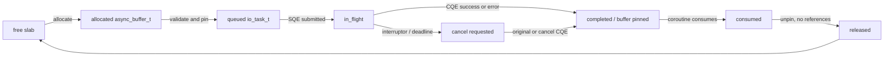
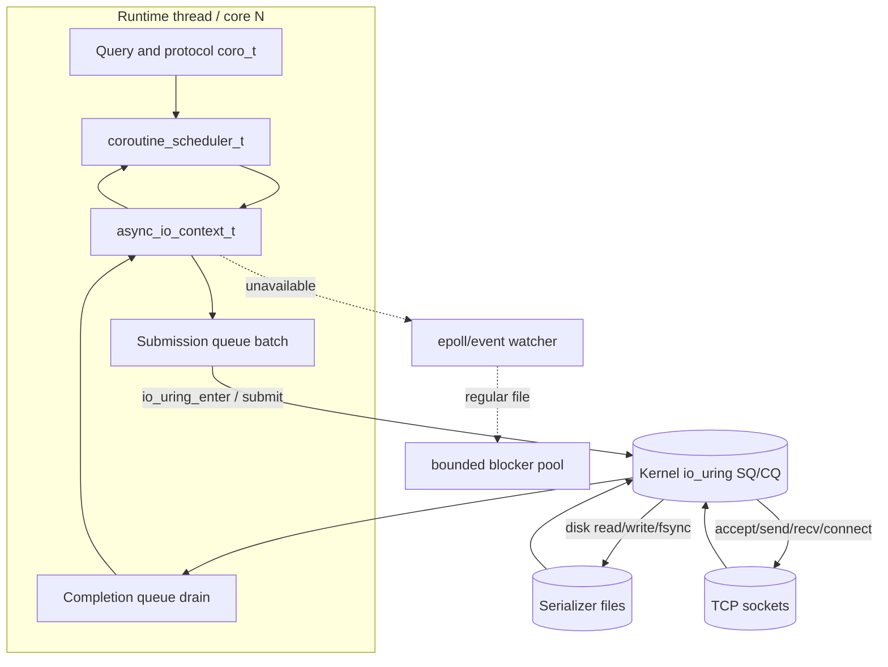
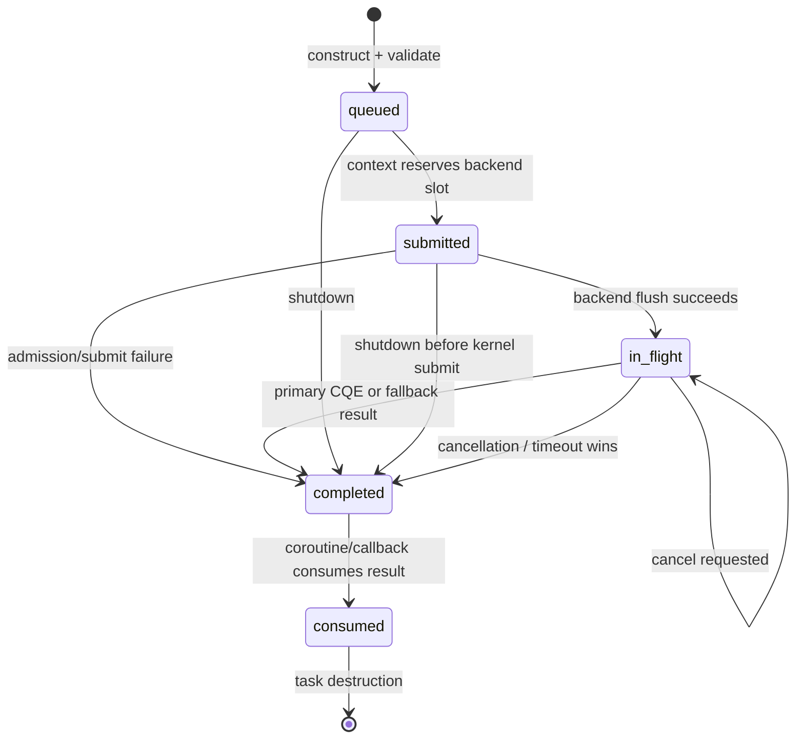

# Phase 3 — Async I/O Subsystem (v3.0)

## Status and scope

**Status:** implementation-ready design specification.

**Target:** RethinkDB v3.0, C++17, Linux-first.

**Objective:** replace the storage and socket readiness path that currently reaches blocking disk workers and `linux_event_watcher_t` waits with a per-runtime-thread asynchronous I/O context. Query and internal `coro_t` coroutines must suspend while I/O is outstanding; they must never occupy their runtime thread while the kernel is servicing a disk or network operation.

This document is deliberately precise about the current repository names:

- The existing coroutine type is `coro_t` in `src/arch/runtime/coroutines.hpp`; there is no repository type named `coroutine_t`.
- The existing socket type is `linux_tcp_conn_t` (alias `tcp_conn_t`) in `src/arch/io/network.hpp`; there is no generic `connection_t` in this layer.
- The existing file descriptor owner is `scoped_fd_t`, held by `linux_file_t` in `src/arch/io/disk.hpp`; there is no `file_descriptor_t` in the current architecture layer.
- `file_t` already exposes callback-shaped `read_async`, `write_async`, and `writev_async`, but its Linux implementation delegates regular-file work to the disk manager / blocking backend. This feature changes the implementation and adds a typed coroutine-facing API; it does not break all existing callback callers in one release.

### Non-goals

1. Do not adopt C++20 language coroutines in v3.0. `src/build.mk` compiles with `-std=gnu++17`, and RethinkDB already has a mature stackful cooperative scheduler. The implementation SHALL integrate with `coro_t`.
2. Do not make every user-space computation asynchronous. B-tree work, query evaluation, compression, TLS, and serialization remain ordinary cooperative work; only kernel I/O wait is removed from runtime threads.
3. Do not require io_uring on every supported platform. The public abstraction works on all supported builds.
4. Do not use io_uring multishot operations, SQPOLL, `IORING_SETUP_IOPOLL`, or `IORING_REGISTER_FILES` in the v3.0 baseline. They have stronger kernel, privilege, device, and lifetime assumptions than the v3.0 compatibility floor.
5. Do not silently change durability semantics. A `WRAP_IN_DATASYNCS` write remains a write followed by a data-sync barrier before its user-visible completion.
6. Do not issue concurrent mutable operations against a `file_t` or socket that current ownership and serialization rules prohibit.

---

## 1. Overview

### 1.1 Architectural change

RethinkDB currently has one `linux_thread_t` event queue per `linux_thread_pool_t` worker. Each thread hosts `coro_t` fibers and owns a `linux_event_queue_t`, `linux_message_hub_t`, and timer handler. Disk requests ultimately go through `linux_disk_manager_t`; network code waits for readiness through `linux_event_watcher_t::watch_t`. The runtime can suspend a coroutine while those subsystems work, but regular-file I/O is still performed by a blocking backend thread, limiting queue depth and consuming worker resources under scan, compaction, backfill, and write load.

v3.0 introduces `async_io_context_t`, owned by each runtime thread. On Linux with a usable io_uring kernel interface, it owns one io_uring instance and executes:

- `IORING_OP_READ` / `IORING_OP_WRITE` / `IORING_OP_WRITEV` for serializer files;
- `IORING_OP_FSYNC` for `WRAP_IN_DATASYNCS` completion barriers;
- `IORING_OP_ACCEPT`, `IORING_OP_CONNECT`, `IORING_OP_RECV`, and `IORING_OP_SEND` for plaintext TCP;
- `IORING_OP_POLL_ADD` only when a readiness wait is required by a compatibility operation;
- `IORING_OP_TIMEOUT` and `IORING_OP_ASYNC_CANCEL` for timeout and cancellation handling.

Each runtime thread becomes a **thread-per-core execution lane**, not a disk-worker lane:

1. Query, serializer, replication, and networking code runs in existing `coro_t` coroutines on its home runtime thread.
2. A coroutine packages I/O into an `io_task_t`, submits it to its home `async_io_context_t`, then calls `coro_t::wait()` through `coroutine_scheduler_t`.
3. The event queue pumps the context, which batches submissions and drains completions.
4. Completion processing updates the task result and schedules the suspended `coro_t` using `notify_sometime()`; it does not execute application logic inline in the kernel-completion dispatch loop.
5. The coroutine runs on its original home thread and consumes the result or raises the specified error.

No shared submission ring is permitted in v3.0. A ring is owned by exactly one `linux_thread_t`; submission, completion draining, and task-list mutation are thread-affine. Cross-thread callers use the existing `linux_message_hub_t` / `on_thread_t` mechanism to submit on the object’s home thread.

### 1.2 Backend selection

The backend selection order is deterministic:

| Priority | Backend | Platform / prerequisite | Regular files | TCP | Reason |
|---|---|---|---|---|---|
| 1 | `io_uring` | Linux, kernel exposes required base opcodes, `io_uring_queue_init_params` succeeds | native async | native async | Default Linux v3.0 path |
| 2 | `epoll` readiness backend | Linux where io_uring setup/probe fails | delegated to blocker pool | non-blocking readiness | Keeps socket operations non-blocking |
| 3 | platform event backend + blocker degradation | Darwin, FreeBSD, Windows, or a build without epoll | delegated to blocker pool | existing `event_watcher_t` / native backend | Preserves portability and API contract |

`epoll` is Linux-only. Therefore the requirement sometimes described as “epoll on non-Linux” is technically impossible and SHALL NOT be implemented literally. On non-Linux, the abstraction uses the existing platform event watcher implementation for network readiness and the bounded blocker-pool adapter for regular files. The externally observable `async_file_t`, `async_connection_t`, task-state, cancellation, and error contracts remain identical.

### 1.3 Buffer-management change

The current buffer cache owns page memory through `buf_ptr_t`, while I/O APIs accept raw pointers and rely on alignment assertions in `verify_aligned_file_access`. v3.0 adds `async_buffer_pool_t` for I/O-owned, aligned, optionally registered buffers. It provides stable buffer addresses from allocation through completion, permits registered/fixed io_uring buffers where valid, and makes “in flight” an explicit ownership state. It does not replace the buffer cache’s eviction, snapshot, or transaction semantics.

The normal block-read integration path is:

`alt::page_t` / `alt::page_loader_t` → allocate or obtain a page-owned aligned buffer → submit `async_file_t::read` → suspend `coro_t` → completion populates the same buffer → install it into the existing page state machine → pulse `page_acq_t::buf_ready_signal()` → release the I/O pin only after the page owns the populated buffer.

### 1.4 Observable server configuration

Add the following server options to `config/args.*` and startup validation:

| Option | Type | Default | Valid values | Meaning |
|---|---:|---:|---|---|
| `--async-io` | enum | `auto` | `auto`, `io_uring`, `epoll`, `thread_pool` | Backend policy. `io_uring` fails startup if unavailable; `auto` falls back. |
| `--async-io-queue-depth` | unsigned integer | `256` | `8..4096`, power of two | SQ/CQ entries per runtime thread. |
| `--async-io-buffer-pool-size` | size string | `256M` | `32M..min(physical-memory/2, 64G)` | Process-wide async-buffer slab budget. |
| `--async-io-submit-batch` | unsigned integer | `16` | `1..64` | Flush threshold per context; requests are also flushed before a coroutine waits. |
| `--async-io-timeout-ms` | unsigned integer | `30000` | `0..3600000` | Default I/O deadline; `0` disables a default deadline. |
| `--async-io-fixed-buffers` | enum | `auto` | `auto`, `on`, `off` | Register eligible pool slabs with io_uring. `on` is a startup error if registration fails. |

Option parsing SHALL reject non-power-of-two queue depths, values outside bounds, malformed sizes, and an explicit `--async-io=io_uring` request on a build or kernel without io_uring support. `auto` logs a single structured fallback record per process and exposes the selected backend via perfmon and `server_status`.

---

## 2. Dependencies

### 2.1 Existing runtime and I/O dependencies

| Existing component | Current location | v3.0 use / required change |
|---|---|---|
| `linux_thread_pool_t`, `linux_thread_t` | `src/arch/runtime/thread_pool.hpp` | Construct exactly one context per `linux_thread_t`; add it before servicing event-loop work and drain it during thread shutdown. Do not add separate I/O pthreads. |
| `thread_pool_t` | alias in `src/arch/types.hpp` | Preserve as API alias. The generic blocker pool remains the final regular-file fallback and the implementation path for unsupported operations. |
| `linux_event_queue_t` | `src/arch/runtime/event_queue.hpp` | Add an owned async-I/O event source / wake handle and invoke `async_io_context_t::pump()` when it is readable or when pending work reaches a flush point. |
| `linux_message_hub_t` | `src/arch/runtime/message_hub.hpp` | Cross-thread submissions are delivered to the resource home thread. No caller writes a foreign ring. |
| `coro_t` | `src/arch/runtime/coroutines.hpp` | Reuse stackful coroutines. `coroutine_scheduler_t` calls `coro_t::wait()` and resumes with `notify_sometime()`. |
| `file_t`, `linux_file_t`, `scoped_fd_t` | `src/arch/types.hpp`, `src/arch/io/disk.hpp` | Keep legacy virtual callback API during migration. Add an `async_file_t` implementation that owns a `scoped_fd_t` and adapts legacy `file_t` calls. |
| `linux_iocallback_t` | `src/arch/types.hpp` | Retain as compatibility callback sink. Its default error swallowing behavior SHALL NOT be used by the new path; adapters call `on_io_failure(errno, offset, count)` on failure. |
| `io_backender_t`, `linux_disk_manager_t` | `src/arch/io/disk.hpp`, `src/arch/io/disk/*` | Replace direct `linux_disk_manager_t` submission for migrated files; retain for `thread_pool` fallback and unmigrated code. |
| `linux_event_watcher_t` | `src/arch/io/event_watcher.hpp` | Continue to serve epoll/readiness fallback; do not layer an independent second watcher on the same fd without defined ownership. |
| `linux_tcp_conn_t`, listener types | `src/arch/io/network.hpp` | Add `async_connection_t` and async listener implementation. Migrate plaintext TCP first. TLS remains on the existing path in v3.0. |

### 2.2 Storage and buffer-cache dependencies

`cache_t` in `src/buffer_cache/alt.hpp` owns an `alt::page_cache_t`; its `create_cache_account()` returns `cache_account_t`, which contains a home-thread-bound `file_account_t`. `page_t` and `page_acq_t` in `src/buffer_cache/page.hpp` already model loaded, loading, deferred, and waiter states. v3.0 SHALL preserve these semantics.

Required integration rules:

1. `cache_account_t::get()` remains the priority/account source for disk task admission. The new per-context task scheduler maps its priority and outstanding-request limit into per-account pending queues.
2. A page loader that starts an async read remains non-evictable while `loader_` is non-null or while `waiters_` is non-empty. Completion installation occurs on the page cache home thread only.
3. The new I/O buffer cannot be returned to `async_buffer_pool_t` until all of the following are true: kernel completion was observed; the completion has been consumed or discarded; no page loader, task, or user buffer reference pins it; and it has been removed from any fixed-buffer registration in use.
4. Existing `buf_ptr_t` may remain the page’s durable owner. `async_buffer_t` is a transient pin/wrapper around a buffer allocated from the compatible aligned slab, not a second copy of a loaded page.
5. Read-ahead / prefetch uses the same cache account and never bypasses cache capacity accounting. A prefetched page begins as `loading` and may be evicted only after completion and no waiter/ownership pin remains.

### 2.3 Network dependencies

`linux_tcp_conn_t` currently enforces at most one read and one write in progress and uses `event_watcher_t` for non-blocking readiness. Preserve the same directional serialization in `async_connection_t`. It SHALL not allow two concurrent receives or two concurrent sends on the same connection unless an explicit future ordering contract is added.

The listener integration starts from `linux_nonthrowing_tcp_listener_t`, `linux_tcp_listener_t`, and `linux_tcp_conn_descriptor_t`. Each listener socket gets one outstanding accept task in the baseline. When an accept completes, the listener immediately queues the next accept before dispatching the accepted descriptor’s callback, preventing callback work from creating an accept gap.

### 2.4 Coroutine decision

Use the current `coro_t` system, not C++20 coroutines. Reasons:

- C++17 is the repository’s configured language standard.
- `coro_t` carries existing thread affinity, priority, profiling, stack protection, and `on_thread_t` integration.
- The essential operation is already represented by `co_read` / `co_write` in `src/arch/arch.cc`: submit work, then wait. v3.0 replaces the untyped callback adapter with a race-safe task and result object.

No method in the new API returns `std::coroutine_handle<>`, uses `co_await`, or requires `<coroutine>`.

### 2.5 Build and platform dependencies

Linux io_uring support is provided by **liburing** plus Linux UAPI headers. The implementation SHALL use liburing’s queue setup, SQE acquisition, preparation helpers, submit, and CQE iteration functions. It SHALL not open-code shared ring memory layout.

Build-system changes are mandatory:

1. Add `liburing` as an optional dependency in `configure` initialization and platform configuration. Its configure identifier is `liburing` and its link variable is `LIBURING_LIBS`; include variables are `LIBURING_INCLUDE` and `LIBURING_INCLUDE_DEP`.
2. On Linux, probe both `<liburing.h>` and a link of `io_uring_queue_init_params`. Define `HAVE_LIBURING=1` only if both pass. Add `$(LIBURING_INCLUDE)` to `RT_CXXFLAGS` and `$(LIBURING_LIBS)` to `RT_LDFLAGS` only under `HAVE_LIBURING`.
3. On non-Linux, configure SHALL define `HAVE_LIBURING=0` without probing or requiring liburing.
4. Add a supported-source package definition under `mk/support/pkg/` for the pinned liburing release used by reproducible builds. The package SHALL export headers and a shared/static library through the existing support-package contract; system liburing may be used when discoverable.
5. The source must compile when `HAVE_LIBURING=0`; headers including `<liburing.h>` and `<linux/io_uring.h>` are confined to `async_io_linux.cc`.
6. Keep `-std=gnu++17` in `src/build.mk`. No language-standard bump is part of this feature.

At runtime, Linux calls `io_uring_queue_init_params` with flags `0`, then probes required opcodes. A successful library link is not sufficient. Minimum kernel support is Linux 5.1 for basic io_uring; availability is decided by the probe, not only `uname`. The v3.0 required-opcode set is `READ`, `WRITE`, `WRITEV`, `FSYNC`, `ACCEPT`, `CONNECT`, `RECV`, `SEND`, `TIMEOUT`, and `ASYNC_CANCEL`. If a required opcode is unavailable, `auto` falls back and explicit `io_uring` fails startup.

---

## 3. Interface (C++ API)

### 3.1 New files and ownership

Create these files:

```text
src/arch/io/async_io.hpp                 Public backend-neutral task/context API
src/arch/io/async_io.cc                  Common state transitions, scheduler, metrics
src/arch/io/async_io_linux.cc            liburing backend, compiled only with HAVE_LIBURING
src/arch/io/async_io_epoll.cc            epoll readiness backend and blocker adapter
src/arch/io/async_buffer_pool.hpp        Aligned buffer handles and slab pool API
src/arch/io/async_buffer_pool.cc         NUMA-aware slab implementation
src/arch/io/async_file.hpp               Coroutine-facing file wrapper
src/arch/io/async_file.cc                File operation construction and legacy adapter
src/arch/io/async_connection.hpp         Coroutine-facing plaintext TCP wrapper/listener
src/arch/io/async_connection.cc          TCP accept/connect/send/recv implementation
src/unittest/async_io.cc                 Backend-independent and fake-backend unit tests
src/unittest/async_buffer_pool.cc        Pool ownership, alignment, and pressure tests
test/async_io/async_io.yaml              Integration scenario manifest
```

`async_io_context_t`, `coroutine_scheduler_t`, and `async_buffer_pool_t` are constructed during runtime startup and destroyed only after all context tasks are terminal. `async_file_t` and `async_connection_t` are home-thread-affine and non-copyable. `io_task_t` is caller-owned until submitted, then context-owned until it enters `consumed` or is destroyed as part of shutdown.

### 3.2 Common types

The following declarations belong in `src/arch/io/async_io.hpp`. Names, member types, and return contracts are normative.

```cpp
#ifndef ARCH_IO_ASYNC_IO_HPP_
#define ARCH_IO_ASYNC_IO_HPP_

#include <cstddef>
#include <cstdint>
#include <functional>
#include <memory>

#include "arch/runtime/coroutines.hpp"
#include "arch/runtime/runtime_utils.hpp"
#include "containers/intrusive_list.hpp"
#include "containers/scoped.hpp"

class async_buffer_t;
class async_io_context_t;
class file_account_t;
class signal_t;

enum class async_io_backend_t : uint8_t {
    io_uring,
    epoll,
    blocker_pool
};

enum class async_io_operation_t : uint8_t {
    read,
    write,
    writev,
    fsync,
    accept,
    connect,
    recv,
    send,
    poll,
    timeout,
    cancel
};

enum class io_task_state_t : uint8_t {
    queued,
    submitted,
    in_flight,
    completed,
    consumed
};

enum class async_io_errc_t : int {
    ok = 0,
    cancelled = ECANCELED,
    timed_out = ETIMEDOUT,
    queue_full = EAGAIN,
    resource_exhausted = ENOMEM,
    operation_not_supported = EOPNOTSUPP,
    backend_unavailable = ENOSYS,
    invalid_argument = EINVAL,
    shutdown = ESHUTDOWN,
    short_read = EIO,
    short_write = EIO,
    completion_overflow = EOVERFLOW
};

struct async_io_result_t {
    ssize_t bytes_transferred;
    int sys_errno;
    async_io_errc_t code;

    bool is_success() const {
        return code == async_io_errc_t::ok;
    }
};

struct async_io_config_t {
    async_io_backend_t requested_backend;
    uint32_t queue_depth;
    uint32_t submit_batch;
    uint64_t default_timeout_ms;
    bool fixed_buffers;
};

struct completion_queue_entry_t {
    class io_task_t *task;
    int32_t kernel_result;
    uint32_t kernel_flags;
};

class io_task_t : public intrusive_list_node_t<io_task_t> {
public:
    typedef std::function<void(const async_io_result_t &)> completion_t;

    io_task_t(async_io_operation_t operation,
              int fd,
              int64_t offset,
              size_t length,
              async_buffer_t *buffer,
              completion_t completion);
    ~io_task_t();

    async_io_operation_t operation() const;
    io_task_state_t state() const;
    const async_io_result_t &result() const;
    int fd() const;
    int64_t offset() const;
    size_t length() const;
    async_buffer_t *buffer() const;

private:
    friend class async_io_context_t;
    friend class coroutine_scheduler_t;

    void transition(io_task_state_t next);
    async_io_operation_t operation_;
    int fd_;
    int64_t offset_;
    size_t length_;
    async_buffer_t *buffer_;
    completion_t completion_;
    async_io_result_t result_;
    io_task_state_t state_;
    bool cancel_requested_;
    uint64_t deadline_ns_;
    void *backend_private_;

    DISABLE_COPYING(io_task_t);
};

class coroutine_scheduler_t : public home_thread_mixin_debug_only_t {
public:
    explicit coroutine_scheduler_t(async_io_context_t *context);

    async_io_result_t submit_and_wait(io_task_t *task, signal_t *interruptor);
    void complete(io_task_t *task, const async_io_result_t &result);
    void cancel_wait(io_task_t *task);

private:
    async_io_context_t *context_;
    DISABLE_COPYING(coroutine_scheduler_t);
};

class async_io_context_t : public home_thread_mixin_debug_only_t {
public:
    static scoped_ptr_t<async_io_context_t> create(
        const async_io_config_t &config,
        async_buffer_pool_t *buffer_pool,
        threadnum_t home_thread,
        async_io_backend_t *selected_backend_out,
        std::string *fallback_reason_out);

    virtual ~async_io_context_t();

    virtual async_io_backend_t backend() const = 0;
    virtual bool submit(io_task_t *task) = 0;
    virtual void flush_submissions() = 0;
    virtual size_t drain_completions(size_t max_completions) = 0;
    virtual void request_cancel(io_task_t *task) = 0;
    virtual void begin_shutdown() = 0;
    virtual bool is_drained() const = 0;
    virtual int wake_fd() const = 0;

    void pump();
    coroutine_scheduler_t *scheduler();

protected:
    async_io_context_t(async_buffer_pool_t *buffer_pool, threadnum_t home_thread);
    void publish_completion(const completion_queue_entry_t &cqe);
    void fail_queued_tasks(async_io_errc_t code);

    async_buffer_pool_t *const buffer_pool_;
    const threadnum_t home_thread_;
    coroutine_scheduler_t scheduler_;
};

#endif  // ARCH_IO_ASYNC_IO_HPP_
```

Implementation notes that are contractually binding:

- Add `<cerrno>`, `<string>`, and the complete `async_buffer_pool.hpp` include in the final header where needed; the shortened declaration above conveys interface shape, not include-order exemptions.
- A task is submitted only by its home thread. Every public mutating method asserts home-thread affinity in debug builds.
- `submit()` returns `false` only when it cannot accept the task synchronously; before it returns `false`, it sets `task.result_` and transitions it directly from `queued` to `completed` with `queue_full`, `resource_exhausted`, `backend_unavailable`, `invalid_argument`, or `shutdown`.
- `kernel_result` is the raw CQE `res` value or an equivalent backend result. Negative values are `-errno`; it is converted exactly once in common completion code.
- A successful read must transfer exactly the requested number of bytes for fixed-size serializer/block reads. A smaller nonnegative result becomes `short_read` / `EIO`; EOF is not a successful database block read. `recv` is allowed to return a short successful result; zero-length `recv` becomes `ECONNRESET` for an open protocol read.
- `write`, `writev`, and `send` preserve byte counts. `async_file_t` retries partial regular-file writes by submitting the remaining suffix; a final short write is `short_write` / `EIO`. `async_connection_t` exposes both `send_some` and `send_all` semantics explicitly.

### 3.3 Buffer API

Declare the following in `src/arch/io/async_buffer_pool.hpp`:

```cpp
enum class async_buffer_state_t : uint8_t {
    free,
    allocated,
    in_flight,
    completed,
    released
};

class async_buffer_t {
public:
    void *data();
    const void *data() const;
    size_t capacity() const;
    size_t size() const;
    void set_size(size_t size);
    bool is_direct_io_aligned() const;
    bool is_fixed_registered() const;
    uint16_t fixed_buffer_index() const;
    async_buffer_state_t state() const;

private:
    friend class async_buffer_pool_t;
    friend class async_io_context_t;
    friend class io_task_t;

    void mark_in_flight();
    void mark_completed();
    void release_to_pool();

    void *data_;
    size_t capacity_;
    size_t size_;
    uint16_t numa_node_;
    uint16_t fixed_buffer_index_;
    async_buffer_state_t state_;
    uint32_t pin_count_;
    class async_buffer_pool_t *pool_;

    DISABLE_COPYING(async_buffer_t);
};

class async_buffer_handle_t {
public:
    async_buffer_handle_t();
    async_buffer_handle_t(async_buffer_handle_t &&movee);
    async_buffer_handle_t &operator=(async_buffer_handle_t &&movee);
    ~async_buffer_handle_t();

    async_buffer_t *get() const;
    async_buffer_t *release();
    bool has() const;

private:
    friend class async_buffer_pool_t;
    explicit async_buffer_handle_t(async_buffer_t *buffer);
    async_buffer_t *buffer_;
    DISABLE_COPYING(async_buffer_handle_t);
};

class async_buffer_pool_t {
public:
    async_buffer_pool_t(uint64_t byte_limit, bool fixed_buffers_requested);
    ~async_buffer_pool_t();

    async_buffer_handle_t allocate(size_t minimum_size, threadnum_t owner_thread);
    void register_with_context(async_io_context_t *context);
    void unregister_from_context(async_io_context_t *context);
    uint64_t bytes_in_use() const;
    uint64_t bytes_reserved() const;
    uint64_t allocation_failures() const;

private:
    DISABLE_COPYING(async_buffer_pool_t);
};
```

Zero-copy semantics are defined narrowly and testably: submission passes `async_buffer_t::data()` directly to the kernel; no intermediate copy is performed by `async_file_t`, `async_connection_t`, the context, or the pool. The handle transfers ownership rather than copying bytes. A caller cannot resize, free, reassign, or hand a buffer to another operation while `pin_count_ != 0` or state is `in_flight`.

### 3.4 Async file API

`async_file_t` is a C++17 coroutine-facing replacement for direct new storage callers. It does not immediately remove `file_t`.

```cpp
class async_file_t : public home_thread_mixin_debug_only_t {
public:
    enum mode_t {
        mode_read = linux_file_t::mode_read,
        mode_write = linux_file_t::mode_write,
        mode_create = linux_file_t::mode_create,
        mode_truncate = linux_file_t::mode_truncate
    };

    static file_open_result_t open(const char *path,
                                   int mode,
                                   io_backender_t *backender,
                                   async_io_context_t *context,
                                   scoped_ptr_t<async_file_t> *out);

    ~async_file_t();

    int64_t get_file_size() const;
    async_io_result_t read(int64_t offset,
                           async_buffer_t *buffer,
                           size_t length,
                           file_account_t *account,
                           signal_t *interruptor);
    async_io_result_t write(int64_t offset,
                            async_buffer_t *buffer,
                            size_t length,
                            file_account_t *account,
                            file_t::wrap_in_datasyncs_t durability,
                            signal_t *interruptor);
    async_io_result_t writev(int64_t offset,
                             scoped_array_t<iovec> &&iovecs,
                             size_t length,
                             file_account_t *account,
                             signal_t *interruptor);
    async_io_result_t prefetch(int64_t offset,
                               async_buffer_t *buffer,
                               size_t length,
                               file_account_t *account,
                               uint64_t deadline_ms);

    void read_async(int64_t offset, size_t length, void *buffer,
                    file_account_t *account, linux_iocallback_t *callback);
    void write_async(int64_t offset, size_t length, const void *buffer,
                     file_account_t *account, linux_iocallback_t *callback,
                     file_t::wrap_in_datasyncs_t durability);

    void set_file_size(int64_t size);
    void set_file_size_at_least(int64_t size, int64_t extent_size);
    bool coop_lock_and_check();

private:
    async_file_t(scoped_fd_t &&fd, int64_t file_size,
                 async_io_context_t *context, file_direct_io_mode_t direct_mode);

    scoped_fd_t fd_;
    int64_t file_size_;
    async_io_context_t *context_;
    file_direct_io_mode_t direct_mode_;
    auto_drainer_t close_drainer_;
    DISABLE_COPYING(async_file_t);
};
```

Validation before submission is mandatory and identical for native and fallback backends:

- `offset >= 0`, `length > 0`, no signed or unsigned overflow in `offset + length`, and `offset + length <= file_size_` for reads and existing-file writes.
- `buffer != nullptr`, `length <= buffer->capacity()`, and a buffer may not already be in flight.
- For direct I/O, data pointer, `offset`, and `length` are multiples of `DEVICE_BLOCK_SIZE`; for vectored I/O each element pointer and length is aligned and summed length equals `length`.
- `account == DEFAULT_DISK_ACCOUNT` resolves to the file’s default account; otherwise the account must belong to the file/context home thread.
- The file must be open and not closing. Violations return `invalid_argument/EINVAL` or `shutdown/ESHUTDOWN` without creating an SQE.

Legacy `read_async` / `write_async` use a private adapter task and a pool-owned borrowed-buffer wrapper. The adapter invokes exactly one of `callback->on_io_complete()` or `callback->on_io_failure(errsv, offset, count)` on the callback’s home thread. It must not call the historical default no-op failure implementation on behalf of the caller.

### 3.5 Async connection API

Create the plaintext transport API below. TLS wrappers remain on `linux_secure_tcp_conn_t` and legacy readiness operations in v3.0; an explicit `operation_not_supported/EOPNOTSUPP` is returned if a caller asks the new raw async API to operate directly on a TLS-wrapped connection.

```cpp
class async_connection_t : public home_thread_mixin_debug_only_t {
public:
    static scoped_ptr_t<async_connection_t> connect(
        const ip_address_t &host,
        int port,
        int local_port,
        async_io_context_t *context,
        signal_t *interruptor,
        async_io_result_t *result_out);

    ~async_connection_t();

    async_io_result_t recv_some(async_buffer_t *buffer, size_t capacity,
                                signal_t *interruptor);
    async_io_result_t recv_exact(async_buffer_t *buffer, size_t length,
                                 signal_t *interruptor);
    async_io_result_t send_some(async_buffer_t *buffer, size_t length,
                                signal_t *interruptor);
    async_io_result_t send_all(async_buffer_t *buffer, size_t length,
                               signal_t *interruptor);
    void shutdown_read();
    void shutdown_write();
    void close();
    bool is_read_open() const;
    bool is_write_open() const;
    void rethread(threadnum_t new_thread);

private:
    async_connection_t(scoped_fd_t &&fd, async_io_context_t *context);
    scoped_fd_t fd_;
    async_io_context_t *context_;
    bool read_in_progress_;
    bool write_in_progress_;
    bool read_open_;
    bool write_open_;
    auto_drainer_t drainer_;
    DISABLE_COPYING(async_connection_t);
};

class async_tcp_listener_t : public home_thread_mixin_debug_only_t {
public:
    async_tcp_listener_t(const std::set<ip_address_t> &bind_addresses,
                         int port,
                         async_io_context_t *context,
                         const std::function<void(scoped_ptr_t<async_connection_t> &)> &callback);
    ~async_tcp_listener_t();

    bool begin_listening();
    int get_port() const;
    void stop();

private:
    void submit_accept_for_socket(size_t socket_index);
    void on_accept_complete(size_t socket_index, const async_io_result_t &result);
    DISABLE_COPYING(async_tcp_listener_t);
};
```

Exact connection rules:

- `recv_some` allows `1..capacity` bytes. A positive result sets buffer size to transferred bytes. A zero return indicates peer EOF and maps to `ECONNRESET` for protocol reads.
- `recv_exact` loops using `recv_some`; a peer EOF before `length` returns `short_read/EIO` to the caller, which maps to `tcp_conn_read_closed_exc_t` in compatibility methods.
- `send_some` permits partial successful completion. `send_all` resubmits the untransferred suffix until complete or an error occurs.
- One read and one write can be in flight concurrently. A second same-direction call returns `queue_full/EAGAIN`; it never races the first task.
- Completion `-EPIPE`, `-ECONNRESET`, `-ENOTCONN`, and zero-byte EOF update the matching open flag before resuming the coroutine.
- Accepts use nonblocking listening sockets. `-ECONNABORTED`, `-EPROTO`, and `-EINTR` cause one immediate re-arm and no listener shutdown; `-EMFILE`, `-ENFILE`, and resource exhaustion use exponential backoff starting at 10 ms capped at 1 s; other errors transition the listener to stopped and log the errno.

### 3.6 Runtime wiring

`do_serve()` creates `async_buffer_pool_t` once, after configuration parsing and before runtime worker startup. Each `linux_thread_t` creates its `async_io_context_t` after `coro_runtime_t` exists and before `linux_event_queue_t::run()` begins. Store it as `scoped_ptr_t<async_io_context_t> async_io;` on `linux_thread_t`.

The event queue must register each context’s `wake_fd()` exactly once. The event callback invokes `context->pump()`, which flushes submissions and drains up to 256 CQEs, then reschedules itself if completions remain. `linux_thread_t::pump()` calls `async_io->pump()` before `timer_handler` and message-hub work, and after any batch of local I/O submissions. This preserves existing scheduler fairness: no more than 256 completions may be processed in one event-loop turn.

`io_backender_t` receives the selected context through the owning runtime thread. New storage construction paths request `async_file_t`; existing code that still accepts `file_t *` is migrated through the compatibility adapter. `cache_t` retains its `cache_account_t` creation API unchanged.

---

## 4. Behavior

### 4.1 Submission loop and batching

All local task submission follows this algorithm:

1. The caller validates operation-specific parameters and constructs an `io_task_t` in `queued` state.
2. `coroutine_scheduler_t::submit_and_wait()` records `coro_t::self()` as the task’s waiting coroutine. Calling it outside a coroutine is a programming error (`invalid_argument/EINVAL` in release, assertion in debug).
3. `async_io_context_t::submit()` pins the buffer, adds the task to the per-context pending list, and transitions it to `submitted` only after it owns an SQE or equivalent fallback slot.
4. On io_uring, fill an SQE with one operation, set `sqe->user_data` to `reinterpret_cast<uint64_t>(task)`, and leave the task in `submitted`. For fixed registered buffers, use the appropriate read/write-fixed preparation function only if the complete requested region is contained within the registered buffer.
5. Flush once the pending count reaches `submit_batch` (default 16), when a caller is about to suspend, when the event loop goes idle, or when shutdown starts. `io_uring_submit()` submits all prepared SQEs in one syscall when possible.
6. After successful submit, each task becomes `in_flight`. If `io_uring_submit()` reports fewer submitted SQEs than prepared, retain unsubmitted tasks in order, submit the accepted prefix as `in_flight`, and retry the suffix on the next pump. Do not reorder writes for the same file/account.
7. `-EAGAIN` from SQE acquisition or submit leaves task admission bounded. The context first drains completions, then retries once. If no capacity exists, the task completes with `queue_full/EAGAIN`; it is not spun in a busy loop.

The queue-depth budget includes primary operations plus timeout/cancel companion operations. The context reserves 25% of entries, minimum 8, for cancellation and timeout control tasks. Normal admission uses at most `queue_depth - reserved_control_entries` entries.

### 4.2 Completion handling

For io_uring, `drain_completions()` iterates CQEs with `io_uring_for_each_cqe`, copies `user_data`, `res`, and `flags` to `completion_queue_entry_t`, marks each CQE seen before invoking no user callback, and queues normalized completion work on the context. It then dispatches at most 256 queued completions per `pump()`.

For every completion:

1. Verify the task belongs to this context and state is `in_flight`; otherwise increment `unexpected_completion_total`, log task/op/fd/state, and fail closed in debug builds.
2. Convert `res < 0` to `sys_errno = -res` and an `async_io_errc_t` as defined in Section 7. Convert nonnegative result to bytes transferred and validate operation-specific byte-count requirements.
3. Transition `in_flight → completed` exactly once. Clear the kernel in-flight marker but keep the buffer pinned.
4. `coroutine_scheduler_t::complete()` stores the result, calls the optional completion callback only for the legacy callback adapter, and invokes `waiting_coro->notify_sometime()`. The callback/resume is queued, not invoked recursively from `io_uring_cqe_seen` processing.
5. The resumed coroutine validates / consumes the result. `submit_and_wait()` transitions `completed → consumed`, unpins the buffer, and returns the result.

A task completion that wins a race with cancellation wins. The scheduler stores the first terminal result only. A later cancel CQE has `-ENOENT` or `-EALREADY` and is ignored after metric accounting; it must never overwrite a successful completion.

### 4.3 Coroutine suspension and resume model

The existing `coro_t` model is retained. Conceptual code is:

```cpp
async_io_result_t coroutine_scheduler_t::submit_and_wait(
        io_task_t *task, signal_t *interruptor) {
    assert_thread();
    coro_t *self = coro_t::self();
    if (self == nullptr) {
        return {0, EINVAL, async_io_errc_t::invalid_argument};
    }
    task->waiting_coro_ = self;
    task->interruptor_subscription_.reset(interruptor);
    if (!context_->submit(task)) {
        return task->result();
    }
    context_->flush_submissions();
    coro_t::wait();
    return task->consume_result_and_unpin();
}
```

The concrete task fields may be private helper objects rather than the illustrative names above, but these ordering properties are mandatory:

- Store the waiting coroutine before task admission.
- Flush before `coro_t::wait()` so a single request cannot remain indefinitely in an unflushed batch.
- Completion only schedules the coroutine; it never resumes it synchronously.
- The coroutine reads a fully written result after it wakes on its home thread; no atomic result field is required under the context’s thread-affine ownership model.
- An interruptor pulse requests cancellation and waits for the original operation or its cancellation completion before the buffer may be released. It does not free task memory while `in_flight`.

```mermaid
sequenceDiagram
    participant Q as Query coro_t
    participant S as coroutine_scheduler_t
    participant C as async_io_context_t
    participant K as io_uring / fallback kernel path

    Q->>S: submit_and_wait(read task)
    S->>C: submit(task), pin buffer
    C->>C: batch SQE and flush before wait
    C->>K: read(fd, buffer, offset, length)
    S->>Q: coro_t::wait()
    Note over Q: suspended_on_io; runtime thread runs other coroutines
    K-->>C: CQE(res)
    C->>S: complete(task, normalized result)
    S->>Q: notify_sometime()
    Q->>S: resumes and consumes result
    S->>C: unpin buffer; completed -> consumed
```

### 4.4 Per-core thread model

The runtime uses **one context per existing runtime worker**, not one additional I/O thread per worker and not a shared global submission queue. `linux_thread_pool_t::n_threads` determines the number of contexts. CPU affinity remains the responsibility of the existing `linux_thread_pool_t` configuration.

Reasons for this choice:

- It matches `home_thread_mixin_t` and current coroutine/message-hub ownership.
- It avoids a lock around every SQE/CQE and preserves local cache / NUMA locality.
- It permits a completion to resume its target coroutine on the same event queue without cross-thread handoff.
- It localizes queue-depth backpressure. A saturated disk on one execution lane cannot monopolize a process-wide lock.

A cross-thread request MUST switch to the file, cache, or connection home thread before allocating an SQE. It is invalid to submit a raw task to an arbitrary context merely because it has spare ring capacity.

### 4.5 Buffer lifecycle



Lifecycle rules:

- `allocate()` returns a buffer sized to the next slab class at or above the requested length, aligned to `max(DEVICE_BLOCK_SIZE, 4096)`; capacity may exceed requested length.
- The submitting API sets requested byte count, but read completion sets `size_` to actual bytes only after validating transfer size.
- `mark_in_flight()` increments `pin_count_`; direct calls to `release_to_pool()` while pinned assert in debug and are ignored with an error log in release.
- The pool maintains per-NUMA-node local free lists. A context allocates from the NUMA node of its runtime thread first; it may steal from another node only after local exhaustion and increments `remote_numa_allocations_total`.
- Buffer memory is never moved. Slabs are allocated with `posix_memalign`; fixed-buffer registration is per context because each io_uring instance owns its registered-buffer table.
- A borrowed legacy raw buffer is represented by an `async_buffer_t` with `pool_ == nullptr`, `fixed_buffer_index_ == invalid`, and a pin only. It is never returned to the pool and can never use a fixed-buffer opcode.

### 4.6 Disk behavior and durability

- `async_file_t::read` maps to one read task and rejects short reads.
- `async_file_t::write` maps to write task(s). For `NO_DATASYNCS`, the operation completes when all bytes are written. For `WRAP_IN_DATASYNCS`, completion requires all bytes written **and** a subsequent `fsync(fd, IORING_FSYNC_DATASYNC)` task completed successfully. The fsync task is linked logically in user space; the user completion occurs only after both results succeed.
- `writev` uses `IORING_OP_WRITEV` when native and `pwritev` is available; fallback follows current platform behavior, including split writes where `USE_WRITEV` is false. Every iovec is owned or pinned until final completion.
- `set_file_size`, `set_file_size_at_least`, `flock`, metadata `fstat`, and directory fsync remain blocking syscalls in the initial v3.0 scope only when they are startup/rare control-plane operations. They SHALL run through `thread_pool_t::run_in_blocker_pool`, never on a query runtime thread. A later feature may add `IORING_OP_FTRUNCATE` when supported.
- Per-file ordering: queued writes from the same `async_file_t` and `file_account_t` are submitted in issue order. Reads may be reordered relative to other reads. A caller requiring read-after-write visibility must await the write result before submitting the read.

### 4.7 Network behavior

Native io_uring accepts/connects/sends/receives are submitted directly. The epoll backend places the socket in nonblocking mode, waits with the existing watcher/event queue, and performs the syscall only when ready. Regular disk files cannot be made asynchronously readable with epoll; that path uses the blocker adapter.



The listener accepts only plaintext TCP through `async_tcp_listener_t` in v3.0. Existing TLS uses `SSL_read` / `SSL_write`, whose readiness behavior has additional `WANT_READ` / `WANT_WRITE` semantics; it continues on `linux_secure_tcp_conn_t` until a dedicated TLS async state-machine specification is implemented.

### 4.8 Shutdown behavior

Shutdown is a stateful drain, not a destructor race:

1. `linux_thread_t::initiate_shut_down()` calls `async_io->begin_shutdown()` on every thread.
2. Context rejects new non-control tasks with `shutdown/ESHUTDOWN`.
3. Queued, unsubmitted tasks complete `ESHUTDOWN` immediately. In-flight tasks receive `ASYNC_CANCEL`; their buffers and file/socket owners remain pinned.
4. The event queue continues pumping completions until `is_drained()` is true or the configured hard shutdown deadline of 30 seconds expires.
5. At deadline, log every remaining operation with task id, operation, fd, offset, age, and state, close the owning fd only after cancellation has been requested, and terminate with the existing fatal-shutdown policy rather than freeing in-flight user buffers.
6. Unregister fixed buffers only after all associated tasks are terminal; destroy the ring after CQ drain; then destroy buffer pool and file/socket owners.

No `io_task_t`, `async_buffer_t`, `scoped_fd_t`, `linux_iocallback_t`, or `coro_t` pointer may be destroyed while a kernel `user_data` can still reference it.

---

## 5. Data

### 5.1 Per-core context data

The following conceptual structure lives in the common context implementation; the io_uring-specific members are isolated in `async_io_linux.cc`.

```cpp
struct async_io_context_state_t {
    async_io_backend_t backend;
    threadnum_t home_thread;
    uint32_t queue_depth;
    uint32_t submit_batch;
    uint32_t reserved_control_entries;
    bool accepting_submissions;
    bool flushing;
    bool draining;
    bool shutdown_requested;

    intrusive_list_t<io_task_t> queued_tasks;
    intrusive_list_t<io_task_t> submitted_tasks;
    intrusive_list_t<io_task_t> in_flight_tasks;
    intrusive_list_t<io_task_t> completed_tasks;
    std::deque<completion_queue_entry_t> completion_queue;

    uint64_t submitted_total;
    uint64_t completed_total;
    uint64_t cancelled_total;
    uint64_t sq_full_total;
    uint64_t cq_overflow_total;
    uint64_t unexpected_completion_total;
};
```

Linux-only state additionally contains:

```cpp
struct io_uring_context_state_t {
    io_uring ring;
    io_uring_params params;
    int wake_eventfd;
    bool fixed_buffers_registered;
    std::vector<iovec> registered_iovecs;
    std::vector<io_task_t *> sqe_to_task_debug;
};
```

`io_uring_sqe_t` is not copied into task state. Each task records operation parameters and receives an SQE only during preparation. The SQE’s `user_data` is the stable task address encoded as `uint64_t`. Before ring destruction, all SQEs must have corresponding terminal task state; task address reuse before CQE drain is forbidden.

### 5.2 Task ordering and account queues

Admission has two layers:

1. The global per-context capacity described above.
2. Per-`file_account_t` outstanding request limits already produced by `file_t::create_account` / `cache_account_t`.

Implement a new internal `async_io_account_state_t` associated with existing file accounts:

```cpp
struct async_io_account_state_t {
    void *legacy_account;
    int priority;
    int outstanding_limit;  // -1 is unlimited
    int in_flight;
    intrusive_list_t<io_task_t> waiting;
};
```

A task associated with a finite account limit remains `queued` until `in_flight < outstanding_limit`. Scheduler selection is weighted round-robin by descending priority; equal priority uses FIFO. A task consumes account capacity when submitted to the kernel and releases capacity only when its primary I/O completion arrives, not when its coroutine consumes the result. Fsync companion tasks inherit the write account and are admitted as control work for that write.

### 5.3 Async buffer slabs

`async_buffer_pool_t` uses fixed size classes: `4 KiB`, `16 KiB`, `64 KiB`, `256 KiB`, `1 MiB`, and `4 MiB`. Requests greater than 4 MiB allocate a dedicated, aligned extent charged exactly to the process budget. Each slab is allocated on the requesting NUMA node where `libnuma` is present; otherwise it uses aligned allocation and reports NUMA node 0.

- Every slab base and buffer region is aligned to `max(4096, DEVICE_BLOCK_SIZE)`.
- The pool stores buffer metadata out of band, not in the data region supplied to I/O.
- Fixed-buffer registration uses complete slabs, never a user-provided external pointer.
- If registering the requested slab set would exceed io_uring’s registered-buffer limit, `auto` disables fixed buffers for that context and logs it; `on` fails context startup with `resource_exhausted/ENOMEM`.
- Freed buffers are scrubbed with `memset(..., 0, capacity)` before reuse only in debug / sanitizer builds. Production relies on ownership isolation and does not add a hot-path zeroing cost.

### 5.4 Metrics and observability data

Register the following per-thread perfmon counters and aggregate them process-wide:

```text
async_io.backend                         selected enum encoded as string/status
async_io.queue_depth                     configured entries
async_io.sq_in_flight                    gauge
async_io.pending_tasks                   gauge
async_io.submissions_total               counter
async_io.completions_total               counter
async_io.submit_syscalls_total           counter
async_io.sq_full_total                   counter
async_io.cq_overflow_total               counter
async_io.cancel_requests_total           counter
async_io.timeouts_total                  counter
async_io.fallback_operations_total       counter, labels: backend, operation
async_io.buffer.bytes_reserved           gauge
async_io.buffer.bytes_in_use             gauge
async_io.buffer.allocation_failures      counter
async_io.buffer.remote_numa_allocations  counter
async_io.latency_us                      histogram, labels: operation, backend
```

Each task gets a monotonically increasing `uint64_t task_id` generated by its context for logs and tracing. Do not use fd, task address, or buffer address as a stable identifier in externally visible telemetry.

---

## 6. States

### 6.1 I/O task state machine



Allowed transitions are only:

| From | To | Trigger |
|---|---|---|
| `queued` | `submitted` | SQE/fallback-slot admission succeeds |
| `queued` | `completed` | validation failure, account rejection, shutdown |
| `submitted` | `in_flight` | flush confirms primary operation submitted |
| `submitted` | `completed` | submit failed before kernel ownership |
| `in_flight` | `completed` | normalized completion, timeout, or cancellation completion |
| `completed` | `consumed` | waiter/compatibility callback takes result |

There is no `completed → in_flight`, no task reuse, and no direct `queued → in_flight`. A resubmitted partial `send_all` or file write is a new child task with a new task id; the parent coroutine loops at the API layer.

### 6.2 Coroutine states

| State | Meaning | Legal next states |
|---|---|---|
| `running` | `coro_t` executing on its home runtime thread | `suspended_on_io`, `ready`, finished |
| `suspended_on_io` | one task has a stored continuation and the coroutine called `coro_t::wait()` | `ready` |
| `ready` | completion called `notify_sometime()` and queued it on the event loop | `running` |

A coroutine may have multiple outstanding prefetch tasks only if it does not call `submit_and_wait()` for them individually and instead uses an explicit fan-in object. The v3.0 `coroutine_scheduler_t` supports exactly one waiting task per coroutine. Attempting a second wait before consuming the first is `invalid_argument/EINVAL` and a debug assertion.

### 6.3 Context states

| State | Condition | Behavior |
|---|---|---|
| `idle` | no pending SQEs and no CQEs | event loop waits on wake fd / normal sources |
| `processing` | preparing or flushing submissions | accepts tasks until capacity policy blocks admission |
| `draining` | CQEs available or shutdown requested | completion budget applies; shutdown rejects new data tasks |
| `stopped` | all tasks terminal and backend destroyed | no submission permitted |

`processing` and `draining` are reentrancy guards, not a cross-thread lock. A completion callback cannot recursively call `pump()`; it queues wake work and returns.

### 6.4 Error and saturation states

| Condition | Detection | State transition | Mandatory action |
|---|---|---|---|
| SQ full | no SQE / `io_uring_get_sqe` returns null | task remains queued after one drain attempt | increment metric; later pump or return `EAGAIN` if bounded admission expires |
| CQ overflow | `IORING_SQ_CQ_OVERFLOW` flag, CQ overflow counter, or liburing failure | context enters draining | stop new data submissions, drain, log, then fail explicit backend if recovery cannot clear overflow |
| SQE allocation ENOMEM | task/metadata or liburing allocation failure | task `queued → completed` | `resource_exhausted/ENOMEM`; no partial task ownership |
| Ring setup unsupported | init/probe failure | context selection fallback | auto fallback, explicit io_uring startup failure |
| Shutdown | runtime begins draining | reject non-control work | complete queued tasks with `ESHUTDOWN`, cancel in-flight work |

---

## 7. Errors

### 7.1 Normalized error catalog

All new coroutine-facing APIs return `async_io_result_t`. Compatibility adapters map the result to existing callbacks or exceptions. `sys_errno` preserves the operating system errno whenever one exists; `code` provides a portable semantic classification.

| Condition | `code` | `sys_errno` | Required caller behavior |
|---|---|---:|---|
| Success | `ok` | 0 | consume bytes / result |
| Kernel cancel CQE | `cancelled` | `ECANCELED` | discard result; release only after terminal completion |
| Deadline expires | `timed_out` | `ETIMEDOUT` | abort operation at protocol / query boundary; log task id |
| Ring/SQ admission full | `queue_full` | `EAGAIN` | scheduler may retry on next pump; external operation reports overload if deadline expires |
| Task/SQE/buffer allocation failure | `resource_exhausted` | `ENOMEM` | fail current operation; do not fall back per-operation after a native context is selected |
| Unsupported operation/opcode | `operation_not_supported` | `EOPNOTSUPP` | choose configured backend at initialization or reject operation |
| Backend unavailable | `backend_unavailable` | `ENOSYS` | explicit backend fails startup; auto falls back during initialization |
| Invalid offset/buffer/account/state | `invalid_argument` | `EINVAL` | fail before kernel submission; programmer error in debug |
| Runtime/file/socket draining | `shutdown` | `ESHUTDOWN` | stop new work; caller propagates shutdown |
| Serializer block short read | `short_read` | `EIO` | fatal storage I/O path; never treat as valid block |
| Full write cannot complete | `short_write` | `EIO` | fatal storage I/O path after retry policy |
| Completion queue unrecoverable overflow | `completion_overflow` | `EOVERFLOW` | fail the context and begin controlled server shutdown |
| Device/file I/O failure | `operation_not_supported` only if errno `EOPNOTSUPP`; otherwise semantic `ok` is forbidden | original errno (e.g. `EIO`, `ENOSPC`, `EROFS`) | propagate original errno to storage error handling |

For raw disk errors (`EIO`, `ENOSPC`, `EDQUOT`, `EROFS`, `EBADF`, `EACCES`), use `code = async_io_errc_t::ok` is prohibited. The implementation SHALL add `async_io_errc_t::system_error` with a stable non-errno enum value if needed by compiler constraints; the returned `sys_errno` is the exact error. The task is failure if `sys_errno != 0`, irrespective of enum convenience classification.

### 7.2 io_uring resource exhaustion and CQ overflow

- **SQE allocation:** `io_uring_get_sqe()` returning null is capacity pressure, not malloc failure. Drain completions, flush pending SQEs, retry once, then complete the task with `queue_full/EAGAIN` if reserve policy prevents admission.
- **Memory allocation:** failure to allocate task metadata, timeout companion state, fixed-buffer registration metadata, or a pool slab returns `resource_exhausted/ENOMEM`. Do not call the blocking fallback for a single failing operation because that hides exhaustion and breaks configured backend observability.
- **CQ overflow:** detect `IORING_SQ_CQ_OVERFLOW` through ring flags after each submit/drain. On first detection, stop accepting normal tasks, drain all CQEs, emit an error record, and attempt one recovery cycle. If overflow remains after recovery, transition all outstanding tasks to `completion_overflow/EOVERFLOW` only after their actual CQE or cancellation terminal result arrives; then request controlled server shutdown. Never discard CQEs or free unknown `user_data`.

### 7.3 Disk error propagation

Native disk errors are normalized on the file home thread and propagated as follows:

```text
CQE res = -errno
  -> async_io_context_t normalizes async_io_result_t
  -> async_file_t returns result to coroutine
  -> storage/page loader records exact errno and fails its read/write operation
  -> existing serializer/database-file error policy logs path, offset, length, errno
  -> query/replication path receives existing storage failure, not a partial block
```

The compatibility adapter must call `linux_iocallback_t::on_io_failure(errno, offset, length)`. The migration SHALL audit all current subclasses/call sites that rely on the historical default `on_io_failure` no-op and replace them with an explicit error path before they are routed through native io_uring.

### 7.4 Timeout and cancellation

Every task has an absolute monotonic deadline. The task-specific deadline overrides `--async-io-timeout-ms`; zero means no deadline. On io_uring, submit a timeout task associated with the primary operation. On timeout:

1. Mark `cancel_requested_` while the primary task remains `in_flight`.
2. Submit `IORING_OP_ASYNC_CANCEL` targeting the primary task’s `user_data`.
3. Do not report terminal timeout until either primary completion or cancellation completion proves the kernel no longer uses the buffer.
4. If the primary succeeds first, return success. If cancellation completes first and primary later reports `-ECANCELED`, return `timed_out/ETIMEDOUT` because deadline initiated the cancellation.
5. If cancellation returns `-ENOENT`, the primary completed; wait for its CQE and use its result.

On epoll and blocker fallback, remove the readiness watch or mark the blocker job cancelled, but still wait for the job’s completion handoff before unpinning a raw buffer. POSIX cannot safely kill arbitrary blocking `pread` / `pwrite` in another worker thread; the fallback task becomes logically cancelled and its result is discarded only when the worker returns.

### 7.5 Platform fallback rules

- `--async-io=auto`: choose io_uring only if setup and opcode probe pass. Otherwise choose epoll on Linux; otherwise choose the existing platform event backend plus blocker pool. Log `async_io_backend_fallback` with reason (`liburing_not_built`, `ring_setup_errno`, `opcode_unsupported`, `non_linux`).
- `--async-io=io_uring`: startup fails before accepting client connections if unavailable. Error text includes selected kernel/runtime reason and remediation.
- `--async-io=epoll`: available only on Linux; fail startup with `ENOSYS` elsewhere.
- `--async-io=thread_pool`: use no io_uring, retain socket event watchers and disk blocker behavior. This is the explicit rollback / diagnostic mode.
- A running context does not silently switch backend because of a per-operation error. Backend switching occurs only at process startup or a deliberate full context restart during controlled maintenance.

---

## 8. Testing

### 8.1 Test layers and backend matrix

Every test runs in three configurations where platform permits:

| Configuration | Native expectation |
|---|---|
| `--async-io=io_uring --async-io-fixed-buffers=off` | Native ring path; skip only if runtime probe says unavailable |
| `--async-io=epoll` | Socket readiness + regular-file blocker degradation |
| `--async-io=thread_pool` | Existing-compatible fallback / migration baseline |

Linux CI adds a kernel-enabled io_uring job. Non-Linux CI runs `thread_pool` and platform event fallback tests. Do not treat a skipped io_uring-only test as pass in the Linux io_uring CI job; that job fails if its kernel probe does not support the required opcode set.

### 8.2 Exact unit test scenarios

Add the following tests to `src/unittest/async_io.cc` and `src/unittest/async_buffer_pool.cc`.

1. **async read/write correctness versus sync baseline**
   - Create a temporary direct-I/O-compatible file with 256 aligned 4 KiB blocks containing a deterministic block-number/checksum pattern.
   - Issue reads for all blocks through `async_file_t`; verify returned bytes and checksums equal a synchronous `pread` baseline.
   - Overwrite a shuffled subset, use `WRAP_IN_DATASYNCS`, reopen, and verify durable contents.
   - Expected: exact bytes, no short completion, zero leaked buffers/tasks.

2. **concurrent asynchronous operations**
   - Submit 128 independent reads and 128 writes across at least two runtime contexts while each context runs unrelated yielding coroutines.
   - Expected: all tasks terminal, per-file write ordering preserved, read data valid, no same-direction socket overlap, task count returns to zero.

3. **submission batching**
   - Configure `--async-io-submit-batch=8`; submit 32 reads without yielding, then wait for all.
   - Instrument `async_io.submit_syscalls_total` and submitted task counts.
   - Expected: four or fewer normal submit syscalls for 32 requests under an uncongested ring; no single-operation forced submit except final flush-before-wait. The test asserts average batch size >= 8, not an architecture-specific exact syscall count.

4. **coroutine suspend/resume cycle**
   - A test coroutine records `running`, submits a delayed fake-backend read, and calls `submit_and_wait`; a second coroutine must run before completion.
   - Inject completion; verify first coroutine transitions `running → suspended_on_io → ready → running`, resumes exactly once on original `threadnum_t`, and receives the correct result.

5. **fallback path**
   - Force `--async-io=thread_pool` and use a fake platform probe that rejects io_uring.
   - Expected: `async_file_t` API returns correct data, no runtime worker blocks in the instrumentation hook, `async_io.fallback_operations_total{backend=blocker_pool}` increments.
   - On non-Linux, execute this as a required test. On Linux, additionally force `epoll` and validate TCP readiness operations.

6. **buffer-pool stress**
   - Allocate/release random sizes from 1 byte through 8 MiB across all contexts for 60 seconds or 100,000 operations under ASan/TSan.
   - Submit reads while attempting premature handle destruction and duplicate submission.
   - Expected: allocator returns correctly aligned buffers; duplicate/in-flight misuse is rejected; bytes-in-use returns to zero; no UAF, double free, or address movement.

7. **shutdown with I/O in flight**
   - Submit a fake backend task that withholds completion; start `begin_shutdown`; verify new work receives `ESHUTDOWN`, cancellation is requested, and neither task nor buffer is destroyed before terminal completion.
   - Release completion; expected context drains cleanly. A separate hard-deadline test verifies diagnostics include task id, fd, operation, state, and age.

8. **disk error propagation**
   - Inject `EIO`, `ENOSPC`, `EROFS`, and short read through the fake backend.
   - Expected: exact `sys_errno`, correct semantic code, legacy callback receives `on_io_failure`, page loader does not expose a populated page, and no error is silently converted to success.

9. **timeout race matrix**
   - Test primary success before deadline, timeout before primary completion, cancel `ENOENT` after success, and primary `ECANCELED` after timeout.
   - Expected: one terminal result, buffer released exactly once, no double coroutine notification.

10. **TCP accept/connect/send/recv**
    - Start `async_tcp_listener_t`, connect 100 local clients, exchange short and 64 KiB messages, close peer mid-read, and saturate descriptor limits using an injectable accept syscall.
    - Expected: one outstanding accept per listener fd, rearm behavior specified in Section 3.5, exact connection-close errors, no blocking runtime thread.

11. **file-account fairness and cap**
    - Create two accounts with differing priority and a finite outstanding limit of 2 for the low priority account. Queue 20 tasks in each account.
    - Expected: low account never exceeds two in-flight tasks; high priority makes progress without starving low priority once capacity frees.

12. **fixed-buffer safety**
    - With fixed buffers enabled, use valid pool buffers and assert native fixed registration is selected. Attempt external, undersized, unaligned, and released buffers.
    - Expected: only valid pooled regions reach kernel; invalid submissions fail `EINVAL` before SQE preparation.

### 8.3 Integration scenario YAML

Create `test/async_io/async_io.yaml` as the declarative manifest consumed by a new `test/scenarios/async_io.py` runner. The YAML schema is intentionally simple and exact:

```yaml
version: 1
scenarios:
  - name: table_scan_native_async
    requires:
      os: linux
      async_backend: io_uring
    server_options:
      - --async-io=io_uring
      - --async-io-queue-depth=256
      - --async-io-buffer-pool-size=256M
      - --async-io-submit-batch=16
    setup:
      database: async_io
      table: scans
      documents: 1000000
      document_bytes: 1024
      durable: true
    workload:
      type: parallel_table_scan
      clients: 8
      iterations: 5
    assertions:
      query_result_count: 1000000
      async_io_backend: io_uring
      runtime_worker_blocked_io: 0
      async_io_completions_min: 1000
      async_io_submit_batch_average_min: 8

  - name: write_durability_and_restart
    requires:
      async_backend: any
    server_options:
      - --async-io=auto
    setup:
      database: async_io
      table: durable_writes
    workload:
      type: concurrent_insert_then_restart
      writers: 16
      documents_per_writer: 1000
      write_durability: hard
    assertions:
      after_restart_document_count: 16000
      storage_errors: 0
      async_io_tasks_in_flight: 0

  - name: fallback_regular_file_path
    requires:
      async_backend: any
    server_options:
      - --async-io=thread_pool
      - --async-io-queue-depth=64
    setup:
      database: async_io
      table: fallback
      documents: 100000
    workload:
      type: parallel_table_scan
      clients: 4
      iterations: 3
    assertions:
      query_result_count: 100000
      async_io_backend: blocker_pool
      async_io_fallback_operations_min: 1
      runtime_worker_blocked_io: 0

  - name: shutdown_cancels_inflight
    requires:
      async_backend: any
    server_options:
      - --async-io=auto
      - --async-io-timeout-ms=100
    setup:
      fault_injection:
        hold_next_disk_read_ms: 500
    workload:
      type: scan_then_shutdown
      clients: 1
    assertions:
      shutdown_clean: true
      async_io_leaked_tasks: 0
      async_io_leaked_buffers: 0
      cancellation_requests_min: 1
```

The runner must skip only scenarios whose `requires` clause is false, print the exact skip reason, and fail a scenario where a required metric is absent. It reads `server_status` / perfmon data after workload completion and before server teardown.

### 8.4 Acceptance gates

The implementation is not complete until all are true:

- Unit tests above pass under native and fallback backends as applicable.
- Native Linux integration job proves the selected backend is io_uring, not a silent fallback.
- ASan test reports no UAF/leak from in-flight task or buffer destruction.
- TSan test reports no cross-thread ring or buffer state race.
- The pre-existing `mock_file_t` test suite still passes through the legacy `file_t` contract.
- Existing serializer, btree, and network unit/integration tests pass with `--async-io=thread_pool` first, then native io_uring where supported.

---

## 9. Security

### 9.1 Threat model

The async layer accepts file descriptors, offsets, lengths, iovecs, and memory addresses from internal database components. Its main risks are memory safety, use-after-free across asynchronous completion, descriptor reuse, resource exhaustion, and privilege / sandbox incompatibility. Client protocol data does not directly choose arbitrary process fds or raw buffer pointers.

### 9.2 Fixed buffers and bounds validation

Before kernel submission, the common validation layer SHALL enforce:

1. `async_buffer_t` is allocated or pinned and is not `free`, `released`, or already `in_flight`.
2. Requested `(offset within buffer, length)` satisfies `offset <= capacity` and `length <= capacity - offset` without overflow.
3. Fixed-buffer SQEs are used only if the whole requested region is inside the registered pool region associated with that context and `fixed_buffer_index_` is valid.
4. User-provided / legacy raw buffers can use ordinary read/write SQEs only after null, alignment, range, and lifetime pin checks. They never use fixed-buffer SQEs.
5. Iovec arrays are copied as metadata into task-owned storage before submission; their underlying byte buffers are pinned for the full operation. Sum lengths with overflow detection and require equality with declared total length.
6. The ring `user_data` contains only a pointer to a live task owned by the context. Task memory is quarantined from address reuse until completion CQE drain.

No IO completion may write beyond a buffer’s requested length. Completion byte counts greater than requested length are treated as `EIO`, logged as a kernel/backend invariant violation, and trigger controlled shutdown in debug and production builds.

### 9.3 Descriptor lifecycle and cancellation

`scoped_fd_t` stays alive through `auto_drainer_t` ownership until every operation referencing its integer fd has terminal completion. Closing a numeric fd before completion risks fd-number reuse and I/O against an unrelated resource; it is forbidden. Shutdown first cancels, drains, and only then allows `scoped_fd_t` destruction.

Network accept sockets and accepted connections remain nonblocking. The layer does not accept `SCM_RIGHTS` descriptors or expose direct fd submission to drivers / clients.

### 9.4 Privilege and platform policy

Basic io_uring use requires Linux kernel 5.1+ and does not require elevated privileges for the operations in this specification. Deployment can still deny `io_uring_setup`, `io_uring_enter`, or `io_uring_register` through seccomp, containers, LSMs, or host policy. Such denial is detected at startup:

- `auto` falls back with a log that includes `EPERM` / policy reason.
- explicit `--async-io=io_uring` fails startup rather than attempting privilege escalation.
- The server never requests `CAP_SYS_ADMIN`, SQPOLL, IOPOLL, or other elevated io_uring modes.

Fixed buffer registration can increase locked-memory pressure. Startup must account for registered buffer bytes against `RLIMIT_MEMLOCK` and report `ENOMEM` / `EPERM` precisely. `--async-io-fixed-buffers=auto` disables registration on failure; `on` fails safely.

### 9.5 Resource-exhaustion controls

Queue depth is bounded; control-entry reserve prevents cancellation starvation. Buffer-pool budget is process-wide and hard-capped by configuration. Per-account outstanding limits remain effective. Listener accept backoff prevents an `EMFILE` storm. Metrics provide alertable saturation indicators. No unbounded queue, vector, callback capture, or per-request detached thread is permitted.

---

## 10. Performance

### 10.1 Success criteria

The primary performance goal is **zero runtime-worker thread blocking on disk or socket I/O** for the native io_uring path. During a disk-backed table scan, runtime worker CPUs should execute query/coroutine work or be idle awaiting completions; they must not be parked in `pread`, `pwrite`, `fsync`, `accept`, `recv`, or `send`.

Performance targets on a supported Linux kernel and NVMe-backed test host:

| Metric | Target | Measurement |
|---|---:|---|
| Runtime worker blocking I/O calls during native scan | 0 | instrumentation around blocking syscall / blocker-pool dispatch |
| Submit batch size | median >= 8, target 8–32 SQEs/syscall | `submissions_total / submit_syscalls_total` under parallel scan |
| Ring completion drain budget | <= 256 CQEs per event turn | scheduler instrumentation |
| Buffer-pool hit rate after warm-up | >= 95% for repeated 4 KiB–256 KiB scans | pool allocation metric |
| Per-context SQ occupancy | sustained <= 75% at target workload | gauge / histogram |
| Fallback behavior | functionally correct, explicitly observable | backend and fallback metrics |

“100% CPU utilization during scans” means CPU work remains available to runtime workers when enough query work exists; it is not a promise that every core is permanently busy on an I/O-bound device. Report CPU utilization alongside device utilization, queue occupancy, scan throughput, and p99 I/O latency so an I/O-limited workload is not misrepresented as a scheduler failure.

### 10.2 Benchmark comparison

Add `test/benchmarks/async_io_table_scan.py` with these fixed comparison modes:

```text
Dataset: 100 GiB, 1 KiB documents, randomized key order
Table: one shard on the tested server; cache budget restricted to 10% dataset
Workload: 8 concurrent full table scans, five warm-up + ten measured iterations
Modes: --async-io=thread_pool; --async-io=io_uring
Controls: same binary, same direct-I/O setting, same queue depth 256, no compaction,
          CPU governor performance, record kernel version, disk model, cache size
Report: rows/s, MiB/s, p50/p95/p99 request latency, CPU utilization per runtime thread,
        blocker-pool active count, io_uring submit batch histogram, ring depth, buffer hit rate
```

The benchmark report must present the synchronous/blocker baseline and io_uring result in one table. A claim of improvement requires a minimum 10% throughput gain **or** a 50% reduction in runtime-worker blocked-I/O time at statistically stable (within 5%) throughput. If the device cannot improve throughput, the no-blocking criterion and latency distribution remain valid success evidence.

### 10.3 Tuning rules

- `--async-io-queue-depth=256` is default. Increase to 512 or 1024 only when `sq_in_flight` is frequently above 75%, device queueing remains healthy, and p99 latency does not regress more than 10%. Reduce when tail latency or memory pressure grows.
- `--async-io-submit-batch=16` is default. Set 8 for latency-sensitive point reads and 32 for throughput-dominant scans / backfill only after benchmark validation.
- `--async-io-buffer-pool-size=256M` is default. Size it to at least `runtime_threads * queue_depth * median_io_size`, then cap to avoid starving `cache_t`. The buffer pool is not a substitute for page-cache capacity.
- Fixed buffers are enabled automatically only if the registration succeeds and total registered memory fits policy. They are most useful under high operation churn; benchmark them separately because registration and pool fragmentation can offset gains.
- Use per-account limits to prevent backfill, secondary-index construction, or prefetch from monopolizing ring depth over foreground query reads.

### 10.4 Regression limits

Native io_uring must not regress these compared with explicit `--async-io=thread_pool` on the same hardware:

- p99 point-read latency by more than 10% at low concurrency;
- hard-durable write completion latency by more than 15%;
- process RSS by more than configured buffer-pool budget plus 10%;
- query correctness, durability, cache-account priority behavior, or shutdown cleanliness.

Any regression above a limit blocks default `auto` enablement and requires the backend to remain opt-in until root-caused.

---

## Implementation sequence and migration gates

Implementation proceeds in these non-optional orderings to keep every intermediate commit buildable and testable:

1. Add configure/build capability detection, common type declarations, fake backend, metrics, and unit tests for task state transitions.
2. Add `async_buffer_pool_t` with allocation/pin/release correctness tests.
3. Add `coroutine_scheduler_t` integration with existing `coro_t`, including interruption and shutdown tests.
4. Add Linux io_uring read/write/fsync implementation; keep all callers on legacy file API through adapters.
5. Add epoll/platform-event plus blocker fallback; prove backend parity with fake and integration tests.
6. Migrate serializer log / page-loader read and write paths while preserving `cache_account_t` and page ownership semantics.
7. Add plaintext `async_connection_t` and listener; migrate network callers incrementally. Do not migrate TLS until its own state machine is specified.
8. Enable `--async-io=auto` only after benchmark and regression gates pass. Keep `thread_pool` as a supported rollback option for the v3.x line.

The final definition of done is not “an io_uring ring exists.” It is: native and fallback backends meet the exact task, coroutine, buffer, error, security, shutdown, correctness, and performance contracts above without worker-thread I/O blocking on the native path.
