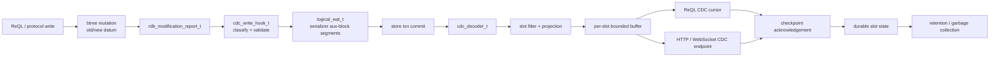
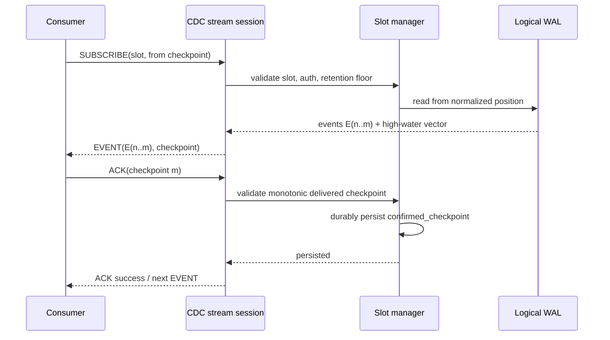

# Phase 3 — Logical Replication / CDC Streaming (v3.0)

**Status:** implementation specification  
**Target:** RethinkDB v3.0, C++17  
**Scope:** durable, logical, table/database CDC with resumable named replication slots  
**Primary source paths:** `src/rdb_protocol/`, `src/serializer/`, `src/client_protocol/`, `src/clustering/administration/`, `test/rql_test/src/`

## Problem statement and acceptance criteria

RethinkDB changefeeds are query-local live views: a client evaluates a query, the server maintains that query's result, and updates are delivered while that client remains attached. This feature adds a durable, consumer-agnostic logical replication stream. A consumer selects a table set, receives committed logical mutations in replayable order, persists a checkpoint, disconnects, and resumes without losing committed events while the slot remains inside retention.

The implementation is complete only when all of the following are true:

1. Given a named slot and a committed insert, when a subscriber reads the slot, then it receives exactly one `insert` event containing the post-image and a durable checkpoint.
2. Given an acknowledged checkpoint and a disconnect, when the subscriber reconnects with that checkpoint, then it receives every later retained event in the same ordering domain and no event before the checkpoint.
3. Given a slot spanning multiple tables, when writes commit on either table, then the slot receives events for both tables and no event from an unselected table.
4. Given a requested table backfill, when the snapshot fence is established, then the subscriber receives all snapshot rows before every live event whose commit position is greater than that fence.
5. Given a slot that falls behind the retention floor, when it subscribes or acknowledges a stale position, then it receives the exact `CDC_CHECKPOINT_EXPIRED` failure and must re-backfill.
6. Given DDL on a selected database/table, when `include_ddl` is enabled, then the slot receives a typed DDL event at a checkpoint after the metadata commit.
7. Given a principal without the required permissions, when it creates, inspects, drops, or subscribes to a slot, then the request fails before any data or checkpoint is disclosed.

## Non-goals

- This feature does not make raw serializer pages a supported external format.
- It does not promise a single total order across independent table shards. It supplies a strict per-table order and an explicit causal/vector checkpoint across tables.
- It does not provide exactly-once delivery. Delivery is at-least-once; consumer sink idempotence is keyed by `(cluster_id, table_id, shard_id, lsn)`.
- It does not implement outbound Kafka, Debezium, or database-specific connectors in the server. It supplies an authenticated HTTP/WebSocket protocol suitable for those adapters.
- It does not support arbitrary ReQL predicates in durable slots. Filters are declarative and serializable only.
- It does not retain WAL forever or allow a lagging slot to inhibit disk reclamation without a configured hard limit.

---

# 1. Overview

## 1.1 CDC versus changefeeds

| Property | Existing changefeed | v3.0 CDC stream |
| --- | --- | --- |
| Subscription unit | A ReQL query and its maintained result set | Named slot, table(s), or a database |
| Source | In-memory mutation/report and query-maintenance machinery | Durable logical WAL records produced with the write transaction |
| Lifetime | Client/query lifetime | Slot lifetime; survives client and server restart |
| Resume | No durable position | Checkpoint/LSN resume within retention |
| Ordering | Query/result-dependent; no recovery contract | Strict commit order per table shard; vector/causal order across tables |
| Consumer model | ReQL driver only | ReQL cursor plus HTTP/WebSocket protocol |
| Backfill | Changefeed `include_initial` semantics | Snapshot fence plus row events, then WAL catch-up |
| Retention | Bounded changefeed queue | Time/size retention constrained by confirmed slot checkpoints |

`ql::changefeed::server_t` and `rdb_modification_report_t` are useful sources of mutation images and ordering hooks, but are not the CDC persistence mechanism. The existing `store_t` owns region-specific changefeed servers (`src/rdb_protocol/store.hpp:407-426`), and `rdb_modification_report_cb_t::on_mod_report` turns old/new values into transient messages (`src/rdb_protocol/btree.cc:1573-1633`). CDC must run at the same logical mutation boundary but write an independently durable record before the transaction is exposed as committed.

## 1.2 Design decision: logical WAL, not reverse-decoding physical pages

The serializer is log structured and commits atomic `index_write` and block writes (`src/serializer/serializer.hpp:101-115`), but physical page/block records do not reliably encode document operation type, primary key, old datum, new datum, table identity, or DDL intent. Therefore **CDC must not attempt to reconstruct row changes by parsing historical serializer page deltas**.

Instead, the write path creates a canonical `cdc_event_t` from the already available logical mutation report immediately after `rdb_replace_and_return_superblock` obtains the old and new row images (`src/rdb_protocol/btree.cc:414-426`, `511-534`). `logical_wal_t` serializes those records into serializer-managed auxiliary blocks in the same durability boundary as the user write. The serializer log is the durable substrate and crash-consistency boundary; `logical_wal_t` is the logical decoding layer and stable reader API.

No CDC event is externally visible until the enclosing store transaction commits. On crash, recovery exposes either both the data mutation and its committed CDC record or neither.

## 1.3 Terms

- **LSN:** a monotonically increasing `uint64_t` local to `(table_id, shard_id, branch_id)` and assigned at commit serialization time.
- **stream position:** `cdc_checkpoint_t`, a cluster ID plus sorted per-shard LSNs. It is the only resume token accepted by public APIs.
- **slot:** a durable named consumer registration/configuration and its confirmed checkpoint.
- **retention floor:** oldest readable LSN for a shard. A checkpoint below it has expired.
- **snapshot fence:** an immutable checkpoint captured before a backfill scan. It divides snapshot and live WAL events.
- **event ID:** `(cluster_id, table_id, shard_id, lsn)`, stable across retries.

## 1.4 Architecture



---

# 2. Dependencies

## 2.1 Existing write and storage path

CDC hooks are installed in `store_t`/`btree_store_t`, not in a driver or query term. `store_t::write` acquires a write transaction, invokes `protocol_write`, releases the superblock, and commits (`src/rdb_protocol/btree_store.cc:205-240`). `rdb_batched_replace` funnels row replacements through `do_a_replace_from_batched_replace`, which produces `rdb_modification_report_t` before changefeed and secondary-index work (`src/rdb_protocol/btree.cc:392-426`). The CDC hook belongs in that critical write operation, after old/new values are known and before transaction commit.

Required additions:

- `src/rdb_protocol/cdc.hpp` / `cdc.cc`: public CDC value types, slot manager, decoder, stream session, filtering, and serialization definitions.
- `src/rdb_protocol/cdc_wal.hpp` / `cdc_wal.cc`: append/read/trim logical WAL segments against a `serializer_t` and the table's superblock metadata.
- `src/rdb_protocol/store.hpp` / `store.cc`: one `cdc_table_state_t` per `store_t`, initialized before writes are accepted and drained before store destruction.
- `src/rdb_protocol/btree.cc`: invoke `cdc_write_hook_t::append_row_change` in the same FIFO and commit ordering as `rdb_modification_report_cb_t`.
- `src/rdb_protocol/btree_store.cc`: register the write transaction's CDC commit finalizer; it makes pending records visible only after data commit succeeds.

The existing `expected_change_count = 2 + _write.expected_document_changes()` (`btree_store.cc:220-223`) must include CDC segment/header changes. The exact added count is returned by `cdc_write_hook_t::expected_block_writes(_write)`; it is `0` when CDC is globally disabled and otherwise reserves one segment/header update plus one durable index update per group of records committed in that transaction. Reservation must be conservative; under-reserving is forbidden.

## 2.2 Changefeed infrastructure reuse

Reuse:

- `rdb_modification_report_t`: canonical primary key plus optional old/new `ql::datum_t` images.
- `rdb_modification_report_cb_t` FIFO and cfeed stamp ordering: CDC appends are sequenced after mutation and before existing post-mutation notifications.
- `auto_drainer_t`, `rwlock_t`, `cond_t`, bounded queues, mailbox patterns, and the state-change conventions exposed by existing changefeeds.
- `ql::datum_t` encoding, `store_key_t`, `namespace_id_t`, and `region_t` identity rules.

Do not reuse:

- `ql::changefeed::server_t` as slot storage: it is keyed by transient region/query subscribers and has no durable offsets.
- Changefeed queue overflow behavior: CDC cannot silently skip an event. A full slot buffer pauses network sending; durable WAL remains authoritative until retention expires.
- Query transforms/secondary-index maintenance as the CDC filter language.

## 2.3 Cluster/network dependencies

`replica_t::do_write` applies replicated writes in timestamp order and `timestamp_enforcer_t` tracks completed writes (`src/clustering/immediate_consistency/replica.hpp:39-68`). The primary assigns the committed LSN; replicas receive the corresponding CDC WAL record through the same replication/backfill path and never independently allocate a replacement LSN. A promoted replica resumes from the persisted shard WAL head.

The endpoint uses existing client listener and TLS/authentication infrastructure:

- Driver socket server: `src/client_protocol/server.hpp:98-143` and `server.cc` authentication.
- TCP listener: `tcp_listener_t` / `linux_tcp_listener_t` in `src/arch/io/network.hpp`.
- HTTP dispatcher: `query_server_t::handle` (`client_protocol/server.hpp:128-140`).

Create a `cdc_http_server_t` owned by the client protocol server rather than adding unauthenticated routes to the administrative web UI. It binds only to the configured driver addresses, inherits the configured TLS context, and is disabled unless `--cdc-http-port` is nonzero.

## 2.4 ReQL/protobuf dependencies

`ql2.proto` already carries ReQL terms, cursor responses, error categories, and changefeed notes. Add three non-conflicting term IDs after current value 201:

- `CDC_STREAM = 202`
- `CDC_CREATE_SLOT = 203`
- `CDC_DROP_SLOT = 204`
- `CDC_LIST_SLOTS = 205`

Add `CDC_FEED = 6` to `Response.ResponseNote`. Preserve every existing integer. Generated protocol bindings and all maintained drivers must expose the same term IDs and optarg validation.

## 2.5 Metadata, serializer, and disk compatibility

CDC introduces a new on-disk cluster/storage version, `cluster_version_t::v3_0`. A v3.0 node must refuse to join a cluster containing older nodes when CDC is enabled. Older nodes deserialize a table without CDC only if its `cdc_wal_root_block == NULL_BLOCK_ID`; otherwise cluster upgrade gating rejects the metadata before an unsafe reader starts.

The table-local superblock gains durable references to:

- `cdc_wal_root_block`: auxiliary-block chain root;
- `cdc_wal_tail_block`: current append segment;
- `cdc_wal_head_lsn`, `cdc_wal_tail_lsn` (inclusive readable range);
- `cdc_wal_format_version`.

Cluster metadata gains a serializable `cdc_slot_catalog_t` stored in the system metadata region, not in individual user table files. Slot catalog mutations use the existing configuration/metadata consensus path; WAL payloads remain table/shard local.

---

# 3. Interface (ReQL + C++ API)

## 3.1 ReQL surface

### CDC stream

```javascript
r.table("t").cdcStream({
  slot: "orders_sink",                 // optional; ephemeral when omitted
  from: checkpoint,                     // optional; required for stateless resume
  include_initial: false,               // slot config default if omitted
  include_ddl: false,                   // slot config default if omitted
  operations: ["insert", "update", "delete", "ddl"],
  columns: ["id", "status", "total"],
  heartbeat_ms: 10000,
  max_batch_bytes: 1048576
})
```

`TABLE.cdcStream` returns an infinite cursor. A table stream may only use a slot whose exact normalized table selector is that table. `from` is a checkpoint datum returned by this API, never a caller-manufactured numeric LSN. `include_initial` is valid only for a new/initializing slot and is rejected once a slot has a confirmed checkpoint.

Each normal event is a ReQL object:

```javascript
{
  type: "insert",                      // insert | update | delete | ddl | snapshot | heartbeat
  event_id: {cluster_id: "...", table_id: "...", shard_id: "...", lsn: 42},
  checkpoint: {version: 1, cluster_id: "...", positions: [{table_id: "...", shard_id: "...", lsn: 42}]},
  commit_ts: "2026-07-16T12:34:56.789Z",
  database: "app",
  table: "orders",
  key: "o-42",
  old_val: null,
  new_val: {id: "o-42", status: "paid", total: 19.99},
  changed_fields: ["id", "status", "total"]
}
```

`ack` is issued on the same live cursor connection using the existing `CONTINUE` query control with optarg `cdc_ack: <checkpoint>`. Drivers must expose `cursor.cdcAck(checkpoint)`; it validates monotonically and persists before responding success. Merely fetching an event does not acknowledge it.

### Slot commands

```javascript
r.cdcCreateSlot("slot_name", {
  database: "app",                     // mutually exclusive with fully qualified tables
  tables: ["orders", "customers"],     // one or more, canonical sorted table IDs on creation
  include_initial: true,
  include_ddl: true,
  operations: ["insert", "update", "delete", "ddl"],
  columns: ["id", "status"],
  retention_seconds: 86400,
  retention_bytes: 10737418240
})

r.cdcListSlots({include_dropped: false})
r.cdcDropSlot("slot_name", {force: false})
```

`CDC_CREATE_SLOT` takes a literal string name and one literal object. It returns:

```javascript
{created: 1, slot: "slot_name", state: "initializing", checkpoint: {...}}
```

Slot names must match `[A-Za-z_][A-Za-z0-9_.-]{0,62}`. The normalized selector cannot be empty, duplicated, or refer to a nonexistent table. `retention_seconds` must be in `[60, 604800]`; `retention_bytes` must be in `[67108864, 1099511627776]`. `cdcDropSlot` is idempotent only with `force:true`; without it, a nonexistent slot returns `CDC_SLOT_NOT_FOUND`.

A database-scoped slot resolves its table selector at create time and additionally stores `database_id`; tables created later in that database are included only if `follow_database_ddl: true` is explicitly set. The default is false, eliminating accidental data disclosure from future tables.

## 3.2 C++ API

Create these exact declarations in `src/rdb_protocol/cdc.hpp` (namespaces and project containers match existing RethinkDB conventions):

```cpp
namespace rdb_protocol {
namespace cdc {

enum class event_type_t : uint8_t {
    INSERT = 1,
    UPDATE = 2,
    DELETE = 3,
    DDL = 4,
    SNAPSHOT = 5,
    HEARTBEAT = 6
};

enum class ddl_type_t : uint8_t {
    TABLE_CREATE = 1,
    TABLE_DROP = 2,
    TABLE_RENAME = 3,
    SINDEX_CREATE = 4,
    SINDEX_DROP = 5,
    SINDEX_RENAME = 6
};

struct cdc_lsn_t {
    uuid_u shard_id;
    uint64_t value;
    RDB_DECLARE_ME_SERIALIZABLE(cdc_lsn_t);
};

struct cdc_position_t {
    namespace_id_t table_id;
    cdc_lsn_t lsn;
    RDB_DECLARE_ME_SERIALIZABLE(cdc_position_t);
};

struct cdc_checkpoint_t {
    uint32_t format_version;
    uuid_u cluster_id;
    std::vector<cdc_position_t> positions;  // sorted (table_id, shard_id), no duplicates
    RDB_DECLARE_ME_SERIALIZABLE(cdc_checkpoint_t);
};

struct row_payload_t {
    store_key_t primary_key;
    optional<ql::datum_t> old_val;
    optional<ql::datum_t> new_val;
    std::vector<std::string> changed_fields;  // sorted UTF-8 top-level field names
    RDB_DECLARE_ME_SERIALIZABLE(row_payload_t);
};

struct ddl_payload_t {
    ddl_type_t ddl_type;
    uuid_u database_id;
    namespace_id_t table_id;
    std::string database_name;
    std::string table_name;
    optional<std::string> old_name;
    optional<std::string> index_name;
    optional<ql::datum_t> definition;
    RDB_DECLARE_ME_SERIALIZABLE(ddl_payload_t);
};

struct cdc_event_t {
    uint32_t format_version;
    event_type_t type;
    uuid_u cluster_id;
    uuid_u transaction_id;
    namespace_id_t table_id;
    uuid_u shard_id;
    uint64_t lsn;
    int64_t commit_unix_millis;
    boost::variant<row_payload_t, ddl_payload_t> payload;
    RDB_DECLARE_ME_SERIALIZABLE(cdc_event_t);
};

enum class slot_state_t : uint8_t {
    CREATED = 1, INITIALIZING = 2, BACKFILLING = 3,
    STREAMING = 4, PAUSED = 5, DROPPED = 6, INVALID = 7
};

struct cdc_filter_t {
    std::vector<namespace_id_t> table_ids;  // sorted, nonempty
    std::vector<std::string> columns;       // sorted; empty means all columns
    uint32_t operation_mask;                // bit(event_type_t), SNAPSHOT implied by include_initial
    bool include_ddl;
    bool follow_database_ddl;
    RDB_DECLARE_ME_SERIALIZABLE(cdc_filter_t);
};

struct cdc_slot_config_t {
    uint32_t format_version;
    std::string name;
    uuid_u owner_user_id;
    optional<uuid_u> database_id;
    cdc_filter_t filter;
    bool include_initial;
    uint64_t retention_seconds;
    uint64_t retention_bytes;
    uint64_t max_buffered_events;
    uint64_t max_buffered_bytes;
    RDB_DECLARE_ME_SERIALIZABLE(cdc_slot_config_t);
};

struct cdc_slot_state_t {
    cdc_slot_config_t config;
    slot_state_t state;
    cdc_checkpoint_t confirmed_checkpoint;
    cdc_checkpoint_t snapshot_fence;
    cdc_checkpoint_t retention_floor;
    int64_t created_unix_millis;
    int64_t updated_unix_millis;
    std::string invalid_reason;
    RDB_DECLARE_ME_SERIALIZABLE(cdc_slot_state_t);
};

class logical_wal_t;
class cdc_slot_manager_t;

class cdc_write_hook_t {
public:
    cdc_write_hook_t(logical_wal_t *wal, uuid_u cluster_id, namespace_id_t table_id,
                     uuid_u shard_id, uuid_u transaction_id);
    void append_row_change(const rdb_modification_report_t &report,
                           event_type_t type, int64_t commit_unix_millis);
    void append_ddl_change(const ddl_payload_t &payload, int64_t commit_unix_millis);
    void commit(txn_t *txn, write_durability_t durability);
    void abort();
private:
    // Owns uncommitted events. No record is readable until commit succeeds.
};

class cdc_slot_manager_t : public home_thread_mixin_t {
public:
    cdc_slot_state_t create_slot(const cdc_slot_config_t &config,
                                 auth::user_context_t const &user_context,
                                 signal_t *interruptor);
    cdc_slot_state_t get_slot(const std::string &name,
                              auth::user_context_t const &user_context) const;
    std::vector<cdc_slot_state_t> list_slots(auth::user_context_t const &user_context) const;
    void drop_slot(const std::string &name, bool force,
                   auth::user_context_t const &user_context, signal_t *interruptor);
    void acknowledge(const std::string &name, const cdc_checkpoint_t &checkpoint,
                     auth::user_context_t const &user_context, signal_t *interruptor);
    void validate_subscribe(const cdc_slot_state_t &slot, const cdc_checkpoint_t &from,
                            auth::user_context_t const &user_context) const;
};

}  // namespace cdc
}  // namespace rdb_protocol
```

`event_type_t` and `ddl_type_t` are manually serialized as validated `uint8_t`; never deserialize them with a blind `static_cast`. Reject an unknown value with `archive_result_t::SOCKET_ERROR`/the project’s malformed archive result and invalidate the affected slot instead of treating it as a row event.

Serialization implementation requirements:

```cpp
RDB_IMPL_SERIALIZABLE_2_SINCE_v3_0(cdc_lsn_t, shard_id, value);
RDB_IMPL_SERIALIZABLE_3_SINCE_v3_0(cdc_position_t, table_id, lsn);
RDB_IMPL_SERIALIZABLE_3_SINCE_v3_0(cdc_checkpoint_t, format_version, cluster_id, positions);
RDB_IMPL_SERIALIZABLE_4_SINCE_v3_0(row_payload_t, primary_key, old_val, new_val, changed_fields);
RDB_IMPL_SERIALIZABLE_7_SINCE_v3_0(ddl_payload_t, ddl_type, database_id, table_id,
                                   database_name, table_name, old_name, index_name, definition);
RDB_IMPL_SERIALIZABLE_9_SINCE_v3_0(cdc_event_t, format_version, type, cluster_id,
                                   transaction_id, table_id, shard_id, lsn,
                                   commit_unix_millis, payload);
```

Because scoped enum classes are not automatically archive-serializable, `ddl_payload_t` and `cdc_event_t` use manual templates for their enum fields and validate them before setting the object. `boost::variant<row_payload_t, ddl_payload_t>` uses existing Boost variant archive support only after the enclosing event type/payload pairing is validated: row types require `row_payload_t`; DDL requires `ddl_payload_t`; all other types require a row payload with absent images as specified below.

## 3.3 Wire protocol additions in `ql2.proto`

ReQL events continue to travel as `Response` Datum objects for compatibility. The following protobuf messages define the HTTP/WebSocket binary protocol and are added after `Datum` in `ql2.proto`; field numbers are fixed forever:

```proto
message CdcCheckpoint {
  optional uint32 format_version = 1;
  optional string cluster_id = 2;  // canonical UUID
  message Position {
    optional string table_id = 1;
    optional string shard_id = 2;
    optional uint64 lsn = 3;
  }
  repeated Position positions = 3; // canonical sorted order
}

message CdcEvent {
  enum EventType { INSERT = 1; UPDATE = 2; DELETE = 3; DDL = 4; SNAPSHOT = 5; HEARTBEAT = 6; }
  optional uint32 format_version = 1;
  optional EventType type = 2;
  optional string cluster_id = 3;
  optional string transaction_id = 4;
  optional string table_id = 5;
  optional string shard_id = 6;
  optional uint64 lsn = 7;
  optional sint64 commit_unix_millis = 8;
  optional string database = 9;
  optional string table = 10;
  optional Datum primary_key = 11;
  optional Datum old_val = 12;
  optional Datum new_val = 13;
  repeated string changed_fields = 14;
  optional Datum ddl = 15;
  optional CdcCheckpoint checkpoint = 16;
}

message CdcFrame {
  enum FrameType { SUBSCRIBE = 1; EVENT = 2; ACK = 3; ERROR = 4; HEARTBEAT = 5; CLOSE = 6; }
  optional FrameType type = 1;
  optional string request_id = 2;
  optional string slot = 3;
  optional CdcCheckpoint checkpoint = 4;
  optional CdcEvent event = 5;
  optional string code = 6;
  optional string message = 7;
}
```

## 3.4 HTTP/WebSocket consumer protocol

- `GET /api/v1/cdc/slots`: authenticated JSON list; requires CDC administration permission.
- `POST /api/v1/cdc/slots`: authenticated JSON slot creation; same validation as `cdcCreateSlot`.
- `DELETE /api/v1/cdc/slots/{slot}?force=false`: slot drop.
- `GET /api/v1/cdc/stream?slot=<name>&from=<base64url-checkpoint>`: WebSocket upgrade only. Plain HTTP returns `426 Upgrade Required` with `CDC_WEBSOCKET_REQUIRED`.

The endpoint authenticates with the same SCRAM/client credentials before the upgrade and obtains an `auth::user_context_t`; credentials in URL query parameters are rejected. After upgrade, every frame is a length-delimited protobuf `CdcFrame` with a maximum uncompressed size of 1 MiB. Client sends `SUBSCRIBE` first within 10 seconds, server returns `EVENT`/`HEARTBEAT`, client sends monotonic `ACK`, and either side sends `CLOSE`. No server frame is compressed by default.

A `SUBSCRIBE` frame has slot name and optional checkpoint. A provided checkpoint takes precedence over the stored checkpoint only for replay start; it may not be older than the stored confirmed checkpoint unless the caller holds slot-owner/admin authority and explicitly sets `allow_replay_before_confirmed: true` at creation time. The v3.0 default is false.

---

# 4. Behavior

## 4.1 Logical WAL append and read

1. `rdb_replace_and_return_superblock` calculates old/new images. Classify: absent old + present new = `INSERT`; present old + present new = `UPDATE`; present old + absent new = `DELETE`; both absent creates no event.
2. `cdc_write_hook_t` canonicalizes the images, primary key, changed top-level fields, table ID, shard ID, transaction ID, and commit wall-clock candidate. It allocates no public LSN yet.
3. At the transaction’s serialization point, `logical_wal_t` allocates consecutive LSNs, writes a segment record with CRC32C, then updates the segment/header tail in the same serializer transaction. A multi-row ReQL write gets consecutive LSNs in the existing `fifo_enforcer_t` order used by `rdb_batched_replace`; it must not use coroutine completion order.
4. After `txn_t::commit()` returns, `logical_wal_t` advances the in-memory committed tail and pulses subscribers. If the process fails before commit, recovery ignores the uncommitted segment tail. If it fails after commit but before notification, startup rebuilds the tail from superblock metadata and readers replay it.
5. The decoder reads immutable committed segments only, validates magic/version/length/CRC/monotonic LSN, and returns canonical `cdc_event_t` objects. It never reads raw serializer log pages outside the CDC segment chain.

Segment record layout, in this exact byte order:

```text
uint32 magic = 0x52434443              // "RCDC"
uint16 format_version = 1
uint16 header_bytes = 64
uuid cluster_id
uuid transaction_id
uuid table_id
uuid shard_id
uint64 first_lsn
uint32 event_count
uint32 payload_bytes
uint32 payload_crc32c
uint32 header_crc32c
payload: concatenated length-prefixed serialized cdc_event_t records
```

Records in one committed user transaction share `transaction_id`; the segment may contain several transactions but record boundaries and event CRCs must be preserved. A segment is sealed at 4 MiB or when the transaction would exceed it. An oversize single row is rejected before mutation with `CDC_EVENT_TOO_LARGE`; CDC never truncates a row silently.

## 4.2 Ordering guarantees

- **Within a table shard:** events are strictly increasing by LSN in committed write order. The subscriber must observe LSN `N` before `N+1`.
- **Within a table:** each shard has a strict sequence. The coordinator performs a deterministic k-way merge by `(commit_unix_millis, shard_id bytes, lsn)`, but this is a presentation order, not a claim of cross-shard serializability. Each event carries its shard LSN.
- **Across tables:** no fabricated global scalar LSN. `cdc_checkpoint_t.positions` is the causal vector. A multi-table consumer acknowledges the vector after durably applying all events at or below its positions.
- **Transactional visibility:** events from a single table-shard transaction are emitted contiguously. Cross-shard ReQL operations may produce multiple transaction groups and have only the vector/checkpoint causal relation.
- **Failover:** no event may be emitted with an LSN that differs from the persisted primary record. A new primary starts at `tail_lsn + 1` after verifying the durable tail.

## 4.3 Slot creation, checkpoint, and acknowledgement

Creation persists configuration and a `CREATED` state atomically in metadata. It captures a per-selected-shard WAL tail as `snapshot_fence`. If `include_initial` is false, it stores that fence as the initial confirmed checkpoint and transitions directly to `STREAMING`. If true, it transitions to `INITIALIZING`, then `BACKFILLING` after all selected table shards acknowledge the fence.

An acknowledgement is accepted only if all conditions hold:

1. `format_version == 1`, `cluster_id` equals this cluster, and positions exactly cover the slot’s selected shards.
2. Each acknowledged LSN is `>=` stored confirmed LSN and `<=` currently delivered high-water LSN for that session.
3. Each LSN is at or above the current retention floor.
4. The authenticated principal can subscribe to every selected table and owns the slot or has CDC administration permission.

On success, persist the normalized checkpoint before sending an ACK success response. Duplicate ACKs are success/no-op. A partial/non-monotonic/future ACK returns the exact error listed in Section 7 and does not mutate state.



## 4.4 Slot operations and inspection

`cdcListSlots` returns slot config/state, owner name, confirmed checkpoint, snapshot fence, retention floor, `lag_events`, `lag_bytes`, oldest unacked age, and `invalid_reason`. Lag is a sum over selected shard `tail_lsn - confirmed_lsn`; bytes use segment accounting and are approximate but must be labelled `lag_bytes_estimate`.

Drop behavior:

- Normal drop requires no active subscriber. It transitions `PAUSED -> DROPPED`, removes catalog metadata after active session drain, and schedules retention recalculation.
- `force:true` interrupts active sessions with `CDC_SLOT_DROPPED`, drains their buffers, transitions immediately to `DROPPED`, and deletes state after the metadata commit.
- Slots are name-reserved until deletion commits; concurrent create/drop serialization occurs in the catalog metadata transaction.

## 4.5 Backfill

A slot with `include_initial:true` follows this exact protocol:

1. Capture and persist `snapshot_fence` per selected shard while holding the same snapshot/read barrier used by store reads.
2. Read every selected table shard from a snapshot at that fence, in primary-key ascending order. Emit `SNAPSHOT` events containing `new_val`, `primary_key`, and the fence checkpoint. Snapshot events have no WAL LSN of their own; `event_id` has `lsn: 0` and `snapshot: true` in the public object.
3. Persist an internal per-shard scan cursor after each 10,000 rows or 10 MiB, whichever comes first, so backfill resumes after restart without re-emitting completed chunks. Consumer-level at-least-once still permits a final chunk replay.
4. After every selected shard has emitted its snapshot at the same persisted fence, switch to WAL reading at `fence_lsn + 1` for each shard, transition to `STREAMING`, and emit `caught_up` state once all live tails are reached.
5. A table drop during backfill produces DDL if enabled and finishes that table’s scan; a slot remains valid for remaining tables. A database drop invalidates the slot with `CDC_SOURCE_DROPPED`.

## 4.6 Filtering and projection

Filtering happens after decode and authorization but before per-slot buffer accounting:

- Table filter is exact `namespace_id_t` membership; names are never used after creation.
- Operation mask applies to `INSERT`, `UPDATE`, `DELETE`, and `DDL`; `SNAPSHOT` is governed only by `include_initial`.
- Column filtering projects `old_val` and `new_val` to the configured top-level fields plus primary key. If the primary key is not named `id`, include the table’s configured primary key field. `changed_fields` is intersected with requested columns.
- DDL payloads are never field-projected.
- Events that fail a filter still advance the source read position; their position is included in the next delivered event checkpoint and heartbeat. This prevents permanent replay loops.

No function, expression, JavaScript, or secondary-index predicate is accepted for `cdc_filter_t`; these are non-deterministic or not durable across versions.

## 4.7 DDL capture

DDL operations are appended through `cdc_write_hook_t::append_ddl_change` only after the catalog metadata operation succeeds and before its metadata transaction commits. Capture: table create/drop/rename and secondary-index create/drop/rename. Payload `definition` is the existing ReQL/canonical catalog datum for table/index configuration, redacted of credentials. DDL records use the affected table ID and its metadata shard ID. Table creation does not automatically add the table to a named table-list slot; database slots with `follow_database_ddl:true` atomically expand their table ID list at the create checkpoint.

---

# 5. Data

## 5.1 Persistent logical WAL metadata and slot files

`cdc_table_metadata_t` is embedded in the table’s durable superblock tail and version-gated at v3.0:

```cpp
struct cdc_table_metadata_t {
    uint32_t format_version;             // 1
    block_id_t wal_root_block;
    block_id_t wal_tail_block;
    uint64_t wal_head_lsn;               // 0 when empty
    uint64_t wal_tail_lsn;               // 0 when empty
    uint64_t retained_bytes;
    RDB_DECLARE_ME_SERIALIZABLE(cdc_table_metadata_t);
};
```

`wal_head_lsn == wal_tail_lsn == 0` is the only empty state. Otherwise `wal_head_lsn <= wal_tail_lsn`; all referenced blocks must be non-null. Any violation is corruption, never an empty WAL.

`cdc_slot_catalog_t` is one serializer-backed metadata blob containing a lexicographically sorted map from slot name to `cdc_slot_state_t`. Slot data is not a separate host filesystem file: placement under the cluster metadata serializer ensures replication, atomic update, and backup behavior match other metadata. Its durable layout is versioned and begins with `uint32_t format_version = 1`; appending optional fields requires an explicit v3.x version and safe defaults.

## 5.2 Canonical checkpoint JSON

The public checkpoint datum is canonical JSON:

```json
{
  "version": 1,
  "cluster_id": "550e8400-e29b-41d4-a716-446655440000",
  "positions": [
    {"table_id": "...", "shard_id": "...", "lsn": 991}
  ]
}
```

UUIDs are lowercase RFC 4122 strings. `positions` is sorted by raw table UUID then raw shard UUID. Parsers reject unknown top-level keys, duplicate positions, missing selected shards, `lsn < 0`, numeric non-integers, and a cluster ID mismatch. Checkpoints are opaque compatibility values: consumers must persist and replay the complete object, not edit individual LSNs.

## 5.3 Event payload rules

| Event type | `old_val` | `new_val` | `changed_fields` | `ddl` |
| --- | --- | --- | --- | --- |
| insert | absent / JSON null | required | all top-level keys of new value | absent |
| update | required | required | sorted union-difference of top-level fields | absent |
| delete | required | absent / JSON null | all top-level keys of old value | absent |
| snapshot | absent | required | all top-level keys of new value | absent |
| ddl | absent | absent | empty | required |
| heartbeat | absent | absent | empty | absent |

`old_val`/`new_val` in the C++ representation are `optional<datum_t>` so absence differs from a row whose datum has JSON `null` (rows themselves must be objects, but retain the distinction). Wire rendering uses JSON null for absence and includes no row object for heartbeat/DDL.

## 5.4 Configuration

Server configuration keys and defaults:

| Key | Type/default | Validation/effect |
| --- | --- | --- |
| `--cdc-enabled` | bool, `false` | Enables durable WAL creation after cluster v3.0 check. Existing data writes remain supported when false. |
| `--cdc-http-port` | int, `0` | `0` disables HTTP/WebSocket endpoint; otherwise valid non-privileged TCP port. |
| `--cdc-retention-seconds` | uint64, `86400` | `[60, 604800]`; global maximum for slot requests. |
| `--cdc-retention-bytes` | uint64, `10737418240` | `[64 MiB, 1 TiB]`; global maximum per table. |
| `--cdc-max-slots` | uint32, `128` | `[1, 4096]` per cluster. |
| `--cdc-max-buffered-events` | uint64, `100000` | `[100, 10000000]` per active session. |
| `--cdc-max-buffered-bytes` | uint64, `67108864` | `[1 MiB, 1 GiB]` per active session. |
| `--cdc-heartbeat-ms` | uint32, `10000` | `[1000, 60000]`; only heartbeat cadence, not ACK timeout. |
| `--cdc-consumer-timeout-ms` | uint32, `30000` | `[5000, 300000]`; no frame/ack activity closes session. |

Slot values may lower global retention/buffer limits but may never raise them.

---

# 6. States

## 6.1 Slot state machine

```mermaid
stateDiagram-v2
  [*] --> CREATED: catalog create committed
  CREATED --> INITIALIZING: include_initial=true
  CREATED --> STREAMING: include_initial=false; fence checkpoint persisted
  INITIALIZING --> BACKFILLING: all snapshot fences captured
  BACKFILLING --> STREAMING: all shard scans done; WAL catch-up begins
  STREAMING --> PAUSED: no active consumer / admin pause / buffer limit
  PAUSED --> STREAMING: valid subscribe
  CREATED --> DROPPED: drop before stream
  INITIALIZING --> DROPPED: drop
  BACKFILLING --> DROPPED: drop
  STREAMING --> DROPPED: drop
  PAUSED --> DROPPED: drop
  INITIALIZING --> INVALID: source/metadata/WAL failure
  BACKFILLING --> INVALID: source dropped or WAL corruption
  STREAMING --> INVALID: retention expired or WAL corruption
  PAUSED --> INVALID: retention expired or WAL corruption
  INVALID --> DROPPED: force drop
  DROPPED --> [*]
```

Allowed state transition guards:

- `CREATED -> STREAMING` only after a valid fence checkpoint is persisted.
- `BACKFILLING -> STREAMING` only when every selected shard has a completed snapshot cursor and source read position equals fence plus one.
- `PAUSED -> STREAMING` only after authentication, authorization, a nonexpired checkpoint, and buffer allocation.
- `INVALID` is terminal except forced drop/recreate; resuming an invalid slot is never permitted.
- Dropped slot names may be reused only after old catalog deletion commits.

## 6.2 Consumer states

| State | Entry condition | Required behavior | Exit |
| --- | --- | --- | --- |
| connecting | TCP/WebSocket accepted | TLS + authentication; no event data | subscribed or disconnected |
| subscribed | valid `SUBSCRIBE` | normalize checkpoint; start reader | caught_up, lagging, disconnected |
| caught_up | reader reaches current tail | emit heartbeat at configured cadence | new event, lagging, disconnected |
| lagging | source has records beyond send buffer/window | stop reading after bounded buffer; do not drop WAL event | caught_up, disconnected, slot invalid |
| disconnected | socket closed/timeout | release session resources; retain slot and confirmed checkpoint | terminal |

A consumer has an in-memory `delivered_high_water` checkpoint distinct from the slot's durable `confirmed_checkpoint`. On reconnect, unacknowledged events can be replayed. The session must not advance durable state based on TCP delivery or WebSocket write completion.

## 6.3 Event lifecycle

```text
written_to_wal -> decoded -> filtered -> buffered -> sent -> acknowledged
```

- `written_to_wal`: record is inside a transaction but not readable.
- `decoded`: transaction committed, CRC/version/event invariants validated.
- `buffered`: event passed filter and occupies bounded slot session capacity.
- `sent`: fully written to the transport; remains replayable and unacknowledged.
- `acknowledged`: a valid checkpoint containing the event is durably persisted in the slot.

Terminal alternate paths: `decoded -> retained_without_subscriber`, `buffered -> session_disconnected`, and `any durable state -> retention_pruned` only when every relevant slot's confirmed position is above the segment and its time/size policy allows removal.

---

# 7. Errors

All ReQL failures use `Response.RUNTIME_ERROR` with the specified `error_type`; HTTP errors use the listed status and a `CdcFrame.ERROR` with identical `code` and `message`. Error text is an API contract.

| Code | ReQL error type / HTTP | Exact message | Condition / recovery |
| --- | --- | --- | --- |
| `CDC_SLOT_EXISTS` | `OP_FAILED` / 409 | `CDC slot '<name>' already exists.` | Create with existing name. Use list/inspect or choose a new name. |
| `CDC_SLOT_NOT_FOUND` | `NON_EXISTENCE` / 404 | `CDC slot '<name>' does not exist.` | Unknown slot, non-force drop. |
| `CDC_INVALID_SLOT_NAME` | `QUERY_LOGIC` / 400 | `CDC slot name must match [A-Za-z_][A-Za-z0-9_.-]{0,62}.` | Invalid name. |
| `CDC_INVALID_CONFIG` | `QUERY_LOGIC` / 400 | `Invalid CDC slot configuration: <reason>.` | Invalid selector, retention, filter, duplicate table, or incompatible optargs. |
| `CDC_PERMISSION_DENIED` | `PERMISSION_ERROR` / 403 | `User is not authorized to <action> CDC slot '<name>'.` | Missing connect/read/config/CDC permission. Do not disclose selector details. |
| `CDC_CHECKPOINT_INVALID` | `QUERY_LOGIC` / 400 | `CDC checkpoint is invalid: <reason>.` | Malformed, foreign-cluster, missing/duplicate positions. |
| `CDC_CHECKPOINT_NON_MONOTONIC` | `OP_FAILED` / 409 | `CDC checkpoint does not advance slot '<name>'.` | ACK is lower than confirmed or contains a lower shard LSN. |
| `CDC_CHECKPOINT_NOT_DELIVERED` | `OP_FAILED` / 409 | `CDC checkpoint has not been delivered to this consumer.` | ACK exceeds session high-water. |
| `CDC_CHECKPOINT_EXPIRED` | `OP_FAILED` / 410 | `CDC checkpoint for slot '<name>' is older than the retained WAL; create a new backfill.` | Requested/confirmed checkpoint below any selected shard retention floor. Slot becomes `INVALID`. |
| `CDC_SLOT_INVALID` | `OP_FAILED` / 409 | `CDC slot '<name>' is invalid: <reason>.` | Subscribe an invalid slot. Drop/recreate required. |
| `CDC_SOURCE_DROPPED` | `NON_EXISTENCE` / 410 | `CDC source for slot '<name>' was dropped.` | Database drop or no selected source remains. |
| `CDC_WAL_CORRUPTION` | `INTERNAL` / 500 | `CDC WAL corruption detected for table '<table>'; slot '<name>' was invalidated.` | Magic/version/CRC/LSN chain failure. Halt affected decoder, mark affected slots invalid, require operator repair/new backfill. |
| `CDC_EVENT_TOO_LARGE` | `RESOURCE_LIMIT` / 413 | `CDC event exceeds the configured maximum event size.` | Before mutation is committed; the entire write fails. |
| `CDC_BUFFER_LIMIT` | `RESOURCE_LIMIT` / 429 | `CDC consumer for slot '<name>' exceeded its buffered event limit.` | Session is closed; slot pauses and remains resumable. No event is discarded from WAL. |
| `CDC_CONSUMER_TIMEOUT` | `OP_FAILED` / 408 | `CDC consumer for slot '<name>' timed out waiting for acknowledgement.` | Close session; slot pauses. |
| `CDC_SLOT_DROPPED` | `OP_FAILED` / 410 | `CDC slot '<name>' was dropped.` | Forced drop terminates active client. |
| `CDC_WEBSOCKET_REQUIRED` | `OP_FAILED` / 426 | `CDC streaming endpoint requires a WebSocket upgrade.` | HTTP stream endpoint without upgrade. |
| `CDC_PROTOCOL_VIOLATION` | `QUERY_LOGIC` / 400 | `Invalid CDC protocol frame: <reason>.` | Frame order, size, unsupported type, missing subscribe. Close socket. |
| `CDC_CROSS_DC_TIMEOUT` | `OP_INDETERMINATE` / 504 | `CDC replica acknowledgement timed out; retry from the last confirmed checkpoint.` | Remote replica/consumer timeout during network path; no confirmation is implied. |

Cross-data-center behavior: transport failures, TCP resets, and inter-cluster replication timeouts always leave the durable slot checkpoint unchanged. The client retries with the last confirmed checkpoint using exponential backoff (initial 250 ms, multiplier 2, cap 30 s, jitter ±20%). The server must never report an ACK success until the slot metadata write commits. Duplicate event delivery after an indeterminate timeout is expected and documented.

---

# 8. Testing

## 8.1 Unit tests

Create `src/unittest/cdc_test.cc` in `namespace unittest` using `unittest/gtest.hpp`.

Required exact cases:

1. `CdcCheckpointSerializationRoundTrip`: serialize/deserialize a sorted multi-shard checkpoint using `cluster_version_t::v3_0`; assert equality.
2. `CdcCheckpointRejectsDuplicateOrUnsortedPositions`: malformed checkpoint is rejected, not normalized silently at disk boundary.
3. `CdcEventSerializationRoundTripEveryVariant`: insert/update/delete/DDL/snapshot/heartbeat variants retain payload and validate legal type/payload pairings.
4. `CdcWalCommitVisibility`: append under an uncommitted transaction; reader sees nothing; commit; reader sees exactly consecutive LSNs.
5. `CdcWalCrashTailRecovery`: construct a partial/CRC-invalid tail; recovery stops at last valid sealed record and marks any slot requiring the damaged range invalid.
6. `CdcPerShardOrdering`: concurrent/batched replacements produce strictly increasing LSNs in FIFO write order, not coroutine completion order.
7. `CdcSlotAckMonotonicity`: same checkpoint is idempotent, lower/future checkpoint fails with exact codes, valid advance is persisted.
8. `CdcRetentionFloor`: simulate segment trimming; checkpoint below floor produces `CDC_CHECKPOINT_EXPIRED` and changes state to `INVALID`.
9. `CdcFilterProjection`: selected operation/table/columns project images correctly and always retain primary-key field.
10. `CdcBackfillFence`: rows existing at fence appear once as snapshots; writes after fence appear as WAL events; no gap and no live event precedes snapshot completion.
11. `CdcDdlPayload`: create/drop/rename/index DDL records carry canonical IDs/names and never expose auth secrets.
12. `CdcAuthorization`: read-only table permission permits subscribe but not slot creation/drop; missing table read permission denies stream before first event.
13. `CdcBufferBackpressure`: full session buffer pauses/terminates session with `CDC_BUFFER_LIMIT` while durable WAL remains readable.

## 8.2 ReQL integration scenarios

Add `test/rql_test/src/cdc/slots.yaml`, `stream.yaml`, `backfill.yaml`, `ddl.yaml`, `retention.yaml`, and `permissions.yaml`. Scenarios use existing YAML conventions from `test/rql_test/src/changefeeds/table.yaml`; they do not alter existing changefeed expected behavior.

`slots.yaml` minimum:

```yaml
desc: CDC slot lifecycle
table_variable_name: tbl
tests:
  - cd: r.cdcCreateSlot('cdc_slots_basic', {tables:['test']})
    ot: partial({'created':1, 'slot':'cdc_slots_basic', 'state':'streaming'})
  - cd: r.cdcListSlots().filter({'name':'cdc_slots_basic'}).count()
    ot: 1
  - cd: r.cdcDropSlot('cdc_slots_basic')
    ot: partial({'dropped':1})
  - cd: r.cdcListSlots().filter({'name':'cdc_slots_basic'}).count()
    ot: 0
```

`stream.yaml` minimum:

```yaml
desc: CDC table stream resumes from a checkpoint
table_variable_name: tbl
tests:
  - cd: r.cdcCreateSlot('cdc_stream_basic', {tables:['test']})
    ot: partial({'created':1})
  - cd: c = tbl.cdcStream({slot:'cdc_stream_basic'})
  - cd: tbl.insert({'id':1, 'v':'a'})
    ot: partial({'inserted':1})
  - cd: e = fetch(c, 1)[0]
  - cd: e('type')
    ot: 'insert'
  - cd: e('new_val')
    ot: {'id':1, 'v':'a'}
  - cd: c.cdcAck(e('checkpoint'))
    ot: partial({'acknowledged':1})
  - cd: tbl.insert({'id':2, 'v':'b'})
    ot: partial({'inserted':1})
  - cd: c2 = tbl.cdcStream({slot:'cdc_stream_basic', from:e('checkpoint')})
  - cd: fetch(c2, 1)[0]('new_val')
    ot: {'id':2, 'v':'b'}
```

Additional required integration scenarios:

- Insert then receive event; update has old/new values; delete has old value and null new value.
- Checkpoint then resume; verify the acknowledged insert is not replayed and subsequent mutation is.
- Multi-table slot receives both `orders` and `customers`, with event table identifiers; unrelated table excluded.
- DDL capture with `include_ddl:true` for `table_create`, `index_create`, `index_drop`, and table drop; same operations absent when false.
- Retention lag: configure short test retention/forced trim, acknowledge old position, assert `CDC_CHECKPOINT_EXPIRED` exactly and invalid slot state.
- Drop cleanup: force-drop active cursor, observe `CDC_SLOT_DROPPED`, assert metadata removed and WAL eligibility advances.
- Backfill: prepopulate table, create `include_initial:true` slot, assert snapshot events then post-fence insert in live stream; restart consumer mid-backfill and verify no lost key.
- Permission matrix: denied principal cannot create/inspect/drop; a principal lacking one selected table receives no partial stream or table names.
- Server restart/failover fixture: acknowledgements survive restart and replay resumes from persisted checkpoint.
- WebSocket fixture: invalid first frame, oversized frame, failed authentication, monotonic ACK, heartbeat, and reconnect at last confirmed checkpoint.

## 8.3 Test mapping and quality gates

| Acceptance criterion | Unit test | Integration scenario |
| --- | --- | --- |
| Create/subscribe/insert | `CdcWalCommitVisibility` | `stream.yaml` |
| Ack/resume | `CdcSlotAckMonotonicity` | `stream.yaml` |
| Multi-table | `CdcFilterProjection` | `slots.yaml` multi-table case |
| DDL | `CdcDdlPayload` | `ddl.yaml` |
| Retention | `CdcRetentionFloor` | `retention.yaml` |
| Backfill | `CdcBackfillFence` | `backfill.yaml` |
| Cleanup | `CdcBufferBackpressure` | `slots.yaml` forced drop case |
| Security | `CdcAuthorization` | `permissions.yaml` |

Performance tests use a repeatable workload that writes 1 KiB documents in batches and records event commit-to-send latency. Test 10K events/s per slot on one shard and 100K events/s aggregate over ten slots; assert no ordering/checkpoint violation and p99 commit-to-buffer latency under 500 ms under the stated hardware baseline. Do not treat a throughput number as passed without recording workload, hardware, document size, slot count, retention setting, and p50/p95/p99 latency.

---

# 9. Security

## 9.1 Authentication and authorization

The WebSocket endpoint uses the existing client protocol authentication path, including SCRAM-SHA-256 where configured (`src/client_protocol/server.cc`), TLS context, and `auth::user_context_t`. There is no anonymous CDC endpoint, query-string password, bearer-token fallback, or separate CDC credential store in v3.0.

Authorization decisions are evaluated at create, list/get, subscribe, ACK, and drop; an open connection rechecks authorization on permission metadata change before delivering the next batch.

Required permissions:

| Operation | Required permission |
| --- | --- |
| Subscribe to a selected table | `connect` globally and `read` on every selected table/database |
| Create slot | `connect`, `read` on all selected tables, and `config` on all selected tables/database |
| List/inspect own slot | owner plus `read` on all selected tables |
| List/inspect any slot | global `config` plus `read` on all selected tables |
| Acknowledge | active authenticated owner/subscriber with selected table read rights |
| Drop own slot | owner plus `config` on selector |
| Drop any slot | global `config` |

Existing permission fields (`read`, `write`, `config`, `connect`) are retained; v3.0 does not add a coarse `cdc` boolean. The implementation may add a future explicit CDC privilege only through an additive permissions schema/version, not as an undocumented bypass.

## 9.2 Isolation and leakage prevention

- Slots persist table IDs and owner identity; never re-resolve names without permission checks.
- A session has one slot and one authenticated identity. It cannot change slot or selector after subscribe.
- Buffer objects, decoder cursors, and checkpoint references are private per session; no shared user-visible event cache is keyed only by table.
- Unauthorized list/get requests return `CDC_PERMISSION_DENIED`, not `CDC_SLOT_NOT_FOUND`, for existing inaccessible slots; messages do not include selected table names.
- Column projection happens before transport serialization and buffer accounting. An unprojected datum must not remain attached to a queued event object.
- DDL payloads exclude passwords, auth keys, TLS material, write-hook source, and any internal metadata fields classified secret.
- Checkpoints contain UUIDs/LSNs only; they are not credentials. They still require slot authorization because positions reveal throughput and table topology.
- Rate limit HTTP/WebSocket upgrades to 20 failed auth attempts/minute/IP and 100 successful concurrent CDC sockets/user. Exceeding limits returns `429` without allocating a reader.

## 9.3 Transport and input security

TLS is mandatory when the configured client listener requires TLS; a CDC WebSocket inherits the same policy and cannot downgrade it. Limit HTTP headers to 16 KiB, one `SUBSCRIBE` frame per connection, protobuf frame size to 1 MiB, checkpoint positions to configured selected-shard count, event batch bytes to `max_batch_bytes`, and strings to existing ReQL identifier limits. Reject invalid UTF-8 slot/table names at API ingress. Treat WAL CRC failure as storage corruption, not client input.

---

# 10. Performance and operations

## 10.1 Service objectives

| Metric | Target | Measurement boundary |
| --- | --- | --- |
| Commit to durable CDC availability | p99 < 500 ms | successful transaction commit to decoder-visible event |
| Commit to connected consumer delivery | p99 < 1 s | successful transaction commit to WebSocket/ReQL event write under healthy network |
| Per-slot sustained throughput | 10K events/s | 1 KiB average payload, one table shard, filters disabled |
| Aggregate sustained throughput | 100K events/s | 10 active slots across shards, 1 KiB average payload |
| Ordering | zero violations | increasing LSN per table shard |
| Event loss in retention window | zero | crash/restart/failover test suite |

These are acceptance targets, not guarantees for an overloaded cluster or arbitrarily large row documents.

## 10.2 Retention and GC

Retention has both time and size limits. A WAL segment is eligible for reclamation only when:

1. its maximum LSN is below every non-dropped slot's confirmed position for that table/shard; and
2. it is older than the effective time policy or retention bytes exceed the effective size policy.

The effective policy is the minimum of cluster limits and the most demanding live slot request, bounded by `--cdc-retention-*`. A slot may not demand a policy above global maximum. When available WAL exceeds a hard per-table disk safety cap of `2 * --cdc-retention-bytes`, the server identifies slots pinning the oldest segments, invalidates them with `CDC_CHECKPOINT_EXPIRED`, updates the retention floor, and reclaims space. It must emit structured logs/metrics naming slot IDs (not credentials) and require operator attention; it must not block user writes indefinitely.

GC runs every 60 seconds and after slot drop/ACK. It takes a catalog read snapshot, computes a safe head per shard, writes the new head atomically, then releases detached serializer blocks. It may leave extra segments after crash; it must never advance the head beyond a still-valid slot checkpoint.

## 10.3 Resource limits and backpressure

- Max slots: default 128 cluster-wide, hard maximum 4096.
- Max active subscribers: 1 per named slot by default. A second subscriber receives `CDC_SLOT_BUSY` (`OP_FAILED`, HTTP 409: `CDC slot '<name>' already has an active consumer.`). A future fan-out mode requires a distinct per-consumer checkpoint model and is out of scope.
- Max buffered events: 100,000/session default; max buffered bytes: 64 MiB/session default.
- Max one event: 16 MiB after logical serialization, independent of transport frame batching. Writes exceeding it fail with `CDC_EVENT_TOO_LARGE` only when CDC is enabled for that table/slot selector.
- Max in-flight unacknowledged range: min(buffer limits, 60 seconds at measured send rate). Reader pauses at the limit; if no ACK occurs by consumer timeout, close the session and preserve WAL.

Filters execute in O(number of requested top-level fields) per row and must not deserialize fields that are not needed when datum representation permits projection. `changed_fields` computation is O(number of top-level fields); nested diffing is explicitly not implemented.

## 10.4 Observability and runbook signals

Expose per table/shard and per slot:

- `cdc_wal_head_lsn`, `cdc_wal_tail_lsn`, `cdc_wal_bytes`, `cdc_retention_floor_lsn`;
- `cdc_slot_confirmed_lag_events`, `cdc_slot_confirmed_lag_bytes_estimate`, `cdc_slot_oldest_unacked_seconds`;
- `cdc_events_written_total`, `cdc_events_delivered_total`, `cdc_events_acknowledged_total`, `cdc_events_filtered_total`;
- `cdc_decode_crc_failures_total`, `cdc_slot_invalidations_total`, `cdc_consumer_disconnects_total`, `cdc_buffer_pauses_total`;
- histograms for commit-to-WAL, WAL-to-send, and ACK persistence latency.

Log at warning on buffer pause, retention pressure above 80%, consumer timeout, and any slot invalidation. Log at error on WAL corruption, metadata serialization failure, or forced retention invalidation. Metrics labels use table/slot UUIDs; expose human names only in authenticated admin inspection to avoid catalog disclosure.

## 10.5 Implementation sequencing

1. Add v3.0 storage/cluster version gates and CDC data/serialization types with unit round-trips.
2. Implement serializer-backed `logical_wal_t` and transaction-atomic append/recovery before any public API.
3. Wire mutation and DDL hooks; prove commit visibility, ordering, crash recovery, and replication/failover preservation.
4. Implement durable catalog/slot manager, retention GC, state machine, and authorization checks.
5. Add ReQL terms/driver bindings and cursor ACK control.
6. Add HTTP/WebSocket endpoint after the slot engine passes ReQL tests; it is a second transport, not a second CDC implementation.
7. Add performance harness, metrics, operational documentation, and upgrade/downgrade guards.

No phase may expose CDC to users before the prior phase’s persistence, error, and test obligations pass. In particular, a memory-only stream, a raw serializer-page parser, or an auto-acknowledging cursor is not an acceptable intermediate implementation.
