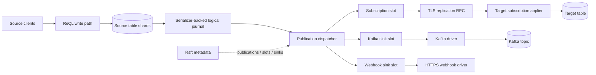

# Phase 3 Design: Logical Replication and CDC Streaming
Status: Design specification — RethinkDB v3.0
Scope: durable logical replication and CDC for committed row changes.
This specification adds persistent publications, remote RethinkDB subscriptions, and external CDC sinks. It defines the data contract, storage invariants, ReQL surface, integration seams, failure behavior, testing, and security. It is a design artifact only; it makes no implementation changes
outside this file.
## Contents
1. Overview
2. API Design / ReQL Surface
3. Data Structures
4. WAL / Change Capture
5. Protocol / Wire Format
6. Integration Points
7. Conflict Resolution
8. Error Paths
9. Testing Requirements
10. Security Considerations
## 1. Overview
### 1.1 Problem statement
RethinkDB changefeeds push realtime updates to connected query clients, but they are per-query and ephemeral. They do not maintain a durable consumer cursor, retain history for a disconnected receiver, or define delivery guarantees. Applications can build an ad hoc relay on changefeeds, but a relay
cannot prove whether an update was delivered before a disconnect and has no server-owned replay point.
RethinkDB v3.0 shall provide a durable logical-change layer with two uses:
1. Logical replication streams row-level changes from a source RethinkDB table publication to a target RethinkDB table subscription.
2. CDC streaming sends the same logical events to external systems such as Kafka-compatible brokers, HTTPS webhooks, and file/S3-compatible archives.
A publication is durable source metadata. Each subscription or CDC sink has a durable replication slot. The slot stores what it has safely processed and pins source change history until it advances, is dropped, or is explicitly evicted.
### 1.2 Definitions
| Term | Definition |
| --- | --- |
| LSN | Monotonically increasing log sequence number for a committed row mutation in one shard. |
| Publication | Durable source-table configuration that selects and formats logical changes. |
| Subscription | Durable target-cluster configuration that consumes a publication into a target table. |
| CDC sink | Durable source configuration that delivers publication events to an external system. |
| Replication slot | Durable cursor and retention pin owned by one subscription or sink. |
| Snapshot barrier | Per-shard LSN separating the initial snapshot from subsequent live changes. |
| Change record | Versioned before/after row mutation event stored in the logical journal. |
### 1.3 What this is and is not
| Capability | Existing changefeed | Phase 3 logical CDC | Physical replication |
| --- | --- | --- | --- |
| Unit | Query-result delta | Row-level table mutation | Storage bytes/pages |
| Lifetime | Connected query | Durable metadata and slot | Storage replication lifecycle |
| Resume point | None | Confirmed LSN per shard | Internal storage position |
| Delivery | Connection-dependent | At least once | Internal durability |
| External contract | ReQL result shape | Versioned change envelope | No public contract |
| Cross-cluster | Client-built | Native subscription | Not supported as an API |
CDC must not expose serializer bytes as an API. Serializer layout, page reuse, compression, and compaction are internal implementation details. The logical journal decodes committed mutations into a stable, versioned row-change record.
### 1.4 Goals
- Capture every eligible committed source mutation exactly once in the durable source journal, before the write is reported successful.
- Deliver records in increasing LSN order for each `(source cluster, table, shard)` stream.
- Let consumers reconnect from a durable confirmed LSN.
- Provide snapshot-plus-stream bootstrap without a silent gap.
- Use at-least-once delivery with stable event IDs and idempotent target apply.
- Retain log history until every valid slot has confirmed consumption.
- Keep slow external consumers from blocking foreground table writes.
- Route configuration through existing Raft metadata and data through existing shard routing, mailbox RPC, and serializer durability infrastructure.
- Expose lag, retained bytes, state, retry count, and recovery action to operators.
### 1.5 Non-goals
Phase 3 does not provide byte-for-byte physical replication, a public WAL reader, exactly-once delivery to arbitrary external systems, multi-primary replication, or cross-table atomic CDC transactions. It does not replicate DDL, users, permissions, or server configuration. It does not run arbitrary
ReQL functions in source publication filters. It does not wait for a remote sink during a normal source-table write commit.
Global order across shards is also out of scope. A multi-shard write may produce several ordered shard streams with the same transaction identifier; consumers requiring a total merge order must define their own deterministic policy.
### 1.6 Delivery contract
The source appends a logical record in the same successful serializer transaction as the primary-table mutation. The sender reads only committed records. If a process dies after commit but before dispatch, recovery scans the journal from the slot cursor. Therefore a committed source row cannot be
silently missing from a healthy retained stream.
Delivery is at least once. A record may be sent again if a transport or process failure occurs after delivery but before a durable acknowledgement. Consumers must deduplicate using an immutable `event_id`; a target RethinkDB subscription persists that ID in its apply ledger before acknowledging the
record.
### 1.7 Topology

### 1.8 Key invariants
1. A journal record exists iff its table mutation committed.
2. An LSN is never reused after crash recovery, compaction, or failover.
3. The source never advances a slot from a received-but-unconfirmed position.
4. Journal retention is not released below an active slot's confirmed LSN.
5. A WAL gap produces `RESYNC_REQUIRED`, never a best-effort later start.
6. A duplicate event cannot duplicate a target subscription's row mutation.
7. Publication filters determine eligibility before output redaction.
8. No credential value is stored in Raft metadata or emitted in status/logs.
9. A slow consumer consumes retained disk budget, not unbounded source memory.
10. Dropping a publication is visible and terminal to attached consumers.
## 2. API Design / ReQL Surface
### 2.1 Create a publication
```javascript
r.table("events").createPublication(
  "events_publication",
  {
    filter: {
      fields: ["tenant_id", "event_type", "status"],
      operations: ["insert", "update", "delete"],
      predicate: {tenant_id: "acme", event_type: {in: ["created", "cancelled"]}}
    },
    format: "json",
    includeBefore: true,
    includeAfter: true,
    snapshot: "initial",
    maxSlotLagBytes: 10737418240
  }
)
```
The publication belongs to the table UUID, not just its current name. A table rename preserves the publication relationship. A table drop terminates its publication. Creation returns `{created: 1, publication: "...", state: "creating"}` and becomes `ready` after Raft metadata installation and local
capture registration complete.
### 2.2 Publication options
| Option | Default | Validation and meaning |
| --- | --- | --- |
| `filter` | no filter | Declarative operation/field/predicate restriction. |
| `format` | `json` | `json` or `internal_rdb_v1`. External sinks may use only JSON. |
| `includeBefore` | `true` | Emit before image when operation has one. |
| `includeAfter` | `true` | Emit after image when operation has one. |
| `snapshot` | `initial` | Default mode for attached consumers: `initial` or `none`. |
| `maxSlotLagBytes` | cluster default | Hard retained-byte policy for attached slots. |
At least one of `includeBefore` and `includeAfter` must be true. The server may retain both images internally even when one is not emitted, because source-side filter matching and future subscription correctness need them.
### 2.3 Filter grammar
A filter is deterministic declarative JSON, never an arbitrary ReQL lambda.
```javascript
{
  fields: ["tenant_id", "event_type"],
  operations: ["insert", "update", "delete"],
  predicate: {
    tenant_id: "acme",
    event_type: {in: ["created", "cancelled"]}
  }
}
```
Rules:
- `operations` defaults to insert, update, replace, and delete.
- `fields` is an output allowlist; `primary_key`, operation, LSN, and metadata remain in the event envelope.
- `predicate` is a conjunction of top-level scalar equality or finite `in`.
- Nested paths, regexes, functions, nondeterministic values, and table reads are rejected at publication creation.
- Insert evaluates `new_val`; delete evaluates `old_val`.
- Update/replace evaluates both images; publish if either matches so a target can remove a row that has moved outside the filter.
- A missing predicate field does not match.
- Projection happens after eligibility evaluation, so predicate-only fields are not accidentally exported.
### 2.4 Create a subscription
```javascript
r.db("target").createSubscription(
  "events_from_primary",
  {
    source: "rethinkdbs://source.example:29100/production.events.events_publication",
    targetTable: "events",
    conflict: "last_write_wins",
    snapshot: "initial",
    auth: {tokenRef: "secret://replication/source-primary"},
    tls: {verifyServer: true, serverName: "source.example"},
    applyBatchSize: 1000
  }
)
```
A subscription commits local target metadata first, then transitions through `connecting`, `snapshotting`, `catching_up`, and `streaming`. The target table must already exist. The source locator is verified on handshake and persisted as source cluster/table/publication UUIDs; reconnecting to a
different object with the same name is rejected.
| Option | Default | Meaning |
| --- | --- | --- |
| `targetTable` | subscription name | Existing target table name. |
| `conflict` | `last_write_wins` | `last_write_wins`, `primary_key_merge`, or `custom`. |
| `conflictHandler` | absent | Required deterministic restricted ReQL function for `custom`. |
| `snapshot` | `initial` | `initial` gives bootstrap parity; `none` starts at a safe current position. |
| `auth` | required | Source credential reference, not a literal secret. |
| `tls` | required | Source TLS verification configuration. |
| `applyBatchSize` | 1000 | Maximum target apply batch size. |
### 2.5 Create a CDC sink
```javascript
r.table("events").createCDCSink(
  "events_kafka",
  {
    publication: "events_publication",
    type: "kafka",
    brokers: ["kafka-1.example:9093", "kafka-2.example:9093"],
    topic: "rethinkdb.production.events",
    credentialsRef: "secret://kafka/events-writer",
    batchSize: 500,
    flushIntervalMs: 100,
    maxInFlightBatches: 4,
    deadLetter: {type: "kafka", topic: "rethinkdb.production.events.dlq"}
  }
)
```
```javascript
r.table("events").createCDCSink(
  "events_webhook",
  {
    publication: "events_publication",
    type: "webhook",
    url: "https://receiver.example/v1/rethinkdb/events",
    credentialsRef: "secret://webhook/events",
    batchSize: 100,
    flushIntervalMs: 250
  }
)
```
```javascript
r.table("events").createCDCSink(
  "events_archive",
  {
    publication: "events_publication",
    type: "s3",
    bucket: "analytics-archive",
    prefix: "rethinkdb/events/",
    credentialsRef: "secret://s3/analytics-archive",
    batchSize: 10000,
    flushIntervalMs: 5000
  }
)
```
A sink creates its own slot. A fast sink cannot hide a slow sink's retention lag. Only sink drivers compiled and configured by the server are accepted; RethinkDB does not infer arbitrary protocols from a URL.
### 2.6 Management API
```javascript
r.publicationList()
r.publicationStatus("events_publication")
r.publicationDrop("events_publication")

r.table("events").subscriptionList()
r.table("events").cdcSinkList()
r.table("events").cdcSinkStatus("events_kafka")
r.table("events").cdcSinkDrop("events_kafka")
```
`publicationStatus` returns publication state, source table identity, format, retention floor, and consumer summaries. A consumer summary contains name, kind, state, confirmed LSN per shard, lag bytes, lag time, retry count, and redacted last error. It never returns bearer tokens, passwords, private
keys, or resolved credential data.
```javascript
{
  name: "events_publication",
  state: "ready",
  table: {db: "production", table: "events", table_id: "..."},
  format: "json",
  consumers: [{
    name: "events_from_primary",
    kind: "subscription",
    state: "streaming",
    lag_bytes: 16384,
    lag_ms: 42,
    last_error: null
  }]
}
```
Dropping a publication first commits `dropping` through Raft, rejects new connections, sends a terminal control frame to consumers, releases their pins once terminal state is durable, and removes metadata. It never drops target tables or deletes already delivered external data.
### 2.7 Term types and compatibility
Add these stable `TermType` entries in `src/rdb_protocol/ql2.proto`:
```protobuf
PUBLICATION_CREATE = <allocated>;
PUBLICATION_LIST = <allocated>;
PUBLICATION_STATUS = <allocated>;
PUBLICATION_DROP = <allocated>;
SUBSCRIPTION_CREATE = <allocated>;
SUBSCRIPTION_LIST = <allocated>;
SUBSCRIPTION_STATUS = <allocated>;
SUBSCRIPTION_DROP = <allocated>;
CDC_SINK_CREATE = <allocated>;
CDC_SINK_LIST = <allocated>;
CDC_SINK_STATUS = <allocated>;
CDC_SINK_DROP = <allocated>;
```
Numeric IDs must be allocated only after inspecting existing proto values; this design intentionally does not guess them. The change regenerates supported driver bindings. CDC DDL is cluster-version-gated and rejected until all members can deserialize and enforce the new metadata.
### 2.8 Authorization
- Publication creation/drop requires source-table administration permission.
- Subscription creation/drop requires target database/table administration and permission to use the named credential reference.
- Sink creation/drop requires source-table administration and credential access.
- Connection-time authorization verifies both publication access and permission to operate the specific slot.
- Detailed filters/status are visible only to owners and administrators.
- System tables, incomplete tables, and tables being dropped reject publication creation.
## 3. Data Structures
### 3.1 Identity and position types
```cpp
struct log_sequence_number_t {
    uint64_t value;
    bool operator<(const log_sequence_number_t &other) const;
    bool operator==(const log_sequence_number_t &other) const;
};

struct shard_lsn_t {
    uuid_u shard_id;
    log_sequence_number_t lsn;
};

struct change_event_id_t {
    uuid_u source_cluster_id;
    uuid_u table_id;
    uuid_u shard_id;
    log_sequence_number_t lsn;
};
```
An LSN is shard-local, durable, and never reused. `change_event_id_t` is the idempotence key. A timestamp is not an idempotence key because clocks can skew or share insufficient resolution.
### 3.2 Publication configuration
```cpp
enum class publication_format_t { JSON_V1, INTERNAL_RDB_V1 };
enum class publication_state_t { CREATING, READY, DROPPING, DROPPED, ERROR };

struct publication_filter_t {
    std::set<std::string> projected_fields;
    std::set<change_operation_t> operations;
    std::map<std::string, filter_predicate_t> predicates;
};

struct publication_config_t {
    uuid_u publication_id;
    name_string_t name;
    uuid_u database_id;
    uuid_u table_id;
    publication_filter_t filter;
    publication_format_t format;
    bool include_before_image;
    bool include_after_image;
    snapshot_mode_t default_snapshot_mode;
    uint64_t max_slot_lag_bytes;
    publication_state_t state;
    uuid_u created_by_user_id;
    microtime_t created_at;
};
```
This is Raft-managed metadata. It references stable database/table UUIDs and uses names only for display/lookup. Its serialized format is additive and cluster-version-gated.
### 3.3 Subscription configuration
```cpp
enum class conflict_resolution_t {
    LAST_WRITE_WINS,
    PRIMARY_KEY_MERGE,
    CUSTOM_REQL
};

enum class subscription_state_t {
    CREATING, CONNECTING, SNAPSHOTTING, CATCHING_UP, STREAMING,
    PAUSED, RESYNC_REQUIRED, ERROR, DROPPING, DROPPED
};

struct subscription_config_t {
    uuid_u subscription_id;
    name_string_t name;
    source_publication_locator_t source;
    uuid_u target_database_id;
    uuid_u target_table_id;
    conflict_resolution_t conflict_resolution;
    optional<serialized_reql_function_t> conflict_handler;
    snapshot_mode_t snapshot_mode;
    secret_reference_t source_auth;
    tls_client_config_t tls;
    uint32_t apply_batch_size;
    subscription_state_t state;
};
```
The verified source identity includes source cluster, table, and publication UUIDs. The target rejects a same-name but different source identity during a later reconnect.
### 3.4 CDC sink configuration
```cpp
enum class cdc_sink_type_t { KAFKA, WEBHOOK, FILE, S3 };
enum class cdc_sink_state_t {
    CREATING, CONNECTING, STREAMING, RETRYING, PAUSED,
    DEAD_LETTERING, ERROR, DROPPING, DROPPED
};

struct cdc_batching_config_t {
    uint32_t max_records;
    uint32_t max_in_flight_batches;
    uint64_t flush_interval_ms;
    uint64_t max_buffer_bytes;
};

struct cdc_sink_config_t {
    uuid_u sink_id;
    name_string_t name;
    uuid_u publication_id;
    cdc_sink_type_t type;
    datum_t connection_parameters;
    secret_reference_t credentials;
    cdc_batching_config_t batching;
    optional<dead_letter_config_t> dead_letter;
    cdc_sink_state_t state;
};
```
`connection_parameters` holds validated non-secret addresses/topics/buckets. Credentials are secret-provider references and never literal durable fields.
### 3.5 Change record
```cpp
enum class change_operation_t { INSERT, UPDATE, REPLACE, DELETE };

struct change_record_t {
    change_event_id_t event_id;
    microtime_t commit_timestamp;
    change_operation_t operation;
    uuid_u database_id;
    uuid_u table_id;
    store_key_t primary_key;
    optional<ql::datum_t> old_value;
    optional<ql::datum_t> new_value;
    uuid_u write_transaction_id;
    uint32_t schema_version;
};
```
Insert has only `new_value`; delete has only `old_value`; update/replace have both. A no-op update emits no record. The durable journal retains full images in Phase 3; publication projection is an output concern.
### 3.6 Replication slot
```cpp
enum class replication_slot_state_t {
    INITIALIZING, SNAPSHOTTING, ACTIVE, PAUSED, RETRYING,
    RESYNC_REQUIRED, EVICTED, ERROR, DROPPING
};

struct replication_slot_t {
    uuid_u slot_id;
    uuid_u publication_id;
    consumer_identity_t consumer;
    replication_slot_state_t state;
    std::map<uuid_u, log_sequence_number_t> confirmed_lsn_by_shard;
    std::map<uuid_u, log_sequence_number_t> flush_lsn_by_shard;
    std::map<uuid_u, log_sequence_number_t> snapshot_barrier_lsn_by_shard;
    microtime_t last_ack_at;
    uint64_t retained_bytes;
    optional<replication_error_t> last_error;
};
```
`flush_lsn` means received and is diagnostic only. `confirmed_lsn` means consumer-durable and is the sole retention-release cursor. It is monotonic and must acknowledge contiguous LSNs only.
### 3.7 Target apply ledger
```cpp
struct applied_change_t {
    change_event_id_t event_id;
    microtime_t applied_at;
    uuid_u subscription_id;
};

class subscription_applier_t : public home_thread_mixin_t {
public:
    void apply_batch(const std::vector<change_record_t> &records,
                     signal_t *interruptor);
    bool already_applied(const change_event_id_t &event_id,
                         signal_t *interruptor) const;
};
```
The applier writes target changes and ledger entries in one target transaction where supported. A crash after apply but before network ACK causes replay; the ledger suppresses duplicate row mutation. Ledger entries are retained for the subscription lifetime in Phase 3 unless a proven-safe compaction
rule exists.
### 3.8 Metadata ownership
Raft owns publication/subscription/sink definitions and durable lifecycle state. The replication coordinator batches high-frequency progress checkpointing rather than proposing to Raft per event. A process crash can replay a small confirmed suffix, which is acceptable because delivery is at least
once. Table config continues to own table/shard layout; CDC metadata refers to stable table IDs.
## 4. WAL / Change Capture
### 4.1 Capture invariants
The serializer/log-structured engine is the durability base. Phase 3 adds a logical journal layered on committed write transactions. It does not reinterpret raw serializer entries on demand as the public CDC format.
Required properties:
1. Each committed primary-row mutation receives one committed logical record.
2. Aborted writes emit no record.
3. Row mutation, LSN assignment, and logical record commit atomically.
4. Logical records remain decodable after physical serializer compaction.
5. Recovery restores the durable high-water LSN before dispatch resumes.
6. Extent reclamation consults active replication slot retention pins.
### 4.2 Write capture seam
Capture starts in `store_t::write()` after mutation logic has produced normalized before/after images and before the surrounding serializer transaction commits. `btree_store_t` must preserve enough mutation-report information to identify operation type, primary key, old image, and resulting image
for every changed row. The capture code stages `change_record_t` entries in that transaction.
A post-commit notification wakes the dispatcher. It is not correctness-critical: if the notification is lost, the dispatcher reads from the durable journal using its slot cursor.
### 4.3 Mutation normalization
| Mutation | Event | Old image | New image |
| --- | --- | --- | --- |
| Insert absent key | `insert` | absent | inserted document |
| Replace existing key | `replace` | previous document | replacement document |
| Update existing key | `update` | previous document | resulting document |
| Delete existing key | `delete` | removed document | absent |
| No-op update | none | n/a | n/a |
The source captures `ql::datum_t` values with existing durable datum serialization. It does not serialize values via lossy string formatting.
### 4.4 Journal layout
The logical journal is an append-only serializer-managed extent stream per table shard. It uses a versioned record independent of physical page layout:
```text
logical_record_header
  format_version, table_id, shard_id, lsn
  transaction_id, commit_timestamp, operation
  primary_key length + durable datum/key encoding
  old-value present marker + payload
  new-value present marker + payload
  checksum
```
A journal index maps LSN ranges to extents and is checkpointed with durable shard metadata. Recovery loads a checkpoint, validates the tail, and discards only uncommitted/incomplete tail records. It must never reorder, manufacture, or reuse LSNs.
### 4.5 LSN allocation
LSNs are assigned by the shard-local durable journal owner. The current high-water value advances in the same transaction as its record. A multi-row write on one shard produces increasing LSNs in mutation commit order. A write spanning shards creates one ordered sequence per shard and may share its
`write_transaction_id` across records.
### 4.6 Snapshot plus stream
For `snapshot: "initial"`:
1. Create the source slot and persist a snapshot barrier LSN for every shard.
2. Read a consistent source-table image at those barriers through normal table routing and shard read facilities.
3. Send rows as `snapshot: true` frames, partitioned by source shard/key range.
4. Send journal events strictly after each shard's barrier when that snapshot partition is durable at the consumer.
5. Mark the slot active only after all snapshot partitions complete.
Snapshot rows are not synthetic insert events. They carry an explicit snapshot flag, allowing target appliers and external systems to bootstrap deliberately.
### 4.7 Retention and extent GC
For a table shard, the retention floor is the minimum confirmed LSN across its active slots, subject to configured extra retention. A journal extent is reclaimable only when all covered records are below this floor.
`src/serializer/log/lba/extent_manager.hpp` gains retention consultation with behavior equivalent to:
```cpp
class logical_log_retention_t {
public:
    void pin_through(const uuid_u &table_id, const uuid_u &shard_id,
                     log_sequence_number_t required_lsn);
    void advance_slot(const uuid_u &slot_id, const shard_lsn_t &confirmed);
    log_sequence_number_t retention_floor(const uuid_u &table_id,
                                          const uuid_u &shard_id) const;
};
```
The final API must follow existing extent-manager ownership and coroutine style. The non-negotiable rule is that GC cannot infer safety from an in-memory ACK or an open TCP connection.
### 4.8 Stalled consumers and capacity policy
| Control | Behavior |
| --- | --- |
| `max_slot_lag_bytes` | Warn at 80%; enforce explicit pause/eviction policy at the configured hard limit. |
| `max_slot_lag_age` | Alert when a slot is stale; durable subscriptions are not silently discarded. |
| Slot lease timeout | May evict explicitly ephemeral consumers only. |
| Disk watermarks | Identify pinning slots and refuse unsafe new workload before integrity is threatened. |
An evicted slot records `EVICTED`, its last confirmed LSN, and the retention floor at eviction. Reconnect compares required LSN with retained history. If history is gone, it enters `RESYNC_REQUIRED`; it never silently resumes later.
### 4.9 Backpressure
Per-slot dispatch uses bounded in-memory queues. It stops reading beyond `maxInFlightBatches` or `maxBufferBytes`, lets the retained journal buffer changes, and reports slot lag. Source foreground writes are never blocked solely because Kafka, a webhook, or a target cluster is slow.
## 5. Protocol / Wire Format
### 5.1 Transport
Cluster-to-cluster replication uses a dedicated TLS-authenticated long-lived stream on the existing mailbox/RPC infrastructure. It is separate from legacy changefeed cursors. Framed messages support bounded chunked transfer; a large document cannot require an unbounded receiver allocation.
A WebSocket developer gateway may be designed later, but it is not the trusted cross-cluster protocol for this phase.
### 5.2 Handshake
1. Consumer opens TLS and validates source certificate/server name.
2. Consumer authenticates with a publication-scoped credential.
3. Consumer sends publication identity, consumer ID, supported schemas, requested snapshot mode, and durable confirmed positions.
4. Source authorizes identity, verifies publication state, and binds/creates slot.
5. Source returns source cluster/table/publication UUIDs, retention floors, and snapshot barriers or live start positions.
6. Both peers reject an unsupported mandatory protocol version before data flow.
A slot is bound to authenticated consumer identity. Guessing a slot ID cannot advance its cursor or release retained data.
### 5.3 Frames
```cpp
enum class replication_frame_type_t : uint8_t {
    HELLO, START_REPLICATION, STARTED,
    SNAPSHOT_BEGIN, SNAPSHOT_ROW, SNAPSHOT_END,
    CHANGE_BATCH, ACK, HEARTBEAT,
    PAUSE, RESUME, ERROR, PUBLICATION_DROPPED,
    RESYNC_REQUIRED, CLOSE
};
```
All frames include protocol version, slot/stream ID, bounded payload length, and frame type. TLS provides transport integrity. Receivers enforce maximum frame, record, and batch sizes before allocating payload buffers.
### 5.4 JSON envelope
```json
{
  "schema_version": 1,
  "event_id": "cluster/table/shard/0000000000004a2f",
  "lsn": "0000000000004a2f",
  "source_cluster_id": "d4b0...",
  "shard_id": "40f6...",
  "timestamp": "2026-07-16T12:34:56.789Z",
  "op": "update",
  "db": "production",
  "table": "events",
  "primary_key": "evt_42",
  "old_val": {"id": "evt_42", "status": "pending"},
  "new_val": {"id": "evt_42", "status": "published"},
  "snapshot": false,
  "transaction_id": "..."
}
```
Delete omits `new_val`; insert omits `old_val`. Projected values may have fields removed, but operation, primary key, LSN, and event identity stay present. RethinkDB JSON pseudotype behavior is used for values requiring it.
`internal_rdb_v1` is a versioned binary envelope containing the same logical fields and durable datum serialization. It is allowed only for RethinkDB target subscriptions, not generic external sinks.
### 5.5 Batches and acknowledgements
A batch contains consecutive records from one source shard. The sender flushes on record count, elapsed latency, or flow-control pressure.
| Setting | Default | Bounds |
| --- | --- | --- |
| `batchSize` | 500 | 1–10,000 events |
| `flushIntervalMs` | 100 ms | 1–60,000 ms |
| `maxInFlightBatches` | 4 | 1–64 |
| `maxBufferBytes` | 16 MiB | 1 MiB–1 GiB |
| heartbeat | 5 s | 1–60 s |
An ACK names the highest contiguous durably processed LSN for a shard. Sparse or out-of-order ACKs are rejected and do not release retention.
### 5.6 Sink ACK mapping
| Consumer | ACK boundary | Idempotence key |
| --- | --- | --- |
| RethinkDB subscription | Target row and apply-ledger transaction commits | apply ledger event ID |
| Kafka | Broker acknowledges configured durable producer write | key/header event ID |
| Webhook | Receiver returns configured durable-acceptance 2xx | `Idempotency-Key` event ID |
| File/S3 | Final object/file and manifest commit | event range manifest |
Webhook 2xx proves receiver acceptance, not the receiver's own database commit. The source still treats this integration as at least once.
### 5.7 Retry protocol
Error frames include code, retryability, affected shard/LSN, and redacted action. Retryable transport failures use full-jitter exponential backoff: 250 ms initial, multiplier 2, 30 s cap, reset after successful handshake. Authentication, unsupported schema, malformed event, and permanent 4xx
configuration failures enter `ERROR` rather than busy-looping.
## 6. Integration Points
### 6.1 New CDC modules
| File | Responsibility |
| --- | --- |
| `src/rdb_protocol/publication.hpp` | Publication types, validation, filter compilation, metadata lookup, status interface. |
| `src/rdb_protocol/publication.cc` | Publication lifecycle, eligibility, projection, dispatch coordination. |
| `src/rdb_protocol/subscription.hpp` | Target state machine, RPC client, applier and conflict-policy interfaces. |
| `src/rdb_protocol/subscription.cc` | Snapshot/stream orchestration, durable apply ledger, reconnect/resync. |
| `src/rdb_protocol/cdc_sink.hpp` | Sink-driver, batching, retry, and dead-letter interfaces. |
| `src/rdb_protocol/cdc_sink.cc` | Kafka/webhook/file/S3 driver registration and shared dispatch implementation. |
| `src/clustering/replication_coordinator.hpp` | Slot ownership, cursor checkpoints, retention-floor and metadata interface. |
| `src/clustering/replication_coordinator.cc` | Slot lifecycle, lag accounting, Raft and shard-routing integration. |
### 6.2 Storage and capture changes
| Area | File/path | Required change |
| --- | --- | --- |
| Write seam | `src/rdb_protocol/store.hpp`, `store.cc` | Stage change records from `store_t::write()` in the enclosing committed transaction. |
| B-tree writes | `src/rdb_protocol/btree_store.hpp`, `btree_store.cc` | Expose normalized before/after mutation reports without changing ordinary write semantics. |
| Logical journal | `src/serializer/` | Add versioned append/read/checkpoint journal support tied atomically to serializer transactions. |
| Retention | `src/serializer/log/lba/extent_manager.hpp` | Prevent reclaim below slot retention floors and expose pinned-byte pressure. |
| Recovery | serializer recovery paths | Restore LSN high-water and journal tail before slot dispatch. |
| Query protocol | `src/rdb_protocol/ql2.proto` | Add CDC term definitions and regenerate bindings. |
| ReQL terms | `src/rdb_protocol/terms/` | Implement DDL/status terms and optarg/permission validation. |
Exact serializer implementation files must be chosen after tracing current transaction and extent ownership. This specification does not invent unverified storage APIs; it requires atomic row+journal commit and retention-safe GC.
### 6.3 Metadata and Raft
`table_config_t` remains authoritative for table UUID, shard layout, replica assignment, and lifecycle. CDC configuration uses table IDs and follows table movement/reconfiguration. Raft carries durable publication, subscription, sink, and slot lifecycle metadata, not per-row event payloads or
per-event ACKs.
`replication_coordinator_t` must react to shard leadership/routing change by reconnecting or handing off source streams without changing a slot's durable confirmed position. It must distinguish a stale shard incarnation from a current shard before accepting a cursor acknowledgement.
### 6.4 RPC and runtime
The coordinator registers a dedicated replication mailbox/RPC service. It needs version negotiation, TLS-authenticated identity, bounded flow-control, normal coroutine cancellation, and terminal cancellation on table/publication/slot drop. It must use existing shard routing rather than making one
server proxy unbounded journal traffic for every remote consumer.
### 6.5 Sink driver interface
```cpp
class cdc_sink_driver_t : public home_thread_mixin_t {
public:
    virtual ~cdc_sink_driver_t() = default;
    virtual void connect(const cdc_sink_config_t &config,
                         signal_t *interruptor) = 0;
    virtual sink_delivery_result_t deliver(
        const publication_config_t &publication,
        const uuid_u &slot_id,
        const std::vector<change_record_t> &batch,
        signal_t *interruptor) = 0;
    virtual void close(signal_t *interruptor) = 0;
};
```
`deliver()` returns a contiguous durable acknowledgement or a typed retryable / permanent failure. It must not log a failure and return success. Any third-party client dependency needs build, licensing, timeout, and test-double review; logical journal and slot primitives do not depend on a Kafka
library existing.
### 6.6 Observability
Expose low-cardinality metrics keyed by IDs or controlled names:
- `cdc_records_captured_total`
- `cdc_records_delivered_total`
- `cdc_delivery_latency_ms`
- `cdc_slot_lag_bytes`
- `cdc_slot_lag_lsn`
- `cdc_retained_journal_bytes`
- `cdc_sink_retries_total`
- `cdc_sink_dead_letter_total`
- `cdc_resync_required_total`
Status and metrics must not use document values, token values, URLs with secrets, or arbitrary user field data as labels.
## 7. Conflict Resolution
### 7.1 Scope
Conflict policy applies only to RethinkDB-to-RethinkDB subscriptions. External sinks deliver immutable events and do not mutate a target table. Target rows store replication metadata outside ordinary user JSON fields so user documents cannot forge source version state.
### 7.2 Last-write-wins
LWW compares the deterministic tuple:
```text
(source commit timestamp, source cluster UUID, shard UUID, LSN)
```
The target applies an incoming insert/update/replace only if this tuple is newer than its recorded source version. A delete creates a tombstone version rather than immediately discarding history, preventing an old replayed write from resurrecting data. Phase 3 retains tombstones for subscription
lifetime unless a proven-safe compaction condition is implemented.
LWW is deterministic conflict handling, not support for arbitrary bidirectional multi-primary topology.
### 7.3 Primary-key merge
`primary_key_merge` is an upsert-oriented policy:
- Missing target PK plus source insert/update/replace inserts `new_val`.
- Existing target PK plus source insert/update/replace shallow-merges source top-level fields while preserving target primary key.
- Source delete removes only when target metadata is not newer; otherwise it creates a conflict record.
- PK type/value mismatch is a permanent identity conflict.
Arrays, recursive object merge, CRDT sets, and custom merge algebra are not implied. The incoming version is stored even when a merge produces no visible user-field difference.
### 7.4 Custom handler
```javascript
function(sourceEvent, targetDocument, targetMetadata) {
  return {action: "apply" | "skip" | "replace" | "merge" | "conflict", value: ...};
}
```
A custom handler is a serialized deterministic restricted ReQL function. It may not read/write tables, access network, use random/time nondeterminism, recurse into queries, or exceed CPU/output limits. Invalid return values, exceptions, or resource limits create an unresolved conflict; they never
silently default to apply.
### 7.5 Conflict log
Unresolved conflicts are durably recorded with subscription ID, event ID, redacted source envelope, target version metadata, policy, reason, retry count, and timestamps. An authorized operator can inspect and explicitly retry, skip, or resolve a conflict. The slot may not ACK past a blocked record
unless an explicit durable skip/dead-letter policy records resulting divergence.
## 8. Error Paths
### 8.1 Error model
Errors are classified as transient, permanent configuration/authentication, data compatibility/conflict, history loss, or terminal lifecycle error. Status always includes code, last confirmed LSN, timestamp, safe diagnostic, and operator action. A log message alone is not a recovery interface.
### 8.2 Required behavior matrix
| Condition | Required state and behavior | Recovery |
| --- | --- | --- |
| Dropped publication | Subscription gets `PUBLICATION_DROPPED` and enters terminal error; source releases slot | Recreate publication and intentionally resync |
| Dropped source table | Publication terminates attached streams | Recreate table/publication; target is not deleted |
| Journal/WAL gap | `RESYNC_REQUIRED`; do not stream from arbitrary later LSN | New snapshot barrier and full resync |
| Sink network failure | `RETRYING` with bounded jitter; retain journal data | Automatic reconnect after endpoint recovery |
| Permanent sink reject | `ERROR` or `DEAD_LETTERING`; do not ACK original record prematurely | Fix credentials/config or explicit DLQ/skip action |
| Target restart | Source retains slot; target reconnects from confirmed LSN | Automatic replay plus ledger dedupe |
| Source shard movement | Stream handoff/reconnect; retain cursor | Automatic routing recovery |
| Schema/protocol mismatch | Reject before partial apply | Upgrade peers or recreate compatible config |
| Unsupported datum coercion | Durable `SCHEMA_MISMATCH`; pause or DLQ by policy | Transform data/config or resync |
| Custom conflict failure | Durable conflict log and pause at contiguous point | Operator resolves/retries/skips |
| Duplicate event | Target ledger suppresses row reapply and ACKs | No action |
| Out-of-order ACK | Reject cursor advancement | Consumer sends valid contiguous ACK |
| Filter mutation request | Reject in-place semantic filter alteration | Create new publication and migrate consumers |
### 8.3 Schema compatibility
RethinkDB-to-RethinkDB binary replication preserves supported `ql::datum_t` values exactly. JSON sinks use documented RethinkDB JSON pseudotypes. A JSON sink must reject an unrepresentable external value rather than stringify it silently. Primary key changes are never coerced. Numeric coercion is
disabled by default and allowed only when explicitly declared lossless.
### 8.4 Dead-letter policy
A sink DLQ event includes original envelope, sink ID, code, redacted diagnostic, and timestamp. The slot advances only after the DLQ write is durable. If the DLQ is unavailable, the source retains and retries the original record.
Target subscription apply errors do not dead-letter by default because doing so creates data divergence. If enabled explicitly, each skip creates a durable conflict-log record and status reports degraded parity.
### 8.5 Pause, resume, eviction, resync
Pause stops dispatch but retains the slot pin. Resume continues from confirmed LSN. Drop releases the pin after durable lifecycle state. Eviction is auditable and makes later history loss explicit. Resync creates new snapshot barriers, records old/new stream positions, and requires an
operator-approved apply-ledger reset/rebuild policy.
### 8.6 Alerts
Alert on lag above 80%/100% quota, old acknowledgements, journal storage pressure, retry storms, any `RESYNC_REQUIRED`, `EVICTED`, `ERROR`, or `DEAD_LETTERING` state, and snapshots/catch-up that cannot converge. The alert/status path must identify the slot currently blocking extent reclamation.
## 9. Testing Requirements
### 9.1 General completion gate
CDC is complete only when it demonstrates no silent loss, no false cursor advancement, no unbounded-memory slow-consumer path, and no credential exposure. Tests must use established repository unit/integration conventions and validate observable table/sink state, not just process logs.
### 9.2 Unit tests
| Area | Required cases |
| --- | --- |
| Change record codec | Every operation; absent images; large docs; corrupt/truncated/unknown version data. |
| LSN allocator | Strict monotonicity; recovery high-water; no reuse after failed append; shard isolation. |
| Publication validation | Valid/invalid filters, formats, images, names, permissions, predicates. |
| Filter evaluation | Insert/delete/update transition into/out of predicates; projection after matching. |
| Slot manager | Contiguous ACK, duplicate ACK, out-of-order rejection, floors across slots, state transitions. |
| Retention accounting | Pin/release only on confirmed LSN; flush-only position never releases bytes. |
| Batching | Size/latency triggers, one-shard batch ordering, queue/window bounds, heartbeats. |
| Apply ledger | Atomic apply/ledger, duplicate suppression, restart/replay, safe retention. |
| Conflict policies | LWW ties/tombstones, merge semantics, handler errors and return validation. |
| Sink errors | Retry classification, jitter bounds with injected time/randomness, DLQ boundary. |
| Protocol | Auth/version handshake, identity mismatch, bad frames, allocation limits. |
### 9.3 Source-to-target integration tests
1. Bootstrap source publication and target subscription, then insert/update/ replace/delete source rows; assert exact target parity.
2. Write concurrently with initial snapshot; prove snapshot barrier has no gap and no duplicate logical application.
3. Kill target after apply but before ACK; restart and prove replay is deduped.
4. Restart source with slots present; prove cursor recovery and permitted suffix replay only.
5. Use at least two source shards and force routing/leadership handoff; prove per-shard ordering and successful reconnect.
6. Attach fast and slow subscriptions; prove fast progress is independent while slow slot correctly pins source retention.
7. Drop a live publication; prove terminal consumer state and source slot release.
8. Test `snapshot: "none"`; prove it starts only at documented safe current LSN.
### 9.4 CDC sink tests
Kafka tests must verify event IDs in key/header, event body, source-shard order, broker outage retry, no ACK before broker acknowledgement, and permanent error/ DLQ behavior. Use an isolated broker/test double with durable observation.
Webhook tests use a controllable HTTPS receiver. Verify body, idempotency key, 2xx ACK, timeout/reset retry, 429/5xx behavior, non-retryable 4xx behavior, and batch payload limits.
File/S3 tests verify finalized object/file plus manifest as the ACK boundary. Simulate interruption before finalization and prove no slot advancement. Verify restart cleanup/recovery of partial staging output.
### 9.5 Failure and durability tests
- Kill source after mutation staging but before commit; prove neither source row nor event becomes committed, or both recover together.
- Kill source after commit but before wake-up; prove dispatcher finds journal record from slot cursor.
- Partition source/target beyond heartbeat interval; prove bounded memory, lag, retry backoff, and correct resume.
- Stall a slot under extent-GC pressure; prove no premature record deletion, clear operator diagnostics, and explicit eviction/resync behavior.
- Request a LSN below retention floor; prove precise WAL-gap error and no later partial stream.
- Corrupt journal/checkpoint in controlled test; prove recovery refuses unsafe delivery and requires repair/resync.
- Race table/publication/subscription create/drop; prove no leaked pin or worker.
### 9.6 Performance benchmarks
Report cluster size, shards, storage medium, document distribution, filter, sink config, and durability configuration. Measure:
| Metric | Definition |
| --- | --- |
| Capture throughput | Eligible committed changes per second. |
| Delivery throughput | Durably ACKed changes per second per/aggregate consumer. |
| End-to-end latency | Commit to durable consumer ACK; p50/p95/p99/max. |
| Capture overhead | Write latency/throughput with no, idle, and active CDC. |
| Journal amplification | Journal bytes per source mutation. |
| Retention growth | Bytes/hour with stalled slots. |
| Recovery time | Restart to safe stream convergence. |
| Resync time | Snapshot plus catch-up duration. |
Release thresholds must come from measured baselines, not invented values. The release gate requires bounded write latency and process memory under disconnected consumer workload.
### 9.7 Compatibility and security tests
Test old/new metadata defaults, mixed-version cluster rejection, regenerated protocol bindings, unauthorized DDL/connect/status denial, secret redaction from all diagnostics, TLS bad-cert/wrong-name failure, and plaintext downgrade rejection.
## 10. Security Considerations
### 10.1 Threat model
CDC adds long-lived data-export paths, durable cursors, and external credential references. Risks include unauthorized reads, malicious ACK advancement, credential disclosure, source impersonation, endpoint abuse, retained-log disk exhaustion, event replay/tampering, and accidental export of
sensitive fields.
### 10.2 Authentication and authorization
Each subscription authenticates with a publication-scoped credential. The source checks publication permission and slot-operation permission at DDL and connection time. A token for one publication cannot enumerate or consume another. Credential revocation disconnects/revalidates sessions through
existing identity infrastructure. A claimed slot ID alone is never authority.
### 10.3 Secret handling
Kafka keys, webhook secrets, TLS private-key references, and S3 credentials live only in the configured secret provider. Durable CDC metadata contains opaque `secret_reference_t` values. Literal secrets must be rejected in ReQL options. Resolved values must not reach Raft logs, status, query
history, profiles, metric labels, exceptions, or fixtures.
Secret rotation triggers driver reconnect/reload without altering source history. Failure to resolve a secret is a permanent configuration error and must not produce a false acknowledgement.
### 10.4 Transport protection
Cross-cluster replication requires TLS with certificate/server-name validation. Insecure verification is rejected by default. Kafka uses TLS/SASL as configured; webhooks and S3 require HTTPS except isolated test-only loopback fixtures. Plaintext downgrade is never implicit.
### 10.5 Event integrity and replay
TLS protects the transport. Event ID, source/table/shard UUIDs, schema version, and LSN protect logical validation. Targets reject malformed identity, invalid batch sequence, unknown schema, or source identity drift. Webhooks include an idempotency key and may include HMAC body/timestamp signatures.
Kafka messages include source identity and event ID headers.
### 10.6 Data minimization
A publication is a data-export boundary. Filters are evaluated before projection and predicate-only fields are not emitted. External sinks should default to no before image unless required. Creation/status audit output warns when full before/after documents are exported to a non-RethinkDB
destination.
### 10.7 Resource controls
Enforce quotas for publications, slots, workers, snapshots, frame size, filter complexity, pending batches, retry rate, DLQ growth, slot age, and retained bytes. A consumer cannot consume unbounded process memory; its cost is visible retained storage subject to explicit configured eviction policy.
### 10.8 Auditability
Audit publication/subscription/sink create, pause, resume, drop, secret-reference change, slot eviction, resync, and authorization failure with actor, object IDs, timestamp, and redacted delta. Never audit raw document payloads or secret values.
### 10.9 Security release checklist
- [ ] TLS and authenticated identity are required on every production stream.
- [ ] ACK authority is bound to authenticated slot owner.
- [ ] Secrets are reference-only and redacted everywhere.
- [ ] Filter/projection prevent unintended data export.
- [ ] Target dedupe and external event IDs support safe replay handling.
- [ ] Slow consumers have bounded memory impact and visible disk impact.
- [ ] Eviction/resync are explicit, auditable, and never silent.
- [ ] Mixed-version clusters cannot create or mishandle CDC state.
This design builds a durable logical data plane on RethinkDB's established serializer, B-tree/store write path, Raft metadata, table routing, and mailbox RPC foundations. It keeps normal source writes independent of sink speed while making lag, retention, recovery, conflicts, and export boundaries
explicit.
