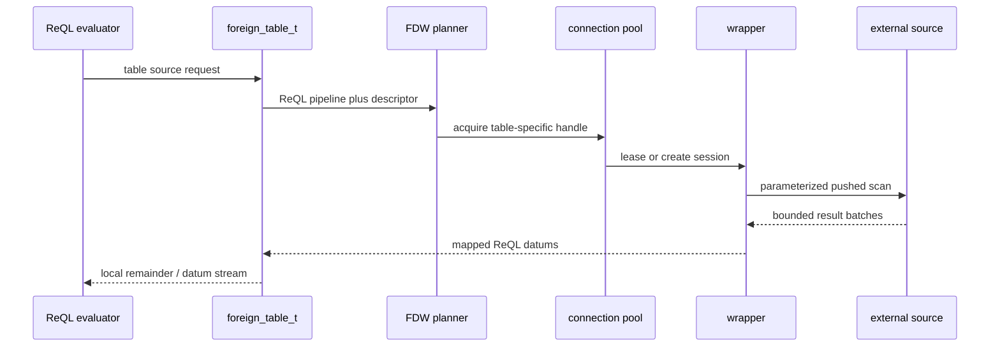

# Foreign Data Wrapper (FDW) Support — RethinkDB v3.0

Status: Phase 3 axiom-level implementation specification. Scope: read-only
foreign tables exposed through existing ReQL table operations. Repository:
/home/kara/rethinkdb. This is a design specification only; it authorizes no
implementation patch and contains no implementation code.

This document uses the checked-in table-create seam in
src/rdb_protocol/terms/db_table.cc, the existing table and datum abstractions
in src/rdb_protocol/val.hpp and src/rdb_protocol/context.hpp, ql2.proto
Term::TABLE_CREATE, and the ReQL-specific superblock metainfo facilities in
src/btree/reql_specific.hpp plus the B-tree transaction rules in
src/btree/operations.*.

## 1. Overview

An FDW foreign table is a normal logical ReQL table name backed by a remote
relation rather than a local primary B-tree. The server owns the external
connection, maps remote rows to ReQL documents, and exposes the table through
the existing table, selection, datum-stream, filtering, projection, limit, and
profiling paths.

### 1.1 Goals and scope

- v3.0 supports exactly read-only foreign tables. `get`, table scans,
  `filter`, `pluck`, `without`, `map` when row-local, `limit`, `count`, and
  ReQL terminals consume rows returned by the wrapper.
- The initial built-in wrapper identifiers are `postgres_fdw` and
  `mysql_fdw`. They are server-linked adapters, not user-loaded plugins,
  shared libraries, scripts, or arbitrary executable commands.
- A foreign table has one logical RethinkDB table identity and one remote
  relation descriptor. It is not materialized locally, replicated through
  RethinkDB shard contracts, or represented as one RethinkDB child table per
  remote partition.
- Each foreign query captures a wrapper session lease and a remote schema
  fingerprint before its first row. The fingerprint protects one query from
  silently decoding two incompatible row layouts.
- Existing ReQL result semantics remain authoritative. The wrapper supplies a
  finite stream of mapped `datum_t` objects; the ordinary RethinkDB terms
  apply any operation that is not safely pushed down.
- Pushdown is an optimization only. Failure to push a predicate, projection,
  or limit must select the correct local ReQL evaluation path and must never
  change rows, errors, or visibility.
- Foreign tables participate in the database and table namespace,
  `r.tableList`, `r.table`, `r.config`, `r.status`, permission checks, and
  normal client protocol dispatch.
- No new driver protocol framing is introduced. The existing TABLE_CREATE
  term accepts a literal `foreign` optarg in its existing optarg map.
- All remote work is initiated by the RethinkDB server process. A driver
  never receives remote credentials, opens a wrapper connection, or directly
  contacts the configured foreign endpoint.
- The catalog holds metadata and protected credentials only. It does not
  cache remote rows, indexes, transaction snapshots, query plans, or full
  remote schemas beyond the bounded descriptor required for decoding.

### 1.2 Architecture

```mermaid
flowchart LR
    C[ReQL client] --> R[r.table("remote_t")]
    R --> P[FDW planner and pushdown classifier]
    P --> W[foreign_table_t / wrapper adapter]
    W --> CP[per-server connection pool]
    CP --> E[PostgreSQL or MySQL external source]
    E --> W
    W --> M[remote row to ReQL datum mapper]
    M --> L[local ReQL remainder and datum stream]
    L --> C
```

- The planner has three independent choices: whether a table is foreign,
  which safe subset of the ReQL plan can be represented by the selected
  wrapper, and whether opening or reusing a connection is justified by the
  estimated remote cost.
- The wrapper boundary accepts a normalized foreign scan request rather than
  a ReQL AST, a raw query string, or a client-supplied SQL fragment. This
  prevents remote-language injection and gives every wrapper the same
  cancellation and error contract.
- The PostgreSQL adapter uses a parameterized SQL extended-query path. The
  MySQL adapter uses a prepared-statement binary protocol path. Literal
  values travel as typed bound parameters, never string-concatenated SQL.
- Wrapper adapters are responsible for remote dialect quoting and parameter
  encoding. The common planner is responsible for only the portable
  predicate/projection/limit subset defined in Section 4.
- Foreign tables are read-only even if the remote account has write
  privileges. RethinkDB write terms fail before an adapter is acquired and
  must not emit remote SQL.
- `changes`, geospatial search, vector search, full-text search,
  secondary-index operations, write hooks, index creation, reconfigure,
  rebalance, and local durability controls are explicitly unsupported on a
  foreign table in v3.0.
- A remote source is not a member of the RethinkDB replication quorum.
  Availability of a remote relation affects only reads routed to that foreign
  table and does not make local tables unavailable.
- Foreign table metadata must be valid on every server that may execute a
  query. Each server independently creates pooled remote connections from the
  replicated descriptor and its local protected credential material.
- The system may route a query to any eligible RethinkDB server according to
  existing table lookup and query placement behavior, but it must not add
  ordinary shard fan-out for a foreign table.
- For the initial release, the relation name resolves at create time and is
  revalidated at query acquisition. A remote rename or incompatible
  alteration is reported as a schema mismatch, not followed implicitly.

### 1.3 Non-goals

- Writable FDWs are deferred: insert, update, replace, delete, conflict
  functions, write hooks, and remote transaction commit are outside v3.0.
- Federated joins, cross-foreign joins, remote SQL functions, arbitrary
  expressions, remote DDL, stored procedures, and commands are outside v3.0.
- Automatic discovery of foreign servers, automatic credential rotation
  protocols, user-supplied wrapper binaries, and distributed two-phase commit
  are outside v3.0.
- Local caching, refreshable materialized foreign tables, CDC replication,
  write-through cache invalidation, and remote changefeed adapters are
  outside v3.0.
- Predicate pushdown for OR, NOT, arbitrary JavaScript, nondeterministic
  functions, geospatial predicates, FTS, vector search, regular-expression
  dialect differences, and collation-sensitive comparisons is outside v3.0.
- RethinkDB will not claim a remote snapshot stronger than the source
  database can provide. One ReQL statement has one wrapper connection and one
  statement-level remote read, subject to source isolation semantics.
- Foreign tables do not support local secondary indexes in v3.0. A remote
  source index may improve a pushed query but is neither created nor managed
  by RethinkDB.

## 2. API Design / ReQL surface

### 2.1 Table creation contract

`src/rdb_protocol/terms/db_table.cc` currently recognizes table-create optargs
and forwards a table configuration, primary key, and durability to
`reql_cluster_interface_t::table_create`. FDW extends that existing path with
the `foreign` optarg. It does not add a new term type.

```javascript
r.tableCreate("remote_t", {
  foreign: {
    wrapper: "postgres_fdw",
    conn: "host=pg.example.net port=5432 dbname=app user=rethink_reader sslmode=verify-full",
    table: "public.users"
  }
})
```

- The literal `foreign` value is required to be an object when present. A
  missing `foreign` optarg preserves the current local-table creation
  behavior exactly.
- `foreign.wrapper` is required, must be a non-empty string, and must equal
  `postgres_fdw` or `mysql_fdw` in v3.0. Case variants and aliases are
  rejected.
- `foreign.conn` is required, must be a non-empty string, and is parsed by
  the selected wrapper using a strict allowlist of connection attributes. It
  is never interpreted by a shell.
- `foreign.table` is required, must be a non-empty remote relation
  identifier. PostgreSQL requires either `relation` or `schema.relation`;
  MySQL requires either `table` or `database.table`.
- `foreign.options` is optional and must be an object containing only
  wrapper-specific allowlisted options. Unknown keys fail creation rather
  than being silently forwarded.
- `foreign.primary_key` is optional. When omitted, the wrapper derives the
  primary key only from a declared remote primary key. If discovery finds
  none, creation fails with `FDW_PRIMARY_KEY_REQUIRED`.
- When `foreign.primary_key` is provided, it must name one remote scalar
  column included in the descriptor and declared unique by the remote source.
  v3.0 does not create a local synthetic primary key.
- `primary_key`, `shards`, `replicas`, `nonvoting_replica_tags`,
  `primary_replica_tag`, and `durability` cannot be combined with `foreign`;
  their presence causes a logic error explaining that a foreign table has no
  local shards or replicas.
- The public response has the existing table-create success shape plus
  `foreign: 1`, `wrapper`, and `read_only: true`. It never echoes `conn`, a
  password, a token, or a credential reference.
- Table creation performs a bounded remote connect, authentication, relation
  lookup, column-descriptor load, primary-key validation, and compatibility
  check before catalog publication.
- Creation succeeds only after the durable catalog entry is committed and the
  initial remote descriptor is stored. A remote connection is not retained
  merely because creation succeeded.

### 2.2 Option schemas

- PostgreSQL allowed connection keys are host, hostaddr, port, dbname, user,
  password, passfile, sslmode, sslrootcert, sslcert, sslkey, connect_timeout,
  application_name, and options.
- MySQL allowed connection keys are host, port, socket, database, user,
  password, ssl-mode, ssl-ca, ssl-cert, ssl-key, connect-timeout,
  read-timeout, and charset.
- `password` may be supplied in the create request but is protected before
  catalog persistence. `passfile`, client certificate paths, and private-key
  paths are rejected unless the server-local secret provider resolves an
  approved named secret reference.
- The only accepted `foreign.options` keys for PostgreSQL are `fetch_size`,
  `statement_timeout_ms`, `ssl_server_name`, and `remote_schema_refresh_ms`.
- The only accepted `foreign.options` keys for MySQL are `fetch_size`,
  `max_execution_time_ms`, `ssl_server_name`, and `remote_schema_refresh_ms`.
- `fetch_size` is an integer in [1, 10000] and defaults to 1000. It limits
  one remote fetch batch before rows enter the RethinkDB datum stream.
- `statement_timeout_ms` and `max_execution_time_ms` are integers in [1,
  3600000] and default to the inherited ReQL query deadline, capped by a
  server hard maximum.
- `remote_schema_refresh_ms` is an integer in [0, 3600000]. Zero means
  revalidate on every new pooled session lease; the default is 60000
  milliseconds.
- No `query`, `sql`, `where`, `command`, `init_sql`, `search_path`,
  `multi_statements`, `load_data`, or arbitrary driver option is accepted in
  v3.0.
- Named secret references use `secret://fdw/<name>` syntax only. A plain
  password is encrypted and converted to an internal secret record; a
  returned configuration datum displays only `secret://fdw/<opaque-id>`.

### 2.3 Read surface and write rejection

- Existing syntax selects a foreign table: `r.table("remote_t")`,
  `r.table("remote_t").filter(...)`, and `r.table("remote_t").limit(n)`.
- Point reads use `r.table("remote_t").get(key)` only when the descriptor
  contains the selected primary key. The wrapper emits an equality predicate
  with a single bound parameter.
- `getAll` is eligible only with the primary key and a finite scalar key list
  whose size does not exceed the wrapper parameter limit. Larger lists run as
  a local fallback only if the full scan budget permits it.
- `between` is eligible only on the declared foreign primary key and only
  when both bounds map to a source-comparable scalar type. Bound openness
  maps exactly to SQL comparison operators.
- `filter` supports the documented conjunctive scalar comparison subset. All
  other filter forms remain local ReQL evaluation after a conservative remote
  scan decision.
- `pluck` with literal top-level field names is eligible for projection
  pushdown. `without` is eligible only after the planner can derive the
  complete allowed column set from the descriptor.
- `limit` with a non-negative finite integer is eligible for pushdown when no
  local remainder can discard rows before the limit. Otherwise the limit
  stays local so ReQL cardinality remains correct.
- `skip` remains local in v3.0. Pushing offset requires deterministic remote
  ordering and has poor behavior without a matching source index.
- `orderBy` remains local in v3.0 unless it is an implicit primary-key order
  already required for point/range semantics. The wrapper must not invent
  ordering for an unordered foreign scan.
- `changes()` on a foreign table fails with `FDW_CHANGEFEED_UNSUPPORTED`
  before a connection is opened.
- `insert`, `update`, `replace`, `delete`, `forEach` mutation, `sync`,
  `setWriteHook`, and all index administration calls fail with
  `FDW_READ_ONLY` before acquiring a pooled connection.

### 2.4 Protocol and administrative visibility

- ql2.proto changes only the TABLE_CREATE signature documentation to include
  `{foreign:OBJECT}`. TABLE_CREATE retains numeric value 60 and no new
  `TermType` allocation is made.
- No new response error type is added. FDW failures map to the existing
  `QUERY_LOGIC`, `OP_FAILED`, `OP_INDETERMINATE`, `RESOURCE_LIMIT`, or
  `PERMISSION_ERROR` classes as specified in Section 7.
- `r.config()` displays `{foreign: {wrapper, table, primary_key, options,
  conn: redacted}}` and `read_only: true`. It must never serialize a
  recoverable password or filesystem credential location.
- `r.status()` displays wrapper health, schema fingerprint age, idle and
  leased pool counts, last successful connection time, and last failure
  class. It must not display endpoint credentials, raw SQL, or remote error
  detail marked sensitive.
- `r.tableList()` includes a foreign table because it is a table namespace
  entry. `r.dbDrop()` and `r.tableDrop()` remove local catalog state only and
  never issue remote DROP DATABASE or DROP TABLE.
- Protocol-compatible older drivers can construct the literal optarg object
  but may not have a convenience API. Driver releases may add helper typings
  without changing server semantics.

## 3. Data structures

The design adds FDW-specific metadata and runtime state without changing
`ql::val_t` types. `val.hpp` already carries a `table_t` over a polymorphic
`base_table_t`; a foreign implementation is therefore a `base_table_t`
implementation that produces ordinary datum streams and rejects write
virtuals.

### 3.1 Durable descriptor

- `fdw_table_descriptor_t` is the durable, serializable description of one
  foreign table. It owns the wrapper identifier, logical table UUID, remote
  relation name, primary-key column, options, protected connection reference,
  descriptor version, and schema fingerprint.
- `fdw_column_descriptor_t` is the durable description of one selected remote
  column: source ordinal, source name, source type family, source type
  modifier, nullability, ReQL field name, mapping mode, and whether it is the
  primary key.
- `fdw_schema_fingerprint_t` is a stable digest over wrapper name, normalized
  relation identity, ordered column descriptors, selected primary key, and
  mapping version. It is not a credential digest.
- `fdw_descriptor_state_t` is one of `CREATING`, `READY`, `STALE`,
  `UNAVAILABLE`, or `DROPPING`. Only `READY` permits a new scan lease.
- `fdw_options_t` stores normalized non-secret options with defaults
  materialized. It excludes unknown keys so identical requests create equal
  descriptors.
- `fdw_secret_ref_t` contains an opaque catalog key and encryption-key
  generation. It contains neither a cleartext password nor an on-disk
  filesystem path.
- All names have explicit byte limits: wrapper 32, remote relation 256,
  column name 256, option name 64, option value 1024, and normalized
  connection non-secret portion 4096 bytes.
- The descriptor has a monotonically increasing `descriptor_epoch`. Any
  successful schema refresh that changes mapped layout increments the epoch
  and invalidates pooled statements.
- All durable types participate in equality and archive serialization.
  Equality includes mapping version and options because a metadata
  replication system must not discard a behavior-changing update.
- The descriptor contains no live socket, driver handle, thread-affine
  object, prepared statement, last error text, current transaction, cursor,
  or pointer.

### 3.2 Runtime handle and pool

- `fdw_handle_t` is one leased, thread-affine remote session. It records
  wrapper kind, descriptor epoch, remote schema fingerprint, transaction/read
  state, prepared-statement cache generation, deadline, and cancellation
  hook.
- `fdw_connection_pool_t` is per RethinkDB server and per foreign-table UUID.
  Pool state is not replicated through cluster metadata and is destroyed on
  local server shutdown.
- `fdw_pool_key_t` is `{logical_table_uuid, wrapper_kind,
  credential_generation, endpoint_identity}`. Different credential
  generations never share a live connection.
- `fdw_pool_limits_t` contains `max_open`, `max_idle`, `max_waiters`,
  `idle_ttl_ms`, `connect_timeout_ms`, and `acquire_timeout_ms`; each is
  resolved from server policy plus safe descriptor options.
- An idle handle has no active cursor, remote transaction, query deadline, or
  cancellation registration. It is reset before reuse and destroyed if reset
  is unsupported or fails.
- A leased handle belongs to exactly one ReQL query. Two coroutines must not
  concurrently issue commands, consume rows, cancel, or reset the same
  handle.
- `fdw_scan_t` represents one remote statement/cursor and its local decode
  batch. It owns the handle lease until the scan is exhausted, canceled, or
  converted to a terminal error.
- `fdw_pool_waiter_t` carries a deadline and interruptor. A canceled waiter
  is removed before it can acquire a newly freed connection.
- The pool maintains counters for opened, leased, idle, waiting, connect
  failures, reset failures, timeouts, and discarded handles. Counters feed
  status and profiling only.
- Pool creation is lazy after catalog lookup. `tableCreate` verifies
  reachability with a temporary handle and closes it; it does not prewarm the
  production pool.

### 3.3 Normalized scan plan

- `fdw_scan_request_t` contains only normalized relation identity, projected
  descriptor columns, conjunction predicates, optional primary-key range,
  optional pushed limit, parameter values, read deadline, and required
  descriptor epoch.
- `fdw_predicate_t` has exactly `{column_ordinal, operator,
  parameter_index}`. Operators are EQ, NE, LT, LE, GT, GE, IS_NULL, and
  IS_NOT_NULL.
- Predicates are immutable and ordered by original ReQL conjunction order for
  stable diagnostics. The wrapper may reorder only when it does not alter SQL
  NULL semantics or parameter identity.
- `fdw_projection_t` is an ordered list of unique column ordinals. The empty
  projection is not legal because every fetched row must construct at least
  the declared primary key when a local continuation needs it.
- `fdw_pushdown_plan_t` records pushed predicates, local remainder
  predicates, pushed projection, local remainder projection, pushed limit,
  local limit, remote SQL template identity, and cost estimate provenance.
- The normalized plan has no raw SQL field. Wrapper code renders its own
  statement from descriptor identifiers and fixed operator templates while
  binding all data values separately.
- `fdw_row_buffer_t` holds one remote result batch in driver-native values
  only until each value is converted into a ReQL datum. It is bounded by
  fetch size and query memory limits.
- `fdw_type_mapping_t` is a versioned mapping descriptor selected from source
  type family plus option-controlled coercion behavior. Mapping version is
  included in the schema fingerprint.
- `fdw_error_t` is a normalized internal error record: category, stable FDW
  code, wrapper kind, retryability, sensitive-detail flag, remote SQLSTATE or
  vendor code, and sanitized message.
- Runtime handles and scan plans are non-copyable where they own a resource;
  descriptor and request values are immutable-copyable or serializable as
  required by their existing RethinkDB boundary.

### 3.4 Datum mapping rules

- ReQL `datum_t` remains the row representation. No new `val_t::type_t` is
  introduced; a foreign row is an R_OBJECT datum consumed by the existing
  table/selection/stream machinery.
- A remote row maps to one object with descriptor field names. Source column
  order is not exposed as an array and does not vary with wrapper projection
  order.
- Null source values map to ReQL null. Missing source columns are never
  silently converted to null; they are a descriptor/schema mismatch.
- The primary key must map to a ReQL scalar that satisfies existing RethinkDB
  primary-key rules. Null, object, array, geometry, binary pseudo-type, and
  vector values cannot be foreign primary keys.
- When two remote columns normalize to the same ReQL field name, creation
  fails. No suffixing, case-folding collision resolution, or last-column-wins
  policy is allowed.
- Column mapping is entirely descriptor-driven; result-set labels supplied by
  a remote driver are checked against the expected projection and are not
  trusted to redefine field names.

## 4. Query planner changes

### 4.1 Planning boundary

- Foreign planning begins after `r.table` has resolved a `table_t` but before
  a table scan creates its source datum stream. The table implementation
  identifies itself as foreign and requests an FDW plan from the common
  planner.
- The planner first separates a ReQL pipeline into an FDW-safe prefix and a
  local remainder. It cannot move a local operation across a pushed operation
  unless the transformation preserves exact ReQL semantics.
- The planner always retains a serial local fallback plan for a selected
  foreign scan. Fallback may fetch all descriptor columns but remains subject
  to the foreign full-scan admission limit.
- Planning is pure with respect to remote state. It uses durable descriptor
  statistics and cached status but does not open a connection merely to
  decide whether a predicate is pushable.
- Before execution, the wrapper validates descriptor epoch/fingerprint under
  the acquired session. A stale plan is rebuilt once; a second mismatch fails
  with `FDW_SCHEMA_MISMATCH`.
- Foreign queries execute as one remote statement per ReQL source scan in
  v3.0. The planner does not split one remote relation across RethinkDB
  shards or create parallel wrapper cursors for a single query.
- The plan includes a conservative remote row budget. A full scan that
  exceeds `fdw_max_local_rows` without a pushable selective predicate or
  pushed limit fails instead of consuming unbounded remote data.
- Planner profile output records wrapper kind, descriptor epoch, pushdown
  classification, predicates pushed, projection width, local remainder,
  pushed limit, estimated remote rows, and chosen connection-pool action.

### 4.2 Pushdown decision table

- Primary-key `get(key)` is pushed as `primary_key = parameter` when key
  mapping is exact. A non-mapable key produces the normal ReQL non-existence
  or logic behavior without remote coercion.
- `filter({field: value})` is pushed only for a top-level descriptor field
  and a datum type that maps losslessly to that source column family.
- `row("field").eq(value)`, `ne`, `lt`, `le`, `gt`, and `ge` are pushed only
  when the expression is a direct top-level field accessor and the comparison
  has standard scalar semantics for the mapping.
- Conjunction with `and` is pushed when every conjunct is independently
  supported. Unsupported conjuncts remain local; supported conjuncts may
  still be pushed because conjunction only reduces candidates.
- OR is never pushed in v3.0 because source NULL and collation behavior can
  diverge from ReQL and partial OR pushdown can change error/row semantics.
- NOT is never pushed in v3.0. Negation over NULL and missing-field behavior
  remains local.
- Object, array, geometry, binary, vector, and JSON-path comparisons are
  never pushed. They remain local after the selected safe scan.
- `filter` lambdas, JavaScript, `r.now`, random, user errors, subqueries,
  joins, and non-row-local functions are never pushed.
- `pluck("a", "b")` pushes exactly columns a and b plus the primary key
  whenever the local pipeline may need it for selection identity or
  subsequent operations.
- `without` pushes only if the complement can be computed from a stable
  descriptor and does not remove a required internal primary-key field.
- `limit(n)` is pushed only when all prior operations in the source prefix
  are pushed or identity-preserving. A local filter before limit forbids
  remote limit pushdown.
- `count()` is pushed as remote count only when the entire preceding source
  prefix is pushable and the source count type is range-checked before
  becoming a ReQL number.
- `between` pushes primary-key comparisons with exact left/right open or
  closed operators. It never maps `minval` or `maxval` to arbitrary source
  literals; they omit the corresponding predicate.
- No foreign relation scan pushes `orderBy`, `skip`, `distinct`, grouping,
  joins, map, reduce, aggregation other than safe full-prefix count, or
  secondary-index API operations in v3.0.

### 4.3 Cost estimation

- Cost estimation is used for admission and observability, not semantic
  choice. A safe pushdown remains safe if estimates are absent; the server
  may still choose a bounded local fallback or reject a disallowed full scan.
- The descriptor stores `estimated_rows`, `estimated_row_bytes`,
  `stats_observed_at`, and `stats_ttl_ms`. These values are hints and never
  treated as an authorization or correctness boundary.
- PostgreSQL estimates use an explain-free metadata estimate only when
  available through safe catalog metadata; MySQL estimates use table
  statistics only when the wrapper can read them without escalating
  privileges.
- Planner cost is `connection_acquire + remote_start + estimated_remote_rows
  * decode_cost + local_remainder_cost + response_encode_cost`.
- A pooled idle session has lower acquire cost than a new connection. The
  plan may prefer a pushed selective scan even when the pool is empty because
  opening one connection is bounded by the query deadline.
- If the estimate is stale or unavailable, profile output marks it `unknown`;
  the planner uses the configured conservative full-scan threshold rather
  than inventing selectivity.
- Each completed scan updates rolling non-sensitive observations: rows
  fetched, rows emitted, decode bytes, duration, pushed predicate count, and
  whether a local remainder reduced results.
- Observed values never overwrite a durable schema descriptor and do not
  contain row values, SQL text, credentials, or remote server error strings.

### 4.4 Correctness invariants

- A pushed predicate must be a subset filter: every row omitted remotely must
  be impossible under the corresponding ReQL predicate; every candidate
  returned remotely is re-evaluated locally when semantic equivalence is not
  proven.
- Projection pushdown must preserve every field observable by the remaining
  ReQL pipeline. The planner adds fields rather than risks an absent-field
  semantic difference.
- Pushed limit is legal only if the remote candidate order cannot affect
  which rows pass an unpushed local operation. Otherwise local limit remains
  after local filtering.
- Wrapper collation, timezone, numeric precision, and NULL behavior are
  considered non-equivalent unless a mapping rule explicitly proves
  equivalence. Non-equivalence selects local evaluation.
- A plan must not expose a source query string to clients, profile output,
  user error messages, logs at normal verbosity, or the catalog.
- Cancellation before the first remote row produces ordinary query
  cancellation. Cancellation after batches follow existing datum-stream
  cancellation behavior and promptly closes or discards the remote cursor.

## 5. Storage layout

Foreign metadata is durable local metadata. It is stored in a per-table FDW
catalog record reachable from the ReQL primary superblock metainfo rather than
in a user-visible ReQL table. `real_superblock_t` already provides
ReQL-specific metainfo access while generic B-tree code operates through
`superblock_t`; FDW follows that separation.

### 5.1 Catalog records

- The reserved superblock metainfo key is the byte string
  `rethinkdb.fdw.catalog.v1`. No user-configurable key name or prefix is
  permitted.
- The value is an archive-serialized `fdw_catalog_record_t` stored through
  the existing `set_superblock_metainfo` facility. It contains a format
  version, table UUID, descriptor epoch, descriptor state, durable
  descriptor, protected secret reference, and last known schema fingerprint.
- The metainfo value contains no cleartext password, server private key,
  passfile path, open socket, native driver pointer, prepared statement,
  result batch, remote SQL, or remote row data.
- Catalog format version 1 is additive. A table without the reserved key is a
  local table. A foreign table must have a complete valid record; a malformed
  record is not treated as local.
- At most one FDW catalog record exists per logical table superblock.
  Multiple wrappers, union foreign tables, and per-shard foreign descriptors
  are out of scope.
- Foreign table creation allocates a normal table metadata/superblock
  identity but initializes no local primary B-tree root for user rows. The
  local superblock is catalog ownership, not a row store.
- The `root_block_id` remains `NULL_BLOCK_ID` for an FDW-only table. Generic
  B-tree operations must not be invoked for foreign reads or writes merely
  because a superblock exists.
- `get_superblock_metainfo` reads all metainfo pairs and
  `set_superblock_metainfo` rewrites the metainfo blob under existing
  transaction discipline; FDW updates must use this existing atomic write
  path.
- Updating a descriptor uses one write transaction and one superblock
  metainfo update. The durable record is either the complete old descriptor
  or the complete new descriptor.
- Dropping a foreign table marks the descriptor `DROPPING` in durable
  metadata before namespace removal. Local pools receive an invalidation
  event and destroy idle handles; no remote relation is altered.

### 5.2 Creation, recovery, and compatibility

- Creation order is: validate ReQL object; normalize options; authorize;
  resolve and protect credentials; perform bounded remote discovery; validate
  mapping; create namespace/superblock; write READY catalog record; publish
  table metadata.
- A failure before catalog publication leaves no table visible. A failure
  after superblock allocation but before publication releases or collects the
  unused local storage according to existing table-create cleanup rules.
- On startup, a table with a READY FDW record creates no network connection
  until first use. Catalog recovery validates archive format, wrapper
  identifier, descriptor limits, and secret-reference integrity.
- An unreadable protected secret puts the table in UNAVAILABLE state with
  `FDW_CREDENTIAL_UNAVAILABLE`; it does not erase the catalog or silently use
  an empty password.
- An unknown wrapper identifier in a recovered catalog puts the table in
  UNAVAILABLE state with `FDW_WRAPPER_UNAVAILABLE`. The server must not
  reinterpret it as a local table.
- Older nodes that cannot deserialize an FDW catalog must reject joining or
  hosting the foreign table according to cluster feature compatibility rules.
  They must not serve an empty local table.
- Backup and restore include the protected catalog record and secret
  reference metadata, but restore requires key-management material or an
  explicit rebind operation before a remote connection is permitted.
- Catalog migration is explicit by format version. It never connects to the
  remote source during a purely local on-disk migration.
- The catalog includes a checksum over non-secret descriptor content and a
  separate authenticated-encryption integrity check for the protected secret
  payload.
- No row count, local cache population, B-tree stat block, sindex block,
  vector graph, or BRIN sidecar is allocated for a foreign table in v3.0.

### 5.3 B-tree transaction rules

- Only catalog metadata mutation uses B-tree/superblock write acquisition.
  Remote network I/O must not run while holding a B-tree page lock, buffer
  lock, or superblock write semaphore.
- The table-create transaction may persist the discovered descriptor after
  the remote discovery call finishes; it must not retain the remote
  connection inside the transaction object.
- Schema refresh reads the catalog under the existing read path, performs
  remote comparison without local locks, then conditionally writes a new
  descriptor epoch after rechecking the expected old epoch.
- Catalog drop and descriptor replacement use the same existing
  ownership/release semantics as other superblock metainfo updates. Every
  acquired superblock is released on all paths.
- FDW never calls `find_keyvalue_location_for_read`,
  `find_keyvalue_location_for_write`, or `apply_keyvalue_change` for remote
  rows. Those operations remain exclusively local B-tree behavior.
- No remote call occurs from a value deleter, B-tree split, B-tree merge,
  backfill callback, serializer callback, or recovery callback.
- FDW catalog values are size-bounded before archive serialization. Oversized
  column lists, option maps, relation names, or secret envelopes fail table
  creation with a logic error.
- Changing a table from local to foreign or foreign to local is forbidden in
  v3.0. Users create a distinct table and explicitly migrate data outside
  this feature.

## 6. Integration points

### 6.1 Source ownership map

- `src/rdb_protocol/terms/db_table.cc` parses the new `foreign` table-create
  optarg, rejects incompatible local topology optargs, and forwards a
  normalized foreign-create request through the cluster interface.
- `src/rdb_protocol/ql2.proto` documents TABLE_CREATE `{foreign:OBJECT}`
  while preserving term number 60. Generated protocol artifacts and driver
  docs follow the existing protobuf generation workflow.
- `src/rdb_protocol/context.hpp` extends the table-create request path and
  preserves the `base_table_t` read/write virtual boundary. The foreign
  implementation returns ordinary datum streams for read virtuals.
- `src/rdb_protocol/val.hpp` requires no new public value kind. `table_t`,
  `table_slice_t`, `selection_t`, and `datum_stream_t` stay the
  client-visible shapes.
- New FDW source units belong under `src/rdb_protocol/fdw/`: descriptor,
  catalog, planner, pool, common wrapper interface, PostgreSQL wrapper, MySQL
  wrapper, row mapper, and tests.
- `src/rdb_protocol/term.cc` needs no new switch case because TABLE_CREATE
  remains the existing term. Only table-create parsing changes.
- `src/clustering/administration/real_reql_cluster_interface.*` and
  artificial interface counterparts carry normalized foreign-create metadata
  through existing authorization and table creation orchestration.
- `src/clustering/administration/tables/table_metadata.*` stores the logical
  table kind and makes artificial config/status rendering distinguish local
  and foreign tables.
- `src/btree/reql_specific.*` is the only btree-layer home for FDW catalog
  metainfo helpers. Generic `src/btree/operations.*` remains unaware of
  wrappers and remote databases.
- `src/rdb_protocol/store.*` and `btree_store.*` must explicitly reject FDW
  writes and local B-tree read dispatch for a foreign table, preventing
  accidental NULL-root traversal.

### 6.2 Wrapper interface requirements

- The common wrapper interface accepts only descriptor, normalized scan
  request, secret material obtained internally, deadline, interruptor, and
  bounded result consumer.
- The interface supports discover, validate descriptor, acquire session,
  execute scan, cancel scan, reset session, close session, and classify
  native errors. It has no generic `execute_sql` or `execute_command` method.
- Discover returns normalized relation identity, columns, source type
  families, nullability, declared primary keys, unique keys when visible, and
  source server capabilities required by the wrapper.
- Execute scan accepts an immutable plan and emits decoded native cells in
  descriptor projection order. It does not emit dictionaries whose keys came
  from remote labels.
- Cancel must be best-effort and bounded. PostgreSQL uses its
  protocol-supported cancel path; MySQL uses driver cancellation/connection
  close according to capability. Failure to cancel destroys the handle.
- Reset must leave the connection free of open result sets, session-local
  timeout changes, temporary transaction state, altered search path, altered
  role, prepared statement ambiguity, and unread protocol bytes.
- Wrapper discovery and execution set a stable application name identifying
  the logical RethinkDB table but exclude credentials and raw client query
  text.
- Wrappers must quote identifiers using their native dialect only from
  descriptor fields validated during discovery; they never quote or
  interpolate a client-supplied identifier at scan time.
- Wrapper builds are feature-gated by configure-time availability of approved
  client libraries. A disabled wrapper produces `FDW_WRAPPER_UNAVAILABLE`
  during create and status.
- No dynamic `dlopen`, plugin directory scanning, network-loaded modules, or
  runtime shell command is permitted.

### 6.3 Query execution flow



- Authorization is checked before pool acquisition. The remote source account
  is a server-owned integration identity and does not replace the caller’s
  RethinkDB table permission check.
- The foreign table implementation validates `descriptor_epoch` and schema
  fingerprint after acquiring a handle and before statement preparation. It
  retries planning once on a benign descriptor refresh race.
- Each remote result batch is mapped to ReQL datums immediately and then
  passed through the existing bounded datum-stream machinery. Native driver
  buffers are released before the next large fetch whenever possible.
- Local pipeline steps execute in their normal order after the remote scan
  source. A pushed prefix is recorded in profile metadata so debugging can
  distinguish remote and local work.
- `return_changes` cannot apply because every write term fails before
  execution. There is no fabricated write response for a foreign table.
- `sync` cannot flush a remote source and fails as read-only/unsupported. It
  must not report that a remote transaction was made durable.
- RethinkDB transaction boundaries do not extend to external sources. A
  foreign read may be used inside a ReQL query only with the wrapper’s
  statement-level read semantics; no local write can atomically depend on it
  in v3.0.
- If a query combines a foreign source with local ReQL operations, local
  operations are evaluated after each mapped datum or bounded local batch
  using current stream semantics. No implicit remote-local transaction is
  created.
- Foreign tables do not create changefeeds. Existing changefeed registration
  must detect the foreign table kind and reject before allocating feed state.
- On server shutdown, pool invalidation stops new leases, interrupts active
  scans via the standard shutdown signal, waits a bounded interval, then
  closes all local handles.

### 6.4 Write and transaction boundaries

- All mutating public terms are rejected at table-kind dispatch, before
  evaluating conflict functions, write hooks, or remote-side effects.
- The rejection is deterministic even when the remote endpoint is
  unreachable; write attempts return `FDW_READ_ONLY`, not a connection
  failure.
- Table-drop is local metadata deletion only. It intentionally has no remote
  transaction, remote DDL, cascade behavior, or rollback requirement.
- A table-create remote validation is not a remote transaction with
  persistent changes. It uses metadata reads and closes/rolls back any
  wrapper discovery transaction before catalog publication.
- One remote scan may hold a source transaction or cursor as required by its
  driver, but the lifecycle is exactly the query scan lifecycle and cannot be
  shared with another ReQL statement.
- A RethinkDB exception after remote rows have been fetched may cancel the
  remote cursor, but there is nothing to commit or roll back in read-only
  mode.
- Future writable FDW work requires a separate specification covering
  per-wrapper idempotency, remote conflict semantics, local/remote error
  visibility, two-phase commit or explicit non-atomic semantics, and
  changefeed behavior.

## 7. Error paths

### 7.1 Stable error taxonomy

- `FDW_CONFIG_INVALID` is a QUERY_LOGIC error for malformed foreign objects,
  unknown option keys, invalid relation syntax, unsupported wrapper names, or
  incompatible local-table optargs.
- `FDW_READ_ONLY` is a QUERY_LOGIC error for every write, sync,
  index-management, write-hook, or changefeed operation rejected by the v3.0
  boundary.
- `FDW_CONNECTION_FAILED` is an OP_FAILED error when DNS, TCP, socket, TLS,
  or initial connection setup fails before a usable session exists.
- `FDW_AUTH_FAILED` is an OP_FAILED error when the remote source rejects
  credentials, client certificates, selected auth methods, or database
  access. The client message omits usernames and remote detail.
- `FDW_TIMEOUT` is an OP_FAILED error when acquire, connect, remote
  execution, fetch, or cancellation exceeds the effective query deadline.
- `FDW_CONNECTION_LOST` is an OP_FAILED error when an established connection
  breaks before a complete result is delivered. The handle is discarded and
  the query is not silently retried after rows are exposed.
- `FDW_SCHEMA_MISMATCH` is an OP_FAILED error when the remote relation,
  selected columns, types, primary-key claim, or fingerprint differs
  incompatibly from the durable descriptor.
- `FDW_TYPE_COERCION_FAILED` is an OP_FAILED error when a non-null native
  cell cannot map under the durable mapping rule. The message names logical
  field and source family but not the value.
- `FDW_WRAPPER_UNAVAILABLE` is an OP_FAILED error when the configured wrapper
  is not built, a required driver library is absent, or a catalog wrapper
  cannot be recognized.
- `FDW_POOL_EXHAUSTED` is a RESOURCE_LIMIT error when waiters exceed the
  table pool limit or no handle can be acquired before the pool-acquire
  deadline.
- `FDW_REMOTE_LIMIT` is a RESOURCE_LIMIT error when a safe local fallback
  would exceed configured full-scan rows, bytes, parameter count, statement
  size, or decode memory limit.
- `FDW_CREDENTIAL_UNAVAILABLE` is an OP_FAILED error when protected secret
  resolution fails, the encryption key generation is unavailable, or the
  secret record is corrupt.
- `FDW_CHANGEFEED_UNSUPPORTED` is a QUERY_LOGIC error before a wrapper
  connection is opened.
- `FDW_REMOTE_PROTOCOL_ERROR` is an OP_FAILED error for invalid driver
  protocol state, malformed result metadata, wrong projected column count, or
  failed session reset.

### 7.2 Required condition handling

- Connection loss before the first mapped row permits one transparent
  reconnect only when the scan is a point primary-key read, the remote
  statement is read-only, no client-visible row has been emitted, and
  remaining deadline is sufficient.
- Connection loss for a streaming scan, after any mapped row, or after a
  cancellation attempt fails the query without retry. Retrying could
  duplicate, omit, or reorder visible rows.
- Authentication failure marks the current credential generation unhealthy
  for a short bounded cooldown. It does not spin connection attempts or
  report a password mismatch detail to unprivileged callers.
- Schema mismatch first invalidates idle prepared statements and performs one
  descriptor refresh under a compare-and-swap expected epoch. If compatible
  additive columns are irrelevant to the selected descriptor, the existing
  plan may continue only after fingerprint validation.
- Removed, renamed, reordered unexpectedly, nullability-incompatible,
  primary-key-incompatible, or mapping-incompatible selected columns fail
  with `FDW_SCHEMA_MISMATCH`; no best-effort positional decoding is allowed.
- Type coercion failure aborts the query at the offending cell. The
  connection is reset or discarded according to wrapper capability;
  subsequent rows are not silently skipped.
- A remote NULL in a nullable mapped column maps to ReQL null. A remote NULL
  primary key, an unexpected absent selected column, or a duplicate primary
  key inside one scan is an operational schema/data error.
- Remote statement timeout cancels the cursor, drains or closes the
  connection, and reports `FDW_TIMEOUT`. It never returns a successful
  partial sequence.
- Pool acquisition interruption removes the waiter and returns normal query
  cancellation. It must not later hand a connection to the canceled query.
- Pool reset failure discards the handle and increments reset-failure status.
  The next requester gets a newly connected handle or an ordinary
  acquire/connect error.
- TLS verification failure is `FDW_CONNECTION_FAILED` with sanitized cause.
  The system must not fall back from verify-full to plaintext or a weaker
  verification mode.
- An invalid remote identifier returned by discovery is
  `FDW_SCHEMA_MISMATCH`; it does not become a quoted SQL identifier without
  validation.

### 7.3 Error propagation and diagnostics

- Wrapper-native errors are converted once at the adapter boundary into
  `fdw_error_t`. Higher layers receive stable categories and must not parse
  vendor text.
- Client errors use existing ReQL backtrace handling. Table-create validation
  points at the `foreign` optarg or nested key where parsing detects the
  error.
- Profile output contains error category, retry attempted boolean, pool
  action, and sanitized source code class. It excludes SQL text, parameter
  values, password fields, host addresses when status visibility is
  restricted, and certificate paths.
- Administrative status retains only a bounded last-error summary and
  timestamp. It never stores an unbounded remote error message or a raw stack
  trace in durable metadata.
- Logs may include remote SQLSTATE/vendor number and endpoint identity only
  at protected server log levels; normal logs redact secret-bearing
  connection attributes and parameter values.
- All cleanup paths release the datum-stream consumer, remote cursor, handle
  lease, and temporary decrypted secret buffer. A failure in one cleanup step
  cannot suppress the original query error.
- Interrupted exceptions from the existing RethinkDB runtime are propagated
  through the normal cancellation path, not wrapped as an unrelated FDW error
  unless the remote cancellation itself determines the final failure class.
- An OP_INDETERMINATE classification is not used for v3.0 remote reads
  because no remote write is performed. Read connection loss is an ordinary
  failed query, not an unknown write outcome.

## 8. Testing requirements

### 8.1 Test layers

- Unit tests cover descriptor validation, option normalization, secret
  redaction, schema fingerprint construction, mapping selection, pushdown
  classification, rendered statement templates, parameter binding
  descriptors, pool state transitions, and normalized error conversion.
- Mock-wrapper tests run without PostgreSQL or MySQL. The mock records
  normalized requests, returns scripted native metadata/cells/errors, honors
  cancellation, and proves no raw ReQL AST or raw client SQL reaches an
  adapter.
- RethinkDB unit tests compare a foreign-table datum stream with an
  equivalent local table for supported ReQL reads. They assert data equality,
  error class, and profile pushdown fields.
- PostgreSQL integration tests run a disposable PostgreSQL instance with TLS
  and password authentication. They cover discovery, query, schema change,
  timeout, authentication failure, connection loss, and pool reuse.
- MySQL integration tests run a disposable MySQL-compatible instance with TLS
  and password authentication. They cover the same shared contract and
  dialect-specific prepared statement behavior.
- Cluster tests run at least two RethinkDB servers and prove replicated
  descriptor visibility, independent local pools, drop propagation,
  unavailable wrapper status, and no remote credential disclosure through
  artificial tables.
- Fault-injection tests simulate DNS failure, connect refusal, TLS validation
  failure, bad password, statement timeout, mid-fetch connection close,
  malformed metadata, reset failure, and schema fingerprint race.
- Tests must run in the project’s existing unit and RQL scenario harnesses.
  They must not require access to a developer workstation database or a
  public network endpoint.

### 8.2 Mandatory functional cases

- Create the exact acceptance API with `postgres_fdw`, a connection string,
  and `public.users`; assert success response reports foreign/read-only but
  redacts the connection.
- Create a MySQL foreign table with `mysql_fdw` and `app.users`; assert
  normalized database/table identity is durable.
- Reject a foreign object missing wrapper, conn, or table with a nested ReQL
  logic backtrace.
- Reject a wrapper name that differs only by case and reject unknown wrapper
  options.
- Reject `foreign` combined with shards, replicas, durability, or an
  incompatible explicit local primary-key option.
- Discover a remote primary key and verify `r.table("remote_t").get(key)`
  maps one row or ReQL null.
- Create a foreign table against a relation with no usable primary key and
  verify `FDW_PRIMARY_KEY_REQUIRED`.
- Push `filter(r.row("age").ge(21))`; mock wrapper must receive one GE
  predicate with a bound parameter and no raw literal SQL.
- Push a conjunction of equality and range predicates; wrapper must receive
  both predicates and the local remainder must be empty.
- Use OR, NOT, JavaScript, an array comparison, and a collation-sensitive
  predicate; each must remain local and profile must explain the non-push.
- Push `pluck` with two fields; wrapper projection must include only required
  fields plus the internal key when needed.
- Use local filter followed by limit; assert limit is not pushed and the
  resulting local cardinality equals the reference table.
- Use fully pushed primary-key filter followed by limit; assert pushed limit
  and reference-equivalent rows.
- Use `between` with every open/closed combination and minval/maxval
  endpoints; assert remote parameter/operator layout and reference-equivalent
  rows.
- Run count on a fully pushed filter; assert remote count and integer
  conversion. Run count with a local remainder; assert no remote count
  shortcut.
- Read a nullable integer, text, boolean, decimal, timestamp, date, JSON,
  UUID, and binary-compatible column under documented mapping rules.
- Fail a row whose decimal exceeds the selected safe numeric mapping and
  assert `FDW_TYPE_COERCION_FAILED` without the offending value.
- Fail a row with an unsupported source type and assert create-time rejection
  when it is selected by default.
- Exercise an explicitly omitted unsupported column and assert creation/read
  succeeds because the descriptor does not expose it.
- Attempt insert, update, replace, delete, sync, indexCreate, setWriteHook,
  and changes; each must fail before mock wrapper connection count changes.

### 8.3 Connection-pool lifecycle cases

- First eligible query opens one handle; a second sequential query reuses
  that idle handle after successful reset.
- Concurrent queries lease distinct handles and never overlap commands on one
  scripted mock handle.
- Pool max_open blocks a second query; expiration of acquire deadline returns
  `FDW_POOL_EXHAUSTED` and leaves no waiter.
- Cancellation while waiting removes the waiter; releasing a handle afterward
  cannot revive the canceled query.
- Idle TTL closes idle handles; the next query reconnects and validates
  descriptor epoch before use.
- Credential generation change invalidates every idle handle and prevents an
  old-credential handle from being leased.
- Schema epoch change invalidates prepared statements and forces a fresh
  validation before a next scan.
- Mid-scan disconnect discards the handle. No subsequent query receives that
  handle from the pool.
- Reset failure discards the handle and increments status; a succeeding query
  uses a clean newly opened session.
- Server shutdown stops new leases, interrupts active mock scans, closes idle
  handles, and leaves pool counters at zero after teardown.
- Pool counters remain non-negative through open failure, cancellation, reset
  failure, double close attempt, and race between deadline and release.
- Per-table pools are isolated: exhausting one foreign table pool does not
  block another foreign table using the same wrapper.

### 8.4 PostgreSQL and MySQL integration matrix

- PostgreSQL integration: successful TLS-required connection with valid
  server certificate and hostname verification.
- PostgreSQL integration: authentication rejection with bad password and
  redacted client-visible diagnostics.
- PostgreSQL integration: point primary-key read, range filter, literal
  projection, and fully pushed limit.
- PostgreSQL integration: local fallback for unsupported predicate with
  reference-equivalent ReQL rows.
- PostgreSQL integration: schema addition unrelated to selected descriptor
  followed by compatibility refresh.
- PostgreSQL integration: selected-column rename, source-type change, and
  primary-key removal causing schema mismatch.
- PostgreSQL integration: server-side statement timeout and client
  cancellation during a slow query.
- PostgreSQL integration: connection kill during fetch followed by discarded
  session and a successful next query.
- PostgreSQL integration: pool reuse under two concurrent reads with distinct
  sessions and bounded fetch batches.
- MySQL integration: successful TLS-required connection with valid server
  certificate and hostname verification.
- MySQL integration: authentication rejection with bad password and redacted
  client-visible diagnostics.
- MySQL integration: point primary-key read, range filter, literal
  projection, and fully pushed limit.
- MySQL integration: local fallback for unsupported predicate with
  reference-equivalent ReQL rows.
- MySQL integration: schema addition unrelated to selected descriptor
  followed by compatibility refresh.
- MySQL integration: selected-column rename, source-type change, and
  primary-key removal causing schema mismatch.
- MySQL integration: server-side statement timeout and client cancellation
  during a slow query.
- MySQL integration: connection kill during fetch followed by discarded
  session and a successful next query.
- MySQL integration: pool reuse under two concurrent reads with distinct
  sessions and bounded fetch batches.

### 8.5 Acceptance gates

- The specification acceptance example must execute in an integration test
  and produce a usable read-only foreign table.
- Every supported WHERE, LIMIT, and simple projection pushdown must be
  asserted by inspecting the mock normalized request rather than only elapsed
  time.
- Every declared datum mapping must have successful and failing boundary
  tests, including null and overflow/coercion paths.
- Every pool state transition must be exercised under deterministic fake time
  and interruptors.
- Every mandatory error code in Section 7 must have at least one test
  asserting its ReQL response error class and its redaction behavior.
- PostgreSQL and MySQL integration jobs must run separately and may be
  skipped only when explicitly marked unavailable by CI configuration; a
  skipped job cannot be counted as passing FDW coverage.
- No test may assert a raw password, secret envelope plaintext, raw parameter
  value in error output, or remote SQL string in a user-visible datum.
- Before merge, run focused unit tests, relevant RQL tests, and a clean
  foreign integration scenario; record actual commands and results in the
  implementation change, not this design document.

## 9. Security considerations

### 9.1 Credential storage

- Cleartext credentials are accepted only transiently during an authorized
  table-create request and are copied into a short-lived protected buffer
  before catalog encryption.
- The durable catalog stores a secret reference plus an authenticated
  encrypted envelope managed by the server key provider. It stores no
  cleartext `conn` string when that string contains a secret-bearing key.
- Configuration, status, profile, logs, exceptions, core-dump annotations,
  and artificial tables use a redaction function that removes password,
  token, private-key, passfile, and certificate-key values before
  serialization.
- Decrypted secret bytes exist only while a wrapper is opening or
  authenticating a session. They are cleared from temporary buffers after
  handoff to the approved client library as far as the library API permits.
- An FDW secret is scoped to one foreign-table UUID. It cannot be read
  through ordinary ReQL table configuration and cannot be reused by another
  descriptor without an explicit authorized create/update operation.
- Backup exports encrypted descriptor material and secret references only.
  Restoring to a different key provider requires controlled secret rebind; it
  must not silently decrypt with a missing or unrelated key.
- Credential changes require a new secret generation and pool invalidation.
  An in-flight read can complete with its leased generation; no new lease may
  use it after invalidation.
- Plain connection strings are parsed with a wrapper-specific lexer, not a
  generic environment-variable expansion, shell parser, URI fetcher, or
  command substitution facility.

### 9.2 Network and TLS

- Outbound FDW endpoints are subject to a server allowlist of hostname
  suffixes, CIDRs, and ports. Absent an allowlist entry, foreign creation
  fails rather than becoming an unrestricted SSRF primitive.
- Resolved addresses are checked after DNS resolution and on reconnect.
  Private, loopback, link-local, multicast, and metadata-service ranges are
  denied unless explicitly allowlisted by an administrator.
- PostgreSQL defaults to `sslmode=verify-full`; MySQL defaults to required
  TLS with certificate and hostname verification. A weaker mode requires an
  explicit privileged server policy and remains visible in status.
- TLS hostname verification uses the normalized remote host, not a
  client-controlled `Host` header or reverse DNS result.
- Certificate paths and client-key paths are not accepted as arbitrary
  foreign options. Approved server-managed certificate secret references are
  resolved by the key provider.
- Connection and statement timeouts are mandatory to prevent unbounded
  outbound socket waits. DNS, TCP connect, TLS handshake, authentication, and
  result fetch all inherit the query deadline cap.
- FDW adapters do not follow redirects, execute server-provided URLs, open
  secondary network channels, or permit remote server text to influence an
  outbound destination.
- No proxy setting is inherited from process environment for FDW connections
  unless explicitly configured in protected server policy.

### 9.3 Privilege model

- Creating, altering credentials for, and dropping a foreign table require
  the existing table-config permission plus the new FDW administration
  capability. Ordinary table write permission is not sufficient.
- Reading a foreign table requires ordinary RethinkDB table read permission.
  RethinkDB authorization runs before remote connection acquisition and
  remains authoritative even if the remote account is broader.
- The remote identity is a service account with least privilege: SELECT on
  the named relation and metadata read access necessary for descriptor
  validation only.
- The remote identity must not possess INSERT, UPDATE, DELETE, CREATE, ALTER,
  DROP, superuser, file-read, program-execution, replication-administration,
  or unrestricted catalog privileges for v3.0 operation.
- Foreign table configuration is not a way to impersonate arbitrary client
  users at the remote database. Per-user remote delegation, password
  passthrough, and client certificate passthrough are out of scope.
- User-visible error messages identify the logical foreign table and stable
  condition, not the remote account name, raw hostname, network topology,
  schema internals beyond selected relation names, or vendor SQL text.
- Rate limits apply per RethinkDB principal and per foreign table for
  concurrent scans, connections, remote rows, remote bytes, and failed
  authentication attempts.
- Permission revocation interrupts new acquisition immediately. Active
  queries follow existing query cancellation/revocation behavior and must not
  create a new handle after revocation wins.

### 9.4 Injection and data isolation

- All SQL identifiers originate from validated descriptor metadata and are
  quoted by the selected adapter. All row values are bound parameters using
  typed driver APIs.
- The common planner never accepts a client-supplied raw SQL fragment, source
  expression, table identifier, projection expression, order expression,
  comment, delimiter, or option forwarded verbatim to the wrapper.
- Wrapper error messages are sanitized before they become ReQL errors; values
  and query text are classified sensitive by default.
- Remote JSON/text data is treated as data only. It cannot become a ReQL
  term, a parser directive, an option map, a connection string, or a log
  formatting directive.
- FDW descriptor size, projected columns, predicate count, parameter count,
  statement length, result cell length, row length, fetch batch size, and
  total decoded bytes have explicit hard limits enforced before allocation.
- Foreign tables do not bypass RethinkDB audit logging. Create, drop,
  credential generation changes, failed connection attempts, and policy
  denials produce redacted audit events.

## 10. Performance model

### 10.1 Cost and latency model

- Total foreign-read latency is approximately `T_acquire +
  T_connect_if_needed + T_prepare + T_remote_execute + N_batches * T_fetch +
  N_rows * T_decode + T_local_remainder + T_encode`.
- Connection pooling reduces `T_connect_if_needed`, TLS handshake,
  authentication, and prepared-statement setup for repeated compatible scans.
  It does not remove remote execution or network transfer cost.
- Predicate pushdown reduces remote rows, remote bytes, decode work, and
  local filter work. Projection pushdown reduces remote bytes and decode
  work. Limit pushdown reduces all downstream work only when semantically
  valid.
- A safe local fallback may be slower than a pushdown plan but remains the
  correctness baseline. Server policy bounds its rows and bytes so one
  unsupported predicate cannot unintentionally fetch an unlimited relation.
- Pool maximums are per table and per server, not global replication factors.
  The defaults are max_open 8, max_idle 4, max_waiters 32, idle_ttl_ms
  300000, connect_timeout_ms 5000, and acquire_timeout_ms 10000, all
  additionally capped by global server policy.
- Fetch size defaults to 1000 rows but is reduced when average mapped row
  size would exceed 4 MiB per batch. It is increased only up to the
  descriptor/server maximum and never based on untrusted remote metadata
  alone.
- Each active scan has a decoded-row memory budget of 8 MiB by default. A
  scan applies backpressure between fetches rather than accumulating
  arbitrary native result buffers.
- Pool warmup is passive: first query pays setup cost; later queries reuse
  clean idle sessions. v3.0 does not continuously preconnect to an
  unavailable remote endpoint.
- Planning overhead must be less than 1 ms for a cached descriptor and no
  remote discovery. It should be visible separately from remote execution in
  query profile output.
- No percentage speedup is guaranteed. Network distance, remote indexing,
  source load, row width, TLS, source statistics, local remainder
  selectivity, and pool contention determine observed behavior.

### 10.2 Pushdown versus local fetch

- An equality predicate on an indexed remote primary key should normally be a
  one-row parameterized remote scan and has cost proportional to one remote
  round trip plus decoding.
- A range predicate with a matching remote index should transfer only the
  range candidates. The planner still reports it as a remote estimate, not as
  guaranteed remote index use.
- A fully pushed simple projection should transfer only selected mapped
  columns plus any required identity column; it avoids decoding omitted wide
  text/blob columns.
- A fully pushed limit is most beneficial for an identity-preserving source
  scan. It is forbidden whenever a local predicate could reject early remote
  rows and change the first N ReQL results.
- Unsupported filters may still benefit from pushing independent conjuncts.
  For `A AND unsupported_B`, pushing A is allowed and B evaluates locally;
  for `A OR B`, neither side is pushed in v3.0.
- A local full scan is admitted only below `fdw_max_local_rows` and
  `fdw_max_local_bytes`, with defaults 100000 rows and 64 MiB decoded bytes.
  An administrator may lower but not bypass hard safety ceilings per
  untrusted caller.
- Row-count estimates tune admission but must never cause a query to omit
  candidates. When estimate and actual differ, the query continues only while
  hard actual resource limits permit it.
- Count pushdown avoids materializing rows but is restricted to fully
  pushable preceding plans. It must not return a remote count for a stream
  that still has local ReQL filtering.

### 10.3 Connection-pooling lifecycle

- Acquire first checks for an idle handle with matching wrapper, endpoint
  identity, credential generation, descriptor epoch, TLS policy, and
  prepared-statement cache generation.
- An idle handle is health-checked only when its idle age exceeds the
  configured validation interval. A failed check discards it and follows
  normal connect policy.
- If no reusable handle exists and `max_open` allows it, the pool opens one
  connection subject to connect and acquire deadlines. Open attempts are
  counted against a per-table connect-rate limiter.
- If max_open is reached, the query waits FIFO with cancellation and deadline
  support. It cannot borrow a handle leased by another query.
- After normal exhaustion, the wrapper drains the remote result, closes or
  rolls back read state, resets session-local settings, clears
  statement/cursor state, and returns the handle to idle only after reset
  succeeds.
- After error, timeout, protocol ambiguity, cancellation failure, credential
  change, schema epoch change, or shutdown, the handle is discarded rather
  than reused.
- Idle eviction runs opportunistically on acquire/release and periodic
  maintenance. Eviction never closes a leased handle and never performs a
  blocking close under catalog or B-tree locks.
- Pool pressure is observable through status and profile. `pool_wait_us`,
  `connection_reused`, `connection_opened`, `handle_discarded`, and
  `fetch_batches` are recorded without sensitive values.
- Pool state is explicitly not a cache-coherence mechanism. It cannot make a
  foreign query strongly consistent across source writes or RethinkDB
  servers.

### 10.4 Benchmarks and completion criteria

- Benchmark: point primary-key read with cold and warm PostgreSQL
  connections. Report p50, p95, p99 latency, rows fetched, rows emitted,
  bytes fetched, bytes decoded, local remainder time, pool wait, connection
  reuse rate, and error-free completion rate.
- Benchmark: point primary-key read with cold and warm MySQL connections.
  Report p50, p95, p99 latency, rows fetched, rows emitted, bytes fetched,
  bytes decoded, local remainder time, pool wait, connection reuse rate, and
  error-free completion rate.
- Benchmark: 100k-row selective equality filter with and without predicate
  pushdown. Report p50, p95, p99 latency, rows fetched, rows emitted, bytes
  fetched, bytes decoded, local remainder time, pool wait, connection reuse
  rate, and error-free completion rate.
- Benchmark: 100k-row range filter with pushed bounds and a matching remote
  index. Report p50, p95, p99 latency, rows fetched, rows emitted, bytes
  fetched, bytes decoded, local remainder time, pool wait, connection reuse
  rate, and error-free completion rate.
- Benchmark: wide-row projection comparing all-column local fetch versus
  pushed two-column projection. Report p50, p95, p99 latency, rows fetched,
  rows emitted, bytes fetched, bytes decoded, local remainder time, pool
  wait, connection reuse rate, and error-free completion rate.
- Benchmark: limit query where pushdown is safe and an equivalent query where
  it is intentionally forbidden. Report p50, p95, p99 latency, rows fetched,
  rows emitted, bytes fetched, bytes decoded, local remainder time, pool
  wait, connection reuse rate, and error-free completion rate.
- Benchmark: unsupported local predicate bounded full scan at 1k, 10k, and
  configured maximum rows. Report p50, p95, p99 latency, rows fetched, rows
  emitted, bytes fetched, bytes decoded, local remainder time, pool wait,
  connection reuse rate, and error-free completion rate.
- Benchmark: concurrent 1, 4, 8, and 16 query pool contention scenarios.
  Report p50, p95, p99 latency, rows fetched, rows emitted, bytes fetched,
  bytes decoded, local remainder time, pool wait, connection reuse rate, and
  error-free completion rate.
- Benchmark: connection churn, idle TTL eviction, credential-generation
  invalidation, and schema-epoch invalidation. Report p50, p95, p99 latency,
  rows fetched, rows emitted, bytes fetched, bytes decoded, local remainder
  time, pool wait, connection reuse rate, and error-free completion rate.
- Benchmark: TLS handshake and certificate verification overhead under cold
  connection creation. Report p50, p95, p99 latency, rows fetched, rows
  emitted, bytes fetched, bytes decoded, local remainder time, pool wait,
  connection reuse rate, and error-free completion rate.
- Benchmark: forced remote statement timeout and mid-fetch disconnect cleanup
  throughput. Report p50, p95, p99 latency, rows fetched, rows emitted, bytes
  fetched, bytes decoded, local remainder time, pool wait, connection reuse
  rate, and error-free completion rate.
- Benchmark: cluster test with two RethinkDB servers and independent pools
  against one remote source. Report p50, p95, p99 latency, rows fetched, rows
  emitted, bytes fetched, bytes decoded, local remainder time, pool wait,
  connection reuse rate, and error-free completion rate.

- Performance acceptance requires no unbounded memory growth under a slow
  client or slow remote source; bounded batches and pool waiters must remain
  within configured limits.
- Performance acceptance requires a demonstrable reduction in remote rows and
  bytes for fully pushed WHERE/LIMIT/simple projection cases, verified by
  mock and integration instrumentation.
- Performance acceptance requires pool reuse to avoid a new remote connection
  for sequential compatible queries until idle TTL, epoch, credential, or
  reset rules require replacement.
- Performance acceptance requires local fallback to remain reference-correct
  and to fail predictably at configured resource limits rather than consume
  an unlimited remote relation.
- The feature is complete only when every stated read-only boundary, pushdown
  safety rule, mapping rule, lifecycle invariant, security control, error
  path, integration test, and benchmark measurement has an implementation
  test or explicit verified rejection path.
