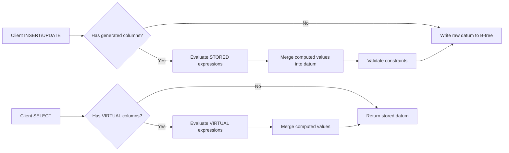

# Generated/Virtual Columns — RethinkDB v3.0

**Status:** Phase 3 axiom-level implementation specification  
**Scope:** Computed column expressions evaluated at write/read time.  
**Repository:** `/home/kara/rethinkdb`  
**Status of this document:** Design only; it specifies no implementation patch.

## 1. Overview

Generated columns are table columns whose values are computed from a ReQL expression
over other columns rather than being supplied by the client. They come in two
varieties:

| Variant | Persisted | Evaluated | Use case |
|---------|-----------|-----------|----------|
| `STORED` | Yes — stored in B-tree leaf value | At INSERT/UPDATE time | Indexable computed fields, derived keys |
| `VIRTUAL` | No — computed on read | At SELECT time | Formatting, denormalization, computed filters |



Generated columns may NOT reference other generated columns that form a dependency
cycle. The dependency graph MUST be a DAG evaluated in topological order. STORED
columns may be indexed via secondary indexes; VIRTUAL columns may not.

### 1.1 Non-goals

Phase 3 does NOT add: generated columns referencing other tables (no subqueries),
incrementally maintained materialized views, partial indexes on generated columns
(filtered indexes), or generated columns with side effects (calling JS/WASM UDFs).
Generated columns may use only deterministic ReQL built-in functions (r.add, r.mul,
r.concat, r.branch, r.coerceTo, r.now with transaction timestamp, etc.).

## 2. API Design / ReQL surface

### 2.1 Table creation

The existing `TABLE_CREATE = 60` term gains a `generated_columns` optarg:

```javascript
r.tableCreate("users", {
  primary_key: "id",
  generated_columns: [
    {name: "full_name", expr: r.row("first_name").add(" ").add(r.row("last_name")), type: "stored"},
    {name: "age", expr: r.now().year().sub(r.row("birth_year")), type: "virtual"},
    {name: "initials", expr: r.row("first_name").slice(0,1).add(r.row("last_name").slice(0,1)), type: "stored"}
  ]
})
```

The `type` field accepts `"stored"` or `"virtual"`. Default is `"stored"`.

### 2.2 Table inspection

```javascript
r.table("users").info()("generated_columns")
// → [{name: "full_name", expr: "r.row('first_name').add(' ').add(r.row('last_name'))", type: "stored"}, ...]

r.table("users").config()  // includes generated_columns in table_config_t
```

### 2.3 Error ReQL surface

All generated-column errors surface through the standard `ReqlRuntimeError` path
with specific messages:
- `"Generated column 'X' expression references unknown column 'Y'."`
- `"Generated column cycle detected: X → Y → X."`
- `"Generated column 'X' expression must be deterministic."`
- `"Cannot create secondary index on virtual column 'X'."`

## 3. Data structures

### 3.1 Column definition

```cpp
// src/rdb_protocol/generated_columns.hpp

enum class generated_column_type_t { STORED, VIRTUAL };

ARCHIVE_PRIM_MAKE_RANGED_SERIALIZABLE(
    generated_column_type_t, int8_t,
    generated_column_type_t::STORED, generated_column_type_t::VIRTUAL);

class generated_column_def_t {
public:
    name_string_t name;
    ql::protob_t<const Term> expression;  // serialized ReQL term tree
    generated_column_type_t type;

    RDB_DECLARE_ME_SERIALIZABLE(generated_column_def_t);
};

class generated_column_config_t {
public:
    std::vector<generated_column_def_t> columns;
    bool enabled = false;

    RDB_DECLARE_ME_SERIALIZABLE(generated_column_config_t);

    // Returns columns in topological dependency order
    std::vector<generated_column_def_t> topological_order() const;

    // Returns cycle description if one exists, empty string otherwise
    std::string detect_cycle() const;
};
```

### 3.2 Table config integration

`table_config_t` gains an optional field:

```cpp
// In src/rdb_protocol/table_config.hpp or equivalent config struct
class table_config_t {
    // ... existing fields ...
    std::optional<generated_column_config_t> generated_columns;

    RDB_DECLARE_ME_SERIALIZABLE(table_config_t);
};
```

### 3.3 Superblock metadata

The `reql_specific_t` superblock stores generated column expressions:

```cpp
// src/btree/reql_specific.hpp
class reql_specific_t {
    // ... existing fields ...
    std::optional<generated_column_config_t> stored_column_config;

    RDB_DECLARE_ME_SERIALIZABLE(reql_specific_t);
};
```

## 4. Query planner changes

### 4.1 Write-time evaluation (STORED)

INSERT and UPDATE terms evaluate STORED expressions after client-supplied values
but before constraint validation:

```
1. Client sends datum D
2. For each STORED column C in topological order:
   a. Bind datum D as implicit row
   b. Evaluate C.expression → value V
   c. If D already has key C.name and value differs from V → error (cannot override)
   d. If D has key C.name and value == V → skip (idempotent)
   e. Otherwise: D[C.name] = V
3. Validate constraints (primary key, schema if present)
4. Write D to B-tree
```

The expression evaluator uses the same `ql::val_t` / `datum_t` machinery as
`r.row()` in ReQL. No new evaluation path is needed.

### 4.2 Read-time evaluation (VIRTUAL)

SELECT/GET operations evaluate VIRTUAL expressions after reading from B-tree
but before returning to client:

```
1. Read datum D from B-tree
2. For each VIRTUAL column C in topological order:
   a. Bind D as row
   b. Evaluate C.expression → value V
   c. D[C.name] = V
3. Apply WHERE/HAS_FIELDS/PLUCK filtering (operates on enriched datum)
4. Return D to client
```

### 4.3 Filter pushdown considerations

WHERE clauses referencing VIRTUAL columns CANNOT be pushed into the storage layer
(the value doesn't exist in the B-tree). However, WHERE clauses referencing STORED
columns CAN be pushed (the value exists on disk). The query planner must
distinguish:

```cpp
bool can_push_predicate(const ql::term_t& predicate,
                        const generated_column_config_t& config) {
    // True if all referenced fields are either:
    // - Regular columns
    // - STORED generated columns
    // False if any referenced field is a VIRTUAL generated column
}
```

## 5. Storage layout

### 5.1 B-tree leaf values

STORED columns are appended to the B-tree leaf value datum alongside regular
columns. No separate storage — they live in the same datum. This means:

- Indexes on STORED columns work like indexes on regular columns
- Backward-compatible: tables without generated columns have no overhead
- Migrations that add/remove STORED columns require rewriting leaf pages

VIRTUAL columns consume NO storage — they exist only in the schema metadata.

### 5.2 Schema versioning

The `reql_specific_t` superblock stores a `generated_column_schema_version`:

```cpp
uint64_t generated_column_schema_version = 0;
// Incremented on every ALTER TABLE that changes generated columns
```

This version is used to detect schema drift during cluster membership changes:
a joining server must have the same generated column schema as the Raft leader.

### 5.3 Migration: adding STORED columns to existing tables

Adding a STORED column to an existing table with data requires backfilling.
This is a multi-phase operation:

```
Phase 1: Add column definition with state = BACKFILLING
Phase 2: Background job iterates B-tree, evaluates expression for each row
Phase 3: When all rows backfilled, atomically promote state = ACTIVE
Phase 4: Writes during backfilling: evaluate expression for both old and new schema
```

## 6. Integration points

### 6.1 Write path (`src/rdb_protocol/terms/writes.cc`)

- `insert_term_t`, `update_term_t`, `replace_term_t` need a pre-write hook
- Hook: `evaluate_generated_columns(datum, config, /*stored_only=*/true)`
- Called before constraint checks, before B-tree insertion

### 6.2 Read path (`src/rdb_protocol/terms/reads.cc` or equivalent)

- `table_read_t` / `get_all_term_t` need a post-read hook
- Hook: `evaluate_generated_columns(datum, config, /*stored_only=*/false)`
- Called after B-tree read, before filter evaluation

### 6.3 Secondary indexes

- STORED columns: fully indexable (value stored in B-tree)
- VIRTUAL columns: NOT indexable (value not persisted)
- `r.indexCreate("idx", r.row("full_name"))` succeeds only if `full_name` is STORED
- Attempting to index a VIRTUAL column returns `ReqlRuntimeError`

### 6.4 Changefeeds

Changefeeds emit the datum AS READ, which includes VIRTUAL columns. This is
consistent with the client's view: if a SELECT returns `full_name`, a changefeed
should too. The changefeed pipeline calls the same post-read hook.

### 6.5 Durability

STORED columns participate in durability guarantees identically to regular
columns — they are written to the B-tree and replicated via Raft. VIRTUAL
columns are never persisted and have no durability requirements.

## 7. Error paths

| Error | Trigger | Response |
|-------|---------|----------|
| `GENERATED_COLUMN_CYCLE` | Dependency cycle in column definitions | Rejected at table create time |
| `GENERATED_COLUMN_UNDEFINED_REF` | Expression references undefined column | Rejected at table create time |
| `GENERATED_COLUMN_OVERRIDE` | Client supplies value for generated column | Rejected at write time |
| `GENERATED_COLUMN_EVAL_FAILED` | Expression runtime error (e.g., type mismatch) | Write fails, error returned to client |
| `GENERATED_COLUMN_NOT_DETERMINISTIC` | Expression uses JS UDF or other non-deterministic term | Rejected at table create time |
| `GENERATED_COLUMN_VIRTUAL_INDEX` | Index creation on VIRTUAL column | Rejected at index create time |
| `GENERATED_COLUMN_BACKFILL_FAILED` | Backfill job encounters permanent error | Column stays BACKFILLING, error logged |
| `GENERATED_COLUMN_SCHEMA_MISMATCH` | Joining server has different generated column version | Raft membership rejected |
| `GENERATED_COLUMN_TYPE_MISMATCH` | Expression returns incompatible type for indexed column | Rejected at table create time (if indexed) |

## 8. Testing requirements

### 8.1 Unit tests

- **Serialization**: Round-trip `generated_column_config_t` through serialize/deserialize
- **Dependency ordering**: Verify topological sort with linear, diamond, and DAG patterns
- **Cycle detection**: Verify cycles of length 1 (self-reference), 2, and 3 are caught
- **Expression evaluation**: Test each supported deterministic ReQL term in generated context
- **Type coercion**: Test type promotion rules match ReQL semantics

### 8.2 Integration tests

- **STORED column round-trip**: INSERT → SELECT verifies computed value persisted
- **VIRTUAL column round-trip**: INSERT → SELECT verifies computed value returned
- **Mixed STORED+VIRTUAL**: INSERT with both types, verify both computed
- **Index on STORED column**: Create index, verify getAll/between work
- **Reject index on VIRTUAL**: Verify error
- **Changefeed correctness**: Verify VIRTUAL columns appear in changefeed output

### 8.3 Migration tests

- **Add STORED column to empty table**: Instant, no backfill
- **Add STORED column to populated table**: Backfill completes, all rows have value
- **Concurrent writes during backfill**: Writes see both old and new schema correctly
- **Server restart during backfill**: Backfill resumes from checkpoint

### 8.4 Failure injection

- Kill server during backfill → restart → backfill resumes
- Network partition during schema version check → rejected with correct error
- Expression OOM → write fails with clear error, no partial writes

## 9. Security considerations

### 9.1 Expression injection

Generated column expressions are defined at table creation time by an admin user,
not supplied by querying clients. The expression is serialized as a protobuf Term
tree — it is NOT a string that could be subject to injection.

### 9.2 Resource limits

Expression evaluation for generated columns must respect existing resource limits:
- Per-query timeout applies to expression evaluation
- Memory allocation for expression intermediates counts against query budget
- Backfill job runs with reduced priority to avoid affecting live queries

### 9.3 Privilege model

Only users with `table_create` permission may define generated columns. Only users
with `table_reconfigure` permission may alter them. Reading generated columns
requires standard `read` permission on the table — no special privilege needed.

## 10. Performance model

### 10.1 Write amplification (STORED)

Each STORED column adds expression evaluation time per INSERT/UPDATE. Expected
overhead: 1-10μs per simple expression (arithmetic, string concat), 10-100μs
for complex expressions (r.branch with multiple conditions). Worst case: N STORED
columns = N × expression_cost per write.

### 10.2 Read overhead (VIRTUAL)

VIRTUAL columns add per-row evaluation cost on every SELECT. For bulk reads
(getAll, between), this is O(rows × virtual_column_count × expression_cost).
Queries that filter on VIRTUAL columns cannot leverage indexes and must scan
the full result set.

### 10.3 Storage overhead

STORED columns add sizeof(datum_t) per row. For a `full_name` column averaging 30
bytes, on a 1B-row table: ~30GB additional storage. VIRTUAL columns: 0 bytes.

### 10.4 Backfill cost

Backfilling a STORED column on an existing table requires a full B-tree scan +
expression evaluation per row. On a 100M-row table with 50B/row expression:
~5GB of expression intermediates, ~30 minutes at 10M rows/sec.

---

Implementation is ordered: (1) data structures and serialization; (2) table creation
with cycle/dependency validation; (3) STORED expression evaluation in write path;
(4) VIRTUAL expression evaluation in read path; (5) index integration and
restrictions; (6) backfill for existing tables; (7) changefeed and cluster
integration; (8) testing and chaos hardening. The feature is complete only when
generated column expressions are deterministic, the dependency DAG is preserved,
and all stated error paths produce correct, descriptive ReQL runtime errors.
