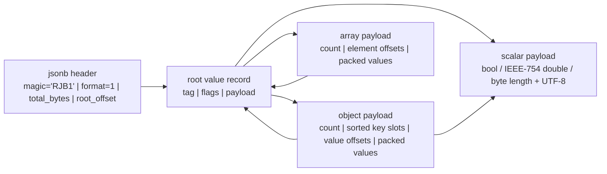
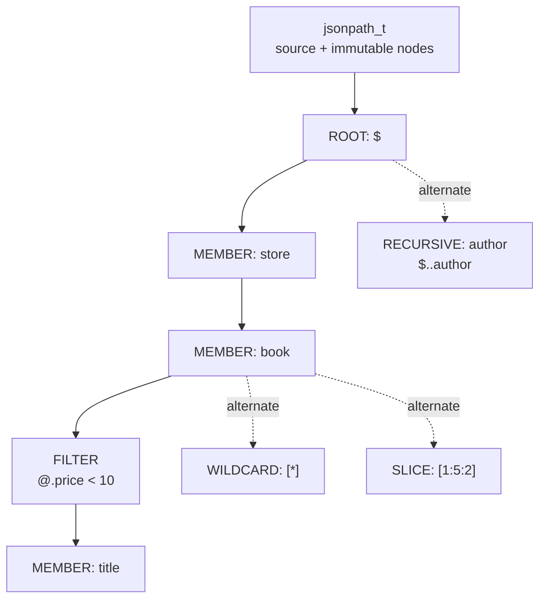
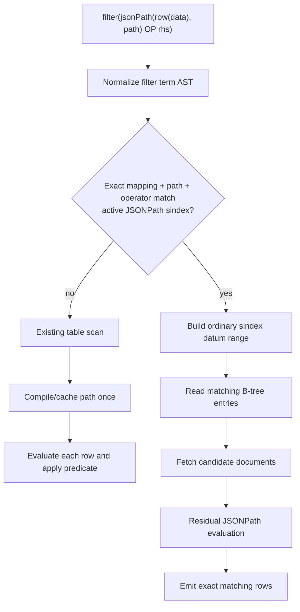
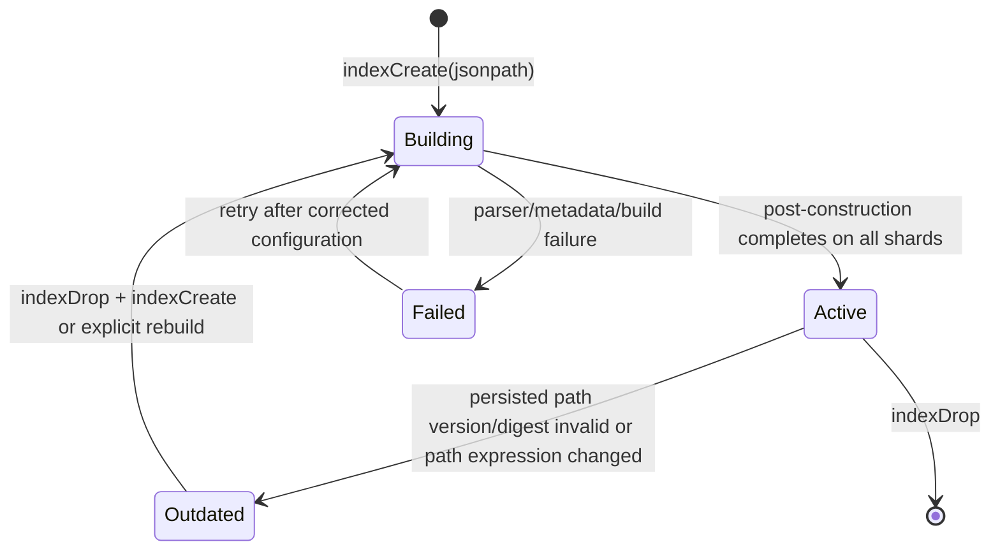

# Phase 3 / v3.0 — JSONB and JSONPath Improvements

Status: implementation specification

Scope: add an opt-in binary JSONB datum representation, a bounded PostgreSQL-style
JSONPath subset, JSONB containment/existence operators, and JSONPath-backed secondary
indexes to RethinkDB. This document is deliberately implementation-level: a change is
not complete until each contract below is implemented and tested.

Repository facts used by this design:

- `ql::datum_t` already stores JSON-like values and can be backed by serialized buffers
  (`src/rdb_protocol/datum.hpp`, `src/rdb_protocol/serialize_datum.*`). Existing
  buffered arrays already have an offset table; this design reuses that discipline.
- Existing sindex metadata is `sindex_config_t` in `context.hpp` and
  `sindex_disk_info_t` in `btree.hpp`; it is serialized through `context.cc` and
  `btree.cc`.
- Existing terms are compiled in `term.cc` and declared in `terms/terms.hpp`.
- Existing protocol term IDs `200` and `201` are already `VECTOR` and `VECTOR_NEAR`.
  They are deployed in this tree and MUST NOT be reassigned.

Non-goals for v3.0:

1. PostgreSQL SQL syntax, PostgreSQL `jsonpath` variables, datetime methods, regular
   expression predicates, arithmetic expressions, mutation expressions, and lax/strict
   path modes beyond the `missing` behavior specified here.
2. Automatic conversion of every existing document to JSONB.
3. Arbitrary JSONPath predicates being indexable. Index planning is deliberately limited
   to exact, safe predicate shapes listed in section 4.
4. A separate GIN implementation. JSONPath indexes use the existing secondary-index
   B-tree and multi-key mechanism.

## 1. Overview

### 1.1 User-visible capability

RethinkDB currently stores JSON documents as `datum_t` values and provides direct field
access such as `r.row("field")`. v3.0 adds:

- `r.jsonb(value)`: converts a JSON-compatible datum into immutable binary JSONB;
- `r.jsonPath(value, path)`: evaluates a compiled JSONPath expression;
- PostgreSQL-inspired JSONB predicates: contains (`@>`), contained-by (`<@`), exists
  (`?`), exists-any (`?|`), and exists-all (`?&`);
- `{jsonpath: "..."}` indexes which extract one B-tree key per matching JSONPath value;
- planner recognition for equality and range predicates over a matching JSONPath index.

Canonical examples:

```javascript
r.jsonPath(doc, "$.store.book[0].title")
r.jsonPath(doc, "$.store.book[*].author")
r.jsonPath(doc, "$.store.book[?(@.price < 10)].title")
r.jsonPath(doc, "$..author")

r.jsonb({store: {book: [{title: "Moby-Dick", price: 8.99}]}})
r.jsonbContains(r.row("data"), {status: "active"})
r.jsonbExists(r.row("data"), "events")
r.jsonbExistsAny(r.row("data"), ["events", "audit"])
r.jsonbExistsAll(r.row("data"), ["events", "audit"])

r.table("orders").indexCreate(
  "event_type",
  r.row("data"),
  {jsonpath: "$.events[*].type"}
)
```

Driver aliases are required for all official drivers:

| ReQL protocol term | JavaScript | Python | Ruby |
|---|---|---|---|
| `JSONPATH` | `r.jsonPath` | `r.json_path` | `r.json_path` |
| `JSONB` | `r.jsonb` | `r.jsonb` | `r.jsonb` |
| `JSONB_CONTAINS` | `r.jsonbContains` | `r.jsonb_contains` | `r.jsonb_contains` |
| `JSONB_CONTAINED_BY` | `r.jsonbContainedBy` | `r.jsonb_contained_by` | `r.jsonb_contained_by` |
| `JSONB_EXISTS` | `r.jsonbExists` | `r.jsonb_exists` | `r.jsonb_exists` |
| `JSONB_EXISTS_ANY` | `r.jsonbExistsAny` | `r.jsonb_exists_any` | `r.jsonb_exists_any` |
| `JSONB_EXISTS_ALL` | `r.jsonbExistsAll` | `r.jsonb_exists_all` | `r.jsonb_exists_all` |

The textual PostgreSQL operator spellings are not added to ReQL, which has no infix
operator grammar. The named functions are the ReQL-compatible surface and have the
same operand semantics as their PostgreSQL counterparts.

### 1.2 Compatibility and type model

JSONB is opt-in. A normal object, array, string, number, bool, or null remains an
ordinary `datum_t` value and serializes exactly as it does now. `r.jsonb(x)` returns a
new `datum_t::R_JSONB` value whose logical JSON value equals `x`. All JSONB consumers
also accept an ordinary JSON datum and convert it transiently for that operation; this
makes mixed existing/new documents usable without a migration.

A JSONB value is immutable. Any ReQL expression which would construct or modify data
(`merge`, `append`, `setInsert`, update replacement functions, and so on) returns an
ordinary JSON datum unless it is explicitly wrapped again by `r.jsonb`.

`typeOf(r.jsonb({a: 1}))` returns `"JSONB"`. For clients which do not opt into binary
results, a JSONB value is converted to its logical JSON value before response encoding;
thus old drivers can read a v3.0 server result but cannot preserve JSONB identity across
a read/modify/write cycle without calling `r.jsonb` again.

### 1.3 Complexity correction

The requested “O(1) field access” must be stated precisely. An offset table gives O(1)
decode after a field's value offset is known. Object key lookup is O(log N), using
binary search over lexicographically sorted UTF-8 keys. This is the required behavior;
claiming O(1) lookup while also requiring sorted keys would be incorrect. Array element
lookup is O(1). Raw object lookup may require linear traversal/decode of up to N pairs;
JSONB avoids that traversal.

### 1.4 High-level binary layout



The format is specified exactly in section 5. It is an internal storage encoding, not a
promise that clients can deserialize bytes without using a supported driver.

## 2. Dependencies

### 2.1 Existing source integration points

| Area | Existing source | Required v3.0 change |
|---|---|---|
| Logical datum | `src/rdb_protocol/datum.hpp/.cc` | Add `R_JSONB`, JSONB accessors, JSONB-to-datum conversion, comparison/equality delegation. |
| Datum wire/disk serialization | `src/rdb_protocol/serialize_datum.hpp/.cc` | Add a stable `R_JSONB` serialized type tag and checked JSONB validation on deserialize. Do not change prior datum encodings. |
| Query protocol | `src/rdb_protocol/ql2.proto` | Add new term IDs and `Datum::R_JSONB`; preserve IDs 200/201 for vectors. |
| Query compilation | `src/rdb_protocol/term.cc`, `src/rdb_protocol/terms/terms.hpp` | Dispatch and declare JSONB/JSONPath term factories. |
| Query implementation | new `src/rdb_protocol/jsonb.hpp/.cc`, `jsonpath.hpp/.cc`, `terms/jsonb.cc` | Binary encoding, parser, AST, cache, evaluator, and ReQL term classes. |
| Index creation/status | `src/rdb_protocol/terms/sindex.cc` | Add and validate the `jsonpath` optarg, expose JSONPath metadata in `indexStatus`. |
| Sindex metadata | `src/rdb_protocol/context.hpp/.cc`, `src/rdb_protocol/btree.hpp/.cc` | Add `sindex_jsonpath_bool_t`, persisted source path and format/AST compatibility fields. |
| Sindex write construction | `src/rdb_protocol/btree.cc`, `btree_store.cc`, secondary-index update path | Extract path results and emit one B-tree entry per scalar match. |
| Table/filter planning | `src/rdb_protocol/terms/seq.cc`, `datum_stream.cc`, `val.*`, `real_table.*` | Recognize the limited indexable JSONPath predicate forms and issue a normal sindex read. |
| Build | the source-list fragment which currently includes `terms/fts.cc` and `terms/vector_near.cc` | Include the three new compilation units. |
| Tests | `src/unittest/`, `test/rql_test/src/` | Add unit, integration, and benchmark scenarios from section 8. |

### 2.2 Serialization rules

`datum_serialize` and `datum_deserialize` are explicitly stable encodings. The
implementation MUST NOT change the encoding of existing `R_OBJECT`, `R_ARRAY`, or
buffered datum types. JSONB receives a new independent serialized type tag and carries
its own format version in its payload. This follows the warning in
`serialize_datum.hpp`: datum formats must not silently change under stored rows.

Metadata fields follow existing `RDB_DECLARE_SERIALIZABLE` and
`ARCHIVE_PRIM_MAKE_RANGED_SERIALIZABLE` patterns. Appending JSONPath metadata is only
allowed in a new cluster serialization version with an explicit old-version branch that
initializes all JSONPath fields to regular/empty values.

### 2.3 Index infrastructure constraints

A JSONPath index is a new sindex kind, not an arbitrary expression cache:

- It uses the existing ordinary secondary B-tree for keys and primary-key references.
- Each path match emits a separate entry; it therefore has multi-index semantics even
  though user configuration MUST NOT also set `{multi: true}`.
- It does not use BRIN summaries, FTS tokens, geo cells, or vector graphs.
- It supports scalar ReQL indexable values only: `R_NULL`, `R_BOOL`, `R_NUM`,
  `R_STR`, `R_BINARY`, and permitted pseudo-types that existing regular sindexes accept.
  Matched arrays, objects, and JSONB containers are rejected at index-build/write time
  using the existing function-error omission policy and increment the ordinary sindex
  error count; they never receive an arbitrary stringification.

### 2.4 Dependency ordering

Implementation order is fixed to avoid a misleading partial feature:

1. JSONB binary codec and validation, with unit tests.
2. `datum_t` / datum serialization / protocol datum support.
3. JSONPath lexer, parser, AST, evaluator, and cache.
4. ReQL term dispatch and JSONB/JSONPath operator terms.
5. JSONPath sindex metadata, construction, maintenance, and status.
6. Planner rewrite and observability.
7. Driver generation and integration/benchmark tests.

No JSONPath index implementation may land before the parser and evaluator have exact
shared semantics. The index builder calls the same `jsonpath_t::evaluate` implementation
as `r.jsonPath`; it may not implement a second path parser.

## 3. Interface (ReQL and C++ API)

### 3.1 ReQL term contracts

#### `r.jsonPath(value, path, {missing, maxResults})`

Signature:

```text
JSONPATH(value: DATUM, path: STRING,
         {missing: "null" | "error", maxResults: NUMBER}) -> DATUM
```

- `path` must be a string beginning with `$`.
- `missing` defaults to `"null"`.
- `maxResults` defaults to `1024`, must be an integer in `[1, 65536]`, and limits the
  number of selected nodes before materialization.
- A statically singular path consisting only of root/member/index nodes returns its one
  selected logical datum. If it selects nothing, it returns `null` with `missing:"null"`
  or raises `JSONPATH_E005` with `missing:"error"`.
- A path containing wildcard, recursive descent, filter, or slice is multi-valued and
  always returns an array, including `[]` for no matches. `missing` does not turn an
  empty multi-result into an error.
- Returned JSONB child nodes are decoded to ordinary logical datums; result JSONB
  identity is not propagated through a path selection.

#### `r.jsonb(value)`

```text
JSONB(value: DATUM) -> JSONB
```

Accepted values are null, bool, finite numbers, UTF-8 strings, arrays, objects, and
existing JSONB. `R_BINARY`, `R_VECTOR`, `MINVAL`, `MAXVAL`, and ReQL pseudo-types are
rejected recursively. An existing valid JSONB returns itself without copying.

A document is limited by both ordinary configured datum limits and
`jsonb_limits_t::max_document_bytes`; errors are `JSONB_E001`, `JSONB_E002`, or
`JSONB_E003` as appropriate.

#### JSONB predicates

```text
JSONB_CONTAINS(left: DATUM, right: DATUM) -> BOOL
JSONB_CONTAINED_BY(left: DATUM, right: DATUM) -> BOOL
JSONB_EXISTS(value: DATUM, key: STRING) -> BOOL
JSONB_EXISTS_ANY(value: DATUM, keys: ARRAY<STRING>) -> BOOL
JSONB_EXISTS_ALL(value: DATUM, keys: ARRAY<STRING>) -> BOOL
```

Both containment operands are normalized through `jsonb_t::from_datum`. `EXISTS*`
requires an object or array on the left: for an object, keys are field names; for an
array, keys are exact string elements. Scalars return `false`, matching PostgreSQL's
non-container behavior. A non-string key or a non-array/non-string key collection is a
logic error, never coercion.

Containment semantics are exact:

- Scalar contains scalar iff their JSON types and values are equal. Numbers compare by
  the existing ReQL `datum_t::cmp`, so `1` and `1.0` are equal as they already are in
  ReQL.
- Object `L @> R` iff every key in R exists in L and `L[key] @> R[key]`.
- Array `L @> R` iff every distinct logical element required by R is contained in L.
  Duplicates in R do not impose multiplicity; this matches PostgreSQL JSONB containment.
- `L <@ R` is exactly `R @> L`.

#### JSONPath index creation

```text
INDEX_CREATE(table, name, mapping,
             {jsonpath: STRING}) -> {created: 1}
```

Canonical API:

```javascript
r.table("orders").indexCreate(
  "event_type",
  r.row("data"),
  {jsonpath: "$.events[*].type"}
)
```

The mapping expression is evaluated once per row to identify the JSON/JSONB root. The
JSONPath is parsed and validated during `indexCreate`, then stored as canonical source
text and a deterministic digest. It may contain root, member, bracket-member, array
index, wildcard, recursive descent, and filters from the supported grammar. An index
path must produce only scalar values for every indexable row; container matches are
omitted and reported through normal sindex function-error accounting.

`jsonpath` is mutually exclusive with `multi`, `geo`, `fts`, `vector`, and `brin`.
JSONPath index extraction is inherently multi-entry. A caller cannot request two
independent expansion policies.

The creation response remains `{created: 1}`. `indexWait` remains the readiness gate.
`indexStatus` adds, for a JSONPath index:

```javascript
{
  index: "event_type",
  ready: true,
  outdated: false,
  jsonpath: "$.events[*].type",
  jsonpath_digest: "sha256:...",
  jsonpath_format_version: 1,
  multi: true,
  function: <binary>,
  query: "indexCreate('event_type', ... {jsonpath: '$.events[*].type'})"
}
```

### 3.2 Protocol numbers and compatibility decision

The requested preliminary assignment `JSONPATH (200), JSONB (201)` cannot be used:
`ql2.proto` currently assigns `VECTOR = 200` and `VECTOR_NEAR = 201`. Reusing either
would cause a v3.0 client/server pair to interpret a vector query as a JSON query or
vice versa. That is an irreversible protocol compatibility bug.

The required, conflict-free assignments are:

```proto
// ql2.proto / Term.TermType
JSONPATH           = 202; // DATUM, STRING {missing: STRING, max_results: NUMBER} -> DATUM
JSONB               = 203; // DATUM -> JSONB
JSONB_CONTAINS      = 204; // DATUM, DATUM -> BOOL
JSONB_CONTAINED_BY  = 205; // DATUM, DATUM -> BOOL
JSONB_EXISTS        = 206; // DATUM, STRING -> BOOL
JSONB_EXISTS_ANY    = 207; // DATUM, ARRAY -> BOOL
JSONB_EXISTS_ALL    = 208; // DATUM, ARRAY -> BOOL
```

`Datum.DatumType` adds `R_JSONB = 9`. A new global query optarg
`accepts_r_jsonb` defaults to false. When false, JSONB results are materialized as
ordinary JSON in the response. When true, `R_JSONB` uses `r_str` as raw JSONB v1 bytes.
A driver MUST validate/decode those bytes before exposing them. This avoids breaking
pre-v3.0 drivers which do not recognize datum type 9.

Every official driver must regenerate its protocol constants from this source. No driver
may hard-code 200–208 independently.

### 3.3 Exact C++ public interfaces

New file `src/rdb_protocol/jsonb.hpp`:

```cpp
#ifndef RDB_PROTOCOL_JSONB_HPP_
#define RDB_PROTOCOL_JSONB_HPP_

#include <cstdint>
#include <string>
#include <vector>

#include <boost/variant.hpp>

#include "containers/archive/archive.hpp"
#include "containers/counted.hpp"
#include "containers/optional.hpp"
#include "containers/shared_buffer.hpp"
#include "rdb_protocol/datum_string.hpp"

namespace ql {

class datum_t;

struct jsonb_null_t { };
class jsonb_array_t;
class jsonb_object_t;

class jsonb_value_t {
public:
    typedef boost::variant<jsonb_null_t, bool, double, datum_string_t,
                           counted_t<const jsonb_array_t>,
                           counted_t<const jsonb_object_t> > variant_t;

    explicit jsonb_value_t(variant_t value);
    const variant_t &variant() const;
private:
    variant_t value_;
};

struct jsonb_array_t {
    std::vector<jsonb_value_t> values;
};

struct jsonb_object_field_t {
    datum_string_t key;
    jsonb_value_t value;
};

struct jsonb_object_t {
    // Strictly increasing bytewise UTF-8 key order; duplicate keys are impossible.
    std::vector<jsonb_object_field_t> fields;
};

struct jsonb_limits_t {
    static const uint32_t format_version = 1;
    static const uint32_t max_document_bytes = 64U * 1024U * 1024U;
    static const uint32_t max_nesting_depth = 128;
    static const uint32_t max_container_entries = 1000000;
};

class jsonb_t {
public:
    static jsonb_t from_datum(const datum_t &datum);
    static jsonb_t from_serialized(shared_buf_ref_t<char> bytes);

    datum_t to_datum() const;
    bool contains(const jsonb_t &rhs) const;
    bool exists(const datum_string_t &key) const;
    bool exists_any(const std::vector<datum_string_t> &keys) const;
    bool exists_all(const std::vector<datum_string_t> &keys) const;
    optional<jsonb_t> get_object_field(const datum_string_t &key) const;
    optional<jsonb_t> get_array_element(uint32_t index) const;
    uint32_t array_size() const;
    uint32_t object_size() const;
    const shared_buf_ref_t<char> &serialized() const;

private:
    explicit jsonb_t(shared_buf_ref_t<char> bytes);
    shared_buf_ref_t<char> bytes_;
};

void serialize_jsonb(write_message_t *wm, const jsonb_t &value);
MUST_USE archive_result_t deserialize_jsonb(read_stream_t *s, jsonb_t *out);

}  // namespace ql
#endif  // RDB_PROTOCOL_JSONB_HPP_
```

`jsonb_value_t`, `jsonb_array_t`, and `jsonb_object_t` are the exact conversion-tree
representation. They are used only while converting ordinary JSON to compact bytes and
in unit tests. Persisted JSONB values are `jsonb_t` views over immutable bytes. This
prevents a full tree allocation for a field lookup.

`datum_t` changes are fixed:

```cpp
// datum_t::type_t: insert before MAXVAL and update the sort-order table.
R_JSONB = 10,
MAXVAL = 11

static datum_t jsonb(jsonb_t &&value);
const jsonb_t &as_jsonb() const;
```

`datum_t::data_wrapper_t` gains `counted_t<const jsonb_t> r_jsonb`; its internal type
enum gains `R_JSONB`. Every exhaustive switch over datum types (`get_type`, type name,
print, equality, comparison, `write_json`, datum serialization, and cleanup) MUST add
this case. `write_json` serializes the logical tree, not a base64 payload.

New file `src/rdb_protocol/jsonpath.hpp`:

```cpp
#ifndef RDB_PROTOCOL_JSONPATH_HPP_
#define RDB_PROTOCOL_JSONPATH_HPP_

#include <cstdint>
#include <list>
#include <string>
#include <vector>

#include "containers/counted.hpp"
#include "containers/optional.hpp"
#include "rdb_protocol/datum.hpp"

namespace ql {

enum class jsonpath_node_type_t {
    ROOT, MEMBER, ARRAY_INDEX, WILDCARD, RECURSIVE, FILTER, SLICE
};

enum class jsonpath_compare_t { EQ, NE, LT, LE, GT, GE };

enum class jsonpath_filter_rhs_t { STRING, NUMBER, BOOL, NULL_VALUE };

struct jsonpath_filter_t {
    std::vector<std::string> relative_members;
    jsonpath_compare_t op;
    jsonpath_filter_rhs_t rhs_type;
    datum_t rhs;
};

struct jsonpath_slice_t {
    optional<int64_t> start;
    optional<int64_t> end;
    int64_t step;
};

struct jsonpath_node_t {
    jsonpath_node_type_t type;
    std::string member;
    int64_t array_index;
    jsonpath_filter_t filter;
    jsonpath_slice_t slice;
};

class jsonpath_t {
public:
    static jsonpath_t parse(const std::string &source);
    const std::string &source() const;
    const std::vector<jsonpath_node_t> &nodes() const;
    bool is_multi_valued() const;
    std::vector<datum_t> evaluate(const datum_t &root,
                                  uint32_t max_results) const;
private:
    jsonpath_t(std::string source, std::vector<jsonpath_node_t> nodes);
    std::string source_;
    std::vector<jsonpath_node_t> nodes_;
};

class jsonpath_cache_t {
public:
    static jsonpath_cache_t *instance();
    counted_t<const jsonpath_t> get_or_parse(const std::string &source);
    void clear_for_testing();
private:
    jsonpath_cache_t();
    static const size_t max_entries = 1024;
    // mutex-protected map plus LRU list; entries are immutable after construction.
};

}  // namespace ql
#endif  // RDB_PROTOCOL_JSONPATH_HPP_
```

New file `src/rdb_protocol/terms/jsonb.cc` exports exactly:

```cpp
counted_t<term_t> make_jsonpath_term(compile_env_t *, const raw_term_t &);
counted_t<term_t> make_jsonb_term(compile_env_t *, const raw_term_t &);
counted_t<term_t> make_jsonb_contains_term(compile_env_t *, const raw_term_t &);
counted_t<term_t> make_jsonb_contained_by_term(compile_env_t *, const raw_term_t &);
counted_t<term_t> make_jsonb_exists_term(compile_env_t *, const raw_term_t &);
counted_t<term_t> make_jsonb_exists_any_term(compile_env_t *, const raw_term_t &);
counted_t<term_t> make_jsonb_exists_all_term(compile_env_t *, const raw_term_t &);
```

They are declared in `terms/terms.hpp` and dispatched in `term.cc`. Constructors use
`op_term_t` with these exact arities:

```cpp
jsonpath_term_t:            argspec_t(2), optargspec_t({"missing", "maxResults"})
jsonb_term_t:               argspec_t(1)
jsonb_contains_term_t:      argspec_t(2)
jsonb_contained_by_term_t:  argspec_t(2)
jsonb_exists_term_t:        argspec_t(2)
jsonb_exists_any_term_t:    argspec_t(2)
jsonb_exists_all_term_t:    argspec_t(2)
```

### 3.4 JSONPath grammar

The parser is a hand-written single-pass lexer/parser; do not use a regex-only parser.
It consumes UTF-8 bytes, validates string escapes, reports a byte offset, and creates
the AST types above. The accepted grammar is:

```ebnf
path            = root , { step } ;
root            = "$" ;
step            = member | bracket-member | array-index | wildcard
                | recursive | filter | slice ;
member          = "." , identifier ;
bracket-member  = "[" , quoted-string , "]" ;
array-index     = "[" , [ "-" ] , digits , "]" ;
wildcard        = ".*" | "[*]" ;
recursive       = ".." , ( identifier | "*" ) ;
filter          = "[?" , "(" , filter-left , ws , compare , ws , literal , ")" , "]" ;
filter-left     = "@" , { "." , identifier } ;
slice           = "[" , [ signed-int ] , ":" , [ signed-int ]
                  , [ ":" , signed-int ] , "]" ;
compare         = "==" | "!=" | "<" | "<=" | ">" | ">=" ;
literal         = quoted-string | number | "true" | "false" | "null" ;
identifier      = identifier-start , { identifier-continue } ;
```

`identifier-start` is ASCII letter, `_`, or `$`; `identifier-continue` additionally
permits ASCII digits. Keys with arbitrary UTF-8, punctuation, whitespace, or leading
digits require bracket-member syntax, for example `$['shipping address']`.

Unsupported syntax is rejected, not ignored: unions (`[0,1]`), scripts, functions,
`@` as a result selector, `&&`, `||`, `!`, regex predicates, variables, and quoted
recursive selectors. Negative array indexes are supported and count from the end.
Slice uses Python semantics: omitted start/end default according to the sign of step;
step may not be zero.

### 3.5 JSONPath AST diagram



## 4. Behavior

### 4.1 JSONB conversion

`jsonb_t::from_datum` recursively validates and converts a logical datum to the
conversion tree, then emits one compact immutable buffer. Conversion has these ordered
rules:

1. Check nesting depth before descending. Depth starts at one for the root.
2. Reject uninitialized data, extrema, binary, vector, and pseudo-types with
   `JSONB_E001`.
3. Reject NaN, positive infinity, and negative infinity with `JSONB_E001`; JSONB numbers
   are finite IEEE-754 doubles.
4. For an object, take `datum_t`'s existing canonical sorted key order, verify each key
   is valid UTF-8, and emit no duplicate key. Ordinary `datum_t` objects already provide
   unique sorted fields, but the invariant is checked at the JSONB boundary.
5. Count entries and emitted bytes using checked arithmetic. Stop before allocating if
   either limit in `jsonb_limits_t` would be exceeded.
6. Emit a v1 header and recursively emit child records. Container offset tables contain
   offsets relative to the beginning of their own payload and use little-endian `u32`.
7. Re-parse the generated bytes with the same validator in debug/test builds. In release
   builds, construction is trusted only after all checked writes completed.

Conversion is one-time for stored `R_JSONB`; field access never reparses JSON text.

### 4.2 JSONB v1 binary format

All integer fields are unsigned little-endian. All offsets are byte offsets and must be
within the enclosing record. A decoder must use checked addition and multiplication for
every size calculation.

```text
jsonb_document_v1
  u8[4]  magic = {'R','J','B','1'}
  u16    format_version = 1
  u16    header_bytes = 16
  u32    total_bytes              // includes the 16-byte header
  u32    root_offset = 16
  value  root

value
  u8     tag                        // 0 null, 1 false, 2 true, 3 number,
                                    // 4 string, 5 array, 6 object
  u8     flags = 0                  // all bits reserved; must be zero in v1
  u16    payload_bytes              // 0xffff means a following u32 extended length
  [u32 extended_payload_bytes]
  u8[payload_bytes] payload

number payload:  u64 IEEE-754 bits (little-endian)
string payload:  u32 utf8_length, u8[utf8_length] utf8

array payload:
  u32 count
  u32 offsets[count]                // each points to a child value within child_bytes
  u8[] child_bytes

object payload:
  u32 count
  object_slot slots[count]          // strictly ascending bytewise UTF-8 keys
  u8[] child_bytes

object_slot:
  u32 key_offset                    // relative to child_bytes
  u32 key_length
  u32 value_offset                  // relative to child_bytes, points to value tag
```

`payload_bytes` permits a compact scalar record; containers and strings larger than
65534 bytes use `0xffff` plus the `u32`. `total_bytes` must equal the available serialized
buffer length exactly. The decoder rejects trailing bytes, out-of-order/duplicate keys,
invalid UTF-8, unknown tags, reserved flags, misaligned or out-of-range offsets, and
child records which escape their parent payload.

Object lookup does a binary search over `object_slot` keys without decoding unrelated
values. Array lookup reads `offsets[index]` directly. A successful lookup creates a
sub-view (`shared_buf_ref_t<char>::make_child`) to the selected record; it does not copy
its payload.

### 4.3 JSONPath evaluation semantics

Evaluation starts with one candidate: the supplied root datum. If root is `R_JSONB`,
the evaluator uses JSONB object/array access methods; if root is ordinary JSON, it uses
`datum_t::get_field`, `get`, and iteration. Both paths produce the same logical results,
in source order.

For each AST node:

- `MEMBER`: retain object children with the named key. A missing member produces no
  candidate, not an immediate exception.
- `ARRAY_INDEX`: retain one array child. Negative indexes add the array size before
  bounds checking.
- `WILDCARD`: for an object, emit values in existing sorted key order; for an array,
  emit increasing index order. Scalars emit nothing.
- `RECURSIVE`: depth-first pre-order traversal through container descendants, with a
  maximum traversal depth of 128 and maximum candidate count. A named recursive node
  yields matching object-member values; `..*` yields every descendant value exactly once.
- `FILTER`: only array elements and wildcard/recursive candidate nodes are filtered.
  Evaluate `@.a.b` without recursive descent; missing left values make the predicate
  false. Comparisons require identical JSON scalar categories except numeric comparisons,
  which use ReQL number comparison. Comparing a string/array/object/null/bool to a
  numeric inequality is false rather than an implicit conversion.
- `SLICE`: applies only to arrays and emits indices in slice order. A zero step is a
  parse error; it is not a runtime exception.

The evaluator checks `maxResults` before appending a result. Exceeding it raises
`JSONPATH_E007`; it must not return a truncated result that looks complete.

### 4.4 Compile-once, evaluate-many cache

`jsonpath_cache_t` is process-local, not cluster metadata. `get_or_parse(source)`:

1. Validates `source.size() <= 16384` bytes before locking.
2. Takes the cache mutex and returns/promotes an existing immutable `jsonpath_t`.
3. On miss, releases the mutex, parses the source, then takes the mutex again.
4. If another thread inserted the same source, discards the local parsed copy and returns
   the existing item. Otherwise inserts it at MRU and evicts LRU entries until count is
   at most 1024.
5. Parse failures are not cached.

The cache owns counted immutable ASTs, so a query can retain its returned
`counted_t<const jsonpath_t>` after eviction. Cache counters are exposed to server
metrics as `jsonpath_cache_hits`, `jsonpath_cache_misses`, `jsonpath_cache_evictions`,
and `jsonpath_cache_entries`. A parse occurs at query compilation/evaluation boundary
once per cache miss, never once per row in a table scan.

### 4.5 JSONPath indexes

Add the following fields using existing sindex conventions:

```cpp
// context.hpp
enum class sindex_jsonpath_bool_t { REGULAR = 0, JSONPATH = 1 };
ARCHIVE_PRIM_MAKE_RANGED_SERIALIZABLE(
    sindex_jsonpath_bool_t, int8_t,
    sindex_jsonpath_bool_t::REGULAR, sindex_jsonpath_bool_t::JSONPATH);

// Added to sindex_config_t and sindex_disk_info_t
sindex_jsonpath_bool_t jsonpath;
std::string jsonpath_source;
uint32_t jsonpath_format_version;
std::string jsonpath_digest;
```

The zero/default values are `REGULAR`, empty strings, and `0`. They mean “not a
JSONPath index” on old metadata. JSONPath indexes persist format version `1` and a
lowercase hexadecimal SHA-256 digest of exactly the UTF-8 source bytes. The digest is
integrity/diagnostic metadata, not a cache key replacement; source text is authoritative.

The `indexCreate` validation sequence is exact:

1. Read `jsonpath` as a datum and require `R_STR`; otherwise `JSONPATH_E008`.
2. Reject if any of `multi`, `geo`, `fts`, `vector`, or `brin` is supplied with a true or
   non-default JSONPath configuration (`JSONPATH_E009`).
3. Parse with `jsonpath_t::parse`; map parser errors unchanged to `JSONPATH_E004`.
4. Require a non-empty path result program (root-only `$` is rejected because it would
   index containers for every row) with `JSONPATH_E010`.
5. Persist the canonical source exactly as supplied; no whitespace canonicalization is
   performed because whitespace may appear in quoted keys.
6. Persist SHA-256 and version, create the ordinary sindex, then build it through the
   normal post-construction machinery.

For each row during index build, insert, update, and replacement:

1. Evaluate the user mapping function to get the JSON root.
2. Get the compiled `jsonpath_t` through the cache.
3. Evaluate with `maxResults = 65536`.
4. For each scalar match, create one ordinary secondary key using current
   `datum_t::print_secondary` behavior; duplicate matches within one document are
   deduplicated by logical datum equality before B-tree insertion.
5. Omit non-indexable/container results using existing function-error semantics.

The conceptual extraction record is:

```cpp
struct jsonpath_index_entry_t {
    ql::datum_t secondary_value;
    store_key_t primary_key;
    uint32_t match_ordinal;
};
```

It is transient only. The durable representation is the existing secondary-index B-tree
entry formed from `secondary_value`, `primary_key`, and multi tag. `match_ordinal` is a
stable per-row occurrence ordinal used only while generating/deduplicating entries; it
must not be exposed as a ReQL key.

### 4.6 Query planning and index use

The planner only chooses a JSONPath index for a `table.filter` predicate with a direct
term-AST match after function inlining. Supported canonical forms are:

```javascript
r.table("orders").filter(
  r.jsonPath(r.row("data"), "$.events[*].type").eq("click")
)

r.table("orders").filter(
  r.jsonPath(r.row("data"), "$.events[*].price").ge(10)
)
```

The compiled path source, mapping function binary, and predicate operator must match one
active JSONPath index exactly. For a multi-valued path, equality means “any selected
value equals the RHS”; ranges mean “any selected scalar is inside the datum range.”
The index query returns candidate documents and a mandatory residual JSONPath predicate
is evaluated before output. The residual keeps semantics exact for rows written during
index construction, for complex path result shape, and for any future sindex collation
change.

Planner matching conditions:

- table source is a real table, not an arbitrary sequence;
- JSONPath root is exactly the stored mapping expression after alpha-renaming the row
  variable;
- path source bytes equal `jsonpath_source`;
- RHS is deterministic and evaluates to one indexable scalar before the read starts;
- outer operator is exactly `EQ`, `LT`, `LE`, `GT`, or `GE`;
- no `missing:"error"`, custom `maxResults`, `default`, `or`, negation, or user function
  surrounds the JSONPath term;
- matching index status is active and not outdated.

If more than one matching index exists, choose the lexicographically smallest active
index name and increment `jsonpath_planner_ambiguous_matches`. This deterministic rule
is preferable to undocumented planner nondeterminism. A future cost model may replace
only this tie-breaker; it must not change correctness.

If no matching index exists, execute the existing filter scan and increment
`jsonpath_planner_fallback_scans`. It is not an error; index absence must never change
query results. Profile output for an index plan includes:

```javascript
{jsonpath_index: "event_type", jsonpath_path: "$.events[*].type",
 candidate_read: "sindex", residual_recheck: true}
```

### 4.7 Query planning flow



### 4.8 Recursive descent and filters

`$..author` means: start at root; walk every object/array descendant depth-first;
whenever an object has a direct key exactly equal to `author`, append its value. The root
object itself is included in the inspection. Values contained under a matching `author`
key are traversed after yielding, so nested `author` fields can also match. Cycle
handling is not required because valid JSON/JSONB is a tree, but the depth limit is
required for adversarial nesting.

Filter expressions are translated to an internal `jsonpath_filter_t`, not re-parsed as
an arbitrary ReQL string. For `?(@.price < 10)`, `relative_members = ["price"]`,
`op = LT`, and RHS is `datum_t(10.0)`. The evaluator applies that AST to each candidate
node. It does not compile dynamic user text into JavaScript, ReQL, or a callback.

## 5. Data

### 5.1 Datum and archive changes

`datum_serialized_type_t` in `serialize_datum.cc` receives a unique new enum member
`R_JSONB`. It must be appended, never inserted between existing on-disk values. Its
payload is a length-prefixed byte string containing the exact `jsonb_document_v1` bytes.
`datum_deserialize` calls `deserialize_jsonb` and returns `archive_result_t::RANGE_ERROR`
for all malformed payloads. It must never log and continue with an uninitialized datum.

`serialized_size<cluster_version_t::LATEST>`, `serialize`, and `deserialize` continue to
route datum values through `datum_serialize`/`datum_deserialize`. JSONB is not serialized
with generic archive macros because its nested structure has a separately versioned,
random-access binary format.

### 5.2 Index metadata serialization

`sindex_jsonpath_bool_t` is range-serialized exactly as shown in section 4.5.
`RDB_DECLARE_SERIALIZABLE(sindex_config_t)` and the manually versioned
`serialize_sindex_info` / `deserialize_sindex_info` implementation must append JSONPath
fields after the existing BRIN fields. On deserialization of older metadata, initialize:

```cpp
info_out->jsonpath = sindex_jsonpath_bool_t::REGULAR;
info_out->jsonpath_source.clear();
info_out->jsonpath_format_version = 0;
info_out->jsonpath_digest.clear();
```

A JSONPath index is invalid/corrupt if exactly some of these values are populated, if
version is not 1, or if recomputing SHA-256 differs from `jsonpath_digest`. It becomes
outdated rather than silently executing a different expression.

### 5.3 Limits and resource accounting

| Limit | Exact value | Enforcement point |
|---|---:|---|
| JSONB encoded document bytes | 67,108,864 (64 MiB) | Before allocation and after encode. |
| JSONB nesting depth | 128 | Every conversion and binary decoder descent. |
| JSONB entries in one container | 1,000,000 | Conversion and binary decoder. |
| JSONPath source bytes | 16,384 | Before cache/parser work. |
| JSONPath AST nodes | 256 | Parser. |
| JSONPath nesting (filter/brackets) | 32 | Parser. |
| Recursive traversal depth | 128 | Evaluator. |
| Default JSONPath results | 1,024 | `jsonPath` evaluator. |
| Maximum JSONPath results | 65,536 | ReQL optarg and JSONPath index extraction. |
| Cache entries per server process | 1,024 | LRU implementation. |

These are hard v3.0 constants in `jsonb_limits_t` and `jsonpath_limits_t`; they are not
per-query client optargs except `maxResults` within the stated upper bound. A cluster
cannot be made vulnerable by a client raising a server limit.

### 5.4 Storage invariants

1. `jsonb_t::serialized()` always begins with a fully validated v1 header.
2. JSONB object keys are unique and strictly ascending by unsigned UTF-8 bytes.
3. Every offset points within the immediate container's `child_bytes` region.
4. Every descendant record is wholly contained by its parent record.
5. The logical JSON serialization of JSONB is stable: object keys appear in sorted order.
6. JSONB cannot represent ReQL pseudo-types or non-finite numeric values.
7. JSONPath ASTs are immutable after parse and safe to share between concurrent queries.
8. `jsonpath_index_entry_t.secondary_value` is scalar and cannot be an uninitialized
   datum, array, object, JSONB container, vector, extrema, or unsupported pseudo-type.

## 6. States

### 6.1 JSONB format versions

| State | Meaning | Read behavior | Write behavior |
|---|---|---|---|
| Absent | Normal JSON datum | Existing behavior | Existing behavior |
| JSONB v1 | Header `RJB1`, version 1, valid checks | Fully supported | v3.0 writes v1 only |
| JSONB v2 | Reserved future header/version | v3.0 rejects as unsupported | v3.0 never writes |
| Corrupt | Invalid header, offsets, UTF-8, sizes, tags, or checksum-equivalent invariants | Read fails `JSONB_E006` | Never rewrite in place |

v2 upgrade path: v2 code must retain the v1 decoder and expose
`jsonb_upgrade_v1_to_v2(const jsonb_t &)`. Offline table rewrite creates a new v2 datum;
it must not reinterpret v1 bytes in place. The v2 writer is enabled only after all nodes
in the cluster advertise v2 support. A mixed cluster may read v1 but may not write v2.

### 6.2 Secondary-index lifecycle



State meanings:

- `Building`: `ready=false`; rows are scanned and ordinary sindex entries are built.
  Planner never chooses it.
- `Active`: `ready=true`, `outdated=false`; planner may choose it.
- `Outdated`: `ready=true`, `outdated=true`; its stored entries are retained for
  diagnostics but planner must ignore them. `indexStatus` includes `outdated:true`.
- `Failed`: the build operation records a stable error in index status and `indexWait`
  returns the failure; clients must drop/recreate after remediation.

Changing a JSONPath expression is not an in-place edit. Existing `indexCreate` already
prevents name reuse. The required user operation is `indexDrop(name)` followed by a new
`indexCreate(name, ..., {jsonpath: newPath})`. If metadata detects source/digest mismatch
at startup, it transitions to `Outdated` instead of attempting a silent rebuild.

### 6.3 Cache state

An entry is one of `Absent`, `Parsing` (not stored globally; a parsing thread owns a
local AST), `Resident/MRU`, or `Resident/LRU`. Concurrent cache misses may parse the same
path twice; only one becomes resident, which is acceptable because correctness and lock
contention are more important than coalescing untrusted parse work. Failed parses always
remain absent.

## 7. Errors

### 7.1 Error transport

RethinkDB's wire `Response::ErrorType` is a category enum, not an extensible per-feature
code list. This feature therefore uses the exact stable identifiers below in the user
message prefix, while mapping each to an existing wire category. Do not add ad-hoc
`Response::ErrorType` numbers: old drivers would not understand them.

| Code | Wire category | Exact message template | Condition |
|---|---|---|---|
| `JSONB_E001` | `QUERY_LOGIC` | `[JSONB_E001] jsonb only accepts JSON null, bool, finite number, string, array, or object; found %s.` | Unsupported datum/reql pseudo-type/non-finite number. |
| `JSONB_E002` | `RESOURCE_LIMIT` | `[JSONB_E002] jsonb document exceeds the 67108864-byte limit.` | Encoded size limit. |
| `JSONB_E003` | `RESOURCE_LIMIT` | `[JSONB_E003] jsonb nesting exceeds the 128-level limit.` | Conversion/decode depth limit. |
| `JSONB_E004` | `RESOURCE_LIMIT` | `[JSONB_E004] jsonb container exceeds the 1000000-entry limit.` | Object or array entry count. |
| `JSONB_E005` | `QUERY_LOGIC` | `[JSONB_E005] jsonb object key is not valid UTF-8.` | Invalid key/input bytes. |
| `JSONB_E006` | `OP_FAILED` | `[JSONB_E006] corrupt jsonb payload: %s.` | Invalid persisted/wire bytes; `%s` is one fixed validator reason. |
| `JSONPATH_E001` | `QUERY_LOGIC` | `[JSONPATH_E001] JSONPath must begin with '$' at byte 0.` | Root absent/wrong. |
| `JSONPATH_E002` | `QUERY_LOGIC` | `[JSONPATH_E002] invalid JSONPath token at byte %u: %s.` | Lexer token/escape failure. |
| `JSONPATH_E003` | `QUERY_LOGIC` | `[JSONPATH_E003] unsupported JSONPath syntax at byte %u: %s.` | Valid-looking but unsupported grammar. |
| `JSONPATH_E004` | `QUERY_LOGIC` | `[JSONPATH_E004] JSONPath parse error at byte %u: expected %s.` | General parser expectation failure. |
| `JSONPATH_E005` | `NON_EXISTENCE` | `[JSONPATH_E005] JSONPath '%s' matched no value.` | Singular missing path with `missing:'error'`. |
| `JSONPATH_E006` | `QUERY_LOGIC` | `[JSONPATH_E006] JSONPath filter comparison '%s' requires compatible scalar types.` | Direct invalid filter type request where parser can prove it; normal mismatches evaluate false. |
| `JSONPATH_E007` | `RESOURCE_LIMIT` | `[JSONPATH_E007] JSONPath result count exceeds the %u-result limit.` | Candidate/output limit. |
| `JSONPATH_E008` | `QUERY_LOGIC` | `[JSONPATH_E008] the 'jsonpath' index optarg must be a string.` | Invalid index optarg type. |
| `JSONPATH_E009` | `QUERY_LOGIC` | `[JSONPATH_E009] 'jsonpath' cannot be combined with multi, geo, fts, vector, or brin.` | Conflicting sindex optargs. |
| `JSONPATH_E010` | `QUERY_LOGIC` | `[JSONPATH_E010] JSONPath index path must select a scalar descendant, not root '$'.` | Root-only index path. |
| `JSONPATH_E011` | `OP_FAILED` | `[JSONPATH_E011] JSONPath index '%s' is outdated and cannot be used.` | Explicit/index-plan request on outdated index. |
| `JSONPATH_E012` | `OP_FAILED` | `[JSONPATH_E012] corrupt JSONPath index metadata for '%s': %s.` | Missing/version/digest-invalid persisted metadata. |

Use lowercase field spelling in actual sindex messages only where existing RethinkDB style
requires backticks. The text above, including code prefix and punctuation, is the test
oracle.

### 7.2 Missing values and type mismatch

- `$.nonexistent.field` is a singular path. The default returns `null`; specifying
  `{missing: "error"}` raises `JSONPATH_E005`.
- `$.items[*].nope` is a multi-valued path and returns `[]`, regardless of `missing`.
- Applying an array selector to a scalar/object, a member selector to a scalar/array, or
  a filter to a scalar produces no candidates. It is not an exception.
- A JSONPath numeric filter on a string, bool, null, object, or array is false for that
  candidate. It does not coerce strings such as `"10"` to numbers.
- `r.jsonbExists(42, "x")` returns false; `r.jsonbExists({}, 42)` is a logic error
  because the key parameter contract is wrong.

### 7.3 Corruption detection and recovery

A malformed JSONB datum must be detected at every untrusted boundary: client binary
result re-ingestion, datum deserialization, disk block load, and JSONB index extraction.
The validator returns a precise reason among `bad magic`, `unsupported format version`,
`invalid header size`, `truncated record`, `invalid tag`, `reserved flags set`,
`size overflow`, `offset out of bounds`, `unsorted object keys`, `duplicate object key`,
or `invalid UTF-8`.

Recovery behavior is deliberately conservative:

1. A query that reaches a corrupt stored datum fails with `JSONB_E006`; it never returns
   a partially decoded document or substitutes null.
2. A corrupt row cannot be safely repaired by an index rebuild. Administrators restore it
   from backup or replace/delete it with a normal write after identifying its primary key.
3. A JSONPath index build encountering corrupt JSONB records marks the build failed with
   the primary key and validator reason in server logs, and leaves the index non-active.
4. Startup metadata corruption makes the affected index `Outdated`; it does not crash the
   server process or permit stale entries to answer queries.

## 8. Testing

### 8.1 Unit-test files and exact scenarios

Add `src/unittest/jsonb.cc` and `src/unittest/jsonpath.cc`; register both in the existing
unit-test source list. Tests must include the following named cases.

JSONB codec and behavior:

1. `Jsonb.RoundTripScalars`: null, false, true, negative/positive finite doubles,
   empty/non-empty UTF-8 strings round-trip JSON -> JSONB -> JSON exactly.
2. `Jsonb.RoundTripContainers`: nested objects and arrays preserve logical equality and
   sorted object key output.
3. `Jsonb.ObjectLookupBinarySearch`: a 10,000-key object retrieves first, middle, last,
   and absent keys; instrument comparison count and assert at most 15 comparisons for a
   present key.
4. `Jsonb.ArrayLookupOffsets`: retrieve first/middle/last elements of a 10,000-element
   array and verify returned subviews have correct values.
5. `Jsonb.ContainsPostgresSemantics`: object subset, nested subset, array subset with
   duplicates, scalar equality, false cases, and exact reverse behavior for contained-by.
6. `Jsonb.ExistsOperators`: object keys and array string elements for `?`, `?|`, `?&`,
   including empty key array (`existsAny` false, `existsAll` true).
7. `Jsonb.RejectUnsupportedDatums`: binary, vector, time pseudo-type, geometry
   pseudo-type, minval/maxval, NaN, and infinities return `JSONB_E001`.
8. `Jsonb.Limits`: 129 levels, 1,000,001 entries (constructed with a test-only low
   configurable limit to avoid allocation), and 64 MiB+1 encoded bytes return the exact
   resource errors.
9. `Jsonb.Corruption`: mutate every header field, length, tag, offset, sorted-key slot,
   UTF-8 byte, and truncate at every byte boundary of a small document; deserialization
   fails deterministically with `JSONB_E006` and never crashes.
10. `Jsonb.Versioning`: v1 decodes; version 0 and 2 fail as unsupported on v3.0.

JSONPath parser/evaluator:

1. `Jsonpath.ParseSimple`: `$.store.book[0].title` yields ROOT, MEMBER, MEMBER,
   ARRAY_INDEX, MEMBER and returns `"Sayings of the Century"` from the fixture.
2. `Jsonpath.Wildcard`: `$.store.book[*].author` returns authors in array order.
3. `Jsonpath.Filter`: `$.store.book[?(@.price < 10)].title` selects exactly cheap titles;
   missing price and string price do not match.
4. `Jsonpath.Recursive`: `$..author` visits root and nested objects depth-first and
   returns duplicate-valued authors at distinct paths.
5. `Jsonpath.SlicesAndNegativeIndex`: `[1:5:2]`, `[-1]`, omitted endpoints, and negative
   step behavior.
6. `Jsonpath.QuotedKeys`: `$['shipping address']['postal.code']` handles escapes and
   punctuation.
7. `Jsonpath.ParseErrors`: root missing, trailing dot, unterminated quote, malformed
   Unicode escape, zero slice step, incomplete filter, unsupported union, and unsupported
   `&&` assert code, byte offset, and complete message.
8. `Jsonpath.Missing`: singular missing default null; `missing:error` exact error; empty
   wildcard gives `[]`.
9. `Jsonpath.ResultLimit`: a wildcard over 1,025 values with `maxResults:1024` returns
   `JSONPATH_E007`, never 1,024 partial values.
10. `Jsonpath.JsonbParity`: each fixture path produces identical output when root is raw
    JSON and when root is wrapped by `jsonb_t`.
11. `Jsonpath.CacheHitMissEviction`: clear cache, verify one miss/one hit for the same
    source, fill 1,025 unique paths, verify LRU eviction and that a retained AST remains
    usable after eviction.
12. `Jsonpath.RecursiveDepth`: 129 nested containers fail with resource limit rather
    than stack overflow.

Performance microbenchmarks must be tagged benchmark/long, not normal unit tests:

- raw object vs JSONB field access for 10, 100, 1,000, and 10,000 keys;
- JSON -> JSONB conversion time and encoded-size ratio for representative nested docs;
- JSONB 10K-key round-trip and field lookup;
- cache hit and miss parse/evaluate throughput.

### 8.2 Integration YAML

Add `test/rql_test/src/jsonb_jsonpath.yaml` using the established `vector.yaml` and
`brin.yaml` convention. It must contain these executable scenarios:

```yaml
desc: Tests for JSONB, JSONPath, and JSONPath secondary indexes
table_variable_name: tbl
tests:
  - py: r.db('test').table_create('jsonb_jsonpath_test')
    ot: partial({'tables_created': 1})
  - def: tbl = r.db('test').table('jsonb_jsonpath_test')

  - py: tbl.insert([
          {'id': 1, 'data': {'events': [{'type': 'click', 'price': 5},
                                        {'type': 'view', 'price': 15}],
                              'author': 'Ada'}},
          {'id': 2, 'data': {'events': [{'type': 'click', 'price': 8}],
                              'nested': {'author': 'Grace'}}},
          {'id': 3, 'data': {'events': [{'type': 'view', 'price': 3}]}}
        ])
    ot: partial({'inserted': 3, 'errors': 0})

  - py: r.json_path(tbl.get(1)['data'], '$.events[0].type')
    ot: 'click'
  - py: r.json_path(tbl.get(1)['data'], '$.events[*].type')
    ot: ['click', 'view']
  - py: r.json_path(tbl.get(1)['data'], '$.events[?(@.price < 10)].type')
    ot: ['click']
  - py: r.json_path(tbl.get(2)['data'], '$..author')
    ot: ['Grace']
  - py: r.json_path(tbl.get(1)['data'], '$.missing.field')
    ot: null
  - py: err("r.json_path(tbl.get(1)['data'], '$.missing.field', missing='error')")
    ot: err('ReqlNonExistenceError', '[JSONPATH_E005] JSONPath \'$.missing.field\' matched no value.')

  - py: r.jsonb({'a': {'b': 1}, 'tags': ['red', 'blue']}).type_of()
    ot: 'JSONB'
  - py: r.jsonb_contains(r.jsonb({'a': {'b': 1}, 'c': 2}), {'a': {'b': 1}})
    ot: true
  - py: r.jsonb_contained_by({'a': 1}, r.jsonb({'a': 1, 'b': 2}))
    ot: true
  - py: r.jsonb_exists({'a': 1}, 'a')
    ot: true
  - py: r.jsonb_exists_any({'a': 1, 'b': 2}, ['x', 'b'])
    ot: true
  - py: r.jsonb_exists_all({'a': 1, 'b': 2}, ['a', 'b'])
    ot: true

  - py: tbl.index_create('event_type', r.row['data'], jsonpath='$.events[*].type')
    ot: partial({'created': 1})
  - py: tbl.index_wait('event_type').pluck('index', 'ready')
    ot: [{'index': 'event_type', 'ready': true}]
  - py: tbl.index_status('event_type').nth(0).pluck('index', 'jsonpath', 'ready')
    ot: {'index': 'event_type', 'jsonpath': '$.events[*].type', 'ready': true}
  - py: tbl.filter(r.json_path(r.row['data'], '$.events[*].type').eq('click')).order_by('id').pluck('id')
    ot: [{'id': 1}, {'id': 2}]

  - py: err("tbl.index_create('bad_path', r.row['data'], jsonpath='$.events[')")
    ot: err_regex('ReqlQueryLogicError', '\\[JSONPATH_E004\\] JSONPath parse error at byte [0-9]+: expected .+', [])
  - py: err("tbl.index_create('bad_combo', r.row['data'], jsonpath='$.a', multi=True)")
    ot: err('ReqlQueryLogicError', "[JSONPATH_E009] 'jsonpath' cannot be combined with multi, geo, fts, vector, or brin.")

  - py: r.db('test').table_drop('jsonb_jsonpath_test')
    ot: partial({'tables_dropped': 1})
```

The actual test must use driver spelling supported by the generated Python driver; the
spec's `r.json_path` form is normative. Add matching JavaScript/Ruby lines where the
YAML harness supports them. Do not test planner selection solely by result equality.
Add a profile assertion that the canonical equality query includes
`jsonpath_index: 'event_type'`, and a structurally different path assertion that records
a fallback scan.

### 8.3 Sindex lifecycle tests

1. Create an index over `$.events[*].type`; insert after index ready; assert both emitted
   keys are queryable through ordinary `getAll` and through planner rewrite.
2. Update one event type and remove another; assert stale B-tree entries disappear.
3. Delete a row with multiple matches; assert all entries disappear.
4. Index a row whose path returns object/array; assert row is omitted and index build
   records the normal sindex function error rather than corrupting B-tree keys.
5. Recreate same-name index with changed path only after drop; assert status uses new
   digest. Simulate metadata digest mismatch and assert `outdated:true` plus no planner
   use.
6. Restart/reload persisted metadata and verify index extraction uses the same source
   path and format version.

## 9. Security

### 9.1 JSONPath injection prevention

A path supplied by a user is data, never executable source. It is accepted only by the
bounded lexer/parser in section 3.4 and represented by `jsonpath_t`. The implementation
MUST NOT:

- pass path text to JavaScript, QuickJS, V8, shell commands, `printf` format strings, or
  an eval-like ReQL term compiler;
- concatenate it into a dynamically generated ReQL AST;
- use a regex with unbounded catastrophic-backtracking behavior to validate it;
- permit callback/function syntax, script expressions, variables, or external I/O.

All parse errors use the escaped/truncated path excerpt supplied by a helper that limits
message source text to 256 bytes and replaces control bytes with `\\xNN`. A malicious
16 KiB input must not cause an unbounded error response or log entry.

### 9.2 Memory and CPU exhaustion controls

The hard limits in section 5.3 are validation boundaries, not suggestions. In addition:

- use `uint64_t` intermediate arithmetic then verify values fit `size_t` before any
  allocation or pointer addition;
- reserve container vectors only after checking count against remaining payload and
  configured limits;
- call `env_t::maybe_yield()` at least once every 256 recursive-descent candidates and
  every 4,096 JSONB conversion entries;
- respect the existing query interruptor before each recursive-descent expansion and
  B-tree index batch;
- parse failures are not cached, preventing an attacker from pinning cache space with
  invalid paths;
- cache keys are raw source bytes and cache size is fixed, preventing unbounded
  cardinality memory growth.

### 9.3 Corrupt storage and mixed versions

Validate every JSONB boundary before dereferencing offsets. Corrupt bytes are never
trusted because they originated from disk, replication, or a future-version client.
Cluster feature gating must reject JSONB writes until all replicas support v3.0 datum
serialization. A pre-v3.0 server must never receive `R_JSONB` bytes as part of a mixed
cluster write; use existing cluster-version compatibility gates instead of best-effort
fallback.

### 9.4 Authorization

No new permission category is introduced. `jsonPath` and JSONB scalar operations require
normal query read access. `indexCreate(..., {jsonpath: ...})`, `indexDrop`, and rebuilds
use the same table-config/index permissions as ordinary sindexes. Query planning never
reads an index from another table or database.

## 10. Performance

### 10.1 Required complexity and targets

| Operation | Required complexity | Target / guardrail |
|---|---|---|
| JSONB array element lookup | O(1) | One offset lookup plus child validation. |
| JSONB object field lookup | O(log N) | Binary search sorted key slots; no full object decode. |
| Raw object field lookup baseline | O(N) worst case | Existing traversal/decode behavior. |
| JSONPath parse cache hit | O(1) average | No allocation or parse. |
| JSONPath parse cache miss | O(path bytes + AST nodes) | Bounded by 16 KiB/256 nodes. |
| Simple path evaluation | O(path nodes) | Per scalar root; no string reparsing. |
| Wildcard/recursive/filter evaluation | O(visited nodes) | Hard result/depth limits prevent unbounded work. |
| JSONPath index exact equality | O(log B + K) | B = secondary B-tree entries, K = candidate rows; residual recheck required. |
| JSONPath index range | O(log B + P + K) | P = B-tree leaf pages covering range; residual recheck required. |

For an equality predicate selecting one value in a well-distributed index, the target is
one root-to-leaf descent plus no more than 3 leaf pages per shard before document fetch.
For a range predicate, profile reports `jsonpath_sindex_leaf_pages`; the accepted plan is
one whose observed pages are materially fewer than the full index leaf-page count.
The planner does not claim a fixed page count for a low-selectivity value or a skewed
index.

### 10.2 Benchmark acceptance criteria

Benchmarks run on a release build, fixed CPU governor where available, warmed cache, and
at least five repetitions with median reported. The benchmark report must include CPU,
compiler, document corpus, and raw samples.

1. **Field access:** 10K-key object, hot key at the end of raw traversal. JSONB median
   lookup must be at least 5x faster than raw JSON lookup and perform at most 15 key
   comparisons. If the corpus does not meet 5x, report it as a regression; do not weaken
   lookup to a hash table without a separate format decision.
2. **Conversion break-even:** measure JSONB conversion plus one, 10, 100, and 1,000 field
   reads. Report the smallest read count where conversion plus reads beats raw reads.
   v3.0 documentation must recommend JSONB only above that observed break-even for the
   tested corpus.
3. **Storage:** compare raw datum serialized bytes vs JSONB bytes for flat objects,
   nested events, repeated keys, and 10K-key objects. JSONB size is a measured tradeoff,
   not promised always smaller; fail only if an implementation adds avoidable duplicate
   keys or offset tables exceed the specified format.
4. **Indexed query:** use 1,000,000 event documents with 3 events each and 1% matching
   `type`. The JSONPath-index plan must scan fewer than 5% of ordinary sindex leaf pages
   and have a lower median latency than the unindexed filter scan. Report candidate rows,
   leaf pages, residual rechecks, and latency.
5. **Cache:** a workload with 100 repeated path strings must achieve at least 95% cache
   hit rate after warm-up. A workload with 1,025 unique paths must show bounded memory and
   eviction rather than an unbounded cache.
6. **Large documents:** benchmark 1 MiB, 16 MiB, 32 MiB, and 64 MiB JSONB values. The
   report identifies the largest document size at which conversion latency exceeds the
   application target and states that values beyond 64 MiB are rejected. No claim that
   JSONB benefits all documents is permitted.

### 10.3 Observability

Expose these profile/metrics fields before performance claims are accepted:

```text
jsonb_conversion_bytes
jsonb_validation_failures
jsonpath_cache_hits
jsonpath_cache_misses
jsonpath_cache_evictions
jsonpath_eval_candidates
jsonpath_eval_results
jsonpath_index_build_entries
jsonpath_index_omitted_containers
jsonpath_planner_index_scans
jsonpath_planner_fallback_scans
jsonpath_sindex_leaf_pages
jsonpath_residual_rechecks
```

Counters are monotonic per process; query profile values are per-query. Metrics must not
include full JSON documents or raw user path strings, which could leak application data.

## Completion gates

This feature is complete only when all gates are true:

- New term IDs are 202–208 and vectors remain 200/201.
- Existing JSON datum serialization bytes are unchanged by compatibility tests.
- JSONB v1 validator rejects every malformed corpus entry without crash or out-of-bounds
  memory access.
- Raw JSON and JSONB produce identical logical JSONPath results for all parser fixtures.
- JSONPath index extraction and planner residual evaluation share the same AST/evaluator.
- Index planning never selects building or outdated JSONPath indexes.
- The full YAML scenarios, unit tests, and required benchmarks from section 8 pass.
- Profile output proves both an indexed plan and a fallback scan.
- No JSONPath path text reaches JavaScript or any generic expression evaluator.
