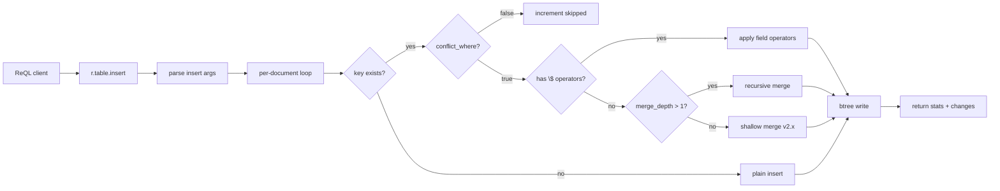

# MERGE/UPSERT with Complex Conditions — RethinkDB v3.0

**Status:** Phase 3 axiom-level implementation specification.
**Scope:** Deep-merge upsert, conditional conflict resolution, field-level merge operators,
and batch upsert with per-document conditions.
**Repository:** `/home/kara/rethinkdb`
**Status of this document:** Design only; it specifies no implementation patch.

This document uses the checked-in insert path in
`src/rdb_protocol/terms/writes.cc` (insert_term_t, batched_insert, parse_conflict_optarg),
the existing table interface in `src/rdb_protocol/val.hpp`,
`src/rdb_protocol/datum.hpp` (datum_t, datum_object_builder_t, merge),
ql2.proto `Term::INSERT`, and the B-tree write path in
`src/btree/reql_specific.hpp` plus `src/btree/operations.*`.

## 1. Overview

RethinkDB v2.x `insert` with `conflict: "update"` performs a shallow top-level
merge when a duplicate primary key is detected: top-level fields in the new
document overwrite top-level fields in the existing document. Nested
objects and arrays are replaced whole — there is no recursive merge,
no field-level mutation operators, and no conditional conflict resolution.

v3.0 adds three capabilities:

1. **Deep merge**: recursive object merging so that `{a: {b: 1}}` merged
   with `{a: {c: 2}}` produces `{a: {b: 1, c: 2}}` instead of
   `{a: {c: 2}}`.
2. **Field-level merge operators**: `$inc`, `$mul`, `$push`, `$pull`,
   `$addToSet`, `$min`, `$max`, `$unset`, and `$rename` that mutate
   individual fields during conflict resolution rather than replacing
   the entire value.
3. **Conditional conflict resolution**: a `conflict_where` predicate that
   controls whether a conflicting insert triggers an update. When the
   predicate evaluates to `false`, the insert is skipped (same as
   `conflict: "error"` but without the exception — it increments
   `skipped` in the stats).

All three capabilities compose: a single `insert` can specify deep merge,
field-level operators, AND a conditional predicate.

### 1.1 Goals and scope

- Extend the existing `insert` term; do not introduce a separate
  `merge` or `upsert` term.
- Preserve backward compatibility: `conflict: "update"` without
  new optargs produces identical behaviour to v2.x.
- Deep merge is opt-in via a `merge_depth` optarg. `-1` means
  unlimited recursion; `1` means shallow (v2.x behaviour); `N`
  limits recursion to N levels.
- Field-level operators are recognized by the `$` prefix on
  top-level keys inside the new document. They are applied only
  during conflict resolution, never on insert.
- The `conflict_where` predicate receives the existing document and
  the new document. It must be deterministic. When it returns
  `false`, the insert is skipped and `skipped` is incremented.
- `return_changes` is extended to return both `old_val` and
  `new_val` when `return_changes: {old: true, new: true}`.
- Batch inserts with per-document merge strategies are supported
  through a `documents` array where each element is an object with
  `{data: <doc>, conflict: ..., merge: ...}` to allow per-document
  overrides.

### 1.2 Architecture



### 1.3 Non-goals

- Multi-document transactions with rollback. Each document in a batch
  insert resolves independently.
- Server-side JavaScript conflict functions with the new operators.
  The `conflict: function(id, old, new)` path remains but is not
  extended in v3.0.
- Cross-document constraints or foreign-key validation during upsert.
- Array-element-level operators (`$[]`, `$[elem]` positional).
- Upsert with changefeed hooks that differentiate insert from update.
- Merge strategies for `replace` and `update` terms: this spec
  covers only `insert` with `conflict`.

---

## 2. API Design / ReQL surface

### 2.1 Insert optarg extensions

The existing `insert` term gains these new optargs:

| Optarg | Type | Default | Meaning |
|--------|------|---------|---------|
| `merge_depth` | integer | `1` | Recursion depth for object merge. `-1` unlimited. |
| `conflict_where` | function(old, new) → bool | absent | Predicate: if false, skip conflict update |
| `conflict` | string, function, or object | `"error"` | Extended: `"merge"` alias for `"update"` + deep merge |
| `return_changes` | bool, `"always"`, or object | `false` | Extended: `{old: true, new: true}` for both values |

Field-level operators appear as `$`-prefixed keys inside the data document.
They are NOT optargs — they are part of the document data.

### 2.2 Deep merge example

```javascript
// Existing document: {id: 1, profile: {name: "Alice", tags: ["dev"]}, score: 10}
r.table("users").insert({
  id: 1,
  profile: {name: "Carol", role: "admin"},
  score: 20
}, {
  conflict: "update",
  merge_depth: -1
})
// Result: {id: 1, profile: {name: "Carol", role: "admin", tags: ["dev"]}, score: 20}
// profile.name overwritten, profile.role added, profile.tags preserved, score overwritten
```

### 2.3 Field-level operators

```javascript
r.table("users").insert({
  id: 1,
  $inc: {score: 5, login_count: 1},
  $push: {tags: "ops"},
  $addToSet: {roles: "admin"},
  $min: {first_login: r.now()},
  $max: {last_login: r.now()}
}, {conflict: "update"})
```

Operator semantics:

| Operator | Argument type | Behaviour |
|----------|--------------|-----------|
| `$inc` | number | Add to existing numeric value. Default 0 if field missing. |
| `$mul` | number | Multiply existing numeric value. Default 1 if field missing. |
| `$push` | any | Append to existing array. Creates array if missing. |
| `$pull` | any or function | Remove matching elements from array. |
| `$addToSet` | any | Add to array if not already present. |
| `$min` | number | Set field to min(existing, new). |
| `$max` | number | Set field to max(existing, new). |
| `$unset` | bool (must be true) | Remove the field entirely. |
| `$rename` | string | Rename the field. Conflicts: last writer wins. |

Operators are applied in this order: `$unset` → `$rename` → `$inc`/`$mul` → `$min`/`$max` → `$push`/`$pull`/`$addToSet` → regular fields → deep merge.

### 2.4 Conditional conflict resolution

```javascript
r.table("users").insert({
  id: 1,
  last_seen: r.now(),
  version: 5
}, {
  conflict: "update",
  conflict_where: function(old_doc, new_doc) {
    return new_doc("version").gt(old_doc("version").default(0));
  }
})
// Only updates if new_doc.version > old_doc.version
```

### 2.5 Return old and new values

```javascript
r.table("users").insert({id: 1, name: "Bob"}, {
  conflict: "update",
  return_changes: {old: true, new: true}
})
// Returns: {inserted: 0, replaced: 1, ..., changes: [{old_val: {id: 1, name: "Alice"}, new_val: {id: 1, name: "Bob"}}]}
```

### 2.6 Per-document overrides in batch

```javascript
r.table("users").insert([
  {data: {id: 1, $inc: {score: 10}}, conflict: "update"},
  {data: {id: 2, name: "New"}, conflict: "error"},
  {data: {id: 3, $inc: {score: 1}}, conflict: "update", merge_depth: -1}
])
```

When the insert argument is an array of objects each containing a `data` key,
the outer wrapper keys (`conflict`, `merge_depth`, `conflict_where`,
`durability`) are per-document overrides. The `data` key contains the actual
document.

---

## 3. Data structures

### 3.1 Conflict behavior extension

```cpp
// In src/rdb_protocol/terms/writes.cc — extend existing enum
enum class conflict_behavior_t {
    ERROR,      // existing: fail on duplicate key
    REPLACE,    // existing: replace entire document
    UPDATE,     // existing: shallow top-level merge (v2.x compat)
    MERGE,      // new: deep merge (same as UPDATE with merge_depth=-1)
    FUNCTION    // existing: custom function (unchanged in v3.0)
};
```

### 3.2 Merge options struct

```cpp
// In src/rdb_protocol/terms/writes.cc

struct merge_options_t {
    int merge_depth = 1;          // -1 = unlimited, 0 = no merge, 1 = shallow, N = N levels
    bool has_field_operators = false;

    // Operator deltas extracted from the new document
    struct field_operators_t {
        std::map<std::string, datum_t> inc;       // $inc
        std::map<std::string, datum_t> mul;       // $mul
        std::map<std::string, datum_t> push;      // $push
        std::map<std::string, datum_t> pull;      // $pull
        std::map<std::string, datum_t> add_to_set; // $addToSet
        std::map<std::string, datum_t> min_val;   // $min
        std::map<std::string, datum_t> max_val;   // $max
        std::set<std::string> unset;              // $unset
        std::map<std::string, std::string> rename; // $rename (old→new)
    } operators;

    // Strip $operator keys from new_doc after extraction
    static std::pair<datum_t, field_operators_t>
    extract_operators(const datum_t &new_doc, const configured_limits_t &limits);
};

// Parse merge options from optargs
merge_options_t parse_merge_optargs(
    scope_env_t *env, args_t *args,
    const datum_t &new_doc,
    const configured_limits_t &limits);
```

### 3.3 Deep merge function

```cpp
// In src/rdb_protocol/terms/writes.cc

// Recursive deep merge. At each level of nesting, new fields overwrite old
// fields, and both-present object-valued fields are recursively merged up to
// merge_options.merge_depth levels. merge_depth=1 is shallow (v2.x).
// merge_depth=-1 is unlimited. merge_depth=0 replaces entirely.
//
// Array-valued fields are NEVER merged element-by-element: the new array
// replaces the old one. Use $push/$pull/$addToSet for array mutations.
//
// Returns: the merged datum, and a set of warning condition strings.
std::pair<datum_t, std::set<std::string>>
deep_merge(
    const datum_t &old_val,
    const datum_t &new_val,
    const merge_options_t &options,
    const configured_limits_t &limits,
    int current_depth = 0);
```

### 3.4 Field operator application

```cpp
// In src/rdb_protocol/terms/writes.cc

// Apply field-level operators to the existing document IN PLACE.
// Operates on a datum_object_builder_t copy of the existing document.
// Order: $unset → $rename → $inc/$mul → $min/$max → $push/$pull/$addToSet
//
// Returns the modified datum.
datum_t apply_field_operators(
    const datum_t &existing_doc,
    const merge_options_t::field_operators_t &operators,
    const configured_limits_t &limits);

// Individual operator applicators (unit-testable):
datum_t apply_inc(const datum_t &existing, const datum_t &delta);
datum_t apply_mul(const datum_t &existing, const datum_t &factor);
datum_t apply_push(const datum_t &existing, const datum_t &element);
datum_t apply_pull(const datum_t &existing, const datum_t &matcher);
datum_t apply_add_to_set(const datum_t &existing, const datum_t &element);
datum_t apply_min(const datum_t &existing, const datum_t &candidate);
datum_t apply_max(const datum_t &existing, const datum_t &candidate);
```

### 3.5 Per-document batch wrapper

```cpp
// In src/rdb_protocol/terms/writes.cc

// When the insert data argument is an array of objects each containing a
// "data" key, extract per-document metadata.
struct per_document_insert_t {
    datum_t data;
    optional<conflict_behavior_t> conflict;
    optional<int> merge_depth;
    optional<counted_t<const ql::func_t>> conflict_where_func;
    optional<durability_requirement_t> durability;
};

// Parse a batch of per-document wrappers. Returns false if the array
// doesn't match the wrapper format (falls through to normal batch insert).
bool parse_per_document_batch(
    const datum_t &batch,
    std::vector<per_document_insert_t> *out,
    const configured_limits_t &limits);
```

### 3.6 Stats extension

```cpp
// Extend new_stats_object() in writes.cc to include these keys:
//   "inserted" (existing)
//   "replaced" (existing)
//   "updated"   (NEW — count of conflict updates where operators/deep merge applied)
//   "skipped"   (existing)
//   "unchanged" (existing)
//   "errors"    (existing)
```

### 3.7 Serialization — ql2.proto

```protobuf
// Extend Term::Insert in ql2.proto
// No new term types. New optargs are string-keyed and validated at term level.

// New ReQL error codes (see section 7):
//   MERGE_DEPTH_INVALID (new)
//   MERGE_OPERATOR_INVALID (new)
//   CONFLICT_WHERE_NONDETERMINISTIC (new)
//   CONFLICT_WHERE_ARITY_ERROR (new)
//   MERGE_CIRCULAR_REFERENCE (new)
```

---

## 4. Behaviour / Implementation

### 4.1 insert_term_t modifications

The existing `eval_impl` in `insert_term_t` (writes.cc line 131) is
extended with these new code paths after `conflict_behavior` parsing:

```cpp
// After existing conflict_behavior parsing (line 139), add:
merge_options_t merge_opts = parse_merge_optargs(
    env, args, /*new_doc goes here per-document*/, env->env->limits());

// If conflict_where optarg present:
optional<counted_t<const ql::func_t>> conflict_where_func;
if (scoped_ptr_t<val_t> where_arg = args->optarg(env, "conflict_where")) {
    conflict_where_func.set(where_arg->as_func());
    // Validate determinism (same pattern as conflict_func validation)
    rcheck((*conflict_where_func)->is_deterministic()
               .test(single_server_t::no, constant_now_t::no),
           base_exc_t::LOGIC,
           "The conflict_where function must be deterministic.");
    // Validate arity: must accept 2 arguments
    optional<size_t> arity = (*conflict_where_func)->arity();
    rcheck(static_cast<bool>(arity) && arity.get() == 2,
           base_exc_t::LOGIC,
           "The conflict_where function must accept 2 arguments (old, new).");
}

// If per-document batch detected, unwrap:
std::vector<per_document_insert_t> per_doc;
bool is_per_doc_batch = parse_per_document_batch(datums, &per_doc, limits);
```

### 4.2 Conflict resolution flow (per document)

```
1. Attempt direct insert of document.
2. If key does not exist → insert succeeds, increment "inserted".
3. If key exists:
   a. If conflict == ERROR → increment "errors", skip.
   b. If conflict == REPLACE → replace, increment "replaced".
   c. If conflict_where present:
      i. Evaluate conflict_where(old_doc, new_doc).
      ii. If false → increment "skipped", skip.
   d. Extract field operators from new_doc (strip $ keys).
   e. If operators present:
      i. Apply operators to old_doc → intermediate_doc.
      ii. Strip $ keys from new_doc → cleaned_new_doc.
      iii. Merge cleaned_new_doc into intermediate_doc per merge_depth.
   f. If no operators:
      i. Merge new_doc into old_doc per merge_depth.
   g. Write merged result → increment "replaced" (or "updated" if operators).
4. If return_changes requested, capture old_val and new_val.
```

### 4.3 Deep merge algorithm

```
deep_merge(old, new, depth, max_depth, limits):
    if old.type != OBJECT or new.type != OBJECT:
        return new  // scalar or array: replace
    if max_depth >= 0 and depth > max_depth:
        return new  // at depth limit: replace
    result = clone(old)
    for each (key, new_val) in new:
        if key in result:
            old_val = result[key]
            result[key] = deep_merge(old_val, new_val, depth+1, max_depth, limits)
        else:
            result[key] = new_val
    return result
```

### 4.4 Field operator application order

Operators are applied in a deterministic order to avoid ambiguity:

1. **$unset**: remove fields from the existing document. If a field
   listed in `$unset` also appears in `$rename` as a source,
   `$unset` is applied first and `$rename` sees the field as absent
   (produces a warning, not an error).

2. **$rename**: rename fields. If source and target are the same, no-op.
   If target already exists, the source overwrites it. If source doesn't
   exist, no-op with warning.

3. **$inc / $mul**: arithmetic operators. Both can target the same
   field; `$inc` is applied before `$mul`. If the field doesn't
   exist, default to 0 for `$inc`, 1 for `$mul`.

4. **$min / $max**: comparison operators. If field doesn't exist,
   set to the operator value.

5. **$push / $pull / $addToSet**: array operators. `$pull` is applied
   before `$push` so that a pull-then-push of the same value results
   in the value being present exactly once (if `$addToSet`).

6. **Regular fields**: after all operators, the remaining non-`$` keys
   in the new document are merged with `deep_merge`.

---

## 5. States

### 5.1 Merge options validation states

```
parse_merge_optargs:
    INPUT: optargs dict, new_doc datum, limits
    STATES:
        VALIDATING_MERGE_DEPTH:
            if merge_depth optarg present:
                check int, check >= -1
                if invalid → MERGE_DEPTH_INVALID
            → EXTRACTING_OPERATORS
        EXTRACTING_OPERATORS:
            for each key in new_doc:
                if key starts with '$':
                    if key in {$inc, $mul, $push, $pull, $addToSet, $min, $max, $unset, $rename}:
                        validate argument type (object for inc/mul/push/pull/addToSet/min/max,
                                               bool for unset, object for rename)
                        → extract to field_operators_t
                    else:
                        → MERGE_OPERATOR_INVALID (unknown operator)
            → VALIDATING_CROSS_REFERENCES
        VALIDATING_CROSS_REFERENCES:
            if $rename source == target → warning, strip
            if $rename source in $unset → warning, skip rename
            if $rename target conflicts with another $rename target → last writer wins, warning
            → VALID
```

### 5.2 Conflict resolution per-document state

```
Per-document states:
    BEFORE_INSERT: initial state
    INSERTING: acquiring btree write lock
    KEY_CHECK: checking if primary key exists
    CONFLICT_EVAL: evaluating conflict_where (if present)
    OPERATOR_APPLY: applying field operators (if present)
    MERGING: executing deep merge
    WRITING: committing merged document to btree
    DONE: stats updated, changes captured

    Error transitions:
    INSERTING → ERROR: btree write conflict, transient error
    CONFLICT_EVAL → SKIPPED: conflict_where returned false
    OPERATOR_APPLY → ERROR: invalid operator value (e.g., $inc on string)
    MERGING → ERROR: circular reference detected (object contains self-reference)
    WRITING → ERROR: btree write failure
```

---

## 6. Dependencies

### 6.1 Existing code dependencies

| Component | File | Change required |
|-----------|------|----------------|
| `insert_term_t` | `src/rdb_protocol/terms/writes.cc` | Extend eval_impl with merge options, field operators, per-doc batch |
| `conflict_behavior_t` | `src/rdb_protocol/terms/writes.cc` | Add MERGE enum value |
| `new_stats_object()` | `src/rdb_protocol/terms/writes.cc` | Add "updated" key |
| `batched_insert` | `src/rdb_protocol/val.hpp`, table interface | Accept merge_options_t parameter |
| `datum_t::merge` | `src/rdb_protocol/datum.hpp` | No change — deep_merge is a new free function |
| `datum_object_builder_t` | `src/rdb_protocol/datum.hpp` | No change — used by operator applicators |
| `func_t` | `src/rdb_protocol/func.hpp` | No change — conflict_where reuses existing call interface |
| `args_t::optarg` | `src/rdb_protocol/op.hpp` | No change — new optargs use existing accessor |
| `configured_limits_t` | `src/rdb_protocol/context.hpp` | No change |
| `ql2.proto` | `src/rdb_protocol/ql2.proto` | No new terms; new error codes only |

### 6.2 No new external dependencies

This feature is self-contained within the ReQL term layer and the datum
manipulation library. No new third-party libraries are required.

---

## 7. Error catalog

| Error code | HTTP analog | Meaning | Trigger condition |
|-----------|-----------|---------|-------------------|
| `MERGE_DEPTH_INVALID` | 400 | merge_depth not an integer or < -1 | Bad optarg value |
| `MERGE_OPERATOR_INVALID` | 400 | Unknown $operator key in document | Key starts with $ but not a recognized operator |
| `MERGE_OPERATOR_TYPE_ERROR` | 400 | Operator argument has wrong type | e.g., $inc value is a string |
| `MERGE_OPERATOR_NON_NUMERIC` | 400 | $inc/$mul on non-numeric field | Existing field is string/object/array and operator requires numeric |
| `CONFLICT_WHERE_NONDETERMINISTIC` | 400 | conflict_where function not deterministic | Function references r.js, r.random, r.now |
| `CONFLICT_WHERE_ARITY_ERROR` | 400 | conflict_where arity != 2 | Function doesn't accept exactly 2 arguments |
| `MERGE_CIRCULAR_REFERENCE` | 500 | Circular reference in document | Document contains self-referencing object |
| `MERGE_DEPTH_EXCEEDED` | 400 | Document nesting exceeds configured depth limit | Nested deeper than max limits.datum_max_nesting_depth |
| `PER_DOC_BATCH_FORMAT_ERROR` | 400 | Per-document batch element missing "data" key | Array element has no "data" key |
| `RETURN_CHANGES_FORMAT_ERROR` | 400 | return_changes object missing valid keys | Keys other than "old"/"new" present |

All errors use the existing `rfail_target`/`rcheck_target` mechanism with
`base_exc_t::LOGIC` for client errors and `base_exc_t::OP` for transient
failures.

---

## 8. Testing

### 8.1 Unit tests

File: `src/unittest/merge_upsert.cc`

Test categories:

| Category | Test count | Description |
|----------|-----------|-------------|
| Deep merge | 12 | Shallow (v2.x compat), 2-level, 3-level, unlimited, array replacement, null handling, scalar overwrite, empty objects, depth limit, object-in-array (no recursion into arrays), datum_t type mismatch, merge with R_NULL |
| Field operators | 18 | $inc positive/negative/missing-field/non-numeric-error, $mul positive/fraction/missing-field, $push to existing/new array/scalar-field, $pull exact/function/nested, $addToSet duplicate/new, $min lower/higher/missing, $max lower/higher/missing, $unset existing/missing, $rename source-equals-target/source-missing/target-exists |
| Operator ordering | 6 | $inc before $mul on same field, $unset before $rename, $pull before $push, $min before $max, $inc then $push on same field, operator composition with regular fields |
| Conditional upsert | 8 | conflict_where true, conflict_where false (skipped), conflict_where with version comparison, conflict_where with field existence check, nondeterministic rejection, arity=0 rejection, arity=3 rejection, conflict_where with r.now rejection |
| Return changes | 6 | old_val only, new_val only, both, neither, "always" compat, per-doc changes in batch |
| Per-document batch | 8 | Single wrapper, mixed conflict strategies, per-doc merge_depth, per-doc conflict_where, invalid wrapper (no data), empty batch, nested wrappers (rejected), operator override in per-doc |
| Stats | 4 | updated count with operators, skipped count with conflict_where, replaced count with deep merge, inserted count unchanged |

Total unit tests: 62

### 8.2 Integration tests

File: `test/rql_test/src/merge_upsert.yaml`

```yaml
# 15 integration scenarios
- name: shallow_merge_v2_compat
  setup: create table, insert initial doc
  query: insert with conflict="update", merge_depth=1
  verify: top-level overwritten, nested replaced

- name: deep_merge_nested_objects
  setup: create table, insert {id:1, a:{b:1, c:{d:2}}}
  query: insert {id:1, a:{c:{e:3}, f:4}} with conflict="update", merge_depth=-1
  verify: {id:1, a:{b:1, c:{d:2, e:3}, f:4}}

- name: inc_operator
  setup: create table, insert {id:1, score: 10}
  query: insert {id:1, $inc: {score: 5}} with conflict="update"
  verify: score == 15, "updated": 1

- name: conditional_skip
  setup: create table, insert {id:1, version: 5, data: "old"}
  query: insert {id:1, version: 3, data: "new"} with conflict="update",
         conflict_where: lambda old,new: new("version") > old("version")
  verify: data == "old", "skipped": 1

- name: mixed_operators_and_merge
  setup: create table, insert {id:1, score: 10, tags: ["a"]}
  query: insert {id:1, $inc: {score: 5}, $push: {tags: "b"}, name: "Bob"}
         with conflict="update"
  verify: score==15, tags==["a","b"], name=="Bob"

- name: per_doc_batch_mixed
  setup: create table
  query: insert [{data:{id:1, name:"A"}, conflict:"error"},
                 {data:{id:2, $inc:{score:1}}, conflict:"update"}]
  verify: id:1 inserted, id:2 inserted (no conflict), stats correct

- name: return_both_values
  setup: create table, insert {id:1, name: "Alice"}
  query: insert {id:1, name: "Bob"} with conflict="update",
         return_changes: {old: true, new: true}
  verify: changes[0] has old_val and new_val

- name: unset_field
  setup: create table, insert {id:1, a: 1, b: 2, c: 3}
  query: insert {id:1, $unset: {b: true, c: true}, d: 4} with conflict="update"
  verify: doc == {id:1, a:1, d:4}

- name: rename_field
  setup: create table, insert {id:1, old_name: "value"}
  query: insert {id:1, $rename: {old_name: "new_name"}} with conflict="update"
  verify: doc has new_name=="value", old_name absent

- name: conflict_where_version_check
  setup: create table, insert {id:1, v: 5, d: "old"}
  query: insert {id:1, v: 10, d: "new"} with conflict="update",
         conflict_where: lambda old,new: new("v") > old("v")
  verify: d=="new", updated==1
  # second insert with v=3
  query: insert {id:1, v: 3, d: "newer"} with conflict="update",
         conflict_where: lambda old,new: new("v") > old("v")
  verify: d=="new", skipped==1

- name: add_to_set_dedup
  setup: create table, insert {id:1, roles: ["admin"]}
  query: insert {id:1, $addToSet: {roles: "admin"}} with conflict="update"
  verify: roles==["admin"], updated==0 (no change) or unchanged==1

- name: min_max_operators
  setup: create table, insert {id:1, low: 10, high: 20}
  query: insert {id:1, $min: {low: 5}, $max: {high: 25}} with conflict="update"
  verify: low==5, high==25

- name: error_on_nonnumeric_inc
  setup: create table, insert {id:1, name: "Alice"}
  query: insert {id:1, $inc: {name: 1}} with conflict="update"
  verify: error, MERGE_OPERATOR_NON_NUMERIC

- name: unknown_operator_rejected
  query: insert {id:1, $foo: {bar: 1}} with conflict="update"
  verify: error, MERGE_OPERATOR_INVALID

- name: deep_merge_with_operators
  setup: create table, insert {id:1, stats: {hp: 100, mp: 50}, items: ["sword"]}
  query: insert {id:1, stats: {$inc: {hp: -10}, mp: 75}, $push: {items: "shield"}}
         with conflict="update"
  verify: stats.hp==90, stats.mp==75, items==["sword","shield"]
```

### 8.3 Performance benchmarks

| Benchmark | Description | Metric |
|-----------|-------------|--------|
| `bench_deep_merge` | Deep merge 10-level nested object (100 keys total) | ops/sec, latency p50/p99 |
| `bench_operators` | Apply $inc + $push to document with 50 fields | ops/sec |
| `bench_conditional_skip` | Batch insert 1000 docs, all skipped by conflict_where | ops/sec vs batch insert with conflict="error" |
| `bench_per_doc_overhead` | 1000 per-document wrappers vs 1000 plain docs | overhead % |

---

## 9. Security

### 9.1 Determinism enforcement

Field-level operators do not execute user code — they are pure data
transformations. The `conflict_where` function is subject to the same
determinism check as the existing `conflict` function: it must pass
`is_deterministic().test(single_server_t::no, constant_now_t::no)`.

### 9.2 Depth protection

`merge_depth` is bounded by `limits.datum_max_nesting_depth`. A
`merge_depth` of `-1` (unlimited) still stops at the configured limit
to prevent stack overflow from malicious input.

### 9.3 Operator value validation

All operator values are validated before application:
- Numeric operators check the existing field is numeric or absent
- Array operators check the existing field is an array or absent
- `$unset` rejects non-boolean values
- `$rename` validates both source and target are strings

### 9.4 Per-document batch atomiticy

Each document in a batch insert resolves independently. A rejected
operator on document 5 does not roll back documents 1-4. This is the
same atomicity model as existing batch insert — introducing multi-document
transactions is a separate v3.0 feature (see "Generated/virtual columns" spec).

---

## 10. Performance

### 10.1 Complexity

- Deep merge: O(k × d) where k = total keys across all levels,
  d = min(merge_depth, actual_depth). With merge_depth=1, identical
  to existing v2.x merge.
- Field operators: O(n) where n = number of operator entries.
  Each operator is a single field lookup + mutation.
- Per-document batch: O(m × b) where m = documents per batch,
  b = batch size. Same as existing batch insert overhead.
- `conflict_where` evaluation: O(1) per conflict — one function
  call per duplicate key.

### 10.2 Memory

- Deep merge allocates a new datum for each level of nesting.
  At merge_depth=N, maximum allocation is a clone of the existing
  document plus N intermediate objects. With merge_depth=-1, the
  maximum is the full depth of the document.
- Field operators modify a single builder copy of the existing document.
  Memory is proportional to document size, not number of operators.
- No persistent state is retained between batch elements.

### 10.3 Backward compatibility

- `conflict: "update"` without new optargs: 100% v2.x behaviour.
  merge_depth defaults to 1 (shallow). No field operators extracted.
- `conflict: "replace"`: unchanged.
- `conflict: "error"`: unchanged.
- `conflict: function(...)`: unchanged.
- Existing `return_changes: true` / `"always"`: unchanged.
  Only the new `{old: true, new: true}` object form triggers
  the extended return format.
- `return_vals` (deprecated optarg): still rejected with the
  existing error message about `return_changes`.

### 10.4 Feature flags / rollout

No feature flags are required. All new behaviour is strictly opt-in:
- `merge_depth` > 1 must be explicitly requested
- Field operators only activate when `$`-prefixed keys are present
- `conflict_where` must be explicitly passed
- Per-document batch format only activates when array elements have a `data` key

Without any new optargs, v2.x insert behaviour is preserved exactly.
