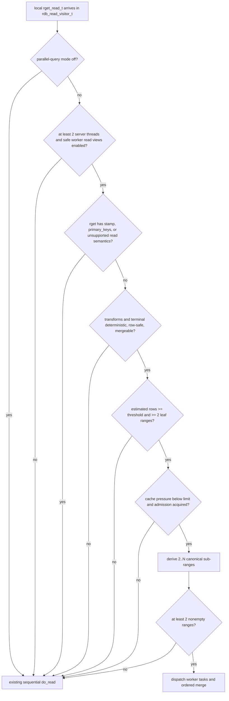
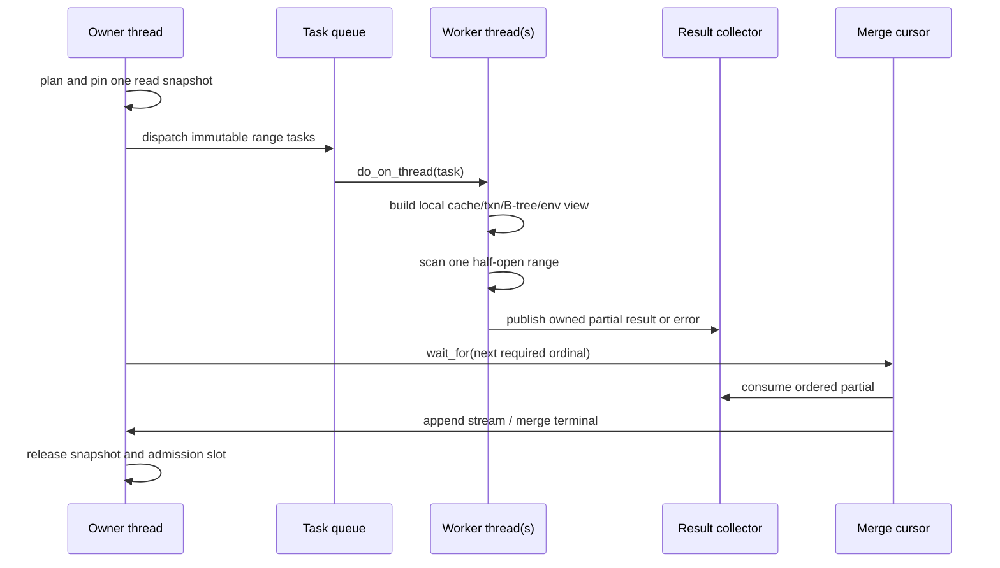
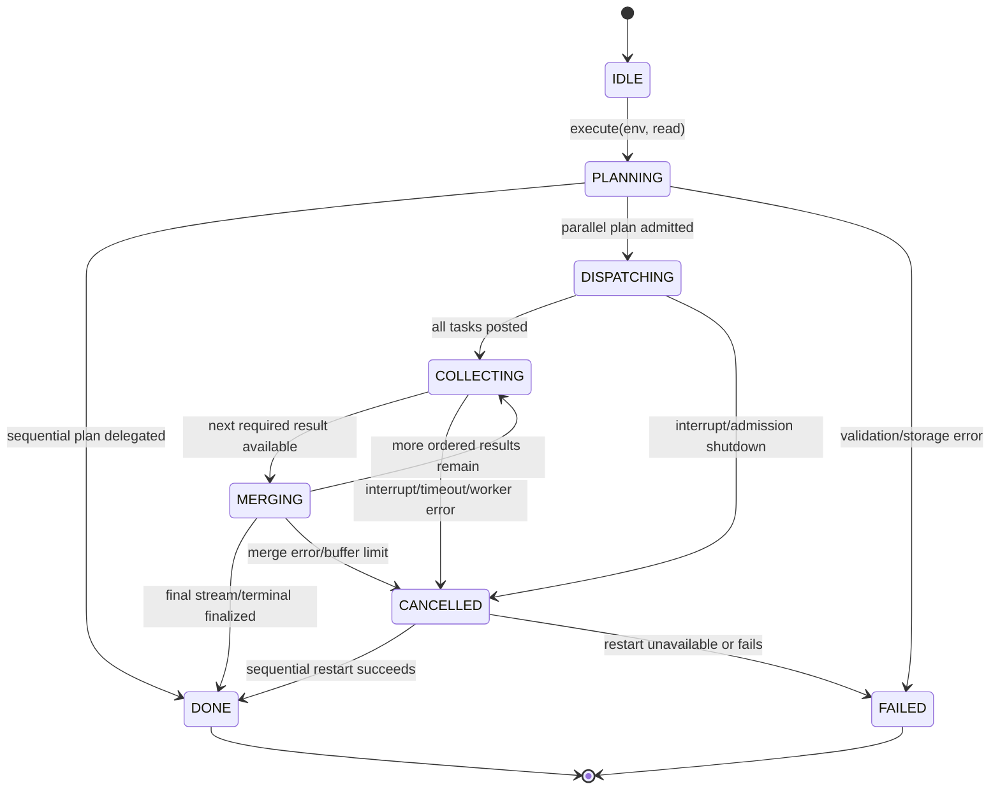

# Phase 3 / v3.0 — Parallel Query Execution

**Status:** implementation-ready design specification

**Scope:** server-local intra-query parallelism for scan-heavy ReQL reads. This is a v3.0 storage/query-runtime feature; it does not change the ReQL wire protocol, table sharding protocol, consistency model, or client-visible result shape.

**Source constraints verified in this repository:**

- `read_t` is a `boost::variant` whose range-read member is `rget_read_t` (`src/rdb_protocol/protocol.hpp:312-614`).
- Range reads enter `store_t::read()`, acquire a read transaction and a `real_superblock_t`, then invoke `store_t::protocol_read()` (`src/rdb_protocol/btree_store.cc:186-203`). `protocol_read()` dispatches through `rdb_read_visitor_t` (`src/rdb_protocol/store.cc:299-997`).
- `rdb_rget_slice()` scans a `key_range_t` through `btree_concurrent_traversal()` and applies transforms and terminals (`src/rdb_protocol/btree.cc:1012-1082`). A `key_range_t` is left-inclusive/right-exclusive (`src/btree/keys.hpp:225-355`).
- The server already owns `linux_thread_pool_t`, one event queue per server thread, and `do_on_thread(threadnum_t, callable)` for cross-core dispatch (`src/arch/runtime/thread_pool.hpp`, `src/do_on_thread.hpp`). It must be reused; this feature must not create an independent `std::thread` pool.
- `store_t::read()` currently calls `assert_thread()` and owns one `cache_conn_t` plus one primary `btree_slice_t` (`src/rdb_protocol/btree_store.cc:186-203`, `src/rdb_protocol/store.hpp:368-377`). Therefore the existing `store_t`, `real_superblock_t`, `ql::env_t`, response object, and B-tree callback objects are not legal to pass to a different server thread unchanged.

The last constraint is a hard design gate, not an optimization note. A parallel plan is permitted only after the worker-local read-view API in §2 is implemented and verified. Until then the planner must select the existing sequential `rdb_rget_slice()` path.

---

## 1. Overview

### 1.1 Definition

Parallel query execution means **intra-query parallelism within one local shard replica**. For an eligible `rget_read_t`, the local server splits the shard-local primary-key or secondary-index key range into disjoint ordered sub-ranges. It evaluates each sub-range on a server runtime worker thread using a worker-local, read-only B-tree/cache view pinned to the same snapshot. The owner thread merges partial streams or partial terminal states and returns the normal `rget_read_response_t`.

This is distinct from **inter-query concurrency**:

| Concern | Existing behavior | v3.0 behavior |
|---|---|---|
| Inter-query concurrency | Independent client queries can already be routed/scheduled concurrently by the server runtime and cluster. | Preserved. Admission control prevents parallel scans from starving ordinary reads or writes. |
| Intra-query parallelism | A local `rget_read_t` is scanned by one query pipeline/coroutine. | One eligible local scan is split into 2..N worker tasks and merged before the existing shard response is returned. |
| Inter-server work | The query router already shards a read and unshards replies. | Unchanged. Each server applies this feature only to the shard fragment it owns. No additional RPCs and no cross-server worker pool. |

A multi-shard ReQL query can therefore have two levels of existing/new parallelism: the coordinator already has one response per shard; each shard server may execute its own eligible fragment with local workers. The coordinator remains unaware of worker count and receives exactly one `read_response_t` per shard.

### 1.2 Semantics that must not change

1. The read observes one valid per-shard snapshot, exactly as a sequential `read_t::use_snapshot()` read does.
2. A successful parallel result has the same rows, multiplicities, order, terminal value, ReQL version behavior, and error behavior as the sequential implementation for the same request and snapshot.
3. User code and ReQL transforms are evaluated in worker-local environments. No `ql::env_t`, `term_t`, accumulator, stream, `read_response_t`, `real_superblock_t`, or `buf_lock_t` is shared concurrently.
4. Parallelism is an implementation decision. No ReQL optarg, protocol field, driver change, or client capability negotiation is added.
5. A failed or cancelled parallel execution never returns a partial successful result. It either restarts once sequentially before producing output, or returns one defined query error.

### 1.3 v3.0 supported plan class

The feature applies only to a local `rget_read_t` satisfying every eligibility rule in §4. Eligible logical inputs are:

- primary-key table scans and primary-key `between()` selections;
- ordered or unordered primary-key scans where all transforms are deterministic and stateless per row;
- secondary-index `between()` and `get_all()` range scans when their index-range stream can be divided at canonical secondary-key boundaries;
- `filter`, `map`, `pluck`, `without`, and other row-local transforms represented in `rget_read_t::transforms` when `is_parallel_row_safe()` returns true;
- `count()` and `sum()` terminals when their merge algebra is declared by §4.7.

The feature explicitly uses `rget_read_t`; it does not add a new member to the serialized `read_t` variant. This avoids a cluster-version wire-format change. The parallel executor is selected only after a normal `rget_read_t` has reached the local `rdb_read_visitor_t`.

### 1.4 Explicit exclusions

The planner MUST select sequential execution for: point reads; geo reads; vector reads; BRIN reads in v3.0; distribution reads; changefeed subscribe/stamp reads; reads with `rget_read_t::stamp`; reads with `primary_keys`; non-deterministic transforms; transforms that mutate query-global state; `group`, `reduce`, `fold`, `distinct`, `order_by` that requires a materializing global sort, `eq_join`, and all terminals without an approved associative merge descriptor. Excluding a plan is correct graceful degradation, not an error.

---

## 2. Dependencies

### 2.1 Query pipeline and planner placement

The implementation spans these existing paths:

```
client term tree
  -> ql::term_t / runtime_term_t::eval(scope_env_t *)
  -> table/datum-stream read generator
  -> rget_read_t inside read_t
  -> cluster routing and existing read_t::shard()/unshard()
  -> store_t::read()
  -> store_t::protocol_read()
  -> rdb_read_visitor_t::operator()(const rget_read_t &)
  -> sequential rdb_rget_slice() OR parallel_query_executor_t
```

`ql::term_t` is an evaluated visitor-style term hierarchy (`src/rdb_protocol/term.hpp:31-86`); it is not a thread-safe worker object. The main evaluation still creates `rget_read_t` exactly as today. The executor consumes the already-serialized query description and creates worker-local evaluation state from `rget_read_t::serializable_env` and the transform/terminal definitions.

### 2.2 B-tree, buffer cache, and snapshot prerequisite

The following interface is required before the planner may enable parallel execution:

```cpp
// New file: src/rdb_protocol/parallel_read_view.hpp
class parallel_read_view_t {
public:
    parallel_read_view_t(const parallel_read_view_t &) = delete;
    parallel_read_view_t &operator=(const parallel_read_view_t &) = delete;
    ~parallel_read_view_t();

    btree_slice_t *primary_btree() const;
    sindex_superblock_t *secondary_superblock() const;
    superblock_t *superblock() const;
    ql::env_t *env() const;

private:
    friend class store_t;
    parallel_read_view_t(store_t *store,
                         const parallel_read_snapshot_t &snapshot,
                         const parallel_scan_task_t &task,
                         threadnum_t owner_thread,
                         signal_t *interruptor);

    threadnum_t owner_thread_;
    cache_conn_t cache_conn_;
    scoped_ptr_t<txn_t> txn_;
    scoped_ptr_t<real_superblock_t> primary_superblock_;
    scoped_ptr_t<sindex_superblock_t> secondary_superblock_;
    scoped_ptr_t<btree_slice_t> primary_btree_;
    scoped_ptr_t<btree_slice_t> secondary_btree_;
    scoped_ptr_t<ql::env_t> env_;
};
```

`parallel_read_view_t` is owned by exactly one worker task and is constructed and destroyed on that task's `owner_thread_`. It must use a worker-local `cache_conn_t`, transaction, superblock wrapper, and B-tree slice. It must never borrow `store_t::general_cache_conn`, `store_t::btree`, an existing `real_superblock_t *`, or an existing `ql::env_t *` from the owner thread.

`store_t` gains this factory:

```cpp
parallel_read_snapshot_t store_t::make_parallel_read_snapshot(
    read_token_t *token,
    const read_t &read,
    signal_t *interruptor)
    THROWS_ONLY(interrupted_exc_t);

scoped_ptr_t<parallel_read_view_t> store_t::make_parallel_read_view(
    const parallel_read_snapshot_t &snapshot,
    const parallel_scan_task_t &task,
    threadnum_t owner_thread,
    signal_t *interruptor)
    THROWS_ONLY(interrupted_exc_t);
```

`make_parallel_read_snapshot()` acquires the existing snapshot semantics once, records immutable snapshot identity, and increments the pinned-snapshot reference count. Each worker view independently acquires a read transaction at that exact snapshot identity. The cache and serializer implementation must guarantee that concurrent read-only page access via independent `cache_conn_t` objects is safe. It must retain page pins until each worker completes. Writes remain serialized through the existing write path and may continue while snapshot readers scan.

**Required gating tests before enabling the feature flag:**

1. Two server threads create worker-local views of the same snapshot and repeatedly scan disjoint leaf ranges while writers update unrelated keys; each worker always reads a valid pre-write or post-write snapshot, never mixed rows.
2. Page eviction/rehydration under concurrent worker reads produces no `assert_thread`, cache-lock violation, use-after-free, or checksum failure.
3. Destroying a worker view after cancellation releases every transaction, superblock, B-tree slice, and cache pin on the worker's home thread.
4. A table/drop/shutdown drain waits for all `parallel_read_view_t` instances through `store_t::drainer`.

Until all four pass, `parallel_query_enabled` must remain false regardless of command-line options.

### 2.3 Existing runtime concurrency primitives

Use the existing `linux_thread_pool_t` server threads. `linux_thread_pool_t::n_threads` is the upper bound on physical execution threads; `do_on_thread()` transfers a callback to a selected `threadnum_t`. `linux_thread_pool_t::run_in_blocker_pool()` must not be used: it is for blocking calls and is not an event-loop query worker scheduler.

New code must not use raw `pthread_create`, `std::thread`, a third-party executor, or a per-query OS thread pool. Worker completion is posted to the planner's home thread through `do_on_thread(home_thread, ...)`. A small `std::mutex` is permitted only inside the result accumulator to protect ownership transfer between server threads; it must never protect B-tree, cache, `ql::env_t`, or query execution itself.

### 2.4 Cluster boundary

The executor runs **per server, per local shard fragment**. It is constructed in the store-layer visitor after cluster routing. `read_t::shard()` and `read_t::unshard()` remain unchanged. The server does not split a task to a remote server, does not change replication/read-mode routing, and does not use a global worker budget across nodes. Every server independently enforces its own limits.

This placement preserves failure domains: a server failure remains an existing shard-read failure handled by the normal cluster read path, and one worker failure is local to one shard response.

### 2.5 Existing B-tree mechanisms to reuse and mechanisms not to reuse

- Reuse `key_range_t` as the canonical half-open scan interval. Adjacent task ranges must satisfy `task[i].range.right == task[i+1].range.left`, except for the final unbounded right edge.
- Reuse `btree_concurrent_traversal()` for each worker's local range traversal. Its existing “concurrent” name does not authorize sharing its callback/response objects across server threads.
- Reuse B-tree split metadata/leaf boundaries exposed through a new read-only `btree_slice_t::sample_split_keys()` helper. Do not split arbitrary serialized key bytes or call `store_key_t::increment()` to invent a key boundary.
- `btree_parallel_traversal()` (`src/btree/parallel_traversal.hpp`) is a structural traversal helper, not a query result executor. It must not be repurposed as the query worker pool because it does not provide snapshot-isolated ReQL evaluation, task cancellation, ordered merge, or terminal merge semantics.

---

## 3. Interface (C++ API)

### 3.1 New files and ownership

| File | Responsibility |
|---|---|
| `src/rdb_protocol/parallel_query.hpp` | Public executor, plan, task, merge, statistics, and configuration types. |
| `src/rdb_protocol/parallel_query.cc` | Planner, task dispatch, worker completion, merge, cancellation, and error selection. |
| `src/rdb_protocol/parallel_read_view.hpp/.cc` | Worker-local snapshot/cache/B-tree/environment construction. |
| `src/rdb_protocol/btree.hpp/.cc` | Read-only split-key sampling and worker-local range scan primitive. |
| `src/rdb_protocol/store.hpp/.cc` | Snapshot/view factory, server admission object, and visitor integration. |
| `src/rdb_protocol/configured_limits.hpp/.cc` | Parallel-query configuration validation and startup defaults. |
| `src/unittest/parallel_query_test.cc` | Unit tests for planning, splitting, merging, cancellation, and error precedence. |
| `test/rql_test/src/parallel_query.yaml` | ReQL integration scenarios defined in §8. |

No serialization declaration is added for `parallel_*` types. They are process-local executor state and must never enter `read_t`, RPC messages, disk metadata, or changefeed state.

### 3.2 Configuration API

```cpp
enum class parallel_query_mode_t {
    OFF,
    AUTO,
    FORCE
};

struct parallel_query_config_t {
    parallel_query_mode_t mode;
    uint32_t max_workers_per_query;
    uint32_t max_parallel_queries;
    uint64_t threshold_rows;
    uint64_t merge_buffer_bytes;
    uint64_t worker_timeout_ms;
    uint64_t sequential_restart_timeout_ms;
    uint64_t cache_pressure_threshold_percent;

    parallel_query_config_t();
    void validate(uint32_t server_threads) const;
};
```

Defaults and startup flags:

| Flag | Type/default | Validation |
|---|---|---|
| `--parallel-query-mode` | `off|auto|force`, default `off` | Reject any other string with `Invalid value for --parallel-query-mode: expected off, auto, or force.` |
| `--parallel-query-workers` | unsigned integer, default `min(4, max(1, server_threads - 1))` | Must be in `[1, server_threads]`; reject `0` with `--parallel-query-workers must be at least 1.` |
| `--parallel-query-threshold-rows` | unsigned integer, default `100000` | Must be `>= 1`; reject `0` with `--parallel-query-threshold-rows must be at least 1.` |
| `--parallel-query-max-queries` | unsigned integer, default `1` | Must be `>= 1`; reject `0` with `--parallel-query-max-queries must be at least 1.` |
| `--parallel-query-merge-buffer-mb` | unsigned integer, default `64` | Convert to bytes with checked multiplication; must be `>= 1`. |
| `--parallel-query-worker-timeout-ms` | unsigned integer, default `30000` | Must be `>= 100`; zero is invalid. |

`parallel_query_config_t::validate()` clamps `max_workers_per_query` to `server_threads - 1` in AUTO mode when there is more than one thread, preserving one event-loop thread for nonparallel work. In FORCE mode it clamps to `server_threads`; it never oversubscribes server threads. If `server_threads == 1`, AUTO selects sequential and FORCE returns the defined “requires two” error in §7.

### 3.3 Executor API

The required executor class and required two-argument execution API are:

```cpp
class parallel_query_executor_t {
public:
    parallel_query_executor_t(store_t *store,
                              btree_slice_t *primary_btree,
                              real_superblock_t *owner_superblock,
                              const parallel_query_config_t &config,
                              parallel_query_admission_t *admission,
                              profile::trace_t *trace,
                              signal_t *interruptor);

    // Required API: the owner-thread env and read fully describe the local query.
    // On success this returns the normal local read response.
    read_response_t execute(ql::env_t *env, const read_t &read)
        THROWS_ONLY(interrupted_exc_t, ql::exc_t);

private:
    store_t *const store_;
    btree_slice_t *const primary_btree_;
    real_superblock_t *const owner_superblock_;
    const parallel_query_config_t config_;
    parallel_query_admission_t *const admission_;
    profile::trace_t *const trace_;
    signal_t *const interruptor_;
    executor_state_t state_;
    uint64_t query_id_;
    DISABLE_COPYING(parallel_query_executor_t);
};
```

`execute()` is called only on the store's current home thread and only from the `rget_read_t` visitor path. It validates that `read.read` holds `rget_read_t`; receiving another variant is a programmer error (`guarantee`) because the planner must not construct this executor for another type. It returns a complete `read_response_t`, never a pointer to worker-owned storage.

### 3.4 Server admission controller

```cpp
class parallel_query_admission_t {
public:
    explicit parallel_query_admission_t(uint32_t max_parallel_queries);

    bool try_acquire();
    void release();
    uint32_t active_queries() const;

private:
    mutable std::mutex mutex_;
    uint32_t active_queries_;
    const uint32_t max_parallel_queries_;
    DISABLE_COPYING(parallel_query_admission_t);
};
```

One instance is owned by the server `rdb_context_t` and is injected into every `store_t`. `try_acquire()` does not wait. In AUTO mode a failed acquisition selects sequential execution. In FORCE mode it waits no longer than `worker_timeout_ms`; expiration returns the admission timeout error in §7.

### 3.5 Planner and partition scan interfaces

```cpp
enum class parallel_plan_kind_t {
    SEQUENTIAL,
    PARALLEL_PRIMARY_RANGE,
    PARALLEL_SECONDARY_RANGE
};

enum class parallel_reject_reason_t {
    DISABLED,
    INSUFFICIENT_SERVER_THREADS,
    ADMISSION_FULL,
    BELOW_ROW_THRESHOLD,
    ONE_LEAF_RANGE,
    UNSUPPORTED_READ_VARIANT,
    CHANGEFEED,
    EXPLICIT_PRIMARY_KEYS,
    UNSUPPORTED_TRANSFORM,
    UNSUPPORTED_TERMINAL,
    NONDETERMINISTIC_TERM,
    UNSAFE_SNAPSHOT_VIEW,
    CACHE_PRESSURE,
    NO_SPLIT_KEYS
};

struct parallel_query_plan_t {
    parallel_plan_kind_t kind;
    parallel_reject_reason_t reject_reason;
    uint32_t worker_count;
    uint64_t estimated_rows;
    uint64_t estimated_bytes;
    bool preserve_order;
    bool may_restart_sequentially;
    std::vector<scan_range_t> ranges;
};

class partition_range_scan_t {
public:
    partition_range_scan_t(btree_slice_t *slice,
                           const parallel_query_config_t &config);

    parallel_query_plan_t plan(const rget_read_t &read,
                               const parallel_read_snapshot_t &snapshot,
                               uint32_t available_workers,
                               uint64_t estimated_rows,
                               uint64_t estimated_bytes,
                               uint64_t cache_pressure_percent,
                               signal_t *interruptor)
        THROWS_ONLY(interrupted_exc_t);

private:
    btree_slice_t *const slice_;
    const parallel_query_config_t config_;
    DISABLE_COPYING(partition_range_scan_t);
};
```

`partition_range_scan_t::plan()` has no side effects beyond read-only B-tree metadata lookup. It returns `SEQUENTIAL` with one explicit `parallel_reject_reason_t` rather than throwing for a nonbeneficial plan. It throws only interruption or an existing B-tree/storage query error.

### 3.6 Worker scheduler interface

```cpp
class parallel_query_task_queue_t {
public:
    explicit parallel_query_task_queue_t(uint32_t server_thread_count);

    void dispatch(const parallel_scan_task_t &task,
                  parallel_result_collector_t *collector,
                  store_t *store,
                  const parallel_read_snapshot_t &snapshot,
                  signal_t *interruptor);

private:
    uint32_t server_thread_count_;
    std::atomic<uint32_t> next_thread_offset_;
    DISABLE_COPYING(parallel_query_task_queue_t);
};
```

`dispatch()` selects a target worker `threadnum_t` by round-robin over non-owner server threads, posts one closure with `do_on_thread()`, and returns immediately. The closure constructs `parallel_read_view_t`, scans exactly `task.range`, creates a `worker_scan_result_t`, and posts that result back to the collector's home thread. Tasks are immutable after dispatch.

### 3.7 Result collector and ordered merge interfaces

```cpp
class parallel_result_collector_t {
public:
    parallel_result_collector_t(threadnum_t home_thread,
                                uint32_t expected_tasks,
                                uint64_t maximum_buffer_bytes,
                                signal_t *interruptor);

    void publish(worker_scan_result_t result);
    worker_scan_result_t wait_for(uint32_t ordinal)
        THROWS_ONLY(interrupted_exc_t);
    void cancel_all();
    bool is_cancelled() const;
    uint64_t buffered_bytes() const;

private:
    const threadnum_t home_thread_;
    const uint32_t expected_tasks_;
    const uint64_t maximum_buffer_bytes_;
    signal_t *const interruptor_;
    mutable std::mutex mutex_;
    std::condition_variable ready_;
    std::map<uint32_t, worker_scan_result_t> completed_;
    uint64_t buffered_bytes_;
    bool cancelled_;
    uint32_t published_tasks_;
    DISABLE_COPYING(parallel_result_collector_t);
};

class merge_cursor_t {
public:
    merge_cursor_t(const parallel_query_plan_t &plan,
                   parallel_result_collector_t *collector,
                   ql::env_t *owner_env,
                   signal_t *interruptor);

    void merge_into(rget_read_response_t *response)
        THROWS_ONLY(interrupted_exc_t, ql::exc_t);

private:
    const parallel_query_plan_t &plan_;
    parallel_result_collector_t *const collector_;
    ql::env_t *const owner_env_;
    signal_t *const interruptor_;
    DISABLE_COPYING(merge_cursor_t);
};
```

`publish()` is callable from any server thread. It moves one result into `completed_`, updates `buffered_bytes_`, and signals `ready_`. It rejects publication after cancellation by destroying the result on the publishing worker's return path. `wait_for()` is called only from `home_thread_`; it waits interruptibly for the range ordinal requested by the merger. The collector holds no B-tree objects and no user datum references into a worker cache page.

### 3.8 Integration points

1. In `store_t::read()`, retain the existing `assert_thread()`, token acquisition, metainfo check, and response ownership. Do not acquire a superblock once per worker through the existing public method.
2. Add `store_t::make_parallel_read_snapshot()` and `store_t::make_parallel_read_view()` as §2.2 defines.
3. In `store_t::protocol_read()`, keep profile tracing and the `rdb_read_visitor_t` dispatch boundary.
4. In `rdb_read_visitor_t::operator()(const rget_read_t &)`, create the existing owner-thread `ql::env_t`; invoke the planner before calling `do_read()`/`rdb_rget_slice()`.
5. When the plan is `SEQUENTIAL`, execute the existing `do_read()` unchanged. When it is parallel, construct `parallel_query_executor_t` and set `response->response` to the returned `rget_read_response_t`.
6. Changefeed initialization continues to use the current path. If `rget.stamp` has a value, it must bypass the executor before any task or snapshot allocation.
7. `read_response_t::n_shards`, event-log extraction, and stop event remain owned by `store_t::protocol_read()` and are never set by workers.

---

## 4. Behavior

### 4.1 Planner decision tree



`FORCE` changes only the threshold/admission behavior: it permits a plan below `threshold_rows` when the read remains semantically eligible and has two or more leaf-aligned ranges. It never bypasses snapshot safety, changefeed exclusions, unsafe transform exclusions, or resource limits.

### 4.2 Eligibility and cost model

The planner computes:

```text
candidate_workers = min(config.max_workers_per_query,
                        available_server_threads,
                        estimated_rows / config.threshold_rows)
worker_count = clamp(candidate_workers, 2, config.max_workers_per_query)
```

The division is integer division. If `estimated_rows / threshold_rows < 2`, AUTO rejects with `BELOW_ROW_THRESHOLD`. `estimated_rows` is obtained from the primary B-tree stat block for a primary range. For a secondary range it uses secondary B-tree cardinality multiplied by an index selectivity estimate. If no stable estimate is available, use `estimated_rows = threshold_rows - 1` in AUTO (sequential) and use split-key availability in FORCE.

The planner selects parallel only when all conditions hold:

- `read.read` is `rget_read_t`;
- `rget.stamp` is empty, `rget.primary_keys` is empty, and `rget.current_shard` identifies a valid local shard;
- the query has no changefeed, geospatial, vector, BRIN, or unsupported ordered/global operator state;
- `rget.sorting` is `UNORDERED`, primary-key forward/backward, or a secondary-key forward/backward order that the merger can compare exactly;
- every transform is deterministic and `is_parallel_row_safe()`; evaluation cannot depend on mutable query-global values;
- terminal is absent (stream result), `count`, or `sum`; see §4.7;
- the B-tree sampler finds at least `worker_count - 1` canonical split keys;
- cache pressure is strictly below `cache_pressure_threshold_percent`;
- server admission succeeds; and
- no active shutdown/drainer signal is set.

Index selectivity is used to choose the estimate, never to alter result semantics. A low-selectivity secondary index with estimated result rows below the threshold stays sequential even when the physical index spans many pages.

### 4.3 Work splitting

`partition_range_scan_t` determines the scanned index range:

- primary scan: use the current local shard intersection of `rget.region.inner`;
- secondary scan: use the existing canonical secondary-key range produced by the range read generation path, retaining the primary-key suffix ordering used by the secondary B-tree;
- reverse scan: derive the same ascending nonoverlapping ranges and reverse only dispatch/merge order.

It requests up to `worker_count - 1` split keys from `btree_slice_t::sample_split_keys()`. Each returned split key is the first key in a leaf subtree and lies strictly within the requested index range. The sampler must return keys sorted ascending and must not return the range's left bound, right bound, duplicates, truncated secondary keys, or a key outside the shard range.

From bounds `[L, K1, K2, ..., R)`, create tasks:

```text
range 0 = [L,  K1)
range 1 = [K1, K2)
...
range n = [Kn, R)
```

Empty ranges are discarded before dispatch. `ordinal` is the ascending range index. For reverse scans, `ordinal == 0` denotes the highest key range, so the merger consumes ordinals in descending key order. A secondary-key split must include the full composite ordering key (secondary datum encoding plus primary-key tie-breaker) so duplicate secondary values cannot be lost or emitted twice.

The executor must never split one `primary_keys` lookup map, never divide an individual B-tree leaf at an arbitrary byte, and never infer boundaries by incrementing an arbitrary key. These rules protect exact coverage.

### 4.4 Parallel scan work distribution

```mermaid
flowchart LR
    Q[owner-thread rget_read_t] --> P[partition_range_scan_t]
    P --> R0[scan_range_t 0: L..K1)
    P --> R1[scan_range_t 1: K1..K2)
    P --> RN[scan_range_t N: Kn..R)
    R0 --> W0[server worker thread A\nparallel_read_view_t]
    R1 --> W1[server worker thread B\nparallel_read_view_t]
    RN --> WN[server worker thread C\nparallel_read_view_t]
    W0 --> C[result collector]
    W1 --> C
    WN --> C
    C --> M[owner-thread merge_cursor_t]
    M --> O[normal rget_read_response_t]
```

Each task scans only its `scan_range_t::key_range`. It applies the task-local compiled transforms and task-local partial terminal state. It emits owned `ql::datum_t` values or an owned terminal partial; a result may not retain a `lazy_btree_val_t`, `scoped_key_value_t`, cache lock, B-tree pointer, or worker `ql::env_t` after its task completes.

### 4.5 Ordering

For `sorting_t::UNORDERED`, worker results may be collected in completion order. The final stream remains semantically unordered; no artificial sorting is allowed.

For primary/secondary forward ordering, the merger consumes task ordinals from lowest range to highest. For reverse ordering, it consumes the highest key range to the lowest. Every worker itself uses the current directional B-tree traversal within its range. This is an ordered concatenation, not a comparison sort, so it uses bounded buffering and retains the existing key ordering exactly.

If task 3 completes before task 0, its result remains buffered until tasks 0, 1, and 2 have been consumed. When `merge_buffer_bytes` would be exceeded, dispatch pauses unscheduled tasks; running tasks are allowed to finish. The owner drains the next required ordinal before dispatch resumes. If a single worker's owned result exceeds the cap, it reports the memory-pressure error; it is not permitted to bypass ordering or spill unencrypted temporary rows to disk in v3.0.

### 4.6 Changefeeds, joins, aggregates, and limits

- **Changefeeds:** Any `rget_read_t::stamp` or changefeed setup remains entirely sequential. It depends on stamp ordering, snapshot timing, and changefeed server state (`src/rdb_protocol/store.cc:862-900`). No parallel initial scan is permitted in v3.0.
- **Joins:** `eq_join`, joins that issue additional reads, and join transforms are sequential. They can observe and schedule other reads; task-local execution would alter scheduling and resource accounting.
- **Row-local filter/map:** Supported if deterministic and side-effect free. Each worker evaluates it in a private `ql::env_t` built from the serialized environment.
- **`count()`:** Supported. Each task reports `uint64_t count`; the owner sums in ordinal-independent order with overflow detection. Overflow returns the defined terminal overflow error.
- **`sum()`:** Supported only for the same numeric semantics as the sequential terminal and only when the sum terminal advertises `parallel_merge_kind_t::SUM`. Workers produce a partial in input order; owner combines partials by ordinal so floating-point evaluation order is deterministic relative to range order. Type promotion/error behavior is delegated to the existing terminal merge helper.
- **`limit(n)`:** Supported only for ordered stream output and `count()` after the executor installs a shared atomic remaining-row budget. Workers may read ahead but must not publish more rows than their ordinal-prefix can consume. The owner initially dispatches the first task only; it dispatches the next range after the preceding range proves it emitted fewer than the remaining limit. This preserves exact ordered `limit()` semantics but may yield less parallelism. For unordered `limit`, v3.0 selects sequential because completion order would change the selected rows.
- **`order_by`:** A table's natural primary-key order or an index-backed order already represented by `rget.sorting` is supported by ordered concatenation. A materializing global `order_by` is sequential; it requires a global sort.
- **`group`, `reduce`, `fold`, `distinct`, `min`, `max`, `avg`:** sequential in v3.0. No worker merge descriptor means no parallel plan.

### 4.7 Result merging pipeline



For stream output, `merge_cursor_t` builds the same `ql::grouped_t<ql::stream_t>`/range response shape used by the sequential path. The merging implementation must use a new `rget_response_builder_t` that owns materialized datum batches and invokes the existing response/accumulator finish rules on the owner thread. It must not concatenate serialized driver batches because batching is an internal transport optimization and must preserve resume/cursor state.

For terminal output, each worker returns exactly one `parallel_terminal_partial_t`. The owner validates that every expected task produced the same terminal kind, merges in range ordinal order where required, calls the existing terminal finalizer once, and constructs one normal `rget_read_response_t`.

### 4.8 Graceful degradation and sequential restart

A rejected plan immediately runs the existing sequential path without logging a user-visible warning. With profiling enabled, append a profile event named `Parallel query skipped` with `parallel_reject_reason_t` and estimate fields.

For a recoverable pre-output worker failure (`WORKER_TIMEOUT`, `CACHE_PRESSURE`, worker-local view construction failure, or worker interruption not caused by the client), the executor:

1. cancels all workers and waits until their views are destroyed;
2. discards all partial rows and terminal states;
3. releases the pinned snapshot and admission slot;
4. if `may_restart_sequentially` is true and `sequential_restart_timeout_ms` remains before the original request deadline, runs the normal sequential path from a fresh valid read snapshot; otherwise returns the original parallel error.

The restart happens only before any shard response has been handed to cluster unsharding or a client cursor. It is not allowed after a result has become externally observable.

---

## 5. Data

### 5.1 Exact data structures

All types in this section are new process-local C++17 types in `parallel_query.hpp` unless stated otherwise.

```cpp
enum class executor_state_t {
    IDLE,
    PLANNING,
    DISPATCHING,
    COLLECTING,
    MERGING,
    DONE,
    FAILED,
    CANCELLED
};

enum class worker_state_t {
    WAITING,
    SCANNING,
    DONE,
    FAILED,
    CANCELLED
};

enum class parallel_terminal_kind_t {
    STREAM,
    COUNT,
    SUM
};

enum class parallel_worker_error_t {
    NONE,
    INTERRUPTED,
    TIMEOUT,
    CACHE_PRESSURE,
    SNAPSHOT_OPEN_FAILED,
    SCAN_FAILED,
    TRANSFORM_FAILED,
    BUFFER_LIMIT,
    INTERNAL
};

struct scan_range_t {
    key_range_t key_range;
    uint32_t ordinal;
    uint64_t estimated_rows;
    uint64_t estimated_bytes;
    bool is_secondary_index;
    bool reverse;
};

struct parallel_scan_task_t {
    uint64_t query_id;
    uint32_t worker_slot;
    threadnum_t target_thread;
    scan_range_t range;
    rget_read_t rget;
    parallel_terminal_kind_t terminal_kind;
    uint64_t deadline_monotonic_ms;
    uint64_t merge_buffer_bytes;
    bool preserve_order;
};

struct parallel_read_snapshot_t {
    uint64_t snapshot_id;
    block_id_t primary_superblock_id;
    repli_timestamp_t read_timestamp;
    bool uses_snapshot;
    optional<uuid_u> secondary_index_id;
};

struct parallel_terminal_partial_t {
    parallel_terminal_kind_t kind;
    uint64_t count_value;
    ql::datum_t sum_value;
    bool has_sum_value;
};

struct worker_statistics_t {
    uint32_t worker_slot;
    threadnum_t target_thread;
    uint64_t rows_examined;
    uint64_t rows_emitted;
    uint64_t bytes_materialized;
    uint64_t btree_pages_read;
    uint64_t cache_hits;
    uint64_t cache_misses;
    uint64_t started_monotonic_ms;
    uint64_t finished_monotonic_ms;
    worker_state_t state;
};

struct worker_scan_result_t {
    uint32_t ordinal;
    scan_range_t range;
    std::vector<ql::datum_t> rows;
    parallel_terminal_partial_t terminal;
    optional<ql::exc_t> query_error;
    parallel_worker_error_t worker_error;
    std::string worker_error_detail;
    worker_statistics_t statistics;
};

struct merge_buffer_t {
    std::mutex mutex;
    std::condition_variable not_empty;
    std::map<uint32_t, worker_scan_result_t> results_by_ordinal;
    uint64_t buffered_bytes;
    uint64_t maximum_buffer_bytes;
    uint32_t expected_result_count;
    uint32_t published_result_count;
    bool cancelled;
};
```

The exact `parallel_read_snapshot_t` fields are immutable after construction. `snapshot_id` is an in-process monotonically increasing ID for diagnostics, not a cluster-visible ID. `primary_superblock_id` and `read_timestamp` identify the pinned snapshot validation context. A worker must reject a view whose requested secondary index ID differs from `secondary_index_id`.

### 5.2 Worker-local execution data

A worker constructs these objects locally; none cross thread boundaries:

```cpp
struct parallel_worker_context_t {
    const parallel_scan_task_t *task;
    const parallel_read_snapshot_t *snapshot;
    parallel_read_view_t *view;
    signal_t *interruptor;
    worker_statistics_t statistics;
    std::atomic<uint64_t> *remaining_limit;
};
```

`remaining_limit` is non-null only for the ordered `limit()` plan described in §4.6. It is decremented with compare-exchange before a row is materialized for publication. The counter protects output cardinality; it does not replace ordinal scheduling.

### 5.3 Thread-safe result accumulator rules

`merge_buffer_t` is protected by its `mutex` for exactly these operations: insert/erase a completed `worker_scan_result_t`, add/subtract `buffered_bytes`, set/read `cancelled`, and wait/notify on `not_empty`.

The following are forbidden while holding `merge_buffer_t::mutex`: B-tree traversal, page/cache acquisition, user transform evaluation, profile logging, blocking RPC, waiting on a server `signal_t`, or invoking user/destructor code. A worker transfers ownership by move; destruction of a rejected result occurs after it releases the mutex.

The owner converts `worker_scan_result_t::rows` into normal response batches only after it has removed the result from `results_by_ordinal` and released the mutex.

### 5.4 Diagnostics and profiling

When request profiling is enabled, append these owner-thread profile events:

| Event | Fields |
|---|---|
| `Parallel query planned` | `query_id`, plan kind, estimated rows/bytes, requested workers, selected workers, sorting. |
| `Parallel scan worker complete` | worker slot/thread, range bounds, rows examined/emitted, pages read, cache hits/misses, elapsed ms. |
| `Parallel query merge complete` | merged rows, peak buffered bytes, elapsed ms. |
| `Parallel query fallback` | reject/failure reason and whether sequential restart succeeded. |

Per-worker statistics are returned to the owner only in `worker_scan_result_t`; workers do not mutate `perfmon_collection_t` objects owned by another thread. Add server-level atomics under a new `parallel_query` perfmon collection: `queries_started`, `queries_completed`, `queries_fallback`, `queries_failed`, `workers_started`, `worker_timeouts`, `peak_buffer_bytes`, and `admission_rejections`.

---

## 6. States

### 6.1 Executor state machine



Allowed transitions and mandatory actions:

| From → To | Guard | Required action |
|---|---|---|
| `IDLE → PLANNING` | `execute()` entered on home thread | Allocate `query_id_`; validate `rget_read_t`. |
| `PLANNING → DONE` | sequential plan | Invoke existing sequential implementation; do not acquire admission. |
| `PLANNING → DISPATCHING` | safe parallel plan and admission acquired | Pin snapshot; allocate collector; create immutable tasks. |
| `DISPATCHING → COLLECTING` | all task posts accepted | Start worker timeout timer on owner thread. |
| `COLLECTING → MERGING` | required ordinal available | Remove result; inspect error before response mutation. |
| `MERGING → COLLECTING` | more output required | Update peak buffer metrics; dispatch throttled tasks if safe. |
| `MERGING → DONE` | all expected results finalized | Destroy collector, release snapshot, release admission. |
| any active → `CANCELLED` | client interrupt, deadline, shutdown, first worker error | Signal cancellation, stop new dispatch, wait for cleanup. |
| `CANCELLED → DONE` | sequential fallback succeeds | Return only fresh sequential response. |
| `CANCELLED → FAILED` | no safe fallback | Return one §7 error. |

No transition may release the pinned snapshot before every worker view has completed destruction. `parallel_query_admission_t::release()` occurs exactly once on every path after a successful `try_acquire()`.

### 6.2 Worker state machine

```text
WAITING -> SCANNING -> DONE
WAITING -> CANCELLED
SCANNING -> DONE
SCANNING -> FAILED
SCANNING -> CANCELLED
```

- `WAITING`: task has been posted but has not constructed a view.
- `SCANNING`: worker owns `parallel_read_view_t`; it checks cancellation and deadline at each B-tree callback/batch boundary.
- `DONE`: worker materialized and published exactly one success result, then destroyed its view.
- `FAILED`: worker materialized and published exactly one error result, then destroyed its view.
- `CANCELLED`: worker publishes no success rows. It may publish one cancellation acknowledgement/statistics record, then destroys its view.

A worker may not transition from `DONE`, `FAILED`, or `CANCELLED` to another state. The owner treats duplicate publication for one ordinal as internal error and cancels the query.

### 6.3 Error aggregation and precedence

The owner picks one error, not one per worker. It cancels immediately after the first observed fatal failure but still drains worker cleanup acknowledgements. Error precedence is deterministic:

1. client interrupt / server shutdown;
2. user `ql::exc_t` from the lowest range ordinal that reported a user error;
3. query deadline timeout;
4. memory/cache pressure;
5. snapshot/view construction failure;
6. internal worker failure.

If user errors occur in multiple workers, choose the lowest ordinal to approximate sequential forward evaluation; for reverse scan choose the highest key-range ordinal. Attach the originating task's ReQL backtrace unchanged. Do not concatenate exception strings.

---

## 7. Errors

### 7.1 Exact error catalog

All errors below are returned as one `ql::exc_t` with the request's existing backtrace unless a pre-existing error type already owns the same message. The strings are exact acceptance criteria.

| Code | Condition | Exact message | Handling |
|---|---|---|---|
| `PQ_CONFIG_WORKERS` | startup workers is zero/out of range | `--parallel-query-workers must be between 1 and the number of server threads.` | Reject startup configuration. |
| `PQ_CONFIG_THRESHOLD` | threshold is zero | `--parallel-query-threshold-rows must be at least 1.` | Reject startup configuration. |
| `PQ_FORCE_ONE_THREAD` | FORCE request with fewer than two server threads | `Parallel query execution requires at least two server worker threads.` | Return query resource error; do not run partial work. |
| `PQ_ADMISSION_TIMEOUT` | FORCE waits beyond worker timeout for a server slot | `Parallel query execution could not acquire a server worker slot before the query deadline.` | Return resource error. AUTO falls back instead. |
| `PQ_WORKER_TIMEOUT` | any worker misses deadline | `Parallel query execution timed out while scanning a table range.` | Cancel; restart sequential only if no output and budget remains, otherwise return error. |
| `PQ_CACHE_PRESSURE` | cache pressure reaches configured limit while planning/scanning | `Parallel query execution was throttled because the buffer cache is under memory pressure.` | Cancel; AUTO restarts sequential if allowed; FORCE returns this error after cleanup. |
| `PQ_MERGE_BUFFER` | buffered materialized rows exceed cap | `Parallel query execution exceeded its result merge buffer limit.` | Cancel; sequential restart if allowed. |
| `PQ_SNAPSHOT_VIEW` | worker cannot open same-snapshot read view | `Parallel query execution could not open a consistent read snapshot on a worker.` | Cancel; sequential restart if allowed. |
| `PQ_WORKER_ABORT` | worker exits without success/error publication | `Parallel query execution lost a worker before its scan completed; no partial result was returned.` | Cancel; sequential restart if allowed. |
| `PQ_TERMINAL_OVERFLOW` | merging count/sum detects overflow | `Parallel query execution overflowed while merging partial aggregate results.` | Return query error; no restart, because sequential would overflow too. |
| `PQ_DUPLICATE_RESULT` | two publications have same ordinal | `Parallel query execution received duplicate worker results.` | Internal error; cancel and return error. |
| `PQ_UNSAFE_PLAN` | FORCE asks for semantically unsupported query | `This query cannot be executed in parallel because it requires sequential evaluation.` | Return logic/resource error; never force unsafe semantics. |

### 7.2 Timeout handling

The owner starts one `signal_timer_t` at `worker_timeout_ms` after dispatch. Cancellation is cooperative: the owner sets collector cancellation, triggers each worker's interrupt signal, and posts cancellation to workers that have not started. B-tree callbacks must check the interruptor at every callback and before materializing a batch.

A “kill” means logical task cancellation and view destruction on the worker event loop. The implementation must not call `pthread_cancel`, terminate a server thread, abandon locks, or free a view from the owner thread.

If all workers acknowledge cleanup before `sequential_restart_timeout_ms` expires and no externally visible output exists, AUTO retries sequentially. If cancellation cleanup itself exceeds the original request deadline, return `PQ_WORKER_TIMEOUT`; do not start a fresh sequential scan.

### 7.3 Memory pressure

`cache_pressure_percent` is sampled before planning and after each worker batch. It is `100 * used_cache_bytes / configured_cache_bytes`, rounded up. At or above `cache_pressure_threshold_percent`, the owner stops dispatching new tasks. Running workers receive a throttle signal and yield after their current B-tree callback. The owner drains in-order results before deciding:

- if pressure falls below threshold and result buffering is below cap, resume dispatch;
- if pressure remains at/above threshold for `worker_timeout_ms / 4`, cancel with `PQ_CACHE_PRESSURE`;
- sequential fallback is permitted only after all views release their cache pins.

The parallel executor must never evict pages directly, bypass cache accounting, or consume memory outside the configured merge buffer to “fix” pressure.

### 7.4 Partial failure guarantee

A worker crash/failure mid-scan makes all partial output invalid. The owner discards every `worker_scan_result_t`, does not finalize any stream/terminal response, and performs either one sequential retry or returns an error. It must not return a prefix, a subset of completed ranges, a partial `count`, or a cursor that later errors.

A whole-server process crash is outside this executor; normal replica/cluster failure behavior applies. The feature never claims that local worker subdivision provides replication or availability.

---

## 8. Testing

### 8.1 Unit tests

Create `src/unittest/parallel_query_test.cc` in `namespace unittest`. Use deterministic fake split keys, fake worker completion ordering, and mock worker-local view factories. Unit tests must not depend on timing sleeps.

| Test name | Setup | Required assertion |
|---|---|---|
| `ParallelQuery.PlanBelowThresholdSequential` | 99,999 estimated rows; threshold 100,000 | plan is `SEQUENTIAL`, reason `BELOW_ROW_THRESHOLD`. |
| `ParallelQuery.PlanOneLeafSequential` | high cardinality estimate but zero sample split keys | plan is `SEQUENTIAL`, reason `ONE_LEAF_RANGE`. |
| `ParallelQuery.SplitTwoWorkersExactCoverage` | range `[0,100)`, split `50` | ranges `[0,50)`, `[50,100)`; no overlap/gap. |
| `ParallelQuery.SplitFourWorkersExactCoverage` | splits 25/50/75 | four half-open ranges; sorted ordinals. |
| `ParallelQuery.SplitEightWorkersExactCoverage` | seven canonical leaf split keys | eight ranges; no empty/duplicate range. |
| `ParallelQuery.ReverseMergePreservesOrder` | worker completion order scrambled | final rows are descending key order. |
| `ParallelQuery.ForwardMergeWaitsForLowestOrdinal` | ordinal 2 completes first | no ordinal-2 row reaches output before ordinals 0/1. |
| `ParallelQuery.UnorderedMergeAcceptsCompletionOrder` | scrambled completion | multiset equals expected rows; no ordering assertion. |
| `ParallelQuery.PrimaryRangeMatchesSequential` | deterministic row-local transform | full rows equal sequential reference. |
| `ParallelQuery.SecondaryRangeMatchesSequential` | duplicate secondary keys at split boundary | equal rows/multiplicity; no duplicate or gap. |
| `ParallelQuery.CountMergesPartials` | four partial counts | exact total. |
| `ParallelQuery.SumMergesInRangeOrder` | numeric partials | exact sequential terminal result/type. |
| `ParallelQuery.OrderedLimitDoesNotOverReturn` | `limit(17)` across four ranges | exactly first 17 ordered rows. |
| `ParallelQuery.UnorderedLimitIsSequential` | unordered limit | reject reason is `UNSUPPORTED_TERMINAL` or explicit unordered-limit reason. |
| `ParallelQuery.ChangefeedIsSequential` | `rget.stamp` set | no snapshot/task/admission allocation. |
| `ParallelQuery.NonDeterministicTransformIsSequential` | nondeterministic transform marker | reason `NONDETERMINISTIC_TERM`. |
| `ParallelQuery.WorkerUserErrorUsesLowestOrdinal` | two workers report ReQL errors | returned error/backtrace from logical first range. |
| `ParallelQuery.WorkerTimeoutCancelsAndRestarts` | one task exceeds deadline before output | all tasks acknowledged; fresh sequential response equals reference. |
| `ParallelQuery.MergeBufferCapCancels` | delayed ordinal 0 plus large later result | error/restart; peak buffer never exceeds cap plus one owned incoming result. |
| `ParallelQuery.NoPartialResponseOnWorkerAbort` | worker terminates before publish | returned response contains no success stream/terminal partial. |
| `ParallelQuery.AdmissionLimit` | max parallel queries 1 | second AUTO query is sequential; active count never exceeds 1. |
| `ParallelQuery.WorkerViewThreadAffinity` | record creator/destructor thread IDs | view construction/destruction occur on target worker thread. |

### 8.2 Required integration YAML

Create `test/rql_test/src/parallel_query.yaml`. The test harness runs the server in two configurations: baseline sequential (`--parallel-query-mode off`) and forced eligible parallel execution (`--parallel-query-mode force --parallel-query-workers N --parallel-query-threshold-rows 1`). Assertions compare visible ReQL results; server test configuration additionally asserts that profiling includes `Parallel query planned` for forced supported cases.

```yaml
desc: Parallel query execution preserves RQL range-scan semantics
table_variable_name: tbl
tests:
    - py: r.db('test').table_create('parallel_query_test')
      ot: partial({'tables_created': 1})
    - def: tbl = r.db('test').table('parallel_query_test')
    - py: tbl.insert([{'id': i, 'bucket': i % 10, 'value': i * 2}
                      for i in range(0, 10000)])
      ot: partial({'inserted': 10000, 'errors': 0})

    # Parallel primary table scan vs sequential reference: exact rows/order.
    - py: tbl.order_by('id').map(lambda row: row['id']).coerce_to('array')
      ot: list(range(0, 10000))

    # Partitioned range scans are run by the harness with 2, 4, and 8 workers.
    - py: tbl.between(1000, 9000).order_by('id').get_field('id').coerce_to('array')
      ot: list(range(1000, 9000))

    # Secondary-index parallel scan.
    - py: tbl.index_create('bucket')
      ot: partial({'created': 1})
    - py: tbl.index_wait('bucket').nth(0)['ready']
      ot: true
    - py: tbl.between(3, 4, index='bucket').order_by(index='bucket').get_field('id').coerce_to('array')
      ot: bag([i for i in range(0, 10000) if i % 10 == 3])

    # Ordered limit must equal the sequential prefix, not an arbitrary worker subset.
    - py: tbl.between(1000, 9000).order_by('id').limit(17).get_field('id').coerce_to('array')
      ot: list(range(1000, 1017))

    # Parallel count terminal.
    - py: tbl.between(1000, 9000).count()
      ot: 8000

    # Data fitting in a single leaf/page follows sequential fallback and retains results.
    - py: tbl.between(10, 12).order_by('id').get_field('id').coerce_to('array')
      ot: [10, 11]

    # Concurrent forced parallel queries are run by the scenario driver; every result is exact.
    - py: tbl.between(2000, 3000).count()
      ot: 1000

    - py: r.db('test').table_drop('parallel_query_test')
      ot: partial({'tables_dropped': 1})
```

The harness must execute the `between(1000, 9000)` case with `N = 2`, `4`, and `8`, each against a fixture large enough to yield at least N leaf-aligned ranges. It must run at least four simultaneous clients in the concurrent test, with server `--parallel-query-max-queries 2`, and assert that all query result values match the sequential reference while no query reports `PQ_*` errors.

### 8.3 Storage/runtime integration tests

Add tests that run the actual server with `--parallel-query-mode force` and validate:

1. writes concurrent with a long parallel scan do not corrupt output and snapshot rows are internally consistent;
2. cache pressure induced by a constrained cache causes throttle/fallback, not OOM or a partial response;
3. a worker injected to fail after K rows produces either a complete sequential retry or `PQ_WORKER_ABORT`, never K rows;
4. request cancellation during a scan destroys all worker views and returns the existing interruption error;
5. server shutdown/drainer waits for outstanding parallel views;
6. primary and secondary duplicate split-boundary keys are exact in forward and reverse order;
7. profile event logs contain planned/worker/merge events only when profile mode is enabled.

### 8.4 Acceptance matrix

The feature is accepted only when sequential and parallel results are byte-for-byte equivalent after normal driver decoding for: table scan, primary `between`, secondary-index `between`, row-local `filter`, `count`, `sum`, forward order, reverse order, ordered `limit`, and a multi-shard cluster query. Run each data test with 2, 4, and 8 workers. The system must also prove the fallback paths: one page/one leaf, below threshold, admission full, cache pressure, timeout, cancellation, and worker failure.

---

## 9. Security

### 9.1 Isolation and data ownership

Parallel workers execute portions of the same authenticated request and same table/shard authorization context. They do not create another user/session, re-authorize differently, or access a range outside `scan_range_t::key_range` intersected with the local shard region.

Each worker gets a fresh `ql::env_t` made solely from the request's already authorized `serializable_env_t`. It must not share mutable scopes, datum streams, function caches with mutable state, user-profile event buffers, auth objects that are not thread safe, or another worker's temporary values.

All result data transferred to the collector must be owned materialized data. It must not retain page-backed memory from buffer-cache pages after the worker view is released. This prevents use-after-free and accidental exposure of adjacent page content.

### 9.2 Resource limits and denial-of-service protection

Enforce all limits on every server:

- `max_parallel_queries` limits simultaneously admitted executors; default `1`.
- `max_workers_per_query` limits task count; defaults to at most four and never exceeds server threads.
- `merge_buffer_bytes` limits retained completed out-of-order worker results; default 64 MiB.
- one request deadline governs planner, worker scan, cleanup, and possible sequential restart; workers cannot extend it independently.
- worker task count is bounded by leaf splits and configured worker count, never estimated row count.
- only the server thread pool is used; a client cannot cause OS-thread creation.

AUTO degrades to sequential when admission, cache pressure, lack of splits, or estimates make parallelism unsafe. FORCE does not override memory, snapshot, worker, or security limits.

### 9.3 Threat considerations

| Threat | Mitigation |
|---|---|
| One client monopolizes all cores | admission and per-query worker cap reserve capacity; no oversubscription. |
| Result-buffer memory exhaustion through delayed early range | strict byte cap, dispatch throttling, cancellation/fallback. |
| Cross-thread cache/page lifetime bug leaks data | worker-local views, owned datum transfer, snapshot/thread-affinity tests. |
| Non-deterministic user code yields different results | planner rejects nondeterministic/non-row-safe transforms. |
| Timing side channel reveals other queries | no new data surface; per-worker metrics are exposed only through existing authorized profile paths. |
| Partial result makes application act on incomplete data | atomic success rule: discard all worker partials on any failure. |

No new network listener, authentication mode, storage format, on-disk metadata, or cross-cluster protocol is introduced.

---

## 10. Performance

### 10.1 Targets

The target on a CPU-bound or cache-resident scan-heavy workload with an eligible large table and sufficient independent B-tree leaf ranges is:

- **2× median throughput improvement** with two workers;
- **2×–4× median throughput improvement** with four workers;
- no more than **10% throughput regression** for eligible queries that the AUTO cost model selects parallel for;
- no measurable result/ordering difference relative to sequential;
- no regression in p99 latency of concurrent point reads greater than 10% when the admission limit is at its default.

These are throughput targets, not a promise for disk-bound scans, a one-leaf range, a selective index, or a query dominated by user function execution. The planner is expected to select sequential for those cases.

### 10.2 Benchmarks

Add a benchmark workload with a table large enough to exceed RAM and another cache-resident table. For each, record p50/p95/p99 latency, rows/s, scanned pages, cache hit rate, CPU utilization, worker count, merge peak bytes, and point-read p99 under contention.

Required benchmark cases:

1. **Table scan latency:** `table.order_by('id').coerce_to('array')`, sequential vs 2/4/8 configured workers.
2. **Parallel `count(*)`:** `table.count()` and large primary `between().count()`.
3. **Parallel filter:** `table.filter(row['bucket'] >= 3).count()` with a deterministic row-local predicate.
4. **Secondary index range:** `between()` through a populated secondary index with low, medium, and high selectivity.
5. **Ordered limit:** large ordered range with a small `limit`, proving the planner's reduced parallelism is not slower than sequential by more than 10%.
6. **Concurrent workload:** four scan clients plus a point-read/write workload; record foreground p99s and admission fallback count.
7. **Single-page fallback:** threshold-bypassing FORCE and AUTO modes; validate no artificial task fanout and report sequential plan reason.

Run each benchmark at 1/2/4/8 configured workers, but report effective worker count. Pin server threads using the existing `linux_thread_pool_t` affinity setting when available. Include hardware, dataset row size, cache size, storage type, RethinkDB build mode, and full command lines in benchmark reports.

### 10.3 Tuning rules

- Start production rollout with `--parallel-query-mode auto --parallel-query-workers 2 --parallel-query-max-queries 1 --parallel-query-threshold-rows 100000`.
- Increase workers only when profiler data shows scan CPU utilization below available cores, worker ranges are balanced, cache pressure is below threshold, and point-read p99 remains within target.
- Raise `--parallel-query-threshold-rows` when small scans enter the parallel plan and benchmark slower due to setup/merge overhead.
- Lower `--parallel-query-workers` or `--parallel-query-max-queries` when write latency, point-read p99, cache misses, or `PQ_CACHE_PRESSURE` increase.
- Do not use FORCE in normal production routing. FORCE is for CI, benchmarks, and controlled diagnosis of an otherwise eligible plan.

### 10.4 Rollout and observability gates

The default is `off` for v3.0. Enable AUTO only after the §2.2 snapshot/cache tests and §8 full matrix pass. A staged deployment must observe `queries_fallback`, `worker_timeouts`, cache pressure, merge peak, result-equivalence canary checks, point-read p99, and write latency. Any snapshot inconsistency, partial-result violation, page/cache safety failure, or p99 regression over the target is an immediate rollback to `--parallel-query-mode off`.

### 10.5 Definition of done

The feature is complete only when:

- every C++ interface and field in this spec is implemented with the stated ownership/thread rules;
- the visitor integration uses the executor only for eligible `rget_read_t` reads and keeps every other existing read sequential;
- worker-local snapshot views pass the cache/thread-affinity gate;
- ordered, unordered, terminal, secondary-index, limit, cancellation, timeout, pressure, and failure tests pass;
- the integration YAML scenarios in §8 are added and exercised with 2/4/8 workers;
- profiling/perfmon values are emitted without cross-thread mutation; and
- the benchmark report demonstrates the target 2×–4× improvement on at least one representative scan-heavy workload without violating point-read/write regression limits.
