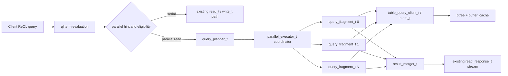
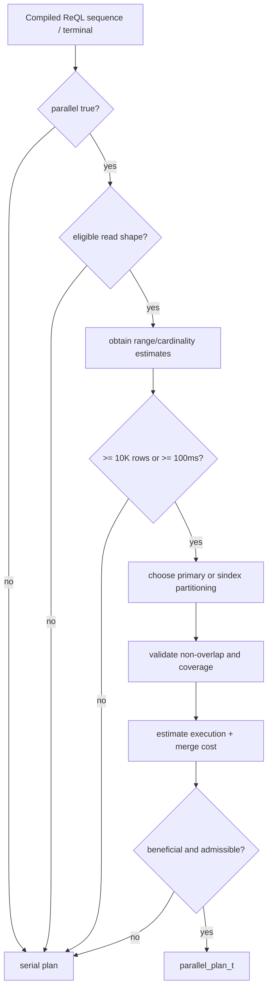
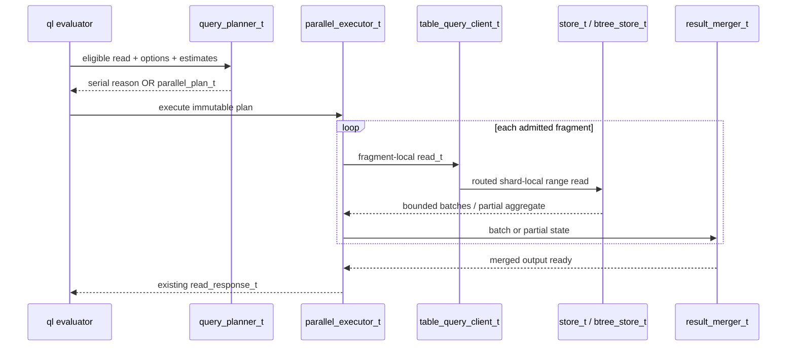
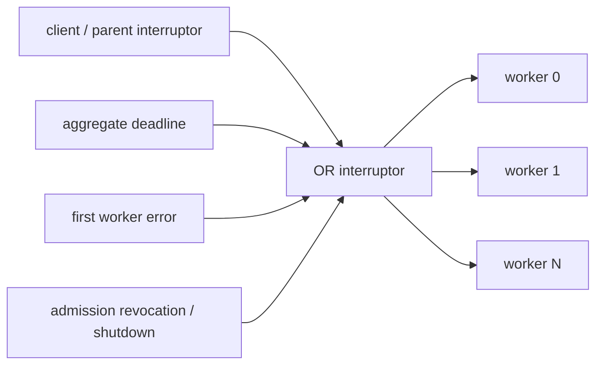

# Parallel Query Execution Design — RethinkDB v3.0

**Status:** Proposed design (Phase 3)  
**Scope:** parallelize eligible execution *within one shard* and across the
server's local worker threads without changing RethinkDB's existing cross-node
sharding/routing model.  
**Primary consumers:** ReQL query planner, local shard executor, B-tree range
reader, query profiling, and admission control.

## 1. Overview — parallel work in a cooperative RethinkDB runtime

### 1.1 Problem statement

RethinkDB currently processes an individual query as one serial execution path:
a ReQL term tree produces `read_t` or `write_t` work, routing sends it through
`table_query_client_t`, and a local `store_t` performs the relevant B-tree
operation. This is simple and preserves existing ordering, cancellation, and
error behavior, but it leaves independent scan, filter, and aggregation work
unexploited for large analytical reads.

Phase 3 introduces an explicit parallel-query execution layer. It decomposes an
eligible local-shard query into independent fragments, schedules those fragments
on RethinkDB's cooperative runtime, and merges their results into the same
logical ReQL result that serial execution would have returned. It is a query
execution feature, not a new distributed-query system.

### 1.2 Scope and terminology

This design uses the following terms consistently:

| Term | Meaning |
| --- | --- |
| **Query coordinator** | The coroutine that owns the client-visible query, chooses a plan, admits workers, and owns final cancellation/error state. |
| **Fragment** | A self-contained range or sub-plan assigned to one worker. A fragment has a non-overlapping input domain and a stable ordinal. |
| **Worker** | A cooperative coroutine executing one fragment. A worker may run on the coordinator's home thread or on an admitted thread-pool worker, but it is never an unmanaged OS thread. |
| **Intra-shard parallelism** | Splitting one shard-local read into multiple independent coroutines. This is useful even when all coroutines share a CPU core because I/O, page-cache waits, and batched streaming can interleave. |
| **Multi-core parallelism** | Scheduling independent fragment workers onto more than one existing runtime thread-pool worker, subject to thread affinity and storage safety constraints. |
| **Ordered plan** | A plan whose externally observable result order is prescribed by ReQL, such as `orderBy`, an explicitly ordered range scan, or an order-sensitive terminal. |
| **Unordered plan** | A plan whose existing ReQL contract permits arbitrary result order, such as the normal result of a table `filter`. |
| **Admission budget** | Per-query and per-principal limits for worker count, buffered rows, buffered bytes, CPU time, and wall-clock duration. |

### 1.3 What this feature is

The executor has two complementary execution modes:

1. **Intra-shard coroutine parallelism.** One shard-local B-tree range is split
   into disjoint key ranges. Each range is executed by a separate coroutine. On
   a single runtime thread, workers cooperatively yield while awaiting page
   cache, RPC, output-buffer, or batch-consumer progress. This reduces latency
   hidden behind blocking points and allows concurrent fragment pipelines.

2. **Local multi-core parallelism.** When the planner, admission controller, and
   storage layer deem it safe, independent fragments are dispatched to existing
   `thread_pool_t` workers. Work is moved using normal runtime mailbox/coroutine
   mechanisms; no feature code creates `std::thread`, shares an unsynchronized
   B-tree cursor, or preempts a coroutine.

The coordinator may combine both: one worker coroutine per admitted fragment,
with workers located on eligible runtime threads and using bounded local buffers.

### 1.4 What this feature is not

This phase deliberately does **not**:

- alter existing table sharding, replica selection, contract coordination, or
  cross-node RPC routing;
- convert the runtime to preemptive scheduling or permit blocking synchronization
  primitives in query execution;
- parallelize writes, transactions, schema changes, index builds, or table
  configuration operations;
- promise speedup for every query, small tables, highly selective point reads,
  changefeeds, or order-sensitive streams;
- change default ReQL ordering, determinism, error, authorization, or cursor
  semantics;
- expose a new ReQL term or require clients/drivers to be upgraded for ordinary
  serial queries.

### 1.5 Architectural placement



The serial path remains the compatibility baseline. A parallel plan is an
implementation detail beneath the existing ReQL terms and must be able to fall
back to that baseline before the first client-visible row is emitted.

### 1.6 Core invariants

1. Every parallel fragment has a disjoint input domain, or a documented
   deduplication key that makes overlap harmless. Phase 3 range plans use
   disjoint domains only.
2. For a deterministic, snapshot-consistent eligible read, parallel output is
   value-equivalent to the serial plan evaluated at the same snapshot.
3. A plan requiring order produces the serial plan's required order; unordered
   plans never advertise a stronger ordering guarantee merely because fragments
   happened to finish in one order.
4. A failure, cancellation, deadline expiry, or authorization revocation stops
   all live sibling workers before the coordinator completes the query.
5. Worker buffering is bounded by an aggregate query budget; slow consumers must
   induce backpressure rather than unbounded accumulation.
6. The executor never bypasses `store_t`, transaction/snapshot ownership,
   routing, permissions, profiling, or existing query-error conversion paths.
7. If planning, admission, worker creation, or merger setup cannot safely
   proceed before output starts, execution falls back to the existing serial
   path without observable semantic difference.

## 2. API Design / ReQL Surface

### 2.1 Opt-in policy

Parallel execution is initially opt-in. The default value of `parallel` is
`false`, even when the planner sees a large table. This preserves current
execution timing and ordering expectations while the implementation matures.

`parallel: true` expresses permission for the server to use a parallel plan; it
is not a demand to create a particular number of workers. The planner may still
choose serial execution because the query is ineligible, the table is too small,
no range split is viable, quota/admission is exhausted, or estimated overhead
outweighs benefit.

The server must expose profile metadata explaining whether a requested parallel
plan ran in parallel, ran serially by cost decision, or fell back because a
resource limit was reached.

### 2.2 ReQL hint syntax

The hint is an existing optional argument carried at a sequence-producing plan
boundary. Drivers represent it with their normal optarg API:

```javascript
// Permit the planner to parallelize this filter scan.
r.table("data")
 .filter(r.row("state").eq("active"))
 .optArg("parallel", true)

// Permit at most four fragment workers for this query.
r.table("events")
 .between(start, end, {index: "timestamp"})
 .filter(predicate)
 .optArg("parallel", true)
 .optArg("max_workers", 4)

// Parallel local scan with a parallelizable aggregation terminal.
r.table("metrics")
 .filter(r.row("host").eq("db-17"))
 .optArg("parallel", true)
 .optArg("max_workers", 8)
 .count()
```

The exact parsing seam is the ReQL term/sequence option plumbing that currently
propagates query options into `rget_read_t`/read generation. The implementation
must keep the option internal to server execution and must not add a wire-level
result shape that older clients need to understand.

### 2.3 Option contract

| Option | Type | Default | Required behavior |
| --- | --- | --- | --- |
| `parallel` | ReQL boolean | `false` | Grants the planner permission to consider a parallel local-read plan. `false` forces serial execution. |
| `max_workers` | finite integral ReQL number | server/query-class default | Upper bound on admitted fragment workers, inclusive of workers on other local runtime threads but excluding the coordinator. |
| `parallel_timeout_ms` | finite integral ReQL number | inherited query deadline | Optional tighter aggregate deadline for the parallel section. It may shorten but never extend the normal query deadline. |
| `parallel_buffer_bytes` | finite integral ReQL number | server policy default | Requested aggregate merger-buffer cap, clamped to the caller's quota and server hard maximum. |

Only `parallel` and `max_workers` are required public options for the initial
feature. The timeout and buffer options are design-reserved: they may be
implemented after server-side policy exists, but if accepted they must follow
this contract. Unsupported options must be rejected explicitly rather than
silently ignored.

Validation requirements:

- `parallel` accepts only a ReQL boolean.
- `max_workers` accepts an integer in `[1, server_parallel_workers_hard_max]`.
  `0`, negative values, fractions, NaN, infinity, arrays, objects, and strings
  return a ReQL logic error.
- `max_workers: 1` is valid but normally plans serially; profile output records
  the requested limit and the selected worker count.
- A hint on an ineligible operation is not itself an error. The operation runs
  serially and exposes `ineligible_operation` in profiling. This prevents an
  availability feature from becoming a compatibility hazard.
- A hint on a write, transaction, or admin operation is rejected only if such
  terms would otherwise consume the option. The parser must not accidentally
  reinterpret unknown optargs as storage options.

### 2.4 Auto-parallelism roadmap

The initial release is opt-in. Once production profiling establishes stable
cost estimates, a server setting may enable auto-parallelism for eligible reads.
Auto-parallelism uses the same planner and resource ceilings as an explicit
hint, but only activates when all of the following are true:

- estimated scanned rows exceed 10,000, **or** estimated serial execution time
  exceeds 100 ms;
- at least two independent fragments can be formed without scanning the same
  primary-key range twice;
- estimated per-fragment useful work dominates decomposition plus merge cost;
- the query does not need unsupported ordering, changefeed, or terminal
  semantics;
- admission can reserve at least two workers and minimum buffer budget.

The 10,000-row and 100-ms values are initial guardrails, not constants embedded
throughout the code. They belong in planner configuration and are surfaced in
profiling for calibration.

### 2.5 User-visible semantics

For `filter`, `map`, and an ordinary `between`, ReQL's existing unordered
sequence semantics remain unchanged. Parallel plans may return batches in
fragment-completion order, but applications must receive no less deterministic
behavior than they receive today.

For `orderBy`, ordered range streams, `slice` over an ordered result, and
order-sensitive terminals, the executor either uses an order-preserving merge
or chooses serial execution. It must never silently emit fragment order.

The hint does not weaken atomicity/snapshot behavior. A parallel scan captures
one logical read snapshot through existing read machinery. A plan that cannot
hold or re-establish one compatible snapshot across all fragments is ineligible
and must run serially.

### 2.6 Observability and profile shape

When query profiling is enabled, the result profile includes a `parallel` object
without changing the ordinary data result:

```javascript
{
  parallel: {
    requested: true,
    selected: true,
    fallback_reason: null,
    requested_max_workers: 4,
    admitted_workers: 4,
    completed_workers: 4,
    fragments_total: 4,
    fragments_completed: 4,
    rows_estimated: 250000,
    rows_scanned: 251048,
    rows_emitted: 7421,
    merger_peak_bytes: 2097152,
    ordered_merge: false,
    planning_us: 83,
    execution_us: 122441
  }
}
```

If serial execution is selected, `selected` is `false` and `fallback_reason` is
one of `not_requested`, `below_threshold`, `ineligible_operation`,
`insufficient_ranges`, `quota_limited`, `coro_pool_exhausted`,
`thread_affinity`, or `cost_not_beneficial`. These strings are diagnostics, not
a compatibility promise for programmatic control flow.

## 3. Data Structures

### 3.1 Design constraints

The new types must be small, RAII-owned, non-copyable where they own runtime
resources, and created/destroyed on the correct runtime thread. They must pass
serializable request information across runtime boundaries rather than sharing a
live B-tree cursor, a `signal_t`, a transaction object, or mutable `ql::env_t`
state between worker threads.

The snippets below define the intended interfaces, not an assertion that all
referenced existing types have these exact constructors. Implementation must
adapt them to the checked-in `read_t`, `read_response_t`, `store_t`, coroutine,
and archive APIs while preserving the named responsibilities.

### 3.2 Fragment descriptor

```cpp
// src/rdb_protocol/parallel_executor.hpp
class query_fragment_t {
public:
    enum class kind_t {
        PRIMARY_KEY_RANGE,
        SECONDARY_INDEX_RANGE,
        FILTERED_PRIMARY_RANGE,
        PARTIAL_AGGREGATION
    };

    query_fragment_t(
        size_t ordinal,
        kind_t kind,
        key_range_t input_range,
        int64_t estimated_rows,
        int64_t estimated_bytes);

    size_t ordinal() const;
    kind_t kind() const;
    const key_range_t &input_range() const;
    int64_t estimated_rows() const;
    int64_t estimated_bytes() const;

private:
    size_t ordinal_;
    kind_t kind_;
    key_range_t input_range_;
    int64_t estimated_rows_;
    int64_t estimated_bytes_;
};
```

A fragment identifies an input domain, never a pre-opened cursor. Fragment
boundaries are half-open wherever the B-tree range representation permits it:
`[start, end)`. Adjacent fragments therefore meet at one boundary without
omission or duplication. A fragment may represent an unbounded first/last
range using the normal `key_range_t` universe endpoints.

A secondary-index fragment additionally includes the encoded sindex range and
stable primary-key tie-breaker boundaries required by the existing index scan.
It must not split a set of equal sindex keys in a way that duplicates or omits
rows. Where an equal-key run cannot be bounded cheaply, the planner chooses
primary-key partitioning or declines the parallel plan.

### 3.3 Parallel plan and planning result

```cpp
class parallel_plan_t {
public:
    enum class ordering_t { UNORDERED, PRIMARY_KEY_ASCENDING, EXPLICIT_ORDER };
    enum class terminal_t { STREAM, COUNT, SUM, AVG, MIN, MAX, REDUCE };

    parallel_plan_t(
        std::vector<query_fragment_t> fragments,
        ordering_t ordering,
        terminal_t terminal,
        int64_t estimated_serial_us,
        int64_t estimated_parallel_us);

    const std::vector<query_fragment_t> &fragments() const;
    ordering_t ordering() const;
    terminal_t terminal() const;
    bool preserves_serial_semantics() const;

private:
    std::vector<query_fragment_t> fragments_;
    ordering_t ordering_;
    terminal_t terminal_;
    int64_t estimated_serial_us_;
    int64_t estimated_parallel_us_;
};

struct parallel_planning_result_t {
    scoped_ptr_t<parallel_plan_t> plan;
    std::string serial_reason;
};
```

The planner returns either a complete executable plan or a reason for serial
selection. It must not return a partial plan and leave the executor to invent
missing coverage.

### 3.4 Executor and cancellation ownership

```cpp
class parallel_executor_t : public home_thread_mixin_t {
public:
    parallel_executor_t(
        store_t *store,
        const read_t &base_read,
        const parallel_plan_t &plan,
        const parallel_execution_limits_t &limits,
        signal_t *parent_interruptor);
    ~parallel_executor_t();

    DISABLE_COPYING(parallel_executor_t);

    void run(read_response_t *response_out);
    void request_cancel(const interruption_t &reason);

private:
    void launch_worker(const query_fragment_t &fragment);
    void run_fragment(const query_fragment_t &fragment);
    void handle_worker_result(fragment_result_t result);
    void fail_all(const query_exc_t &error);
    void await_workers();

    store_t *store_;
    const read_t &base_read_;
    const parallel_plan_t &plan_;
    parallel_execution_limits_t limits_;
    signal_t *parent_interruptor_;
    cond_t canceled_;
    result_merger_t merger_;
};
```

`parallel_executor_t` is the sole owner of worker lifecycle. It installs one
combined interruptor per worker: parent interruption OR aggregate timeout OR
executor cancellation. It accepts exactly one terminal state: successful merge,
first query error, cancellation, or deadline expiry. The winning state is
latched on the coordinator home thread before sibling cancellation begins.

`base_read_` is treated as immutable template data. Each worker creates an
isolated read/scan request containing its `query_fragment_t`; it does not mutate
or reuse a concurrent `read_t` object.

### 3.5 Worker result and bounded channels

```cpp
struct fragment_batch_t {
    size_t fragment_ordinal;
    uint64_t sequence_number;
    std::vector<ql::datum_t> rows;
    int64_t encoded_bytes;
    bool end_of_fragment;
};

struct partial_aggregate_t {
    size_t fragment_ordinal;
    ql::datum_t state;
    int64_t input_rows;
};

class fragment_result_t {
public:
    enum class state_t { BATCH, PARTIAL, COMPLETE, ERROR, CANCELED };
    // Tagged payload implementation follows local project conventions.
};
```

Workers send batches or partial aggregate states through an executor-owned,
bounded channel. The channel accounts for serialized/result memory before
accepting a batch. When the aggregate limit is reached, a worker waits on a
space-available condition while its cancellation/deadline interruptor remains
active. Workers must never spin or retain an unbounded private vector while
waiting for the merger.

### 3.6 Result merger

```cpp
class result_merger_t : public home_thread_mixin_t {
public:
    result_merger_t(
        parallel_plan_t::ordering_t ordering,
        int64_t memory_limit_bytes,
        signal_t *interruptor);

    void push_batch(fragment_batch_t batch);
    void push_partial(partial_aggregate_t partial);
    void mark_fragment_complete(size_t ordinal);
    void fail(const query_exc_t &error);
    void drain_into(read_response_t *out);

private:
    void drain_unordered(read_response_t *out);
    void drain_ordered(read_response_t *out);
    void merge_partials(read_response_t *out);
};
```

For unordered streams, the merger forwards any available fragment batch subject
to backpressure. For ordered streams, it preserves fragment ordinal and within-
fragment key order. An `EXPLICIT_ORDER` plan is only admitted where the planner
can prove that ordinal order corresponds to the requested ordering; otherwise
it requires an external merge strategy with a hard memory/spill design and is
out of scope for Phase 3.

For terminal aggregates, the merger accepts only algebraically valid partial
states. `count`, `sum`, `min`, `max`, and `avg` have defined partial forms.
General `reduce` is parallelizable only when the term advertises an associative,
identity-bearing reducer under ReQL's semantics; absent that proof it is serial.

### 3.7 Limits and admission token

```cpp
struct parallel_execution_limits_t {
    size_t max_workers;
    int64_t aggregate_buffer_bytes;
    int64_t per_worker_buffer_bytes;
    int64_t aggregate_timeout_ms;
    int64_t per_worker_timeout_ms;
};

class parallel_admission_token_t {
public:
    parallel_admission_token_t(size_t workers, int64_t bytes);
    ~parallel_admission_token_t();
    DISABLE_COPYING(parallel_admission_token_t);
};
```

Admission is all-or-serial before output. The executor reserves a token for the
selected worker count and aggregate memory budget. It does not launch two
workers, emit data, then wait indefinitely for two more permits. If the desired
reservation cannot be made, the planner lowers worker count only if the revised
plan remains beneficial; otherwise the query stays serial.

### 3.8 Integration with existing request types

The feature must preserve the current `read_t` / `read_response_t` contract:

- `read_t` remains the routed representation of a read. A parallel read adds a
  fragment envelope or a parallel-specific read variant containing one normal
  shard-local subrange, not a mutable vector of active workers.
- `read_response_t` remains client-visible result/batch machinery. The merger
  fills it through existing response construction rather than introducing a
  parallel-only client protocol.
- `store_t` remains the local storage interface. It receives one fragment scan
  at a time, with normal snapshot, batch, transform, and interruptor context.
- `btree_store_t` owns B-tree traversal and page-cache interaction. Parallel
  orchestration must not reach into B-tree internals from `ql` code.

## 4. Query Planner / Optimizer

### 4.1 Planner responsibility

`query_planner_t` decides whether a hint can become a parallel plan and, if so,
produces a complete set of fragments before any worker starts. It operates after
term compilation has resolved table/index references and before local scan
execution begins. It does not replace the current distributed table routing;
routing still invokes the relevant local plans per shard.



### 4.2 Eligibility matrix

| Operation shape | Initial status | Parallel planning rule |
| --- | --- | --- |
| Primary-key `between` / table range scan | Eligible | Split on sampled B-tree key boundaries. |
| Secondary-index `between` | Eligible with restrictions | Split index-key ranges only when equal-key boundary correctness is established; otherwise split candidate primary ranges after index selection. |
| `filter` over a range/table scan | Eligible | Push deterministic predicate evaluation into each worker; merge unordered results. |
| Deterministic `map` over eligible source | Eligible | Push map evaluation to workers when it has no order/global-state dependency. |
| `count`, `sum`, `avg`, `min`, `max` | Eligible | Use partial aggregation and final merge. |
| General `reduce`, `fold`, `group` | Serial initially | Future work requires explicit algebraic semantics, stable grouping ownership, and memory/spill design. |
| `orderBy` | Conditional | Preserve order by fragment ordering only for compatible primary-key order; otherwise serial in Phase 3. |
| `distinct`, `union`, `zip`, joins | Serial initially | Global dedupe/join ownership is outside Phase 3. |
| `get`, point sindex lookup, tiny `limit` | Serial | Fragment overhead dominates. |
| Writes/transactions | Ineligible | Must use current serialization/atomicity path. |
| Changefeed | Serial initial scan and feed | See Section 4.7. |

### 4.3 Range-based decomposition

For a primary B-tree range, the planner samples or obtains approximate key
quantiles through a bounded metadata/range-estimate operation. It divides the
requested `key_range_t` into `W` sorted, non-overlapping subranges, where `W` is
at most the admitted worker target and never exceeds useful estimated work.

For boundaries `b0 < b1 < ... < bW`, fragments are:

```text
F0 = [b0, b1)
F1 = [b1, b2)
...
F(W-1) = [b(W-1), bW)
```

The first/last bounds preserve the caller's original open/closed/unbounded
semantics. A pure boundary helper must prove:

- each emitted fragment is non-empty or discarded before execution;
- fragments are strictly ordered;
- no fragment intersects another;
- their union equals the original eligible key range;
- all keys equal to a split boundary belong to exactly one fragment.

The planner must not estimate boundaries by converting arbitrary ReQL data to
lossy numeric intervals. It uses the storage layer's canonical `store_key_t` and
`key_range_t` comparison/encoding behavior.

### 4.4 Secondary-index decomposition

For a secondary-index `between`, splitting by index-key range is useful only
when range endpoints can be selected safely. Secondary keys can have duplicate
values and may include primary-key suffix/tie-breaker components. The fragment
boundary must therefore be a complete scan key `(secondary_key, primary_key)` or
another existing cursor boundary format that covers an equal-key run exactly
once.

If index statistics do not provide stable complete boundaries, use one of these
safe alternatives:

1. execute the secondary-index selection serially into bounded primary-key range
   descriptors, then parallelize non-overlapping primary B-tree fetch/filter
   work only if the descriptor set is small and bounded; or
2. decline the parallel plan and run the current serial sindex scan.

The planner must never split solely at the visible ReQL secondary value and
assume equal values do not cross the split.

### 4.5 Filter and transform decomposition

A deterministic, row-local filter/map is copied into every fragment plan and
runs before result batches reach the merger. Pushing the transform down reduces
cross-coroutine buffering and allows the cost model to account for selectivity.

A transform is ineligible when it depends on:

- sequence position, a global accumulator, or prior input rows;
- a nondeterministic value not already stabilized by normal query evaluation;
- a mutable environment that cannot be safely snapshotted per worker;
- exception timing that would make parallel execution observe different visible
  error precedence than serial evaluation.

When in doubt, planner conservatism is required: choose serial execution.

### 4.6 Cost model

The initial cost model is deliberately transparent and calibrated by profiles:

```text
serial_us = scan_rows * scan_cost_us
          + filter_rows * filter_cost_us
          + expected_output_bytes * encode_cost_us_per_byte

parallel_us = planning_us
            + max(fragment_scan_us + fragment_filter_us)
            + merge_us
            + startup_us * workers
            + cross_thread_handoff_us
```

The planner selects parallel execution only when:

```text
estimated_serial_us >= 100000 OR estimated_scan_rows >= 10000
AND workers >= 2
AND estimated_parallel_us < estimated_serial_us * benefit_margin
AND aggregate_buffer_budget is reservable
```

`benefit_margin` starts at `0.85`, requiring a predicted 15% gain to offset
estimation error. All inputs are server configuration or profile-derived
statistics, not magic literals scattered through terms.

Useful estimates include requested key-range fraction, table cardinality,
per-range page/row estimates, available secondary index selectivity, observed
filter selectivity, row width, active worker saturation, and known ordered-merge
cost. Missing statistics bias toward serial execution.

### 4.7 Changefeed interaction

Changefeeds are excluded from initial parallel execution. A changefeed combines
an optional initial query result with a long-lived ordered stream of updates,
state tracking, and client backpressure. Parallelizing only its initial scan
would complicate the handoff boundary and could reorder initial values versus
changes.

Required Phase 3 behavior:

- `parallel: true` on a changefeed records `ineligible_operation` in profiling
  and uses the current serial feed path;
- no feed worker is spawned and no changefeed state is partitioned;
- existing changefeed ordering, squashing, include-initial, include-states, and
  cancellation semantics are regression requirements.

A later phase may define parallel initial scans only with an explicit barrier:
all fragments must complete at one snapshot, the feed registration must capture
post-snapshot updates, and merger ordering must complete before any update is
visible. That work is not implicit in this design.

### 4.8 Aggregation decomposition

The planner supports the following partial/final forms:

| Terminal | Worker partial state | Final merge |
| --- | --- | --- |
| `count` | unsigned row count | integer addition |
| `sum` | datum sum plus numeric-kind validation | ReQL-consistent addition in stable validation order |
| `avg` | `(sum, count)` | sum partial sums, sum counts, divide once |
| `min` / `max` | candidate datum or empty marker | ReQL datum comparison |
| `reduce` | not selected by default | serial |

Partial states are materially smaller than full rows and therefore receive a
separate small buffer allowance. Error behavior deserves special care: a worker
that discovers an invalid numeric value reports it to the coordinator, which
cancels siblings and uses normal query-error formatting. The implementation must
not hide an invalid value merely because another fragment completed first.

## 5. Integration Points

### 5.1 New source files

| Path | Responsibility |
| --- | --- |
| `src/rdb_protocol/parallel_executor.hpp` | Fragment, plan, limits, executor, merger interfaces and pure boundary/aggregate declarations. |
| `src/rdb_protocol/parallel_executor.cc` | Coordinator lifecycle, coroutine launch/collection, cancellation fan-out, bounded channels, ordered/unordered merge, aggregate finalization, profile counters. |
| `src/rdb_protocol/query_planner.hpp` | Parallel planning input/output types, eligibility and cost-model interfaces. |
| `src/rdb_protocol/query_planner.cc` | Range boundary selection, secondary-index split validation, cost decision, auto/explicit hint handling, serial fallback reasons. |
| `src/btree/parallel_scan.hpp` | Storage-facing fragment scan request, key-range invariants, sampling/estimate interfaces. |
| `src/btree/parallel_scan.cc` | Isolated B-tree range scans, safe key quantile/range estimation, fragment-local cursor setup, per-batch interruption checks. |
| `src/unittest/parallel_executor_test.cc` | Pure planner, fragment coverage, merger, cancellation, timeout, and aggregate tests. |

All new `.cc` files must be added to the project's existing source/build list
using the conventions of neighboring `rdb_protocol` and `btree` units. No
external parallelism library is introduced.

### 5.2 Existing modification points

| Existing area | Required change | Boundary that must remain intact |
| --- | --- | --- |
| `src/rdb_protocol/store_t` declarations and `store_t::read()` implementation | Recognize a validated fragment-local read request and delegate to the local parallel-scan interface. | `store_t` continues to own storage dispatch, snapshot/error behavior, and normal serial reads. |
| `src/rdb_protocol/btree_store_t` | Create fragment-local B-tree scan state and expose bounded estimates/sampling to planner. | No shared cursor or page-lock ownership crosses workers. |
| `src/rdb_protocol/val.cc` | Preserve/propagate parallel optargs through sequence construction and invoke planner at the correct lazy/eager execution seam. | ReQL term behavior and serial option handling remain unchanged. |
| `src/rdb_protocol` read-generation / datum-stream path | Attach an immutable parallel planning request to eligible scan sources and keep transform semantics intact. | Existing serial `rget` batching stays the fallback implementation. |
| `src/rdb_protocol` profile construction | Add optional parallel profile object and counters. | Result datum/wire format without profile is unchanged. |
| `arch/runtime/` coroutine-pool/thread-pool call sites | Use established coroutine/mailbox primitives to dispatch, interrupt, and join workers. | Do not change scheduler policy globally or introduce preemption. |
| authorization/query context | Obtain principal quota and cancellation signal before admission. | Existing auth decisions remain authoritative. |

The precise filenames and symbols for the read-generation, profile, and runtime
seams must be confirmed during implementation against the checkout; this spec
does not authorize speculative broad refactors. The listed `store_t::read()`,
`btree_store_t`, and `val.cc` sites are required architectural integration
points, not permission to bypass intervening layers.

### 5.3 Request flow



### 5.4 Layering rules

- `ql`/planner code may describe fragments but may not manipulate B-tree pages,
  page locks, or buffer-cache state.
- `btree` code may scan a supplied fragment range but may not decide client
  quotas, public ReQL optarg semantics, or global merge ordering.
- runtime code schedules coroutines; it may not know ReQL value semantics.
- only the coordinator owns client response emission and terminal error choice.
- all cross-thread result delivery uses the project runtime's established
  mailbox/coroutine transfer discipline, never an ad hoc mutex-protected queue
  containing live thread-affine state.

## 6. Execution Model

### 6.1 Coroutine and thread-pool mapping

RethinkDB uses cooperative coroutines rather than preemptive query threads.
`parallel_executor_t` therefore creates runtime tasks in a `coro_pool_t`-style
facility and associates each task with a runtime thread chosen through existing
`thread_pool_t` facilities. A worker must yield at normal storage/RPC/output
wait points; long CPU-only loops must include bounded batch processing and
interruption checks so one fragment cannot starve the local event loop.

The requested `max_workers` is a ceiling. Actual worker count is:

```text
min(requested_max_workers,
    planner_useful_fragments,
    principal_parallel_worker_quota,
    global_available_worker_permits,
    eligible_local_runtime_threads)
```

The coordinator itself stays on its originating/home thread. A fragment that
requires a thread-affine `store_t`, transaction, or buffer-cache access runs on
that object's home thread. Multi-core parallelism is allowed only through a
storage/RPC boundary that already supports such placement; otherwise fragments
may still interleave on one thread and profile as `cross_thread_workers: 0`.

### 6.2 Worker lifecycle

1. The coordinator receives a complete plan and reserves admission resources.
2. It derives one child interruptor/deadline for each fragment.
3. It launches workers in a bounded pool, initially up to admitted worker count.
4. A worker creates its own fragment-local read request and scan/cursor state.
5. The worker evaluates pushed-down transforms in bounded batches.
6. It sends a batch, partial aggregation state, completion, or error to the
   coordinator-owned merger channel.
7. On completion, the executor may launch the next pending fragment if the plan
   has more fragments than permits.
8. The merger drains client-ready output subject to ordered/unordered rules.
9. The coordinator joins every launched worker, releases admission, and returns
   one normal response or error.

No worker may outlive the coordinator response. Destructor/assertion paths must
join or cancel outstanding children before releasing context that they reference.

### 6.3 Result ordering

| Query class | Required merger behavior |
| --- | --- |
| Unordered `filter` / unordered range scan | Forward any completed batch. Batch interleaving is legal if current serial API has no order guarantee. |
| Primary-key ordered range | Drain fragment ordinal 0 fully before ordinal 1, etc.; each fragment itself scans ascending key order. |
| Descending order | Only eligible if fragments and local scans can be built in descending non-overlapping key order with equivalent guarantees; otherwise serial. |
| `orderBy` on arbitrary expression or sindex | Serial in Phase 3 unless a later external-sort merger is implemented. |
| `count`, `sum`, `avg`, `min`, `max` | Do not emit intermediate partials; finalize exactly one terminal value after all successful workers complete. |

Ordered merge applies backpressure to later fragments while an earlier fragment
has not produced its next batch. The planner accounts for this reduced
concurrency and avoids ordered plans whose expected head-of-line blocking makes
them slower than serial.

### 6.4 Cancellation

Cancellation sources are combined, not polled independently:



When a worker produces the first non-cancellation query error, the coordinator
atomically latches it, signals the shared cancellation source, stops launching
pending fragments, drains/discards queued data according to response state, and
joins siblings. If no client-visible row has been emitted, the normal query
error is returned. If the existing streaming response protocol cannot safely
surface a later error after batches are emitted, Phase 3 must retain the current
protocol's behavior and document it; it must not silently claim full success.

### 6.5 Timeout policy

The original query deadline remains authoritative. `parallel_timeout_ms`, when
implemented, creates a stricter aggregate child deadline. Each worker receives
that aggregate deadline and may receive a smaller per-worker watchdog deadline
only when it does not cause a healthy but uneven fragment to fail a query that
would have met the aggregate deadline.

On expiry:

- stop new launches;
- interrupt every active worker and merger wait;
- discard incomplete fragment output;
- join workers before releasing stores/cursors;
- return the normal query-timeout error.

Phase 3 returns no successful partial query result on timeout. Returning partial
rows would require an explicit, separately designed ReQL/API contract and is
not compatible with ordinary sequence/terminal correctness.

### 6.6 Memory and backpressure

Each plan reserves an aggregate result-buffer budget. The executor partitions it
into a coordinator reserve plus per-worker credits:

```text
aggregate_buffer >= coordinator_reserve + workers * per_worker_credit
```

A worker owns no more than its credit plus one bounded in-progress batch. Before
placing a batch in the merger queue, it charges serialized datum bytes against
aggregate accounting. A full queue causes the worker to wait on a space signal
with cancellation enabled. The coordinator refunds credit when it forwards or
discards a batch.

A worker must produce batches no larger than the lesser of the current existing
read batch limit and `per_worker_buffer_bytes`. It must not read 1M rows into a
private vector merely because it was assigned a 1M-row fragment.

### 6.7 Snapshot and consistency

All fragments of one parallel query must use the same consistency mode and
logical snapshot semantics as the original serial `read_t`. The implementation
must first establish that existing read/routing APIs can create compatible
fragment-local read transactions. If snapshot identity cannot safely span local
worker placement, multi-core execution is disabled for that request and the
planner may use same-thread coroutines or serial execution.

It is invalid to execute fragments at independently chosen snapshots and merge
them as though they represented one table state.

## 7. Error Paths

### 7.1 Error policy table

| Condition | Coordinator action | Client result | Cleanup invariant |
| --- | --- | --- | --- |
| Worker query error | Latch first deterministic error, cancel siblings, stop launching. | Existing ReQL query error. | All launched workers joined; buffered batches released. |
| Worker runtime exception/invariant failure | Convert through existing runtime/query error boundary, cancel siblings. | Server's normal query/internal failure response; never partial success. | No worker retains executor/store references. |
| Aggregate timeout | Cancel all workers and merger waits. | Normal timeout error. | Timers/child interruptors removed after join. |
| Client cancellation/disconnect | Propagate parent interruption immediately. | Existing cancellation/disconnect behavior. | Admission permits released even if response cannot be written. |
| Per-worker timeout | Treat as aggregate query failure unless fragment may be safely retried before any output. | Timeout error, not partial result. | Failed worker's cursor and queued data released. |
| Merger memory pressure | Stop accepting batches; backpressure workers. | No error if consumers drain; otherwise timeout/cancellation policy applies. | Accounted bytes never exceed hard aggregate cap. |
| Hard allocation failure | Cancel workers; release safely allocated queues. | Existing resource-exhausted/internal error path. | Do not attempt an unbounded fallback merge. |
| Coroutine pool exhausted before output | Select serial fallback. | Normal serial result. | No partial parallel state escapes. |
| Coroutine pool exhausted after plan started | Continue with already launched workers only if plan semantics remain valid and admission says safe; otherwise cancel and return resource error. | Must not silently duplicate work. | Pending fragments are either exactly launched once or not launched. |
| Storage routing failure | Treat as worker failure and cancel siblings. | Existing routing/shard query error. | Fragment-local request state discarded. |
| Shutdown/authority revocation | Cancel immediately. | Existing interrupted query behavior. | No result emission after shutdown wins. |

### 7.2 Worker failure

A fragment error is not an isolated warning: row-level evaluation errors,
storage errors, routing errors, and runtime interruption have query-wide
semantics. The first error chosen by the coordinator wins according to the
existing serial error precedence where that is defined. Concurrent error races
must be made deterministic enough for tests: latch the first error observed by
the coordinator event loop, retain its fragment ordinal/profile context, then
cancel siblings.

A worker that notices cancellation stops emitting new rows, releases its local
batch, and reports `CANCELED`; it does not overwrite the winning error.

### 7.3 Timeout during parallel execution

The executor treats timeout as cancellation plus a timeout cause. It does not
return a prefix of a stream as a complete sequence, a partial aggregate, or a
best-effort merge. This also prevents order-sensitive results from being
mistaken for complete answers.

A retry of an individual timed-out fragment is out of scope in Phase 3 because
retry requires a stable snapshot, idempotent output accounting, and a deadline
budget. Retries can be considered later only as a planner-level feature with
those properties explicitly designed.

### 7.4 Out-of-memory and merge pressure

Normal pressure uses backpressure, not failure. If accounting predicts that the
next minimal batch cannot fit under the hard budget, the worker must reduce its
batch or wait. If an allocation nevertheless fails, the merger records a
resource error, cancels workers, and frees all batches it owns.

An ordered merge may accumulate later-fragment data behind an early fragment.
The executor prevents unbounded head-of-line buildup by allocating later workers
smaller credits and pausing them when ordered queues are full. It does not spill
rows to an unreviewed temporary file in Phase 3.

### 7.5 Coroutine-pool exhaustion

Before execution starts, lack of `coro_pool_t` permits is a normal planner
fallback reason. The coordinator chooses serial execution with the original
read request. This is preferable to queueing an unbounded number of queries or
failing an otherwise valid read.

The executor must reserve worker capacity before it starts client-visible
parallel work. It may not partially execute a query, discover no capacity for a
required fragment, and restart serially; doing so risks duplicate output and
inconsistent snapshots.

### 7.6 Correctness assertions

Debug builds and focused unit tests must assert:

- every worker completion is received at most once;
- fragment ordinals are unique and in plan range;
- no batch is merged after terminal failure/cancellation wins;
- accounted memory never becomes negative or exceeds hard cap;
- an ordered merger does not advance past a fragment with an unresolved gap;
- executor destruction has no live worker registrations;
- a successful plan reports exactly all planned fragments complete.

## 8. Testing Requirements

### 8.1 Test placement and test philosophy

Add focused tests in `src/unittest/parallel_executor_test.cc`, plus narrowly
placed regression tests alongside existing ReQL read/stream and B-tree tests
when exercising public behavior needs the established harness. Tests must
compare behavior with the existing serial execution path rather than only
checking internal counters.

The feature is correct only if it produces serial-equivalent ReQL results under
identical inputs and consistency conditions, including error/cancellation
behavior. A speedup benchmark is not a correctness substitute.

### 8.2 Unit tests: decomposition and planning

Test pure planning/boundary helpers without requiring a full server:

1. Given an unbounded, closed, and open primary-key range, when split into 2–16
   fragments, then fragments are sorted, non-overlapping, non-empty, and their
   union equals the original range.
2. Given keys equal to every candidate split point, when ranges are emitted,
   then every key belongs to exactly one fragment.
3. Given insufficient row estimates or only one useful key interval, when
   `parallel: true`, then planner selects serial with the correct reason.
4. Given 10,000+ estimated rows and enough independent ranges, when cost model
   predicts a material benefit, then planner produces no more than the requested
   or admitted worker limit.
5. Given a duplicate-heavy secondary index, when no complete sindex boundary is
   available, then planner declines unsafe index splitting.
6. Given a deterministic filter/map and eligible range, when planned, then every
   fragment contains the same pushed-down transform descriptor.
7. Given a nondeterministic/global/order-dependent transform, when planned, then
   the planner selects serial.
8. Given `count`, `sum`, `avg`, `min`, and `max`, when eligible, then planner
   selects the appropriate partial aggregate form; unsupported `reduce` is
   serial.

### 8.3 Unit tests: merger and aggregate semantics

1. Given unordered batches completing in reverse ordinal order, when drained,
   then all rows appear exactly once and output makes no ordering assertion.
2. Given ordered batches with delayed fragment zero, when later batches arrive,
   then merger waits and emits full ordinal order once the gap closes.
3. Given fragment-local ascending keys, when ordered merge completes, then the
   output is globally ascending and matches serial scan output.
4. Given partial counts/sums/averages/min/max from arbitrary fragment order,
   when finalized, then final values equal serial terminal evaluation.
5. Given a worker error after a queued batch, when the error wins before output
   drain, then queued post-failure data is not emitted.
6. Given memory credits exhausted, when a worker attempts a batch, then it blocks
   or reduces batch size and memory accounting stays within the cap.
7. Given cancellation while a worker waits for merger credit, when interrupted,
   then it exits promptly and releases local state.

### 8.4 End-to-end correctness matrix

Run every relevant query in serial and `parallel: true` modes over the same
seeded table, then compare the appropriate semantic result:

| Query | Required comparison |
| --- | --- |
| Primary `between` | Same row multiset and, where ordered, same ordered sequence. |
| Secondary-index `between` | Same row multiset across duplicate index values and boundary values. |
| `filter` | Same row multiset for selective and nonselective deterministic predicates. |
| `map` | Same mapped row multiset, including nested JSON datums. |
| `filter().count()` | Exact same terminal integer. |
| Numeric `sum()` / `avg()` | Same ReQL numeric result and same invalid-input error behavior. |
| `min()` / `max()` | Same datum under ReQL collation and same empty-sequence behavior. |
| Primary-key `orderBy` compatible plan | Same ordered sequence. |
| Ineligible `orderBy`/changefeed | Same serial result/feed and profile says not selected. |
| Empty table/range | Empty output/terminal behavior identical to serial. |
| One-row table/range | Exactly one result; no spurious worker failure. |
| Duplicate boundaries | No missing or duplicated rows. |

Use randomized/property-style fixtures for primary keys, duplicate secondary
values, range endpoints, fragment counts, and filter selectivities. For every
fixture, assert `parallel_result == serial_result` under the equivalence rule
appropriate to ordering.

### 8.5 Failure, cancellation, and resource tests

- Inject one worker storage/read failure; assert sibling cancellation, one error
  result, no leaked permits, and no leaked batches.
- Inject a row-level transform error in each possible fragment; assert the
  returned error is compatible with the serial error contract and workers join.
- Inject aggregate timeout while workers scan, while a worker waits for buffer
  space, and while ordered merger waits for an earlier fragment.
- Saturate `coro_pool_t` before plan start; assert serial fallback and profile
  reason rather than query failure.
- Exercise shutdown/client cancellation during fragment start, scan, blocked
  output, and final merge.
- Set a tiny aggregate memory budget with large rows and slow response draining;
  assert bounded memory/backpressure rather than unbounded process growth.
- Run many concurrent parallel queries under quotas; assert no principal exceeds
  its permits and serial queries continue to make progress.

### 8.6 Changefeed regression

Existing changefeed tests are a non-negotiable regression suite. Add a focused
case that attaches `parallel: true` to an otherwise supported feed construction
and verifies:

- no worker fragments are selected;
- initial values and subsequent changes retain current behavior/order;
- cancellation/connection close cleans up exactly as in serial mode;
- profile metadata records an ineligible serial choice if profiling is enabled.

### 8.7 Performance benchmarks

Benchmarks must run separately from correctness/unit tests and record hardware,
thread count, table shape, row width, cache state, selected plan, scan rows,
worker count, wall time, CPU time, and peak merger bytes. Required dataset
sizes are 10K, 100K, and 1M rows.

For each size, benchmark:

1. full/table-range scan plus selective and nonselective filters;
2. primary-key and secondary-index `between` with balanced and skewed ranges;
3. `count`, `sum`, and `avg` over an eligible filtered scan;
4. serial, `max_workers` 2, 4, and server-supported higher counts;
5. one-core coroutine-only placement and multi-core placement where supported;
6. cold and warm page-cache variants if the existing benchmark environment
   supports controlling cache state.

The expected target is 2–4x throughput/latency improvement on appropriately
large, balanced analytical queries on a four-core machine, not a universal
assertion for all dataset/query shapes. The benchmark report must include cases
where parallelism loses and explain whether startup, skew, merge, I/O, or
saturation caused it.

### 8.8 Stress and regression gates

Stress tests should run thousands of randomized range/filter queries alongside
concurrent writers only insofar as existing read consistency tests permit. They
must verify that results remain serial-equivalent for a chosen snapshot/consistency
mode and that worker/admission counters return to baseline.

Completion gates:

- all new unit and integration tests pass;
- existing query, B-tree, changefeed, and cancellation regression suites pass;
- debug assertions detect no lifecycle/accounting violation under stress;
- benchmark artifacts cover 10K, 100K, and 1M datasets;
- profile output is exercised for selected, rejected, and fallback plans;
- code review confirms no raw OS-thread creation, unsynchronized shared cursor,
  or unbounded result queue was added.

## 9. Security Considerations

### 9.1 Resource isolation

Parallel query execution turns a single authenticated query into a request for
multiple execution slots and potentially substantial buffered data. Admission
must therefore be tied to the existing authenticated principal/user context,
not merely connection count.

Server policy supplies at least these limits per principal and globally:

| Limit | Purpose |
| --- | --- |
| `max_parallel_queries` | Limits number of simultaneously admitted parallel coordinators. |
| `max_parallel_workers` | Limits total active fragment workers per principal. |
| `max_parallel_buffer_bytes` | Caps all merger/worker result bytes attributed to one principal. |
| `max_parallel_workers_per_query` | Caps amplification of a single query despite a high client hint. |
| `max_parallel_queue_depth` | Prevents an admitted coordinator from holding arbitrary pending fragment metadata. |
| global worker/buffer ceilings | Protects runtime/event-loop and process-wide memory availability. |

`max_workers` is always clamped by these limits. It cannot be used to reserve
all cores merely because the caller supplied a large integer.

### 9.2 Denial-of-service resistance

Potential abuse patterns include issuing many `parallel: true` full-table scans,
requesting huge worker counts, choosing intentionally skewed ranges that pin
workers, consuming ordered-merge buffers behind slow clients, and forcing
planner estimation work on many tiny queries.

Mitigations:

- require opt-in but never treat opt-in as entitlement;
- reserve permits atomically before work begins and release them in all
  completion/cancellation/destructor paths;
- use fair, quota-aware admission so one principal cannot monopolize all runtime
  workers while other users' serial reads starve;
- reject invalid numeric options and clamp valid values to hard maxima;
- impose bounded planning/sampling work; planner statistics collection must not
  scan an entire table merely to decide whether to parallelize it;
- enforce aggregate memory credits and client-output backpressure;
- retain normal query deadlines and server shutdown cancellation;
- profile/log aggregate resource decisions without logging document contents or
  credentials.

### 9.3 Authorization consistency

Every worker inherits the coordinator's already-authorized table/query context.
The executor does not independently re-authorize fragments with a weaker
context, and a fragment cannot be routed to a table/index not present in the
validated original plan. If authorization/context invalidation is represented as
an interruptor by existing infrastructure, it joins the shared cancellation
source.

Parallelization must not broaden data access. Splitting a range is semantically
transparent: each fragment operates only on a subset of the original authorized
read domain and uses the same database/table permission checks.

### 9.4 Information leakage through observability

Profiles may reveal worker count, approximate rows scanned, and timing. These
are query-local diagnostics; they must remain subject to the same client/profile
visibility rules as current query profiles. Do not expose raw key boundaries,
page identifiers, other tenants' queue depth, per-thread identities, or values
from rejected fragments in a user-visible profile.

Server logs should use query/request IDs and resource counters, not serialized
ReQL document data, when diagnosing admission denials or worker failures.

### 9.5 Reliability as a security boundary

Cancellation and bounded queues are security controls as well as performance
features. A bug that leaves workers alive after a client disconnect, leaks
admission tokens, or lets an ordered merger retain unlimited data is a service
availability vulnerability. Lifecycle/resource stress tests in Section 8 are
therefore release requirements, not optional optimization tests.

## 10. Performance Model

### 10.1 Expected benefit

Parallel execution helps when a query contains enough independent scan/filter
or associative aggregation work that worker startup, scheduling, and result
merge are small compared with useful work. On a four-core server with balanced
large analytical scans, the target is a 2–4x improvement in latency or
throughput relative to the same serial query, depending on cache/I/O behavior
and filter cost.

This target applies most plausibly to 100K+ row scans with CPU-heavy row-local
predicates or warm-cache B-tree traversal that can make progress on multiple
runtime workers. It is not a promise for point lookups, small tables, one-shard
single-thread storage affinity, high output cardinality ordered streams, or
I/O-bound scans constrained by one disk/page-cache bottleneck.

### 10.2 Time decomposition

For `N` scanned rows, `W` useful workers, selectivity `p`, row scan cost `Cs`,
row transform cost `Ct`, per-worker startup cost `L`, and merge/encoding cost
`Cm`, a first-order model is:

```text
Tserial = N * (Cs + Ct) + N * p * Cm

Tparallel = Tplan + W * L
          + (N / Weffective) * (Cs + Ct)
          + N * p * Cm_merge
          + Thandoff + Tskew + Tbackpressure
```

`Weffective` is less than or equal to `W`; it is reduced by skew, thread affinity,
I/O contention, ordered merge blocking, and the runtime's cooperative scheduling.
`Cm_merge` may exceed serial encoding cost because batches cross worker/merger
boundaries and ordered plans require coordination.

The planner must use measured/profile-derived estimates where possible and
choose serial execution when projected gain does not clear the configured
benefit margin.

### 10.3 Amdahl's-law bound

Let `f` be the fraction of query time that remains necessarily serial: planning,
routing, snapshot setup, network framing, client output, final merge, and any
unsplittable transform. The ideal upper speedup for `W` workers is:

```text
speedup(W) <= 1 / (f + (1 - f) / W)
```

Illustrative bounds, before real-world scheduling/contestion overhead:

| Serial fraction `f` | 2 workers | 4 workers | 8 workers |
| --- | ---: | ---: | ---: |
| 0.10 | 1.82x | 3.08x | 4.71x |
| 0.20 | 1.67x | 2.50x | 3.33x |
| 0.35 | 1.48x | 2.05x | 2.46x |
| 0.50 | 1.33x | 1.60x | 1.78x |

The practical result will be lower because fragments are not perfectly balanced
and may contend for B-tree pages, buffer-cache locks, CPU cache, network paths,
or a slow client. This is why the target is 2–4x on suitable four-core queries,
not an 8x claim for eight workers.

### 10.4 Overhead sources

| Overhead | Effect | Mitigation |
| --- | --- | --- |
| Planning and key-boundary selection | Fixed latency; harmful to small queries. | 10K-row/100-ms thresholds, bounded estimates, serial fallback. |
| Coroutine setup and cross-thread handoff | Increases with worker count. | Cap workers; batch handoffs; prefer same-thread interleaving when cross-thread placement is not beneficial. |
| Range skew | Slowest fragment controls completion. | Quantile/range estimates, fragment oversubscription bounded by permits, profile skew counters. |
| Page-cache / I/O contention | More workers can lower, not raise, throughput. | Cost model observes load; per-store placement constraints; global admission caps. |
| Merge and result encoding | Dominates high-output queries and ordered streams. | Push filters down; unordered forwarding; decline expensive ordering. |
| Memory/backpressure | Paused workers reduce effective parallelism. | Aggregate and per-worker credits; right-size batches; profile peak bytes and stalls. |
| Snapshot/routing setup | Serial fraction limits speedup. | Reuse normal read machinery; do not add speculative per-worker routing. |

### 10.5 Diminishing returns and worker selection

The planner does not equate CPU count with ideal `max_workers`. More workers
can worsen a query after useful fragment parallelism is exhausted. Initial
selection should use a conservative step function:

| Estimated scan work | Preferred upper target before quota clamp |
| --- | --- |
| `< 10K rows` and `< 100 ms` | serial |
| `10K–100K rows` | 2 workers |
| `100K–1M rows` | up to 4 workers |
| `> 1M rows` | up to min(available cores, configured cap), subject to skew/memory estimates |

The executor may create more fragments than simultaneous permits only when the
fragment descriptors are cheap and a bounded worker pool consumes them. It must
not create one coroutine per page or one task per row.

### 10.6 Metrics for calibration

The implementation should collect profile/aggregate metrics sufficient to tune
the cost model without inspecting user data:

- selected versus rejected parallel plans by reason;
- requested/admitted/active worker count;
- planning, launch, scan, transform, wait-for-buffer, merge, and total times;
- estimated versus actual scanned rows and emitted rows;
- per-fragment row/time distribution and skew ratio;
- cross-thread versus same-thread worker counts;
- peak and average merger bytes, backpressure wait time, and admission denials;
- serial baseline samples for comparable query classes where available.

A future auto-parallel mode may use these metrics to tune thresholds, but must
retain conservative guardrails and a straightforward way to disable automatic
selection operationally.

### 10.7 Acceptance criteria

The design is ready for implementation only when the following are upheld:

1. Given an eligible, deterministic large read with `parallel: true`, when the
   planner can reserve safe resources and estimate a benefit, then it executes
   disjoint fragment workers and returns a result equivalent to serial execution.
2. Given an order-required eligible range, when a fragment ordering proof exists,
   then the merger returns the same order as serial execution; otherwise the
   planner uses serial execution.
3. Given `count`, `sum`, `avg`, `min`, or `max` over an eligible source, when
   partial forms are valid, then the final terminal result equals serial
   evaluation and errors cancel all fragments.
4. Given worker failure, cancellation, timeout, memory pressure, or shutdown,
   when any terminal condition wins, then siblings stop, buffers/permits are
   released, and the client receives normal non-partial error semantics.
5. Given exhausted coroutine or quota capacity before output, when a parallel
   hint is present, then execution falls back to serial safely and profiles the
   reason.
6. Given an unsupported shape such as a changefeed, write, transaction, or
   arbitrary `orderBy`, when `parallel: true` is present, then existing serial
   semantics remain unchanged.
7. Given benchmark tables of 10K, 100K, and 1M rows, when balanced analytical
   queries are run on supported four-core hardware, then the benchmark records
   the speedup/cost model evidence, including both wins and diminishing-return
   cases, with a 2–4x target for suitable large queries.

This phase establishes a bounded, opt-in, coroutine-native local parallelism
foundation. It intentionally keeps distributed sharding, write execution,
changefeeds, arbitrary sorting, and global operators on their established paths
until each can be designed with equally explicit semantics and resource bounds.
