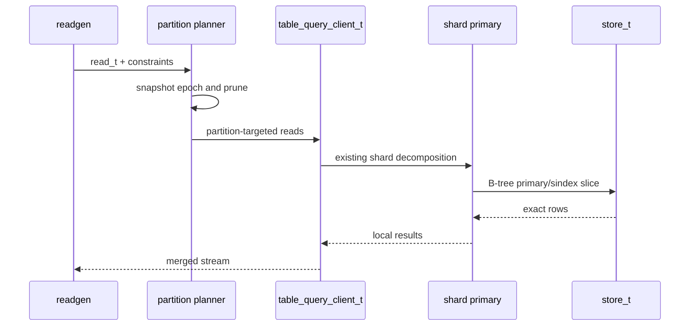
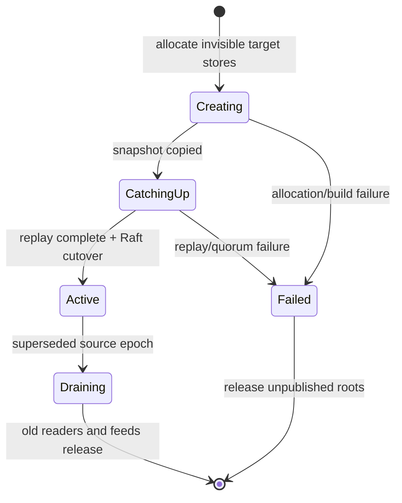

# Declarative Table Partitioning — RethinkDB v3.0

**Status:** Phase 3 axiom-level implementation specification  
**Scope:** Declarative range, hash, and list partitioning for logical RethinkDB tables.  
**Repository:** `/home/kara/rethinkdb`  
**Status of this document:** Design only; it specifies no implementation patch.

## 1. Overview

Declarative partitioning divides one logical RethinkDB table into named physical
partitions chosen from a JSON document field. Clients continue to issue queries against
one table such as `r.table("events")`; the server extracts the configured partition key,
selects an active partition, then uses normal shard routing and B-tree execution inside
that partition.

Partitioning is distinct from sharding. Sharding is the existing horizontal-scale
mechanism: it divides a primary-key B-tree into placement and replica units across the
cluster. Partitioning is a logical subdivision of a table for lifecycle management,
physical locality, and query optimization. A table may have P partitions and S shards;
its local storage topology has P × S partition-shard stores. Partitioning selects the
partition first. Existing primary-key shard routing selects a shard within it.

| Property | Partitioning | Existing sharding |
| --- | --- | --- |
| Routing input | Configured JSON field value | Encoded primary key/hash region |
| Primary goal | Pruning, locality, and controlled data reorganization | Distribution, availability, and replica placement |
| Configuration | `partitions` table option | `shards`, `replicas`, replica tags |
| Logical API | One ReQL table | One ReQL table |
| Query behavior | Can skip nonmatching partitions | Delivers work to selected shard replicas |

Phase 3 supports one required top-level field and these strategies:

| Type | Mapping rule | Appropriate data |
| --- | --- | --- |
| `range` | Exactly one `[from, to)` ReQL datum interval owns a value. | Time, ordered IDs, tenant ranges. |
| `hash` | Versioned canonical datum hash selects a configured bucket. | Uniform tenant/user distribution. |
| `list` | Explicit scalar values map to named partitions; one default owns remaining values. | Regions, plans, bounded categories. |

Partitioning must never change logical-table correctness. Every accepted valid partition
key routes to exactly one active partition; a planner can prune only partitions proven
unable to satisfy a predicate; primary keys remain unique table-wide; and a committed
partition-map epoch is immutable to a routed operation.

```mermaid
flowchart LR
    A[ReQL client] --> B[r.table('events')]
    B --> C[Extract partition key]
    C --> D[Immutable partition map]
    D --> E[Selected partition IDs]
    E --> F[Existing shard routing]
    F --> G[store_t and local B-tree]
    G --> H[Merge exact results]
    H --> A
```

### 1.1 Non-goals

Phase 3 does not add automatic time partition creation or expiration, nested paths,
composite or expression keys, subpartitioning, user-visible child tables,
partition-specific replica policies, partition-scoped permissions, cross-partition
transactions, or automatic predicate guessing. It also does not replace secondary
indexes: a partition map controls location, whereas a secondary index controls lookup.

A partition-key update that moves a row is supported only through the internal atomic
move protocol. It must not be implemented as an externally visible delete followed by
insert. A failed move leaves the source row authoritative.

## 2. API Design / ReQL surface

### 2.1 Table creation

The existing `TABLE_CREATE = 60` term gains a `partitions` optarg. The current parser in
`src/rdb_protocol/terms/db_table.cc` already reads table creation options such as
`primary_key`, `shards`, `replicas`, and `durability`; `partitions` belongs in that same
optarg set. No separate table-create term is introduced.

```javascript
r.tableCreate("events", {
  primary_key: "id",
  shards: 3,
  replicas: 2,
  partitions: {
    by: "timestamp",
    type: "range",
    ranges: [
      {name: "archive", from: r.minval, to: r.time(2026, 1, 1, "Z")},
      {name: "current", from: r.time(2026, 1, 1, "Z"), to: r.maxval}
    ]
  }
})
```

```javascript
r.tableCreate("sessions", {
  partitions: {
    by: "tenant_id",
    type: "hash",
    modulus: 16,
    partitions: [
      {name: "p0", buckets: [0, 1, 2, 3]},
      {name: "p1", buckets: [4, 5, 6, 7]},
      {name: "p2", buckets: [8, 9, 10, 11]},
      {name: "p3", buckets: [12, 13, 14, 15]}
    ]
  }
})

r.tableCreate("accounts", {
  partitions: {
    by: "region",
    type: "list",
    partitions: [
      {name: "americas", values: ["US", "CA", "MX"]},
      {name: "emea", values: ["DE", "FR", "GB"]},
      {name: "other", default: true}
    ]
  }
})
```

The ReQL shapes are:

```text
partitions := {by: STRING, type: "range",
               ranges: ARRAY<{name: STRING, from: DATUM, to: DATUM}>}
partitions := {by: STRING, type: "hash", modulus: INTEGER,
               partitions: ARRAY<{name: STRING, buckets: ARRAY<INTEGER>}>}
partitions := {by: STRING, type: "list",
               partitions: ARRAY<{name: STRING, values?: ARRAY<DATUM>, default?: BOOL}>}
```

Validation is performed during table creation before physical stores are allocated:

- `by` must be a non-empty valid top-level field name.
- Documents must provide a non-null scalar for `by`; objects, arrays, geometry, and
  unsupported pseudo-types are not legal partition keys.
- Names are unique valid table-config identifiers; server-generated UUIDs are the durable
  IDs and cannot be supplied by clients.
- The hard limit is 128 active partitions per logical table.
- Range intervals must be sorted, contiguous, nonempty, nonoverlapping, start at
  `r.minval`, and end at `r.maxval`. `from` is closed; `to` is open.
- Hash `modulus` is in `[2, 65536]`; every integer bucket in `[0, modulus)` occurs exactly
  once in the complete layout.
- List values are scalar and appear in only one partition; exactly one list partition has
  `default: true`, and that partition owns valid unlisted values.

### 2.2 Inspection and online changes

```javascript
r.table("events").partitionInfo()

r.table("events").repartition({
  by: "timestamp",
  type: "range",
  ranges: [
    {name: "archive", from: r.minval, to: r.time(2026, 1, 1, "Z")},
    {name: "q1", from: r.time(2026, 1, 1, "Z"), to: r.time(2026, 4, 1, "Z")},
    {name: "hot", from: r.time(2026, 4, 1, "Z"), to: r.maxval}
  ],
  wait: true
})
```

`partitionInfo()` returns a deterministic, user-safe layout object:

```javascript
{
  type: "range", by: "timestamp", epoch: 7, state: "ready",
  partitions: [
    {name: "archive", id: "...", from: r.minval, to: r.time(...),
     state: "active", rows_estimate: 1200344, shards: 3},
    {name: "hot", id: "...", from: r.time(...), to: r.maxval,
     state: "active", rows_estimate: 9921, shards: 3}
  ]
}
```

`repartition(config)` accepts the same layout schema as `tableCreate` plus `wait?: BOOL`.
It runs the online copy/replay/cutover procedure in Section 5. With `wait: false` it
returns after Raft metadata commit; with `wait: true` it returns only after all new
partitions are active. The response includes `reconfigured`, `old_epoch`, `new_epoch`,
and `config_changes`.

`ql2.proto` receives `PARTITION_INFO` and `REPARTITION` in the next available
administrative-number allocation and extends the `TABLE_CREATE` documentation. Numeric
values must be allocated in the actual protocol change; the design does not invent IDs.

### 2.3 Partition-aware reads

Existing ReQL reads retain their syntax:

```javascript
r.table("events").between(lo, hi, {index: "timestamp"})
r.table("events").filter(r.row("timestamp").ge(lo).and(r.row("timestamp").lt(hi)))
r.table("accounts").getAll("US", {index: "region"})
r.table("events").between(10, 20, {index: "severity"})
  .filter(r.row("timestamp").ge(lo).and(r.row("timestamp").lt(hi)))
```

The first three forms can prune if the index definition is a regular, single-value index
that is exactly the configured partition-key field. The final query prunes by the filter
then performs its ordinary `severity` scan only in selected partitions. An unrelated
sindex, a lambda, JavaScript code, OR, negation, an FTS/vector/geo/multi index, or an
unknown transform is not proof: it safely fans out to all active partitions.

For range layouts, `between` uses its datum bounds to select overlapping intervals before
issuing local index scans. For list/hash layouts, equality and `getAll` on the partition
field select one partition. Ordered range predicates on hash/list layouts usually select
all partitions; the server must not claim pruning it cannot prove.

## 3. Data structures

### 3.1 Configuration and routing types

Create `src/rdb_protocol/partition_config.hpp` and
`src/rdb_protocol/partition_config.cc`. Pure validation, stable hashing, key routing, and
predicate pruning live here; this layer must not allocate B-tree blocks or parse ReQL
terms.

```cpp
enum class partition_type_t : int8_t {
    NONE = 0,
    RANGE = 1,
    HASH = 2,
    LIST = 3
};

enum class partition_state_t : int8_t {
    CREATING = 0,
    CATCHING_UP = 1,
    ACTIVE = 2,
    DRAINING = 3,
    FAILED = 4
};

class partition_entry_t {
public:
    uuid_u id;
    name_string_t name;
    namespace_id_t storage_id;
    partition_state_t state;
    key_range_t primary_key_range;
    std::vector<uint32_t> hash_buckets;
    std::vector<ql::datum_t> list_values;
    bool list_default;
};

class partition_config_t {
public:
    partition_type_t type;
    std::string key_field;
    uint64_t epoch;
    std::vector<partition_entry_t> partitions;
    std::vector<ql::datum_t> range_boundaries;
    uint32_t hash_modulus;

    bool is_partitioned() const;
    void validate_or_throw() const;
    const partition_entry_t *route(const ql::datum_t &key) const;
    std::vector<const partition_entry_t *> prune(const partition_predicate_t &) const;
};

class partition_map_t {
public:
    uint64_t epoch;
    std::map<uuid_u, key_range_t> primary_ranges;
    std::map<uuid_u, namespace_id_t> stores;
    std::vector<partition_route_t> routes_for(const partition_selection_t &) const;
};
```

The N+1 `range_boundaries` define N entries: entry i owns
`[boundaries[i], boundaries[i + 1])`. Keeping adjacent boundaries once prevents
inconsistent duplicate datums. `partition_map_t` is an immutable compiled snapshot
containing physical routes for an epoch. It deliberately distinguishes the partition-key
datum domain from `key_range_t`, which is an existing primary B-tree key range.

### 3.2 Integration with current metadata

`table_config_t`, in
`src/clustering/administration/tables/table_metadata.hpp`, currently stores the basic
configuration, shard replicas, `sindex_config_t` map, write hook, acknowledgement, and
durability. Add:

```cpp
partition_config_t partitioning;
```

`table_basic_config_t` gains `partition_type_t partition_type` and
`std::string partition_key_field`. It does not duplicate full boundaries, buckets, or
list values. Full authoritative layout remains in `table_config_t` and is materialized as
a `partition_map_t` by the table manager/query client.

`table_config_and_shards_t` remains the atomic metadata object carrying placement and
configuration. Its change variant gets `set_partition_config_t`, which contains an
expected epoch and an entire already validated candidate config. Boundary-by-boundary
mutations are forbidden because they could expose a partial map.

`store_t` exists in `src/rdb_protocol/store.hpp`; there is no current `btree_store_t`
class. This design extends `store_t` and existing B-tree superblock helpers. `sindex_config_t`
remains a logical table definition and is copied into every active partition store; it does
not gain partition-routing fields.

### 3.3 Serialization

```cpp
ARCHIVE_PRIM_MAKE_RANGED_SERIALIZABLE(
    partition_type_t, int8_t,
    partition_type_t::NONE, partition_type_t::LIST);
ARCHIVE_PRIM_MAKE_RANGED_SERIALIZABLE(
    partition_state_t, int8_t,
    partition_state_t::CREATING, partition_state_t::FAILED);

RDB_DECLARE_SERIALIZABLE(partition_entry_t);
RDB_DECLARE_EQUALITY_COMPARABLE(partition_entry_t);
RDB_DECLARE_SERIALIZABLE(partition_config_t);
RDB_DECLARE_EQUALITY_COMPARABLE(partition_config_t);
```

A new `PARTITIONING_METADATA_VERSION` gates the additive table-config tail. Older table
metadata deserializes as `NONE`, empty field, epoch zero, empty entries, and zero modulus.
A reader unable to decode a partitioning tail rejects the metadata; it must never pretend
a partitioned table is unpartitioned. Equality includes every field so Raft/semilattice
logic cannot discard a layout change.

## 4. Query planner changes

### 4.1 Predicate analysis

Add an internal `partition_predicate_t` with `UNKNOWN`, `EQUALITY`, and `RANGE` forms.
It holds the configured field, datum values, and open/closed semantics. The analyzer
recognizes only structures it can prove:

| Input form | Planner result |
| --- | --- |
| `row(key).eq(x)` | Equality |
| `row(key).ge(lo).and(row(key).lt(hi))` | Range |
| `between(lo, hi, {index: exact_key_index})` | Range |
| `getAll(x, {index: exact_key_index})` | Equality |
| Different field, arbitrary function, JS, OR, NOT | Unknown / all partitions |

An index name alone is insufficient proof. The planner loads its `sindex_config_t` and
requires a regular non-multi definition equivalent to the configured field accessor.
This prevents a falsely pruned query from producing false negatives.

Range selection is `O(log P + S)`: binary-search the first overlapping boundary and walk
S selected entries. Hash equality selects its canonical hash bucket in `O(1)` after hash
calculation. List equality looks up a canonical value, falling back to the single default.

### 4.2 `read_t` and `key_range_t` decomposition

Current query flow is `ql::term_t` → read generator → `read_t`/`rget_read_t` →
`table_query_client_t` → `store_t`. `src/rdb_protocol/datum_stream.cc` creates rgets;
`src/rdb_protocol/protocol.cc` shards a read by `region_t` and `key_range_t`; and
`src/rdb_protocol/store.cc` dispatches primary and secondary B-tree slices.

Partition planning runs before ordinary shard decomposition:

1. Snapshot `partition_map_t` at epoch E.
2. Analyze the query and select candidate partition IDs, or all active IDs.
3. Add `partition_route_t {partition_id, storage_id, epoch}` to a clone of the read.
4. `table_query_client_t` sends each targeted read to the corresponding partition store.
5. Existing `read_t::shard()` intersects the normal primary-key region with shard regions.
6. Local `store_t` executes ordinary primary/sindex reads and the coordinator merges
   backpressured results using existing terminal/sorting semantics.



`key_range_t` is a primary-key concept from `src/btree/keys.hpp`; it is never constructed
from a timestamp/region/tenant partition key. A selected partition contributes its local
primary-key universe or continuation range; existing shard logic decomposes that range.

### 4.3 Writes, moves, and index aggregation

Writes read configuration epoch E, extract/validate the proposed document key, route it,
and consult a table-wide internal primary-key directory. The directory maps encoded primary
key to partition UUID, prevents duplicate primary keys across local B-trees, and routes
point reads/moves. It is not exposed as a user index.

A same-partition write executes one existing local `write_t`. A partition-key move writes
the destination, swaps the directory entry, and deletes source under an ordered internal
move fence. If any phase fails, the source remains authoritative and destination cleanup
is retried. A stale-epoch rejection causes one map refresh; a second mismatch returns
`PARTITION_CONFIG_CHANGED`.

Every active partition receives the table's ordinary `sindex_config_t` definitions.
`indexStatus` is ready only when all active child indexes are ready, and `indexWait` waits
for that aggregate. BRIN, vector, FTS, geo, and multi sidecars remain local to partition
B-trees and do not acquire global semantics.

## 5. Storage layout

### 5.1 Chosen design: local B-tree per partition-shard

The design chooses one primary B-tree plus local sindex catalog for every
`(logical-table UUID, partition UUID, shard ordinal)`. These are internal child stores,
not user-visible tables.

A shared B-tree with partition-ID-prefixed primary keys would avoid child roots but would
change primary-key encoding, complicate sindex scanning, and make detach/drain require
scans of unrelated data. Per-partition stores preserve proven B-tree operations and make
partition lifecycle bounded. The cost is catalog/superblock overhead plus the global
primary-key directory; the 128-partition limit bounds both.

```text
logical table UUID
├── partition catalog + global primary-key directory
├── archive partition UUID
│   ├── shard 0: store_t primary B-tree + local sindexes
│   └── shard 1: store_t primary B-tree + local sindexes
└── hot partition UUID
    ├── shard 0: store_t primary B-tree + local sindexes
    └── shard 1: store_t primary B-tree + local sindexes
```

### 5.2 Superblock, serializer, and cache

Extend `src/btree/reql_specific.hpp/.cc` with a table-level partition catalog block
reference. The serialized catalog contains a format version, epoch, primary-key-directory
block ID, partition UUIDs/storage IDs, and shard superblock roots.

```cpp
struct partition_catalog_t {
    uint32_t format_version;
    uint64_t epoch;
    block_id_t primary_key_directory_block;
    std::vector<partition_store_ref_t> stores;
};

struct partition_store_ref_t {
    uuid_u partition_id;
    namespace_id_t storage_id;
    std::vector<block_id_t> shard_superblocks;
};
```

Child roots are allocated, initialized, recovered, and released through existing
`serializer`, `buffer_cache`, and B-tree transaction paths. `NULL_BLOCK_ID` is valid for
unpublished candidates only; an active partition requires every configured shard root.
Packed-superblock sizing, block-reference accounting, drop cleanup, and disk-format
migration are mandatory dependencies rather than later cleanup.

### 5.3 Online repartitioning lifecycle



The transition is:

1. Validate one complete candidate map against type, coverage, and resource limits.
2. Acquire the per-table transition lock and record source epoch E.
3. Allocate invisible target partition-shard stores and install inherited sindexes.
4. Copy source rows under a consistent snapshot according to the candidate key route.
5. Replay source modification reports through a recorded high-water stamp while ordinary
   writes continue to route to E.
6. Verify target indexes and primary-key directory entries have caught up.
7. Commit exactly one Raft table-config value with epoch E+1 and target partitions active.
8. New requests route to E+1; old-epoch readers/feed subscriptions keep source leases.
9. Retire draining sources after leases, internal queues, and feed handoff are complete.

A crash before step 7 leaves candidates unpublished and collectable. A crash after step 7
recovers cleanup from the durable new epoch and never rolls back a committed map.

## 6. Integration points

| Area | Files | Required change |
| --- | --- | --- |
| Configuration | `src/rdb_protocol/partition_config.hpp/.cc` | Validation, canonical hashing, route/prune helpers, serialization. |
| ReQL terms | `src/rdb_protocol/terms/db_table.cc`; new `terms/partitioning.hpp/.cc` | Parse `partitions`, implement `partitionInfo` and `repartition`. |
| Schema | `src/rdb_protocol/ql2.proto` and generated dispatch | Extend table-create schema and allocate new administrative terms. |
| Planner | `src/rdb_protocol/real_table.cc/.hpp`, `datum_stream.cc`, `protocol.hpp/.cc` | Predicate extraction, target read/write payload, merge/profile support. |
| Local B-tree ops | new `src/btree/partition_ops.hpp/.cc`; `store.hpp/.cc` | Child acquisition, catalog transaction, local execution, moves and cleanup. |
| Metadata | `src/clustering/administration/tables/table_metadata.hpp/.cc`, `table_config.hpp/.cc` | Durable table config, artificial-table rendering, compatibility/equality. |
| Raft/table manager | `src/clustering/administration/tables/`, `src/clustering/table_manager/`, contract coordinator | Publish maps, provision/reconcile stores, recover and replicate metadata. |
| Routing | `src/clustering/query_routing/table_query_client.hpp/.cc` | Partition target selection before normal shard dispatch. |
| Tests | `src/unittest/`, `src/unittest/rdb_env.*`, `test/rql_test/`, `test/scenarios/` | Correctness, topology, concurrency, restart, and error coverage. |

`partition_ops_t` owns storage work and must not parse user ReQL:

```cpp
class partition_ops_t {
public:
    static partition_catalog_t load_catalog(
        txn_t *txn, real_superblock_t *table_superblock);

    static void create_partition_stores(
        const partition_config_t &config,
        const table_config_t &table_config,
        partition_catalog_t *catalog,
        signal_t *interruptor);

    static void move_row_between_partitions(
        const partition_route_t &source,
        const partition_route_t &destination,
        const store_key_t &primary_key,
        const ql::datum_t &new_value,
        signal_t *interruptor);

    static void retire_drained_stores(
        uint64_t minimum_live_epoch,
        partition_catalog_t *catalog);
};
```

The Raft-visible `table_config_and_shards_change_t` receives:

```cpp
class set_partition_config_t {
public:
    uint64_t expected_epoch;
    partition_config_t new_config;
    std::vector<partition_store_ref_t> provisional_stores;
};
```

`apply_change` validates the whole candidate, verifies `expected_epoch`, and swaps it as
one value. Provisional stores are allocated before proposal but are routable only after
the committed metadata references them.

## 7. Error paths

Invalid input uses `ql::base_exc_t::LOGIC`; operational/quorum/storage errors use
`OP_FAILED`; authorization continues through `PERMISSION_ERROR`. Stable internal codes
appear in status/admin diagnostics.

| Condition | Code | Behavior |
| --- | --- | --- |
| Invalid/missing type, field, or strategy member | `PARTITION_CONFIG_INVALID` | Reject before metadata/storage change. |
| Range gap, overlap, bad order, or incomplete coverage | `PARTITION_RANGE_INVALID` | Reject full map; never normalize user boundaries. |
| Bad hash modulus or bucket ownership | `PARTITION_HASH_INVALID` | Reject omitted, duplicate, noninteger, or out-of-range buckets. |
| Duplicate list value/default or no default | `PARTITION_LIST_INVALID` | Reject configuration; no insertion-order precedence. |
| Missing document key | `PARTITION_KEY_MISSING` | Abort before B-tree mutation. |
| Null/composite/noncanonical key | `PARTITION_KEY_INVALID` | Abort; no string coercion/default fallback. |
| No active route after valid config lookup | `PARTITION_KEY_UNROUTABLE` | Refresh once, then fail and emit metadata health event. |
| Duplicate global primary key | ordinary duplicate-PK error | Do not reserve target or alter existing row. |
| Cross-partition move failure | `PARTITION_MOVE_FAILED` | Source stays authoritative; cleanup destination idempotently. |
| Analyzer cannot prove a constraint | none | Safe all-partition fallback. |
| Fan-out over configured budget | `PARTITION_QUERY_LIMIT` | Reject non-changefeed query with guidance to constrain key. |
| Child sindex not ready | existing sindex-not-ready error | Return no partial index result. |
| Corrupt/mismatched catalog | `PARTITION_METADATA_CORRUPT` | Mark partition-routed table unavailable; require repair. |
| Transition already running | `PARTITION_TRANSITION_BUSY` | Do not allocate another candidate set. |
| Mutation history expires during replay | `PARTITION_BACKFILL_OVERFLOW` | Abort unpublished candidate and restart snapshot. |
| Target quorum fails before cutover | `PARTITION_STORAGE_UNAVAILABLE` | Source epoch stays authoritative. |
| Raft response times out | `PARTITION_RAFT_TIMEOUT` | Return uncertain failure; inspect `partitionInfo`. |
| Node lacks metadata capability | `PARTITION_METADATA_INCOMPATIBLE` | Reject creation/repartition until membership is compatible. |

### 7.1 Concurrent writes and recovery

A per-table transition mutex serializes repartition requests but does not lock all writes
for the duration of the copy. Every source mutation after the source snapshot is appended
to a durable transition modification queue. Target replay is idempotent by primary key and
mutation stamp. Cutover commits only after replay reaches a high-water mark. New writes
are either captured by source epoch E or route to E+1 after commit; they are never
accepted by two authoritative configurations.

A read pins one map epoch. It can finish against a draining source, but new requests never
route to draining partitions. Coroutine loops check existing interruptors between
partition batches and use established cancellation/error propagation paths.

## 8. Testing requirements

### 8.1 Unit tests

Add `src/unittest/partition_config.cc` and `src/unittest/partition_ops.cc` coverage:

1. Serialization round trips for enums, entries, maps, catalog blobs, and table-config
   tails; legacy tails must produce `NONE`, truncated new tails must fail.
2. Range validation and routing for one universe, adjacent ranges, all exact boundaries,
   gaps, overlap, duplicate names/UUIDs, and invalid min/max placement.
3. Hash validation/routing with known canonical hash vectors, every bucket coverage,
   grouped buckets, duplicate/omitted/out-of-range cases.
4. List explicit/default routing, datum comparison duplicates, absent/duplicate default,
   and scalar restrictions.
5. Property-generated valid maps: every legal key routes exactly once; pruning never
   excludes a partition that can contain a matching row.
6. `key_range_t` decomposition: partition field values never become B-tree primary keys.
7. Primary-key directory duplicate/move behavior and atomic source preservation.
8. Superblock allocation/release for active, failed, and drained candidate stores.

### 8.2 Integration tests

Add ReQL workloads in `test/rql_test/` and multi-server cases in `test/scenarios/`.
Required cases:

- create empty/populated range, hash, and list layouts with the exact public API;
- validate `partitionInfo`, missing/null/invalid key errors, range boundary semantics,
  list defaults, and stable hash routing;
- assert pruning counts for `between`, exact-key `getAll`, filters, and safe fallback for
  opaque predicates/unrelated secondary indexes;
- create ordinary, multi, geo, FTS, vector, and BRIN indexes before/after partitioning and
  verify aggregate `indexStatus`/`indexWait` behavior;
- repartition while concurrent hard-durability insert/update/delete/move traffic runs;
- restart before allocation, during replay, after Raft commit, and during drain cleanup;
- exercise multi-shard/multi-replica composition and no duplicate primary keys;
- verify changefeeds emit external document changes exactly once across cutover;
- verify parent-table permission enforcement for reader/writer/config users.

### 8.3 Failure, profile, and acceptance tests

Profile output must include `partitions_total`, `partitions_selected`,
`partition_pruning_applied`, `partition_fanout`, `partition_epoch`, local rows scanned,
and returned rows. Status shows state, replay lag, target readiness, and failure code but
not internal paths.

Fault injection must delay Raft acknowledgement, interrupt source scans, kill a target
primary during replay, exhaust cache, corrupt a catalog block, expire a changefeed stamp,
and race two repartitions. Compare recovery results with a serial logical-table oracle:
there must be no missing row, duplicate primary key, false-negative result, or duplicate
changefeed event.

Acceptance requires: (a) equality selects one range/hash/list partition; (b) a narrow
range query scans only overlap candidates; (c) unknown predicates return reference-table
equivalent results; (d) every accepted concurrent write is visible once after cutover; and
(e) failed pre-cutover work leaves the old map authoritative and cleans unpublished roots.

## 9. Security considerations

Partitioning adds no principal, credential, network listener, or direct child-store API.
`tableCreate`, `repartition`, and `partitionInfo` use existing database/table
configuration authorization. Reads and writes authorize the logical parent table before
routing. Clients never receive an addressable `storage_id`, block ID, child namespace, or
filesystem path.

Partitioning is not row-level access control. A user with table read permission can issue
an unpruned scan and see every partition. Partition-scoped grants are a separate future
design requiring durable UUID permission records, scan/changefeed enforcement, filtered
metadata, and audit semantics.

All client names and config datums are validated/size-bounded before Raft persistence.
Paths and child roots derive only from server-generated UUIDs. The deterministic hash is
not secret and must never be described as a security boundary. TLS, encryption, backups,
and replica transport remain parent-table/cluster settings and apply equally to children.

Resource isolation requirements:

| Resource | Requirement |
| --- | --- |
| Active entries | Maximum 128 partitions per logical table. |
| Query work | Maximum configured partition fan-out for non-changefeeds. |
| Cache | Global `buffer_cache` budget remains authoritative; track child usage without promising equal shares. |
| Repartition | One transition per table, with byte/CPU token buckets to protect foreground requests. |
| Metadata | Bound datum sizes/counts and catalog block sizes before Raft proposal. |
| Changefeeds | Existing feed limits plus one coordinated subscription set per partition epoch. |

## 10. Performance model

Let P be active partitions, S selected partitions, N table rows, and Nk rows in selected
partitions. Range/list equality is `O(log P)` lookup; hash equality is `O(1)` after a
canonical hash. Range pruning is `O(log P + S)`. Primary/secondary work changes from a
logical full scan near `O(N)` to `O(Nk)` plus request and merge overhead when pruning
succeeds.

| Operation | Benefit | Cost / limitation |
| --- | --- | --- |
| Narrow range scan | Skips cold range B-trees. | Requires analyzable partition-key predicate. |
| Tenant equality | Routes one hash/list partition. | Hash cannot prune ordered ranges. |
| Full scan | Same logical results. | P local scans and merge overhead. |
| Ordinary write | One key extraction and one local write. | Primary-key-directory maintenance. |
| Key move | One logical atomic update. | Destination write + directory swap + source delete. |
| Repartition | Online configuration evolution. | Temporary copy/replay storage, cache, and write amplification. |

Metadata is `O(P + B + L)`, where B is hash bucket count and L explicit list values. Each
partition adds a superblock, local sindex catalog, replication state, and cache pressure.
Tiny partitions are therefore actively discouraged by the hard count limit and benchmark
requirements.

Required benchmarks:

1. 100M time-ordered rows in 12 range partitions: hour/day/month/all-time reads versus an
   unpartitioned reference.
2. 100M tenant rows with 16 hash buckets grouped into four partitions: equality, `getAll`,
   and unrelated index scans.
3. Skewed list data with a dominant default partition.
4. Write-heavy workload including 1% partition-key moves.
5. Multi-shard/multi-replica repartition under foreground traffic.

Report p50/p95/p99 latency, throughput, selected partitions, B-tree/cache reads, memory
per child store, catalog bytes, temporary copy bytes, and recovery time. No percentage
speedup is an API contract; predicate selectivity and hardware determine outcome.

Implementation is ordered: (1) configuration/compatibility/DDL; (2) child storage,
superblocks, and primary-key directory; (3) read/write routing and pruning; (4) online
copy/replay/cutover/changefeeds; (5) resource governors, observability, compatibility,
chaos, and benchmark hardening. The feature is complete only when every strategy preserves
logical table correctness, pruning is conservative and observable, partition and shard
routing compose, and all stated recovery paths have no-data-loss test coverage.
