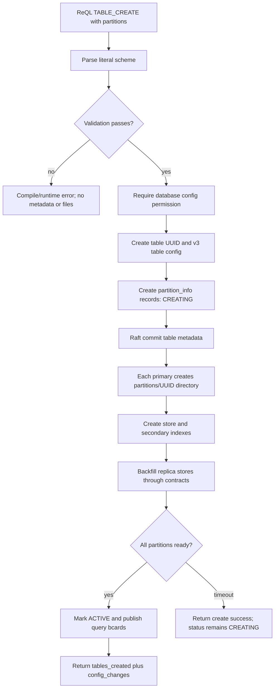
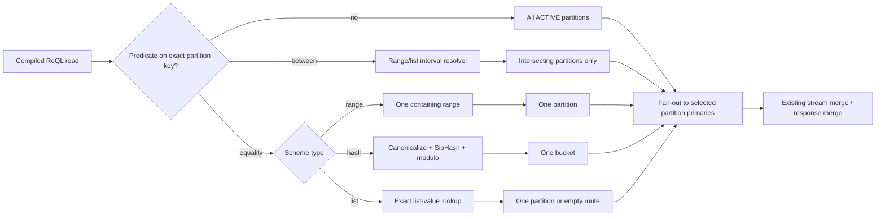
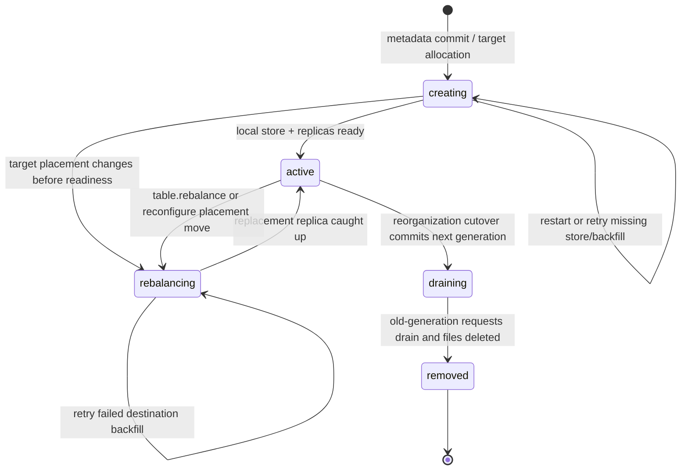

# Phase 3 — Declarative Table Partitioning (v3.0)

**Status:** implementation-ready design specification

**Target:** RethinkDB v3.0 server, ReQL protocol, official drivers, cluster metadata, and storage layout.

**Normative language:** MUST, MUST NOT, SHALL, and SHALL NOT are requirements. All error strings in backticks are byte-for-byte public API strings. This feature is enabled for table formats written by v3.0 only; v2.x nodes MUST NOT join a v3.0 cluster that contains partitioned-table metadata.

## 1. Overview

Declarative table partitioning lets a user describe, at table creation time or through a controlled reorganization of an existing table, how documents are grouped by a top-level document field. A range scheme maps ordered key intervals to named logical partitions, a hash scheme deterministically maps each key to one of a fixed number of buckets, and a list scheme maps explicit scalar values to partitions. The server owns placement, replication, routing, backfill, recovery, and visibility of those partitions, so applications no longer have to maintain separate manual range tables or implement application-side scatter/gather. A partition is the unit of placement and migration; it has one primary replica and zero or more secondary replicas, using the existing table-contract and Raft machinery. A partitioned table is one logical ReQL table with its existing primary key and all existing table semantics unless this specification explicitly states a limitation.

### 1.1 Scope and non-goals

1. This feature adds fixed-definition range, hash, and list partitions. It does not add automatic time-window creation, automatic range splitting, co-partitioned joins, multi-table transactions, global uniqueness beyond RethinkDB's existing primary-key uniqueness, or user-defined partition routing functions.
2. A partition key is exactly one top-level document field. Nested paths, ReQL functions, arrays, geometry, binary values, objects, and MINVAL/MAXVAL as document values are not partition keys in v3.0.
3. A partitioned table has exactly one storage partition per declared logical partition. The existing `shards` table-create option is therefore mutually exclusive with `partitions`.
4. Existing table reconfiguration still controls replica counts and tags. It MUST preserve the partition scheme and operate on every partition. `tableReorganize` is the only operation that changes a table's partition scheme.
5. The canonical examples in this specification use JavaScript-driver spelling. Official drivers MUST expose idiomatic aliases while emitting the protocol terms defined in §3.6.

### 1.2 Terms

| Term | Meaning |
|---|---|
| **partition key** | The configured top-level field whose datum determines the partition. It is independent of the table primary key. |
| **logical partition** | A stable `partition_id` plus routing predicate, state, and placement record in table metadata. |
| **physical partition** | The per-replica `partitions/<partition-id>/` storage directory containing one logical partition's store. |
| **active partition** | A partition that accepts reads and writes for its complete routing predicate. |
| **write epoch** | The monotonically increasing metadata generation used to prevent stale routers from writing to a removed or reassigned partition. |
| **reorganization** | A Raft-coordinated replacement of a table's scheme, with source partitions retained while target partitions backfill and catch up. |

## 2. Dependencies

### 2.1 Existing subsystems and required integration points

| Subsystem | Existing code / contract | Required v3.0 change |
|---|---|---|
| ReQL term compilation | `src/rdb_protocol/terms/db_table.cc` parses `TABLE_CREATE`; `src/rdb_protocol/term.cc` dispatches terms; `src/rdb_protocol/ql2.proto` is the wire enum. | Parse `partitions` on table creation; compile `TABLE_PARTITIONS` and `TABLE_REORGANIZE`; retain old terms and numeric values. |
| Cluster-facing ReQL API | `real_reql_cluster_interface_t::table_create` in `src/clustering/administration/real_reql_cluster_interface.{hpp,cc}` checks config permission and creates `table_config_and_shards_t`. | Extend creation with a validated `partition_config_t`; add read and reorganize methods with the exact signatures in §3.5. |
| Table metadata and Raft | `src/clustering/administration/tables/table_metadata.hpp` owns `table_config_t`, `table_shard_scheme_t`, and `table_config_and_shards_change_t`; `table_meta_client_t` submits state changes. | Add `partition_config_t` and `std::vector<partition_info_t>` to `table_config_t`; add a `partition_reorganize_t` change variant; serialize at `v3_0`. |
| Placement / shard management | `table_generate_config` chooses replicas; `table_manager_t`, `contract_coordinator_t`, and `contract_executor_t` create, backfill, and remove stores. | Treat each partition as a routing region with its own `partition_info_t` replica-placement fields. Reuse existing replica selection, contracts, backfill throttling, and readiness signals per partition. |
| Query routing | `table_query_client_t` sends reads/writes to existing table regions, and `namespace_interface_t` is the table access boundary. | Add a `partition_router_t` before table-region dispatch. It extracts keys on writes and derives candidate partitions from supported read predicates. It produces the exact partition subset described in §4.5. |
| RQL read/write objects | `read_t` and `write_t` in `src/rdb_protocol/protocol.hpp`, table methods through `base_table_t` in `src/rdb_protocol/context.hpp`. | Carry `partition_route_t` in each operation; all fan-out responses retain existing merge/error behavior unless §7 overrides it. |
| Secondary indexes | `sindex_manager_t` watches `table_config_t`, and each store owns its indexes. | Instantiate each configured secondary index in every partition store; aggregate `index_status` and `index_wait` by index across partitions. |
| Artificial tables / cluster config | `rethinkdb.table_config` and `rethinkdb.table_status` are produced by administration backends. | Add a `partitions` object to `table_config`, aggregate partition status under `partition_status`, and expose the full per-partition records through `tablePartitions()`. |
| Persistent cluster metadata | Cluster metadata is stored through the persistence layer and its metadata-superblock / metadata blob handling; legacy migrations live under `src/clustering/administration/persist/migrate/`. | Add a versioned v3.0 table-config payload; old payloads deserialize to `type = NONE`, empty `partition_info`, and one legacy storage partition. |
| Data directory / stores | `execution_t::context_t` passes `base_path_t` to table-contract executions; stores are created under the table's existing data area. | Resolve each replica store to the per-partition directory defined in §5.5. Do not change the server data-directory root or table UUID directory name. |
| Authentication | `user_context.require_config_permission`, `require_read_permission`, and existing write permission checks. | Require config permission for create/reorganize/partition inspection; preserve read/write permissions for data paths. No new permission bit is introduced. |
| Tests | ReQL YAML tests are under `test/rql_test/src/`; cluster scenarios are under `test/scenarios/`; unit tests are under `src/unittest/`. | Add the exact YAML files and test cases in §8. No existing scenario semantics change. |

### 2.2 Compatibility dependency rule

The implementation MUST add a `cluster_version_t::v3_0` serialization gate before any v3.0 node emits partition metadata to a peer. A node advertising a cluster protocol earlier than `v3_0` MUST reject joining a cluster whose current metadata contains any `partition_config_t` where `type != partition_type_t::NONE`. This is a configuration incompatibility, not a best-effort downgrade.

## 3. Interface (ReQL + C++ API)

### 3.1 ReQL table creation syntax

The new `partitions` optional argument is a literal object; its values MUST be compile-time datums, not dynamic ReQL expressions. `partitions` is mutually exclusive with `shards`.

```javascript
// Range: ranges use half-open [start, end) intervals.
r.tableCreate("events", {
  primary_key: "id",
  replicas: 3,
  partitions: {
    type: "range",
    key: "timestamp",
    ranges: [
      {start: r.minval, end: "2026-01-01T00:00:00Z"},
      {start: "2026-01-01T00:00:00Z", end: "2027-01-01T00:00:00Z"},
      {start: "2027-01-01T00:00:00Z", end: r.maxval}
    ]
  }
})

// Hash: a stable v3.0 canonical datum encoding is hashed with SipHash-2-4.
r.tableCreate("sessions", {
  partitions: {type: "hash", key: "id", num: 16}
})

// List: a document key is equal to exactly one list value.
r.tableCreate("orders", {
  partitions: {
    type: "list",
    key: "region",
    values: ["americas", "emea", "apac"]
  }
})
```

#### 3.1.1 Exact ReQL schema

```text
TABLE_CREATE:
  Database, STRING,
    {primary_key: STRING,
     replicas: NUMBER | OBJECT,
     nonvoting_replica_tags: ARRAY,
     primary_replica_tag: STRING,
     durability: STRING,
     partitions: OBJECT} -> OBJECT
  STRING, same optargs -> OBJECT

partitions OBJECT:
  {type: "range", key: STRING, ranges: ARRAY<range>}
  {type: "hash",  key: STRING, num: NUMBER}
  {type: "list",  key: STRING, values: ARRAY<DATUM>}

range OBJECT:
  {start: MINVAL | scalar DATUM, end: scalar DATUM | MAXVAL}
```

`scalar DATUM` means NUMBER, STRING, BOOL, or a valid TIME pseudotype. All range endpoints after conversion MUST have the same ReQL type. `r.minval` is permitted only as the first range start; `r.maxval` is permitted only as the final range end. There is no default partition: a range scheme MUST cover `[MINVAL, MAXVAL)`, and every list key MUST be one of `values`.

Successful create results retain the normal keys and add this config field to the `config_changes.new_val` document:

```javascript
partitions: {
  type: "hash",
  key: "id",
  num: 16,
  generation: 1
}
```

### 3.2 Partition inspection API

The canonical fluent ReQL form is:

```javascript
r.table("events").tablePartitions()
```

The JavaScript driver MUST also expose the generated method name `tablePartitions`; the Python, Ruby, Java, and C# drivers MUST expose their normal idiomatic term aliases. It returns an array ordered by `ordinal` ascending.

```javascript
[
  {
    id: "59d27384-9f21-4c5e-a2b5-0c2a77bb2381",
    ordinal: 0,
    state: "active",
    generation: 1,
    routing: {type: "range", start: r.minval, end: "2026-01-01T00:00:00Z"},
    primary_replica: "server-a",
    replicas: ["server-a", "server-b", "server-c"],
    doc_count_estimate: 1042,
    bytes_estimate: 8388608
  }
]
```

`tablePartitions()` requires table config permission, rather than read permission, because it discloses topology and server placement. It returns only active, creating, rebalancing, and draining partitions; a removed partition is never returned.

### 3.3 Reorganization API

```javascript
// Convert a legacy/unpartitioned table to hash partitioning.
r.table("events").tableReorganize({
  partitions: {type: "hash", key: "id", num: 16},
  wait: true
})

// Validate and show planned movement without changing metadata or data.
r.table("events").tableReorganize({
  partitions: {
    type: "range",
    key: "timestamp",
    ranges: [
      {start: r.minval, end: "2026-01-01T00:00:00Z"},
      {start: "2026-01-01T00:00:00Z", end: r.maxval}
    ]
  },
  dry_run: true
})
```

Exact behavior:

* `wait` defaults to `true`. With `wait: true`, the term completes only after every target partition is `active` and all sources are removed. With `wait: false`, it returns after the Raft change is committed and targets enter `creating`.
* `dry_run` defaults to `false`, is incompatible with `wait: true`, and returns a plan without writing Raft metadata, directories, or data.
* Reorganization MAY only start from a quiescent layout: no other `tableReorganize` or table `reconfigure` may be in progress.
* `tableReorganize` requires table config permission.

Success response:

```javascript
{
  reorganized: 1,
  old_generation: 1,
  new_generation: 2,
  partitions_created: 16,
  partitions_removed: 1,
  estimated_bytes_to_move: 8388608,
  status: "active" // "creating" when wait:false
}
```

### 3.4 C++ declaration file and exact data types

Create `src/clustering/administration/tables/partition_metadata.hpp`; include it from `table_metadata.hpp`. It intentionally does not include `table_metadata.hpp`: this avoids a circular declaration dependency and keeps partition replica placement self-contained. The declarations below are normative. `boost::variant` is used because it is already used by `table_config_and_shards_change_t` and is serializable in this codebase.

```cpp
#ifndef CLUSTERING_ADMINISTRATION_TABLES_PARTITION_METADATA_HPP_
#define CLUSTERING_ADMINISTRATION_TABLES_PARTITION_METADATA_HPP_

#include <stdint.h>

#include <set>
#include <string>
#include <utility>
#include <vector>

#include <boost/variant.hpp>

#include "buffer_cache/types.hpp"
#include "containers/optional.hpp"
#include "containers/uuid.hpp"
#include "rdb_protocol/datum.hpp"
#include "rpc/connectivity/server_id.hpp"
#include "rpc/serialize_macros.hpp"

// partition_type_t identifies the immutable routing algorithm for a table generation.
enum class partition_type_t : int8_t {
    NONE = 0,
    RANGE = 1,
    HASH = 2,
    LIST = 3
};
ARCHIVE_PRIM_MAKE_RANGED_SERIALIZABLE(
    partition_type_t, int8_t, partition_type_t::NONE, partition_type_t::LIST);

// partition_state_t is the durable lifecycle state of one physical partition.
enum class partition_state_t : int8_t {
    CREATING = 0,
    ACTIVE = 1,
    REBALANCING = 2,
    DRAINING = 3,
    REMOVED = 4
};
ARCHIVE_PRIM_MAKE_RANGED_SERIALIZABLE(
    partition_state_t, int8_t, partition_state_t::CREATING, partition_state_t::REMOVED);

// partition_key_t identifies the one top-level document field used to route a document.
class partition_key_t {
public:
    std::string field_name;
};
RDB_DECLARE_SERIALIZABLE(partition_key_t);
RDB_DECLARE_EQUALITY_COMPARABLE(partition_key_t);

// range_partition_config_t stores a complete, ordered, non-overlapping range scheme.
class range_partition_config_t {
public:
    // range_t defines one half-open routing interval using absent bounds for MINVAL/MAXVAL.
    class range_t {
    public:
        optional<ql::datum_t> start;
        optional<ql::datum_t> end;
    };

    partition_key_t key;
    std::vector<range_t> ranges;
};
RDB_DECLARE_SERIALIZABLE(range_partition_config_t::range_t);
RDB_DECLARE_EQUALITY_COMPARABLE(range_partition_config_t::range_t);
RDB_DECLARE_SERIALIZABLE(range_partition_config_t);
RDB_DECLARE_EQUALITY_COMPARABLE(range_partition_config_t);

// hash_partition_config_t stores fixed bucket count and the field whose canonical datum is hashed.
class hash_partition_config_t {
public:
    partition_key_t key;
    uint32_t num_partitions;
};
RDB_DECLARE_SERIALIZABLE(hash_partition_config_t);
RDB_DECLARE_EQUALITY_COMPARABLE(hash_partition_config_t);

// list_partition_config_t stores an ordered, unique set of exact scalar key values.
class list_partition_config_t {
public:
    partition_key_t key;
    std::vector<ql::datum_t> values;
};
RDB_DECLARE_SERIALIZABLE(list_partition_config_t);
RDB_DECLARE_EQUALITY_COMPARABLE(list_partition_config_t);

// partition_config_t holds exactly one routing scheme; NONE denotes a v2.x-compatible table.
class partition_config_t {
public:
    partition_config_t() : config(boost::blank()) { }
    explicit partition_config_t(range_partition_config_t &&value) : config(std::move(value)) { }
    explicit partition_config_t(hash_partition_config_t &&value) : config(std::move(value)) { }
    explicit partition_config_t(list_partition_config_t &&value) : config(std::move(value)) { }

    partition_type_t type() const;
    const partition_key_t &key() const;

    boost::variant<boost::blank,
                   range_partition_config_t,
                   hash_partition_config_t,
                   list_partition_config_t> config;
};
RDB_DECLARE_SERIALIZABLE(partition_config_t);
RDB_DECLARE_EQUALITY_COMPARABLE(partition_config_t);

// partition_info_t records durable identity, routing ordinal, lifecycle, placement, and estimates.
class partition_info_t {
public:
    uuid_u partition_id;
    uint32_t ordinal;
    partition_state_t state;
    uint64_t generation;
    std::set<server_id_t> all_replicas;
    std::set<server_id_t> nonvoting_replicas;
    server_id_t primary_replica;
    uint64_t doc_count_estimate;
    uint64_t bytes_estimate;
};
RDB_DECLARE_SERIALIZABLE(partition_info_t);
RDB_DECLARE_EQUALITY_COMPARABLE(partition_info_t);

// partition_route_t is an in-memory route selected for exactly one read or write operation.
class partition_route_t {
public:
    uint64_t generation;
    std::vector<uuid_u> partition_ids;
    bool complete;
};

#endif  // CLUSTERING_ADMINISTRATION_TABLES_PARTITION_METADATA_HPP_
```

Required table metadata changes in `src/clustering/administration/tables/table_metadata.hpp`:

```cpp
// table_config_t describes the durable configuration of one logical table.
class table_config_t {
public:
    // shard_t describes legacy unpartitioned-table replica placement and remains unchanged.
    class shard_t { /* existing declaration remains unchanged */ };
    table_basic_config_t basic;
    std::vector<shard_t> shards;
    partition_config_t partition_config;
    std::vector<partition_info_t> partition_info;
    std::map<std::string, sindex_config_t> sindexes;
    optional<write_hook_config_t> write_hook;
    write_ack_config_t write_ack_config;
    write_durability_t durability;
};
```

The `shards` member is retained for v2.x serialization and unpartitioned tables only. For `partition_config.type() != NONE`, it MUST be empty and `partition_info` owns all placement. This prevents two competing placement sources.

### 3.5 C++ cluster, metadata, and router interfaces

Add these declarations. Every public C++ class has a Go-style one-sentence comment immediately before its declaration.

```cpp
// partition_reorganize_params_t describes a validated requested replacement partition scheme.
class partition_reorganize_params_t {
public:
    partition_config_t partition_config;
    bool dry_run;
    bool wait;
};

// partition_reorganize_result_t reports a committed or dry-run reorganization plan.
class partition_reorganize_result_t {
public:
    uint64_t old_generation;
    uint64_t new_generation;
    uint32_t partitions_created;
    uint32_t partitions_removed;
    uint64_t estimated_bytes_to_move;
    partition_state_t final_state;
};

// partition_router_t maps documents and prunable read predicates to partition identifiers.
class partition_router_t {
public:
    explicit partition_router_t(const table_config_t &config);

    uuid_u route_document(const ql::datum_t &document,
                          ql::backtrace_id_t bt) const;
    partition_route_t route_primary_key(const ql::datum_t &primary_key) const;
    partition_route_t route_read(const read_t &read) const;
    partition_route_t route_all() const;

private:
    table_config_t config;
};

// partition_reorganization_t coordinates target creation, backfill, catch-up, cutover, and source removal.
class partition_reorganization_t {
public:
    partition_reorganization_t(const namespace_id_t &table_id,
                               table_meta_client_t *table_meta_client,
                               backfill_throttler_t *backfill_throttler);

    void start(const partition_reorganize_params_t &params,
               signal_t *interruptor,
               partition_reorganize_result_t *result_out)
        THROWS_ONLY(interrupted_exc_t, no_such_table_exc_t, failed_table_op_exc_t,
                    maybe_failed_table_op_exc_t, config_change_exc_t);
};
```

Extend `table_generate_config_params_t` in `src/rdb_protocol/context.hpp`:

```cpp
// table_generate_config_params_t describes table placement options accepted by TABLE_CREATE.
class table_generate_config_params_t {
public:
    static table_generate_config_params_t make_default();
    size_t num_shards;
    std::map<name_string_t, size_t> num_replicas;
    std::set<name_string_t> nonvoting_replica_tags;
    name_string_t primary_replica_tag;
    partition_config_t partition_config;
};
```

Extend `real_reql_cluster_interface_t` and its artificial forwarding implementation with these exact methods:

```cpp
bool table_partitions(
    auth::user_context_t const &user_context,
    counted_t<const ql::db_t> db,
    const name_string_t &name,
    signal_t *interruptor,
    ql::datum_t *result_out,
    admin_err_t *error_out);

bool table_reorganize(
    auth::user_context_t const &user_context,
    counted_t<const ql::db_t> db,
    const name_string_t &name,
    const partition_reorganize_params_t &params,
    signal_t *interruptor,
    ql::datum_t *result_out,
    admin_err_t *error_out);
```

Change the existing `table_create` signature by adding `const partition_config_t &partition_config` directly after `const std::string &primary_key`; update all forwarding implementations and call sites:

```cpp
bool table_create(
    auth::user_context_t const &user_context,
    const name_string_t &name,
    counted_t<const ql::db_t> db,
    const table_generate_config_params_t &config_params,
    const std::string &primary_key,
    const partition_config_t &partition_config,
    write_durability_t durability,
    signal_t *interruptor,
    ql::datum_t *result_out,
    admin_err_t *error_out);
```

### 3.6 ql2.proto and term wiring

Append only unused numeric values; existing enum values MUST NOT move. Add these exact enum entries in `src/rdb_protocol/ql2.proto`:

```proto
// Returns topology and lifecycle records for every visible table partition.
TABLE_PARTITIONS = 202; // Table -> ARRAY
// Replaces a table's partition scheme after durable backfill and atomic routing cutover.
TABLE_REORGANIZE = 203; // Table, {partitions:OBJECT, dry_run:BOOL, wait:BOOL} -> OBJECT
```

Update the existing `TABLE_CREATE = 60` comments to add `partitions:OBJECT` on every overload. Add cases in `src/rdb_protocol/term.cc`:

```cpp
case Term::TABLE_PARTITIONS: return make_table_partitions_term(env, t);
case Term::TABLE_REORGANIZE: return make_table_reorganize_term(env, t);
```

Add the factories to `src/rdb_protocol/terms/terms.hpp` and implement them in `src/rdb_protocol/terms/db_table.cc`:

```cpp
counted_t<term_t> make_table_partitions_term(
    compile_env_t *env, const raw_term_t &term);
counted_t<term_t> make_table_reorganize_term(
    compile_env_t *env, const raw_term_t &term);
```

`table_partitions_term_t` accepts exactly one table positional argument and no optargs. `table_reorganize_term_t` accepts exactly a table and one object positional argument; the object allows only `partitions`, `dry_run`, and `wait`. Unknown optargs and unknown object keys are compile errors.

### 3.7 Serialization requirements

1. Add `RDB_DECLARE_SERIALIZABLE` and `RDB_DECLARE_EQUALITY_COMPARABLE` exactly as shown in §3.4.
2. Implement every new durable type in `src/clustering/administration/tables/partition_metadata.cc` with `RDB_IMPL_SERIALIZABLE_*_SINCE_v3_0` macros, preserving field order exactly as declared:

```cpp
RDB_IMPL_SERIALIZABLE_1_SINCE_v3_0(partition_key_t, field_name);
RDB_IMPL_SERIALIZABLE_2_SINCE_v3_0(range_partition_config_t::range_t, start, end);
RDB_IMPL_SERIALIZABLE_2_SINCE_v3_0(range_partition_config_t, key, ranges);
RDB_IMPL_SERIALIZABLE_2_SINCE_v3_0(hash_partition_config_t, key, num_partitions);
RDB_IMPL_SERIALIZABLE_2_SINCE_v3_0(list_partition_config_t, key, values);
RDB_IMPL_SERIALIZABLE_1_SINCE_v3_0(partition_config_t, config);
RDB_IMPL_SERIALIZABLE_9_SINCE_v3_0(partition_info_t,
    partition_id, ordinal, state, generation, all_replicas, nonvoting_replicas,
    primary_replica, doc_count_estimate, bytes_estimate);
```

3. Change `table_config_t` serialization from the existing field sequence to a custom serializer: read/write all legacy fields in their existing order, then append `partition_config` and `partition_info` only for `cluster_version_t >= cluster_version_t::v3_0`. When reading pre-v3.0 data, set `partition_config = partition_config_t()` and clear `partition_info`.
4. Instantiate all durable metadata types using `INSTANTIATE_SERIALIZABLE_SINCE_v3_0(...)`. The implementation MUST NOT use `INSTANTIATE_SERIALIZABLE_SINCE_v2_5` for v3.0 data; that macro name is a historical version boundary and would permit old peers to receive unsupported metadata.
5. The source tree must define `cluster_version_t::v3_0` and select it as `LATEST`. The migration path is described in §5.7.

## 4. Behavior

### 4.1 Partition creation at table-create time

1. `table_create_term_t` parses ordinary table options first, then parses `partitions` with `parse_partition_config_optarg`.
2. If absent, it passes `partition_config_t()` (`NONE`) and follows the current unpartitioned table creation path without behavioral changes.
3. If present, it validates the entire scheme before calling `real_reql_cluster_interface_t::table_create`. No table UUID, Raft state, directory, or data file is created until validation succeeds.
4. `real_reql_cluster_interface_t::table_create` sets `config.config.partition_config`, creates one `partition_info_t` per range, bucket, or list value, and leaves `config.config.shards` empty.
5. Partition UUIDs are generated once on the leader. `ordinal` is the zero-based position in the normalized declaration: range order, hash bucket number, or list value order.
6. For each partition, existing `table_generate_config` placement logic selects replicas using the table's replica/tag options. Copy its `all_replicas`, `nonvoting_replicas`, and `primary_replica` fields into the new `partition_info_t` record.
7. Every new partition starts in `creating`. Its primary creates the data directory, initializes its store and all configured secondary indexes, then brings secondary replicas up through existing table-contract backfill.
8. The table becomes queryable only after every partition is `active`; table-create retains the current ten-second readiness wait. A timeout returns the normal successful `tables_created` response because creation is committed, while `table.status()` and `tablePartitions()` report the remaining creating partitions.



### 4.2 Automatic writes

1. Before a partitioned-table insert, replace, update, or delete changes storage, the server extracts `document[partition_key.field_name]` from the post-write document. For delete, it routes from the stored old document.
2. The key MUST be present, non-null, and scalar. Its runtime type MUST match the scheme's normalized type, except hash schemes accept any permitted scalar type and canonicalize type tags before hashing.
3. Range route: locate the unique `range_t` satisfying `start <= key < end`, where missing `start` represents `MINVAL` and missing `end` represents `MAXVAL`.
4. Hash route: serialize the scalar as `type-tag || canonical-datum-bytes`; compute SipHash-2-4 with fixed public key bytes `RDBv3PartitionKH` truncated to 16 bytes; take `hash % num_partitions` as `ordinal`.
5. List route: compare canonical scalar datums for exact equality; the matching value's index is `ordinal`.
6. A primary-key conflict update that changes the partition key is a move: atomically write the new document to the target partition, tombstone the old document in the source partition, and commit both under one table-level move record. The source and target primaries lock the two partition IDs in lexicographic UUID order. If either primary is unavailable before the move record commits, the mutation fails with the exact error in §7. No partially moved document may become visible.
7. Batched inserts may be split by target partition and run concurrently. The returned counts and `return_changes` output preserve the input order. `ordered` behavior follows existing write ordering tokens.

### 4.3 Rebalancing partitions across servers

`table.rebalance()` on a partitioned table is supported. It does not change partition boundaries or bucket count. It computes a desired placement from every `partition_info_t` record's replica-placement fields, moves one replica at a time through the existing contract/backfill pipeline, and marks only the moved partition `rebalancing`. A partition remains readable and writable while rebalancing because the old primary continues to serve until the new primary has caught up and the Raft placement change commits.

The rebalancer MUST:

1. honor replica tag, non-voting replica, and primary-replica-tag constraints;
2. schedule no more than one primary transfer per table concurrently;
3. use the existing `backfill_throttler_t` for all copies;
4. move at most `min(2, eligible_server_count - 1)` partitions concurrently per table;
5. update `bytes_estimate` before planning and expose the aggregate estimate through `table.rebalance()`;
6. leave a failed target in `rebalancing` and retry through normal contract recovery; it MUST NOT silently delete a healthy source replica.

### 4.4 Table reorganization / existing-table migration

`tableReorganize` converts any table — including a v2.x-format unpartitioned table — into a new v3.0 partition generation.

1. Validate the requested scheme and permissions before creating targets.
2. With `dry_run`, read source distribution statistics and return the planned target count, current bytes estimate, and `estimated_bytes_to_move`; do not make durable changes.
3. Commit generation `old_generation + 1` with all target `partition_info_t` in `creating`, retaining sources in `active`.
4. Backfill source documents into targets using the requested new partition router. New writes during backfill are dual-written to the source and target only after their target is initialized; the move record includes the generation.
5. Once every target has received its source snapshot and ordered change stream, mark all targets `active`; atomically publish the new generation to routers.
6. Routers retaining the prior generation may complete reads, but writes with an old route are rejected and retried against metadata. The old sources transition to `draining`.
7. After all in-flight old-generation operations drain and Raft confirms no old-generation readers, remove source replicas and directories, then mark source records `removed` and omit them from live config.
8. A failed reorganization does not roll back copied target data. It pauses in `creating` or `rebalancing`, exposes that state, and resumes from durable progress checkpoints after retry/restart. The user may not submit a second reorganization until the first completes; v3.0 provides no cancellation or repair term.

### 4.5 Query routing and partition pruning

The planner routes by partition key only. It MUST never infer pruning from a secondary-index predicate or arbitrary function. It compiles an optional `partition_predicate_t` from the following forms when the referenced field is exactly the configured top-level key:

| ReQL shape | Range scheme candidates | Hash scheme candidates | List scheme candidates |
|---|---:|---:|---:|
| `table.get(pk)` | all, unless partition key is primary key | one if key is primary key | all, unless partition key is primary key |
| `getAll(value, {index: partition_key})` | one | all | one or zero |
| `between(start, end, {index: partition_key})` | overlapping ranges only | all | list values in interval |
| `filter({key: value})` | one | all | one or zero |
| `filter(r.row("key").eq(value))` | one | all | one or zero |
| any other query | all active partitions | all active partitions | all active partitions |

For range predicates, candidates are those whose half-open routing interval intersects the requested interval. For a hash scheme, equality cannot prune because the canonical hash is intentionally not an ordered range; a primary-key equality prunes only if the primary key equals the partition key. For a list scheme, a literal equality maps to one partition and a literal finite `in` set maps to the unique partition for each present value.

A pruned route MUST still include `creating` or `rebalancing` targets if the current generation has cut over. It MUST NOT route to `draining` or `removed` sources except for an already-issued old-generation read.



A zero-partition list equality produces an empty stream without contacting a server. It is not an error because no document can match a valid list-partitioned table for that value.

### 4.6 Partition-aware secondary indexes

1. A secondary-index definition remains table-level in `table_config_t::sindexes`.
2. `sindex_manager_t` MUST create identical index definitions in every physical partition store, including partitions that are still creating.
3. An indexed `getAll` or `between` first applies partition pruning if its predicate targets the partition key, then executes the secondary index in every selected partition. If the selected index is not the partition key, all active partitions are selected unless another independently provable partition predicate exists.
4. `index_status()` returns one row per logical index, using `ready = true` only when every active partition reports ready; `progress` is `sum(partition numerator) / sum(partition denominator)`; `outdated = true` if any active partition reports outdated.
5. Index build errors retain existing error semantics and name the partition UUID in server logs only. Public `index_status` does not expose a failed internal path; `tablePartitions` reports the relevant partition state.

### 4.7 Changefeeds, reads, and writes across partitions

A table changefeed is the stable merge of one changefeed per active partition. Events use the existing table-level feed ordering guarantees only; v3.0 adds no total order across partitions. On a partition move or reorganization, the feed deduplicates by `(primary_key, document_version)` and emits no duplicate document transition.

Reads that fan out retain existing ReQL stream behavior. Write operations across multiple partitions are not transactional as a whole, exactly as existing multi-document writes are not transactional. A single-document partition-key move is atomic as specified in §4.2.

## 5. Data

### 5.1 Invariants

For every `table_config_t`:

1. `partition_config.type() == NONE` iff `partition_info.empty()` and `shards.size() >= 1`.
2. `partition_config.type() != NONE` iff `shards.empty()` and `partition_info.size()` equals the scheme cardinality.
3. All `partition_info.partition_id` values are non-nil and unique.
4. Active/current-generation ordinals are dense `[0, cardinality)` and unique.
5. `generation >= 1`; all current-generation partitions share one generation.
6. Each `partition_info_t` placement satisfies the existing shard replica invariants: `nonvoting_replicas` is a subset of `all_replicas`, and `primary_replica` belongs to `all_replicas` but not `nonvoting_replicas`.
7. Only `creating`, `active`, `rebalancing`, or `draining` may be durable live records. `removed` is transitional and MUST be compacted from metadata after all replicas acknowledge removal.

### 5.2 Normalized range representation

`range_partition_config_t::range_t::start` and `end` use `optional<ql::datum_t>` rather than materializing `MINVAL` and `MAXVAL`. `start == none` denotes `MINVAL`; `end == none` denotes `MAXVAL`. The normalized range vector MUST satisfy:

```text
ranges.size() in [1, 1024]
ranges[0].start == none
ranges.back().end == none
for each i:
  ranges[i].start < ranges[i].end
  ranges[i].end == ranges[i + 1].start
all concrete boundaries have one scalar ReQL type
```

This deliberately prevents gaps, overlaps, implicit catch-all ranges, and ambiguous document placement.

### 5.3 Hash representation

`hash_partition_config_t::num_partitions` MUST be a power of two in `[2, 1024]`. The power-of-two constraint enables fast stable routing, creates predictable metadata size, and avoids accidental use of an arbitrary modulus in incompatible drivers. The server is authoritative for hashing; drivers never precompute a bucket.

### 5.4 List representation

`list_partition_config_t::values` MUST contain `[1, 1024]` unique, non-null scalar datums all of one ReQL type. Value `i` maps exactly to partition ordinal `i`. A list table intentionally rejects a document whose key is not listed, preventing silent placement in an unintended catch-all partition.

### 5.5 On-disk layout

The current table directory selection remains the owner of the table root. For each local replica, the relative layout becomes:

```text
<existing-server-data-directory>/
  <existing-table-directory-for-table-uuid>/
    partitions/
      <partition-id-uuid>/
        store
        sindexes/
        partition.meta
```

Requirements:

1. `<existing-table-directory-for-table-uuid>` is resolved by existing table-contract / `base_path_t` logic; this feature MUST NOT invent a second table-root naming algorithm.
2. `partitions/` exists only for partitioned v3.0 tables. Legacy unpartitioned tables retain their current store layout unchanged.
3. `partition.meta` is a small, atomically rewritten local file containing `partition_id`, `table_id`, `generation`, and the serializer format version. It is a cache/check, not authoritative metadata; Raft table metadata is authoritative.
4. During reorganization, old and target generation directories coexist. Deletion occurs only after source state is `removed` and all store handles are closed.
5. The local startup scanner MUST reject a directory whose `partition.meta.table_id` or `partition.meta.partition_id` disagrees with committed metadata, log it as orphaned, and never attach it to a live table.

### 5.6 Metadata-superblock changes

The cluster metadata superblock's table-metadata blob MUST carry the v3.0 serialized `table_config_t`. No physical pointer field is added to the fixed superblock header; partition metadata is appended to the existing table-config archive payload in the metadata blob, as required by §3.7. This keeps the fixed header stable and makes the new data part of the existing durable Raft / metadata recovery path.

The local `partition.meta` file is not a replacement for the metadata-superblock and MUST be reconstructible from the committed config. Any crash between metadata commit and local directory creation yields a `creating` partition whose normal contract executor recreates missing local storage.

### 5.7 Backward compatibility and upgrade

| Source state | v3.0 behavior |
|---|---|
| v2.x unpartitioned table opened by v3.0 | Deserialize with `partition_config.type() == NONE`, empty `partition_info`, existing `shards` unchanged. Query and storage behavior are unchanged. |
| v2.x unpartitioned table reorganized by v3.0 | Keep the old store as source generation 1, add v3.0 target partition directories, then complete §4.4. |
| v3.0 unpartitioned table | Uses the same legacy-compatible representation and may later be reorganized. |
| v3.0 partitioned table | Requires v3.0 cluster protocol and per-partition directories. |
| v3.0 partitioned data directory opened by v2.x binary | Startup MUST fail before serving data with `Data directory contains v3.0 partitioned table metadata; upgrade this server to RethinkDB 3.0 or later.` |
| v2.x node attempts to join partitioned v3.0 cluster | Join MUST fail with `Cannot join cluster: cluster contains partitioned tables that require RethinkDB 3.0 or later.` |

Upgrading binaries before using `tableReorganize` is supported. Rolling binary upgrade is supported only while no partitioned metadata exists; enabling the first partitioned table is the cluster-format cutover and requires all voting cluster members to advertise v3.0.

## 6. States

### 6.1 Partition lifecycle state machine



### 6.2 Allowed transitions and guards

| From | To | Initiator | Required guard | Side effect |
|---|---|---|---|---|
| none | creating | create/reorganize leader | validated scheme, placement selected, Raft leader present | commit config and allocate directory contracts |
| creating | active | contract coordinator | primary initialized and all voting replicas ready | publish current-generation route |
| creating | rebalancing | coordinator | placement must change before ready | replace target contract, retain source |
| rebalancing | active | coordinator | replacement replica caught up | commit new primary/replica placement |
| active | rebalancing | rebalance/reconfigure | at least one legal target placement | create target replica then transfer/remove old replica |
| active | draining | reorganize coordinator | all target partitions of new generation active | atomically publish new generation |
| draining | removed | coordinator | old-generation readers drained, no active contracts | delete local directories and compact metadata |

Invalid transitions MUST fail internal validation and must not be persisted. A server receiving a metadata change with an invalid transition MUST refuse that configuration, remain on the last valid config, and report a table issue.

### 6.3 Table readiness

A partitioned table is `ready_for_reads` only when every current-generation partition is `active` or, for a rebalancing partition, has a readable current primary. It is `ready_for_writes` only when every current-generation partition has a writable primary. `table.wait({wait_for: "ready_for_writes"})` retains its existing response shape and does not report success while any current partition is `creating` without a writable primary.

## 7. Errors

### 7.1 Error catalog

| Condition | Response class / type | Exact message |
|---|---|---|
| `partitions` is not an object | COMPILE_ERROR | `Expected \\`partitions\\` option to be an object.` |
| `partitions.type` is absent or non-string | COMPILE_ERROR | `Expected partition type to be one of \\`range\\`, \\`hash\\`, or \\`list\\`.` |
| unknown partition type | COMPILE_ERROR | `Unknown partition type \\`%s\\`; expected \\`range\\`, \\`hash\\`, or \\`list\\`.` |
| key absent, empty, or not a string | COMPILE_ERROR | `Partition key must be a non-empty top-level field name.` |
| `partitions` used with `shards` | COMPILE_ERROR | `The \\`partitions\\` and \\`shards\\` options cannot be used together.` |
| range `ranges` absent/not array | COMPILE_ERROR | `Range partitioning requires a non-empty \\`ranges\\` array.` |
| range count outside limit | COMPILE_ERROR | `Range partition count must be between 1 and 1024.` |
| malformed range object | COMPILE_ERROR | `Each range partition must be an object with \\`start\\` and \\`end\\` fields.` |
| non-scalar range endpoint | COMPILE_ERROR | `Partition range boundaries must be scalar values, \\`r.minval\\`, or \\`r.maxval\\`.` |
| range types differ | COMPILE_ERROR | `All partition range boundaries must have the same ReQL type.` |
| first/last coverage invalid | COMPILE_ERROR | `Range partitions must begin with \\`r.minval\\` and end with \\`r.maxval\\`.` |
| gap/overlap/empty range | COMPILE_ERROR | `Range partitions must be contiguous, non-overlapping, and non-empty.` |
| hash `num` absent/noninteger | COMPILE_ERROR | `Hash partition count must be an integer power of two between 2 and 1024.` |
| list values absent/not array | COMPILE_ERROR | `List partitioning requires a non-empty \\`values\\` array.` |
| invalid/duplicate list value | COMPILE_ERROR | `List partition values must be unique non-null scalar values of one ReQL type.` |
| caller lacks config permission for create/reorganize/inspect | RUNTIME_ERROR / PERMISSION_ERROR | Existing permission error from `require_config_permission`; no partition-specific alternate text. |
| document omits partition key | RUNTIME_ERROR / QUERY_LOGIC | `Document is missing partition key \\`%s\\` for table \\`%s\\`.` |
| partition key is null/non-scalar | RUNTIME_ERROR / QUERY_LOGIC | `Partition key \\`%s\\` for table \\`%s\\` must be a non-null scalar value.` |
| document range-key type differs | RUNTIME_ERROR / QUERY_LOGIC | `Partition key \\`%s\\` for table \\`%s\\` has type \\`%s\\`, but range partitions require \\`%s\\`.` |
| document key is outside list values | RUNTIME_ERROR / QUERY_LOGIC | `Partition key value is not assigned to any list partition for table \\`%s\\`.` |
| target partition is creating | RUNTIME_ERROR / OP_FAILED | `Partition \\`%s\\` of table \\`%s\\` is still being created.` |
| no writable primary for selected partition | RUNTIME_ERROR / OP_FAILED | `Cannot write to partition \\`%s\\` of table \\`%s\\`: its primary replica is unavailable.` |
| selected read partition unavailable at normal consistency | RUNTIME_ERROR / OP_FAILED | `Cannot read partition \\`%s\\` of table \\`%s\\`: no replica is available.` |
| partition-key move cannot obtain both primaries | RUNTIME_ERROR / OP_FAILED | `Cannot move document between partitions of table \\`%s\\`: a required primary replica is unavailable.` |
| stale router writes after cutover | RUNTIME_ERROR / OP_INDETERMINATE | `Partition map changed while writing table \\`%s\\`; retry the query.` |
| another reorganization/reconfigure runs | RUNTIME_ERROR / OP_FAILED | `Table \\`%s\\` already has a partition or shard reconfiguration in progress.` |
| `dry_run:true` with `wait:true` | COMPILE_ERROR | `The \\`dry_run\\` and \\`wait:true\\` options cannot be used together.` |
| `tablePartitions` on non-table | COMPILE_ERROR | `Expected a table for \\`tablePartitions\\`.` |
| reorganization target type invalid for old peer | RUNTIME_ERROR / OP_FAILED | `Cannot partition table \\`%s\\`: every voting server must support RethinkDB 3.0 partition metadata.` |
| disk directory metadata mismatch | table issue / no client term necessarily | `Partition directory metadata does not match committed table metadata.` |

`%s` placeholders are filled with display names or UUIDs as indicated. The normal ReQL backtrace MUST identify the offending table-create optarg, reorganization object field, or document write expression.

### 7.2 Unavailable-shard behavior

A partition's primary or replicas are its shard placement for purposes of availability. A read that prunes to an unavailable partition fails rather than returning a partial result. A multi-partition read fails if any required selected partition fails; it MUST NOT silently return data from only healthy partitions. An explicitly `outdated` read may use a healthy secondary according to existing read-mode behavior; otherwise it emits the normal unavailable-partition error above.

### 7.3 Cross-partition limitations and responses

1. A query that cannot be pruned fans out to all active partitions. It is supported if the existing operation supports table fan-out.
2. `orderBy` without a usable index, `distinct`, aggregation, grouping, and table-wide secondary-index reads may consume results from all partitions and are subject to existing memory/result limits. They do not receive a partition-specific error solely for being cross-partition.
3. A cross-partition multi-document mutation has existing per-document atomicity only. It MUST NOT claim atomic table-wide commit. If one target partition fails after other independent documents committed, the returned existing write result reports partial success/error according to current ReQL write semantics.
4. A single document whose partition key changes is the sole cross-partition write guaranteed atomic by this feature. Failure returns the move error in §7.1 and leaves the old document visible.
5. `tableReorganize` is not allowed inside a `forEach`/data mutation transaction context; the term is an administrative operation and returns the normal compile error `Cannot use tableReorganize in a non-administrative query context.`

## 8. Testing

### 8.1 Unit tests

Add `src/unittest/partition_metadata.cc` and cover all of the following exact cases:

1. `range_config_accepts_three_contiguous_ranges`: `[MINVAL, 10), [10, 20), [20, MAXVAL)` validates and produces ordinals `0,1,2`.
2. `range_config_rejects_gap`: `[MINVAL, 10), [11, MAXVAL)` yields the contiguous-range error.
3. `range_config_rejects_overlap`: `[MINVAL, 10), [9, MAXVAL)` yields the same error.
4. `range_config_rejects_mixed_types`: numeric and string boundaries yield the same-type error.
5. `hash_config_requires_power_of_two`: `1`, `3`, and `1025` reject; `2`, `16`, `1024` accept.
6. `hash_router_is_stable`: exact canonical scalar inputs route to the same expected ordinals across serialize/deserialize cycles and process restarts.
7. `list_config_rejects_duplicates_and_null`: duplicate strings, `null`, array, and object values reject.
8. `document_key_missing_rejects_before_store_write`: extraction yields the exact missing-key error and no write object reaches the store.
9. `range_router_boundary_is_half_open`: a key equal to a boundary routes to the higher range; final max concrete value routes correctly.
10. `partition_state_machine_rejects_invalid_transition`: `removed -> active` and `draining -> creating` do not mutate state.
11. `legacy_table_config_deserializes_unpartitioned`: pre-v3.0 fixture yields `NONE`, empty `partition_info`, unchanged legacy shard scheme.
12. `v3_partition_config_round_trips`: all three variants and all `partition_info_t` fields round-trip exactly.

### 8.2 ReQL integration YAML

Add `test/rql_test/src/admin/table_partitioning.yaml` with this header and scenarios. Driver-specific source lines follow existing YAML conventions (`py`, `js`, `rb`, `cd`) and expected results use existing `ot`, `partial`, and `bag` syntax.

```yaml
desc: Declarative table partitioning
table_variable_name: partitioned_tbl
tests:
```

Required named scenarios:

| Scenario | Query setup | Required assertion |
|---|---|---|
| `range_partition_create_insert_query` | Create three `timestamp` ranges; insert one document in each interval; call `tablePartitions`; read with `between` on `timestamp`. | Creation reports one table; three partitions are `active`; `between` returns only the correct document; boundary key belongs to the upper range. |
| `hash_partition_uniformity` | Create `{type:"hash", key:"id", num:16}`; insert 16,000 IDs; inspect partitions. | Exactly 16 active partitions; each `doc_count_estimate` is between 700 and 1300 after refresh (wide deterministic tolerance). |
| `cross_partition_secondary_index_query` | Create hash table, insert fields `tenant` and `email`, create `email` index, wait, getAll on non-partition index. | Every matching document across multiple partitions is returned; `index_status("email")` reports one ready index. |
| `rebalance_during_writes` | Create 4-partition hash table in a multi-server scenario; write in a loop while invoking `rebalance`. | All acknowledged IDs are readable exactly once after `rebalance` and all partitions become `active`. |
| `upgrade_from_unpartitioned_table` | Create ordinary table, insert source documents, invoke `tableReorganize` to range scheme. | `reorganized:1`, all documents remain readable exactly once, old config transitions out, and `tablePartitions` lists new active ranges. |
| `missing_partition_key` | Insert a document lacking the configured key. | Runtime QUERY_LOGIC error equals the exact missing-key message. |
| `list_unassigned_value` | List table with `americas`, `emea`; insert `apac`. | Runtime QUERY_LOGIC error equals the exact list-assignment message. |
| `partitions_and_shards_conflict` | Call `tableCreate` with both options. | Compile error equals the exact conflict message. |
| `range_overlap_rejected` | Supply overlapping ranges. | Compile error equals the exact contiguous/non-overlap message. |
| `table_partitions_permission` | Use a user without config permission. | Permission error, not topology disclosure. |

Add `test/rql_test/src/admin/table_partitioning_reorganize.yaml` for long-running scenarios. It MUST run with a test harness configuration containing at least three servers and use `wait:false` to observe `creating`, then `wait:true` to observe `active` and source removal.

### 8.3 Cluster / fault-injection integration scenarios

Add `test/scenarios/partition_rebalance.py` that starts three servers, creates a 16-bucket hash table with two replicas, writes continuously, invokes `rebalance`, kills the planned target replica during one backfill, restarts it, and asserts all acknowledged documents exist once after readiness. It must verify that no partition silently changes to `removed` before a replacement is ready.

Add `test/scenarios/partition_upgrade.py` that:

1. creates a v2.x-format unpartitioned fixture;
2. starts v3.0 against it and verifies legacy reads;
3. reorganizes it into a v3.0 hash table;
4. verifies a v2.x server binary refuses the resulting data directory with the exact error in §5.7.

### 8.4 Test acceptance matrix

| Requirement | Unit | YAML | Multi-server scenario |
|---|---|---|---|
| range routing and validation | yes | yes | no |
| hash distribution/stability | yes | yes | yes |
| list enforcement | yes | yes | no |
| missing document key | yes | yes | no |
| secondary indexes | no | yes | yes |
| rebalance while writes occur | no | yes | yes |
| reorganization/cutover | state unit | yes | yes |
| legacy metadata compatibility | yes | yes | yes |
| availability failure | router/state unit | no | yes |
| permission boundaries | no | yes | no |

## 9. Security

1. Partition create, inspection, reorganization, and placement changes MUST call existing `require_config_permission` for the database/table before reading topology or changing metadata. `tablePartitions()` is configuration inspection, not a read-only data query.
2. No partition operation accepts server IDs, filesystem paths, contract IDs, raw directory names, or primary replica assignments from ReQL. Placement is selected only by existing trusted cluster placement code.
3. Partition key names MUST be validated as non-empty top-level field names before persistence. The implementation MUST reject NUL bytes and names longer than the existing datum object-key maximum; it MUST NOT concatenate the field name into a filesystem path.
4. Scalar key validation occurs server-side for every mutation after write-hook transformation and before routing. A client cannot bypass it by using a driver that does not expose the table-create option.
5. Range comparisons and list equality MUST use RethinkDB datum comparison/canonicalization, not locale-sensitive C++ string comparison. Hash canonicalization includes a type tag, so numeric `1` and string `"1"` never collide at the routing layer due to representation ambiguity.
6. `partition_id` is server-generated UUID data. It is never used as an authorization principal and no user-supplied UUID controls a directory path.
7. The local partition-directory scanner MUST use `base_path_t` / existing path joining and reject any resolved path that escapes the table root. It MUST not follow attacker-created symlinks when creating or deleting `partitions/<uuid>`.
8. Error messages may name the logical table and partition UUID but MUST NOT disclose server filesystem paths, peer addresses, credentials, or replica tags to an unauthorized caller.
9. Partition metadata changes use existing per-table Raft consensus. A single compromised or stale server cannot unilaterally redirect data to a chosen server or delete a healthy replica.

## 10. Performance

### 10.1 Query-pruning targets

| Scheme / predicate | Partitions scanned | Required planner behavior |
|---|---:|---|
| Range equality | 1 | Binary-search normalized range endpoints, then route one partition. |
| Range `between` | number of overlapping ranges | Binary-search first candidate; scan contiguous candidate ordinals only. |
| Hash equality on partition key | 1 | Canonicalize once, SipHash once, select one bucket. |
| Hash non-key predicate | `num_partitions` | Fan out to all active partitions. |
| List equality | 1 or 0 | Lookup canonical value in a prebuilt map. |
| List finite literal set | number of distinct present values | Deduplicate candidate ordinals. |
| Unknown/dynamic predicate | all active partitions | Correctness first; never speculative pruning. |

Router construction may build immutable lookup caches: range boundary vector, `std::unordered_map<canonical_datum_bytes, uint32_t>` for list values, and hash bucket count. The cache is replaced atomically whenever the table-config watchable changes. Per-document route selection must be O(log P) for range, O(1) expected for list/hash, and allocate no heap memory on the normal scalar fast path.

### 10.2 Rebalance and reorganization cost model

Before acting, the planner computes:

```text
estimated_bytes_to_move = sum(bytes_estimate for every source replica that requires copying)
estimated_documents_to_move = sum(doc_count_estimate for the same sources)
```

For a pure placement rebalance, count only replica copies whose current server differs from desired server. For a scheme reorganization, count every live source document once per required target voting replica; replication backfill is included. Estimates use the existing distribution/count facilities plus per-partition store statistics. If no estimate is available, report `0` and `estimate_available: false` in a dry-run result rather than fabricating a value.

The scheduler MUST throttle through the existing `backfill_throttler_t`, cap concurrent partition copies as §4.3 requires, and yield to foreground reads/writes through existing queue priorities. No reorganization may allocate all target stores simultaneously when more than 64 partitions are requested: it creates at most 16 local target stores per server at a time.

### 10.3 Metadata and cardinality limits

1. Maximum partitions per table: 1024.
2. Maximum range/list entries: 1024.
3. Maximum serialized `partition_config_t` plus current-generation `partition_info_t` bytes: 1 MiB. Table creation/reorganization exceeding it fails with `Partition metadata for table \`%s\` exceeds the 1048576-byte limit.`
4. `tablePartitions()` response is capped by the existing ReQL response-size limit. At the 1024-partition maximum it must remain below the 1 MiB metadata limit excluding server-name expansion.
5. Config watch propagation is O(P) in partition count. The implementation MUST avoid O(P × server_count) metadata work on ordinary single-partition queries; routers receive an immutable table snapshot and route locally.
6. Range and list schemes favor predicate pruning; hash schemes favor write distribution. Documentation and driver help MUST state this tradeoff.

### 10.4 Completion criteria

This feature is complete only when all conditions hold:

1. All types, term IDs, serialization gates, error strings, state transitions, and directory rules in this specification are implemented exactly.
2. Existing unpartitioned tables pass their current test suite without storage-layout migration.
3. Every §8 unit and integration scenario passes, including fault recovery and v2.x-format upgrade coverage.
4. A query provably constrained to one range/hash/list partition dispatches one partition request, verified by a router unit test and profiling/metrics assertion.
5. A failed replica backfill never loses an acknowledged write or causes a partial successful read.
6. No v2.x binary or peer can open/join partitioned v3.0 metadata silently.
