# Time-Series Optimizations — RethinkDB v3.0

**Status:** Phase 3 axiom-level implementation specification  
**Scope:** Time-ordered B-tree layout, retention policies, downsampling pipeline.  
**Repository:** `/home/kara/rethinkdb`  
**Status of this document:** Design only; it specifies no implementation patch.

## 1. Overview

Time-series workloads have distinct access patterns that general-purpose B-trees
handle poorly: append-heavy writes to a monotonic key suffix, range scans over
contiguous time windows, and periodic bulk deletion of aged data. Phase 3 adds
native time-series awareness to the storage engine without sacrificing the
existing B-tree abstraction.

```mermaid
flowchart TB
    subgraph Write Path
        A[INSERT/UPDATE with time field] --> B[Route to partition]
        B --> C[Time-aware B-tree]
        C --> D[Append to current chunk leaf page]
        D --> E[Background: flush full chunk to disk page]
    end
    subgraph Read Path
        F[SELECT between t1..t2] --> G[BRIN-like time pruning]
        G --> H[Scan only overlapped chunks]
        H --> I[Stream matching rows]
    end
    subgraph Retention
        J[Retention policy tick] --> K[Find chunks older than TTL]
        K --> L[Mark chunks as dead]
        L --> M[Background: reclaim dead chunk pages]
    end
```



Three independent features compose:

| Feature | Description | Enabled by |
|---------|-------------|-----------|
| Time-ordered B-tree | Append-optimized leaf pages, chunked storage | `{timeSeries: {field: "ts"}}` table option |
| Retention policies | TTL-based automatic deletion | `{retention: "30d"}` table option |
| Downsampling | Continuous aggregate rollups | `{downsample: [{age: "7d", to: "1m"}]}` table option |

### 1.1 Non-goals

Phase 3 does NOT add: automatic partition creation (time-bucketed tables), custom
retention predicates (only TTL on the time field), materialized continuous
aggregates (downsampling produces ReQL tables, not precomputed rollup tables),
time-series-specific compression (deferred to a generic compression layer), or
interpolation/ gap-filling query functions.

## 2. API Design / ReQL surface

### 2.1 Table creation

```javascript
r.tableCreate("sensor_readings", {
  primary_key: "id",
  timeSeries: {
    field: "timestamp",
    chunk_interval: "1h",          // optional, default: auto
    retention: "90d",               // optional
    downsample: [                   // optional
      {age: "24h", to: "1m", aggregate: {avg_temp: r.avg("temperature"), max_temp: r.max("temperature")}},
      {age: "30d", to: "1h", aggregate: {avg_temp: r.avg("temperature")}}
    ]
  }
})
```

### 2.2 Configuration inspection

```javascript
r.table("sensor_readings").config()("time_series")
// → {field: "timestamp", chunk_interval: 3600, retention: 7776000, ...}

r.table("sensor_readings").timeSeriesStatus()
// → {chunk_count: 2160, oldest_chunk: "2026-01-01T00:00:00Z",
//     newest_chunk: "2026-04-01T00:00:00Z", total_rows: 1.2e9,
//     retention_deleted: 0, downsample_lag: null}
```

### 2.3 Downsampled query

```javascript
// Automatically selects appropriate downsample resolution
r.table("sensor_readings")
  .between(r.time(2026, 1, 1), r.time(2026, 3, 1))
  .filter({sensor_id: "temp-42"})
  // Planner auto-selects 1h resolution for this range
  .avg("temperature")
```

### 2.4 Error surface

- `"Time-series field 'X' must exist in every document."`
- `"Time-series field value must be a time pseudo-type."`
- `"Cannot alter time-series table to non-time-series."`
- `"Retention period exceeds maximum allowed (365d)."`
- `"Downsample aggregate expression must be deterministic."`

## 3. Data structures

### 3.1 Time-series config

```cpp
// src/btree/time_series_config.hpp

struct downsample_step_t {
    uint64_t age_seconds;                    // e.g., 86400 for 24h
    uint64_t target_interval_seconds;        // e.g., 60 for 1m
    std::map<name_string_t, ql::protob_t<const Term>> aggregates;
    // e.g., {"avg_temp": r.avg("temperature"), "max_temp": r.max("temperature")}

    RDB_DECLARE_ME_SERIALIZABLE(downsample_step_t);
};

class time_series_config_t {
public:
    name_string_t time_field;                // e.g., "timestamp"
    uint64_t chunk_interval_seconds = 3600;  // default 1h
    uint64_t retention_seconds = 0;          // 0 = no retention
    std::vector<downsample_step_t> downsample_steps;
    bool enabled = false;

    RDB_DECLARE_ME_SERIALIZABLE(time_series_config_t);

    // Returns the downsample step for a given query range, or nullptr
    const downsample_step_t* select_downsample(uint64_t range_seconds) const;
};
```

### 3.2 Time-chunk metadata

```cpp
// src/btree/time_chunk.hpp

struct time_chunk_bounds_t {
    uint64_t min_time_us;    // micros since epoch
    uint64_t max_time_us;    // exclusive upper bound
    uint64_t row_count;

    RDB_DECLARE_ME_SERIALIZABLE(time_chunk_bounds_t);
};

class time_chunk_index_t {
public:
    // Ordered vector of chunk bounds, index == chunk ordinal
    std::vector<time_chunk_bounds_t> chunks;

    RDB_DECLARE_ME_SERIALIZABLE(time_chunk_index_t);

    // Returns indices of chunks overlapping [start_us, end_us)
    std::vector<size_t> overlapping_chunks(uint64_t start_us,
                                            uint64_t end_us) const;
};
```

### 3.3 Superblock extension

```cpp
// extension to src/btree/reql_specific.hpp
class reql_specific_t {
    // ... existing fields ...
    std::optional<time_series_config_t> time_series_config;
    std::optional<time_chunk_index_t> time_chunk_index;  // BRIN-like sparse index

    RDB_DECLARE_ME_SERIALIZABLE(reql_specific_t);
};
```

## 4. Query planner changes

### 4.1 Write routing

Inserts on time-series tables route to the CURRENT (newest) chunk:

```
1. Extract time_field value from datum → ts_value
2. If ts_value >= newest_chunk.max_time:
   a. Extend newest chunk's max_time to ts_value
   b. Append datum to current chunk leaf page
3. Else (backfill / out-of-order write):
   a. Find chunk containing ts_value via time_chunk_index
   b. Insert into that chunk's B-tree (standard insert path)
4. If current chunk row_count > chunk_size_threshold:
   a. Seal current chunk (make immutable)
   b. Create new chunk starting at ts_value
```

### 4.2 Read pruning

`between` queries on the time field use the chunk index to skip irrelevant chunks:

```
1. Parse between bounds → [start_us, end_us)
2. Query time_chunk_index_t::overlapping_chunks(start_us, end_us) → chunk_ids
3. Scan only those chunks' B-trees
4. Merge results in time order
```

This is analogous to BRIN index pruning (§2c) but specialized for time ordering.

### 4.3 Downsample selection

When a query's time range exceeds a downsample threshold, the planner substitutes
the downsampled aggregate:

```
1. Compute query range: range_seconds = end_us - start_us
2. For each downsample_step_t (ordered by target_interval desc):
   a. If range_seconds > step.age_seconds:
      - Rewrite query to use precomputed downsample at step.target_interval
      - Break
3. If no downsample matches: use raw data
```

## 5. Storage layout

### 5.1 Chunk organization

Each time chunk is a self-contained sub-B-tree within the table's storage:

```
Superblock
├── time_chunk_index_t
│   ├── chunk[0]: [ts_min=0, ts_max=3600s, rows=1.2M]
│   ├── chunk[1]: [ts_min=3600s, ts_max=7200s, rows=1.1M]
│   └── ...
├── Chunk 0 B-tree root block → leaf pages (append-optimized)
├── Chunk 1 B-tree root block → leaf pages (immutable, read-optimized)
└── ...
```

New chunks (being written) use append-optimized leaf pages: new rows are appended
to the last leaf page with no rebalancing. Immature chunks get compacted into
read-optimized B-tree pages by a background job.

### 5.2 Retention storage

When retention deletes a chunk, the chunk's storage blocks are marked as free in
the serializer's block allocator but NOT immediately zeroed. A garbage collection
pass (triggered when free blocks exceed a threshold) reaps them:

```
1. Retention tick: find chunks where max_time < (now - retention_seconds)
2. For each expired chunk:
   a. Remove from time_chunk_index
   b. Mark all chunk B-tree blocks as free in serializer
   c. If chunk is the only user of those blocks → reclaim immediately
   d. Otherwise → defer to serializer GC
```

### 5.3 Downsample storage

Downsampled data is stored as regular datum rows in a parallel table namespace:

```
table "sensor_readings" → primary B-tree
table "sensor_readings" → downsample(1m) B-tree
table "sensor_readings" → downsample(1h) B-tree
```

Each downsample level is a full table with its own B-tree, accessible only through
the planner's auto-selection. The background downsample job periodically merges
raw data into downsample tables.

## 6. Integration points

### 6.1 Table lifecycle

- `tableCreate`: parse `timeSeries` optarg, validate field names, create chunk index
- `tableDrop`: cascade-delete all downsample tables
- `tableReconfigure`: time-series config is immutable after creation (except retention)

### 6.2 Write path

- Insert/update terms check `time_series_config.enabled` on the table
- Time-field extraction happens in the term layer before dispatch
- Chunk routing happens in `store_t::write()` when time-series is active

### 6.3 Read path

- `between` term on time-series table: planner checks chunk index, generates scoped reads
- Non-time-field queries: scan all chunks (no pruning benefit)
- `getAll`: passes through to standard B-tree (primary key lookup)

### 6.4 Background jobs

Three system-level background operations:

| Job | Trigger | Behavior |
|-----|---------|----------|
| Chunk compaction | Chunk sealed + 1 hour old | Rewrite chunk B-tree for read efficiency |
| Retention | Every `chunk_interval` seconds | Delete expired chunks |
| Downsampling | Every `target_interval` seconds | Merge raw → downsample tables |

### 6.5 Changefeeds

Changefeed notifications are emitted per-chunk. When a chunk is deleted by retention,
a synthetic `{old_val: ..., new_val: null, state: "retention_deleted"}` changefeed
event is NOT emitted (retention is storage-level, not application-visible).

## 7. Error paths

| Error | Trigger | Response |
|-------|---------|----------|
| `TIME_SERIES_FIELD_MISSING` | Document lacks time field at insert | Write rejected |
| `TIME_SERIES_FIELD_INVALID_TYPE` | Time field is not a time pseudo-type | Write rejected |
| `TIME_SERIES_CONFIG_IMMUTABLE` | Attempt to alter time-series config | Reconfigure rejected |
| `TIME_SERIES_RETENTION_EXCEEDED` | Retention > 365 days | Config rejected |
| `TIME_SERIES_CHUNK_CORRUPT` | Chunk index points to invalid block | Table marked read-only, alert raised |
| `TIME_SERIES_DOWNSAMPLE_CONFLICT` | Overlapping downsample age ranges | Config rejected |
| `TIME_SERIES_OUT_OF_ORDER_WINDOW` | Insert with ts < (newest_chunk - max_oow_window) | Configurable: reject or warn |
| `TIME_SERIES_CHUNK_OVERFLOW` | Single chunk exceeds size limit | Chunk sealed early, new chunk created |

## 8. Testing requirements

### 8.1 Unit tests

- **Chunk index**: Insert, overlap query, boundary conditions
- **Serialization**: Round-trip `time_series_config_t`, `time_chunk_index_t`
- **Downsample selection**: Verify correct resolution chosen for range sizes
- **Retention calculation**: Boundary: exactly-at-TTL, just-before, just-after

### 8.2 Integration tests

- **Time-ordered write**: Insert 10K rows, verify stored in time order
- **Chunk pruning**: `between` query, verify only overlapped chunks scanned
- **Retention**: Insert rows at T-2d, set 1d retention, verify deleted
- **Downsampling**: Insert 10K rows, wait for downsample tick, verify aggregate correct
- **Concurrent write+retention**: Insert while retention runs, verify no lost writes

### 8.3 Chaos tests

- Kill server mid-chunk-seal → restart, verify chunk index consistency
- Kill server mid-retention → restart, retention resumes from checkpoint
- Network partition during downsample merge → no data loss, merge restarts

### 8.4 Performance benchmarks

- Write throughput: time-series table vs regular table (expect 2-5x improvement)
- `between` latency: time-series with pruning vs regular B-tree scan
- Retention overhead: % CPU used by retention job on 1B-row table

## 9. Security considerations

### 9.1 Retention as deletion

Retention bypasses the ReQL write path — it operates at the storage layer. This
means it does NOT trigger ReQL-based changefeeds or audit logging. This is
by design (TTL deletion is infrastructure, not application logic) but must be
clearly documented.

### 9.2 Downsample aggregation

Downsample aggregate expressions can access any column in the source documents.
An admin defining downsample rules has `table_create` permission and already has
full access to the table's data — this is not an escalation vector.

### 9.3 Resource limits

Retention and downsample background jobs must respect system resource limits:
- Memory: bounded by chunk size, not table size
- CPU: low-priority thread pool, yield between chunks
- Disk I/O: throttle to avoid starving live queries

## 10. Performance model

### 10.1 Write path

Time-series writes gain from append-optimized leaf pages: no B-tree rebalancing
on the hot path. Expected throughput: 50K-200K writes/sec per shard (vs 10K-40K
for general-purpose B-tree). Out-of-order writes within the OoO window pay a
small penalty (binary search for chunk, standard insert). Writes outside the OoO
window are rejected (configurable) to preserve append optimization.

### 10.2 Read path

`between` queries on the time field benefit from chunk pruning. On a 1-year table
with 1h chunks, a 1-hour query scans 1/8760 of the data — roughly 10,000× fewer
pages. Expected latency: 1-10ms for point-in-time range (vs 100-1000ms for full
B-tree scan).

### 10.3 Storage overhead

- Chunk index: ~50 bytes per chunk. 1h chunks for 1 year = 8,760 chunks = 438KB
- No per-row overhead beyond standard datum serialization
- Downsamples add storage proportional to target interval ratio: 1m downsample
  = ~1/60 of raw data size; 1h = ~1/3600

---

Implementation order: (1) time-series config structures and serialization;
(2) chunk index and chunked B-tree storage; (3) append-optimized write path;
(4) between/read pruning via chunk index; (5) retention TTL deletions;
(6) downsample pipeline (background merge + planner auto-selection);
(7) background job infrastructure (compaction, retention tick, downsample tick);
(8) cluster integration (chunk index replicated via Raft metadata);
(9) performance benchmarks and chaos hardening. The feature is complete only when
time-ordered writes achieve append throughput, range queries prune chunks, retention
deletes expired data atomically, and all stated error paths produce correct errors.
