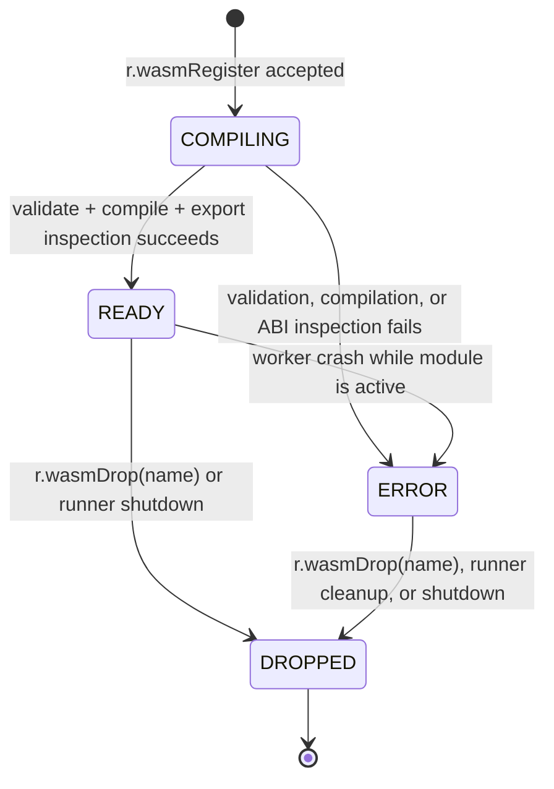

# WASM-based UDF Sandbox — RethinkDB v3.0

**Status:** Phase 3 axiom-level implementation specification  
**Scope:** Sandboxed WebAssembly user-defined functions evaluated by isolated extproc workers.  
**Repository:** `/home/kara/rethinkdb`  
**Status of this document:** Design only; it specifies no implementation patch.

## 1. Overview

### 1.1 Problem statement

The current ReQL UDF implementation is `r.js(source, {timeout})`. It evaluates a
JavaScript source string through the bundled quickjs-ng v0.15.1 C library at
`external/quickjs_0.15.1/`. A query-local `js_runner_t` uses `js_job_t` and
`extproc_job_t` to fork a worker process, then sends `TASK_EVAL`, `TASK_CALL`,
`TASK_RELEASE`, or `TASK_EXIT` messages over `read_stream_t` / `write_stream_t`.
The worker owns a `quickjs_context` (`JSRuntime` + `JSContext`) and a
`quickjs_env` mapping `js_id_t` to `JSValue`; `js_runner_t` maintains a
100-entry LRU cache of JavaScript source-to-function IDs.

This boundary protects the server from a crashed evaluator, but it is not a
complete UDF sandbox. JavaScript is the only supported language, the runtime is
native C code with a broad language surface, and execution is stopped by killing
the worker through `signal_timer_t` rather than by a deterministic in-engine
budget. The QuickJS dependency has also required security upgrades: for example,
CVE-2023-48184 (CVSS 9.8) was remediated by upgrading quickjs-ng. The feature
specified here provides a new WASM UDF facility rather than changing the
semantics of the existing JavaScript term.

WebAssembly provides a portable bytecode target for Rust, C/C++, Go, Zig,
AssemblyScript, and hand-authored WAT/wasm. Its linear-memory model, validated
module format, no-ambient-authority execution, and explicit imports make it a
better foundation for user-supplied compute. The server remains responsible for
all host capabilities; a module receives none unless RethinkDB explicitly
registers a host import.


The deployment boundary is intentionally identical in shape to the existing JS
boundary: the ReQL evaluation thread never invokes untrusted bytecode in the
main database process. Every timeout, crash, IPC error, malformed module, and
memory/fuel violation is converted into a ReQL error before it can corrupt or
block normal query execution.

### 1.2 Goals

1. Add direct, one-shot execution of an in-memory `r.binary(...)` WASM module.
2. Add named registration and reuse of compiled modules within a query execution
   environment and its associated extproc worker.
3. Permit modules produced by Rust, C/C++, Go, AssemblyScript, Zig, or any
   compiler that emits a validated core WebAssembly module.
4. Use Wasmtime fuel metering and linear-memory limits in addition to the
   existing process-level timeout sentry.
5. Preserve the current `r.js()` API and its QuickJS implementation unchanged.
6. Use the existing archive serialization and extproc IPC conventions rather
   than introducing a second worker transport.

### 1.3 Non-goals

This phase does **not** provide any of the following:

- WASI or another system interface: no filesystem, sockets, DNS, subprocesses,
  environment variables, clocks, random sources, standard input/output, or
  process spawning.
- WebAssembly threads, shared linear memory, atomics, SIMD host sharing, or
  cross-module memory access.
- Garbage-collector interoperation between a guest language runtime and the
  RethinkDB C++ heap.
- Dynamic linking, component-model loading, runtime module downloads, native
  shared-library loading, or a guest-visible package manager.
- Persistent database metadata for registered modules; registrations are scoped
  to the owning `env_t` / extproc worker and disappear on worker replacement or
  query completion.
- A replacement implementation for `r.js()` in v3.0. `r.js()` remains QuickJS
  for wire and driver compatibility; the new terms are the supported migration
  target for new UDFs.
- Use in generated-column expressions. WASM UDFs are non-deterministic from the
  query planner's perspective and may NOT be used in generated columns, exactly
  like `r.js()`.

### 1.4 Terminology and invariants

- **Module binary** means a complete WebAssembly core module held in an
  `R_BINARY` datum. It must begin with the WASM magic/version header and pass
  Wasmtime validation.
- **Registration** means validating and compiling a module once, assigning it a
  unique `name_string_t` within one `wasm_runner_t`, and retaining the compiled
  artifact in that worker's bounded LRU cache.
- **Instance** means a fresh Wasmtime store + instantiated module for one call.
  A compiled module is reusable; an instance is not reused across calls.
- **Fuel** is an unsigned count decremented by Wasmtime instrumentation. One
  metered WASM instruction consumes one fuel unit for purposes of this feature.
- **Page** means a 64 KiB WebAssembly memory page. The default 256 pages equals
  16 MiB.
- **No ambient authority** is an invariant. A module that imports a name not
  supplied by the exact allowlist fails instantiation; it does not receive a
  fallback implementation.

## 2. API Design / ReQL surface

### 2.1 New term numbers and exact wire contracts

`src/rdb_protocol/ql2.proto` shall extend `Term.TermType` with the following
previously unassigned values. The comments are part of the protocol contract and
must be copied verbatim into the enum.

```proto
// WebAssembly UDF operations. All module binaries are ReQL BINARY datums.
WASM          = 200; // BINARY, STRING, ARRAY, {timeout:NUMBER,
                     // memory_pages:NUMBER, fuel:NUMBER} -> DATUM
WASM_REGISTER = 201; // BINARY, {name:STRING, timeout:NUMBER,
                     // memory_pages:NUMBER, fuel:NUMBER} -> OBJECT
WASM_CALL     = 202; // STRING, STRING, ARRAY, {timeout:NUMBER,
                     // memory_pages:NUMBER, fuel:NUMBER} -> DATUM
WASM_LIST     = 203; // -> ARRAY
WASM_DROP     = 204; // STRING -> OBJECT
```

The number assignments are permanent once released. Drivers must construct the
normal `Term` protobuf shape: positional arguments in `args`, option arguments
in `optargs`, and `r.binary` encoded as `Term.BINARY` / an `R_BINARY` datum
according to existing driver conventions. No new protobuf message is added.

### 2.2 One-shot execution: `r.wasm`

```javascript
r.wasm(moduleBinary, functionName, args, {
  timeout: 5,
  memory_pages: 256,
  fuel: 1000000
})
```

`moduleBinary` is required and must evaluate to `datum_t::type_t::R_BINARY`.
`functionName` is required and must evaluate to a non-empty string. `args` is
required and must evaluate to an array datum. `timeout`, if specified, is a
finite non-negative numeric value in seconds, converted to milliseconds using
the same saturating conversion used by `r.js()`. `memory_pages` and `fuel`, if
specified, must be finite integral numbers in their stated ranges.

`r.wasm` performs this exact sequence:

1. Evaluate the three positional arguments before entering the worker.
2. Validate the module binary and effective limits in `wasm_term_t`.
3. Send `TASK_WASM_EVAL` with the module bytes, function name, argument array,
   and resolved `wasm_call_config_t`.
4. Compile, instantiate, call, marshal the return value, and discard the
   instance in the worker.
5. Return the resulting datum or raise the catalogued ReQL error.

A one-shot call does **not** populate the named module registry. It may populate
the worker's compiled-module LRU keyed by SHA-256(binary) plus effective engine
configuration, so a repeated equal binary need not recompile during the same
worker lifetime.

Example:

```javascript
const bytes = r.binary(wasm_add_module_bytes);
r.wasm(bytes, "add", [1, 2]) // 3
```

### 2.3 Registration: `r.wasmRegister`

```javascript
r.wasmRegister(moduleBinary, {
  name: "math",
  timeout: 5,
  memory_pages: 256,
  fuel: 1000000
})
// {registered: 1, name: "math", exports: ["add", "fib"]}
```

The term requires exactly one positional BINARY argument and exactly one
required optarg `name`. It accepts the same optional resource-limit optargs as
`r.wasm`. The name must be a valid non-empty `name_string_t`; it is case-sensitive
and unique within the runner. Registration validates and compiles synchronously
in the worker. The response object has exactly these fields:

```javascript
{
  registered: 1,
  name: "math",
  exports: ["add", "fib"]
}
```

`exports` contains only exported callable functions whose type conforms to the
ABI defined in section 4.6, sorted lexicographically by UTF-8 byte sequence.
Non-function exports such as memory, table, global, and tag are omitted.

### 2.4 Invocation of a registered module: `r.wasmCall`

```javascript
r.wasmCall("math", "fib", [10], {timeout: 2, fuel: 2000000}) // 55
```

`r.wasmCall` requires name, function name, and an array argument list. It obtains
the existing `wasm_module_entry_t` by name and uses its stored configuration as
the base limits. Supplying an optarg overrides only the matching call-local
limit; the override is validated against the runtime hard caps. A call-local
override never mutates the registered module's persisted configuration.

The term sends `TASK_WASM_CALL` with the name, function name, arguments, and
fully resolved configuration. If the worker has been replaced after registration,
the registry is empty and the result is `WASM_MODULE_NOT_FOUND`; the client must
register again. This explicit behavior avoids silently reloading arbitrary bytes
from main-process memory after a worker crash.

### 2.5 Registry administration

```javascript
r.wasmList()
// [{name: "math", state: "READY", exports: ["add", "fib"],
//   memory_pages: 256, fuel: 1000000, timeout: 5}]

r.wasmDrop("math")
// {dropped: 1, name: "math"}
```

`r.wasmList()` has zero positional arguments and zero optargs. It returns an
array sorted by module name. Each object has exactly `name`, `state`, `exports`,
`memory_pages`, `fuel`, and `timeout`; `timeout` is expressed in seconds as a
number, preserving the user-facing ReQL unit.

`r.wasmDrop(name)` requires one non-empty string argument and no optargs. It
removes the registration, its compiled handle, and every cache entry keyed by
that registration. It returns the stated response only after the worker confirms
removal. Dropping a non-existent name raises `WASM_MODULE_NOT_FOUND`; it does
not return `{dropped: 0}`.

### 2.6 Optarg validation table

| Optarg | Type | Default | Inclusive range | Meaning |
|---|---|---:|---|---|
| `timeout` | finite integral NUMBER seconds | 5 | 0..`UINT64_MAX / 1000` | Wall-clock deadline; `0` allows no execution time and immediately times out if work is attempted. |
| `memory_pages` | finite integral NUMBER | 256 | 1..65536 | Maximum guest linear-memory pages; 256 pages is 16 MiB. |
| `fuel` | finite integral NUMBER | 1,000,000 | 1..`UINT64_MAX` | Initial and maximum fuel for one instantiation/call. |

Non-integral, NaN, infinity, negative, zero (where the range excludes zero),
unknown optargs, or a `memory_pages` value above 65536 cause
`WASM_INVALID_ARG` before an IPC message is emitted. The driver must not infer
support from the server version; it must use the normal protocol/version feature
negotiation machinery once the terms land.

### 2.7 Compatibility and JavaScript shim decision

No `r.js` compatibility shim converts JavaScript source to WebAssembly. JavaScript
source has semantics, dynamic imports, and value behavior that cannot be safely
or transparently translated. The term switch remains:

```cpp
case Term::JAVASCRIPT: return make_javascript_term(env, t);  // unchanged
case Term::WASM:       return make_wasm_term(env, t);
case Term::WASM_REGISTER: return make_wasm_register_term(env, t);
case Term::WASM_CALL:  return make_wasm_call_term(env, t);
case Term::WASM_LIST:  return make_wasm_list_term(env, t);
case Term::WASM_DROP:  return make_wasm_drop_term(env, t);
```

`tableCreate(..., {js: "quickjs"})` remains the only supported per-table JS
configuration in v3.0. The schema-facing compatibility direction for a later
major release is `r.tableCreate("t", {js: "wasm"})`, but this specification
does not add that optarg, persist a module reference in table metadata, or modify
the current QuickJS path. Any generated-column validation must reject all five
WASM term types as non-deterministic UDFs.

## 3. Data structures

### 3.1 Header ownership and includes

`src/rdb_protocol/wasm_udf.hpp` owns durable IPC/value types and must include
`<cstdint>`, `<string>`, `<vector>`, `containers/archive/archive.hpp`,
`containers/name_string.hpp`, `rdb_protocol/datum.hpp`, and
`rpc/serialize_macros.hpp`. It must not include Wasmtime headers: the runtime
handle stays behind the `src/extproc/wasm_job.cc` implementation boundary.

`src/extproc/wasm_runner.hpp` owns only main-process runner types and must
forward-declare `extproc_pool_t`, `wasm_job_t`, and `wasm_compiled_module_t`.
`src/extproc/wasm_job.hpp` declares job transport methods and includes the same
archive/datum headers as `js_job.hpp` plus `rdb_protocol/wasm_udf.hpp`.

### 3.2 Serializable UDF value definitions

The following declarations are the canonical C++ definitions. Field order is
serialization order. Do not reorder fields after a released cluster version.

```cpp
// src/rdb_protocol/wasm_udf.hpp
#ifndef RDB_PROTOCOL_WASM_UDF_HPP_
#define RDB_PROTOCOL_WASM_UDF_HPP_

#include <cstdint>
#include <string>
#include <vector>

#include "containers/archive/archive.hpp"
#include "containers/name_string.hpp"
#include "rdb_protocol/datum.hpp"
#include "rpc/serialize_macros.hpp"

namespace ql {

class wasm_module_binary_t {
public:
    wasm_module_binary_t() = default;
    explicit wasm_module_binary_t(std::vector<uint8_t> bytes)
        : bytes_(std::move(bytes)) { }

    const std::vector<uint8_t> &bytes() const { return bytes_; }
    bool empty() const { return bytes_.empty(); }

    RDB_DECLARE_ME_SERIALIZABLE(wasm_module_binary_t);

private:
    std::vector<uint8_t> bytes_;
};

enum class wasm_module_state_t : int8_t {
    COMPILING = 0,
    READY = 1,
    ERROR = 2,
    DROPPED = 3
};

ARCHIVE_PRIM_MAKE_RANGED_SERIALIZABLE(
    wasm_module_state_t, int8_t,
    wasm_module_state_t::COMPILING, wasm_module_state_t::DROPPED);

class wasm_module_config_t {
public:
    name_string_t name;
    wasm_module_binary_t binary;
    uint32_t memory_pages = 256;
    uint64_t fuel_limit = 1000000;
    uint64_t timeout_ms = 5000;
    std::vector<std::string> exports;

    RDB_DECLARE_ME_SERIALIZABLE(wasm_module_config_t);
};

class wasm_call_config_t {
public:
    uint32_t memory_pages = 256;
    uint64_t fuel_limit = 1000000;
    uint64_t timeout_ms = 5000;

    RDB_DECLARE_ME_SERIALIZABLE(wasm_call_config_t);
};

class wasm_call_request_t {
public:
    wasm_module_binary_t binary;
    std::string function_name;
    std::vector<datum_t> args;
    wasm_call_config_t config;

    RDB_DECLARE_ME_SERIALIZABLE(wasm_call_request_t);
};

class wasm_registered_call_request_t {
public:
    name_string_t module_name;
    std::string function_name;
    std::vector<datum_t> args;
    wasm_call_config_t config;

    RDB_DECLARE_ME_SERIALIZABLE(wasm_registered_call_request_t);
};

class wasm_module_list_entry_t {
public:
    name_string_t name;
    wasm_module_state_t state = wasm_module_state_t::ERROR;
    std::vector<std::string> exports;
    uint32_t memory_pages = 256;
    uint64_t fuel_limit = 1000000;
    uint64_t timeout_ms = 5000;

    RDB_DECLARE_ME_SERIALIZABLE(wasm_module_list_entry_t);
};

class wasm_module_result_t {
public:
    bool ok = false;
    datum_t datum;
    std::string error_code;
    std::string error_message;

    RDB_DECLARE_ME_SERIALIZABLE(wasm_module_result_t);
};

}  // namespace ql
#endif  // RDB_PROTOCOL_WASM_UDF_HPP_
```

`wasm_module_binary_t` is the only byte-container transport type. A ReQL BINARY
is copied into it using the existing `datum_t` binary accessor; the conversion
must preserve every byte including NUL values. It is never converted through
`std::string` or JSON on the main-process-to-worker transport.

### 3.3 Runtime-only structures

The compiled Wasmtime artifact cannot be archive-serialized: it is native
runtime state tied to one engine and process. The registry serializes only its
metadata and explicitly reinitializes the handle on decode. This distinction is
mandatory; never serialize a Wasmtime pointer, store, linker, instance, or
memory pointer.

```cpp
// src/extproc/wasm_runner.hpp
#ifndef EXTPROC_WASM_RUNNER_HPP_
#define EXTPROC_WASM_RUNNER_HPP_

#include <cstddef>
#include <map>
#include <string>
#include <vector>

#include "arch/timing.hpp"
#include "containers/counted.hpp"
#include "containers/scoped.hpp"
#include "concurrency/wait_any.hpp"
#include "rdb_protocol/wasm_udf.hpp"
#include "thread_local.hpp"

class extproc_pool_t;
class wasm_job_t;
class wasm_timeout_t;
class wasm_compiled_module_t;

class wasm_module_entry_t {
public:
    ql::wasm_module_config_t config;
    ql::wasm_module_state_t state = ql::wasm_module_state_t::COMPILING;
    std::string last_error;
    scoped_ptr_t<wasm_compiled_module_t> compiled_module;

    RDB_DECLARE_ME_SERIALIZABLE(wasm_module_entry_t);

private:
    DISABLE_COPYING(wasm_module_entry_t);
};

class wasm_runtime_config_t {
public:
    enum class engine_t : int8_t { WASMTIME = 0 };

    engine_t engine = engine_t::WASMTIME;
    size_t compiled_cache_size = 100;
    uint32_t default_memory_pages = 256;
    uint32_t max_memory_pages = 65536;
    uint64_t default_fuel_limit = 1000000;
    uint64_t default_timeout_ms = 5000;

    RDB_DECLARE_ME_SERIALIZABLE(wasm_runtime_config_t);
};

ARCHIVE_PRIM_MAKE_RANGED_SERIALIZABLE(
    wasm_runtime_config_t::engine_t, int8_t,
    wasm_runtime_config_t::engine_t::WASMTIME,
    wasm_runtime_config_t::engine_t::WASMTIME);

class wasm_runner_t : public home_thread_mixin_t {
public:
    wasm_runner_t();
    ~wasm_runner_t();

    bool connected() const;
    void begin(extproc_pool_t *pool, signal_t *interruptor,
               const ql::configured_limits_t &limits,
               const wasm_runtime_config_t &runtime_config);
    void end();

    ql::wasm_module_result_t eval(const ql::wasm_call_request_t &request);
    ql::wasm_module_result_t register_module(const ql::wasm_module_config_t &config);
    ql::wasm_module_result_t call(const ql::wasm_registered_call_request_t &request);
    std::vector<ql::wasm_module_list_entry_t> list();
    ql::wasm_module_result_t drop(const name_string_t &name);

private:
    class job_data_t;
    scoped_ptr_t<job_data_t> job_data;
    DISABLE_COPYING(wasm_runner_t);
};

#endif  // EXTPROC_WASM_RUNNER_HPP_
```

`wasm_module_entry_t` uses custom serialization rather than a field-count macro:

```cpp
// src/extproc/wasm_runner.cc
RDB_MAKE_SERIALIZABLE_3(wasm_module_entry_t, config, state, last_error);
INSTANTIATE_SERIALIZABLE_SINCE_v2_5(wasm_module_entry_t);
```

After deserialization, `compiled_module` must be empty and `state` must be set to
`ERROR` with `last_error = "WASM worker state is not transferable."` before the
entry is observable. In normal operation entries never cross a process boundary;
the declaration exists to prevent accidental non-serializable registry additions
and to make unit round-trip behavior explicit.

The remaining generated definitions are:

```cpp
// src/rdb_protocol/wasm_udf.cc
RDB_MAKE_SERIALIZABLE_1(wasm_module_binary_t, bytes_);
RDB_MAKE_SERIALIZABLE_6(wasm_module_config_t, name, binary, memory_pages,
                        fuel_limit, timeout_ms, exports);
RDB_MAKE_SERIALIZABLE_3(wasm_call_config_t, memory_pages, fuel_limit, timeout_ms);
RDB_MAKE_SERIALIZABLE_4(wasm_call_request_t, binary, function_name, args, config);
RDB_MAKE_SERIALIZABLE_4(wasm_registered_call_request_t, module_name,
                        function_name, args, config);
RDB_MAKE_SERIALIZABLE_6(wasm_module_list_entry_t, name, state, exports,
                        memory_pages, fuel_limit, timeout_ms);
RDB_MAKE_SERIALIZABLE_4(wasm_module_result_t, ok, datum, error_code, error_message);
INSTANTIATE_SERIALIZABLE_SINCE_v2_5(wasm_module_binary_t);
INSTANTIATE_SERIALIZABLE_SINCE_v2_5(wasm_module_config_t);
INSTANTIATE_SERIALIZABLE_SINCE_v2_5(wasm_call_config_t);
INSTANTIATE_SERIALIZABLE_SINCE_v2_5(wasm_call_request_t);
INSTANTIATE_SERIALIZABLE_SINCE_v2_5(wasm_registered_call_request_t);
INSTANTIATE_SERIALIZABLE_SINCE_v2_5(wasm_module_list_entry_t);
INSTANTIATE_SERIALIZABLE_SINCE_v2_5(wasm_module_result_t);

// src/extproc/wasm_runner.cc
RDB_MAKE_SERIALIZABLE_6(wasm_runtime_config_t, engine, compiled_cache_size,
                        default_memory_pages, max_memory_pages,
                        default_fuel_limit, default_timeout_ms);
INSTANTIATE_SERIALIZABLE_SINCE_v2_5(wasm_runtime_config_t);
```

### 3.4 Result and task protocol

The worker does not throw an arbitrary native exception over IPC. Every expected
WASM failure returns `wasm_module_result_t{ok=false, datum_t(), code, message}`.
Only transport corruption, EOF, failed write, or a worker death causes
`extproc_worker_exc_t` in the main process.

```cpp
// src/extproc/wasm_job.cc
namespace {
enum wasm_task_t : uint8_t {
    TASK_WASM_EVAL = 0,
    TASK_WASM_CALL = 1,
    TASK_WASM_REGISTER = 2,
    TASK_WASM_LIST = 3,
    TASK_WASM_DROP = 4,
    TASK_WASM_EXIT = 5
};
}  // namespace
```

The exact payload sequence after the one-byte task discriminator is:

| Task | Serialized values, in order | Response |
|---|---|---|
| `TASK_WASM_EVAL` | `wasm_call_request_t` | `wasm_module_result_t` |
| `TASK_WASM_CALL` | `wasm_registered_call_request_t` | `wasm_module_result_t` |
| `TASK_WASM_REGISTER` | `wasm_module_config_t` | `wasm_module_result_t` |
| `TASK_WASM_LIST` | none | `std::vector<wasm_module_list_entry_t>` |
| `TASK_WASM_DROP` | `name_string_t` | `wasm_module_result_t` |
| `TASK_WASM_EXIT` | none | `bool(true)` |

The task byte is appended with `write_message_t::append(&task, sizeof(task))`.
Each remaining value uses
`serialize<cluster_version_t::LATEST_OVERALL>`. The worker uses matching
`deserialize<cluster_version_t::LATEST_OVERALL>` calls. A malformed discriminator
or payload returns `false` from `worker_fn`, causing extproc cleanup; it is not
interpreted as a guest error.

### 3.5 Datum and ABI types

A module binary is represented at the ReQL boundary by `datum_t::R_BINARY`. Call
arguments and results use JSON UTF-8 stored inside the module's isolated linear
memory. The ABI is fixed because it is language-neutral and does not expose C++
object layout:

```c
// Guest ABI required by every callable exported function.
// ReQL supplies UTF-8 JSON representing the complete args array.
// The return value is an i64: (uint64_t(result_ptr) << 32) | result_len.
// result_ptr/result_len refer to bytes in the module's exported memory.
typedef uint64_t (*rdb_wasm_export_t)(uint32_t args_ptr, uint32_t args_len);
```

A callable module must export:

```text
memory: Memory
rethinkdb_alloc: (i32 byte_len) -> i32
<user-selected function>: (i32 args_ptr, i32 args_len) -> i64
```

The module may export `rethinkdb_dealloc(i32 ptr, i32 len) -> ()`; RethinkDB
calls it after reading a result only when it exists with exactly that signature.
If missing, result storage is reclaimed only when the per-call instance is
destroyed. RethinkDB always destroys the instance after one call, so no leak
survives to another query.

Supported JSON-to-datum types are null, boolean, finite number, UTF-8 string,
array, object, and RethinkDB pseudotypes that already serialize to valid datum
JSON. Input `R_BINARY`, `MINVAL`, and `MAXVAL` are rejected with
`WASM_UNSUPPORTED_TYPE`; binary module bytes are accepted only in the module
position, never as guest JSON arguments. A parsed return must satisfy existing
`configured_limits_t` datum depth, array, object, and size limits. The existing
JS recursion maximum of 500 is retained as the default maximum traversal depth
for the JSON parser/serializer used by this feature.

## 4. Core engine design

### 4.1 Runtime selection

The selected runtime is **Wasmtime**, consumed through its stable C API. It is a
production-grade implementation with mature validation, configurable fuel
metering, configurable resource limiting, trap reporting, and optional WASI that
is deliberately not linked or configured here. It is the only runtime permitted
by `wasm_runtime_config_t::engine_t` in this phase.

| Runtime | Decision | Advantages | Rejection reason for v3.0 |
|---|---|---|---|
| Wasmtime | Selected | Mature C API, fuel, epoch interruption, resource limiter, maintained validator and compiler | Bundled dependency is larger than a minimal interpreter. |
| Wasmer | Not selected | Broad language ecosystem, C API | Fuel/limiting integration and stable embedding surface are less aligned with this fixed extproc design. |
| wasm3 | Not selected | Very small interpreter footprint | No production-equivalent compilation cache and resource-control surface for the stated throughput and isolation targets. |
| wazero | Not selected | Strong pure-Go embedding model | Go API only; would add a Go bridge/process instead of direct C++ extproc integration. |

`external/wasmtime/` is vendored and built as a bundled native dependency in the
same manner that `external/quickjs_0.15.1/` is bundled today. The build imports
only the Wasmtime C API headers/library required for core WASM. The configure and
build rules must disable WASI, component-model, CLI, examples, profiling agents,
and network fetches. The vendored revision and its checksums must be recorded in
the external dependency metadata used by the repository.

### 4.2 Engine creation and mandatory settings

Each WASM extproc worker owns exactly one `wasm_engine_t` and one
`wasm_config_t` for its entire process lifetime. `wasmtime_config_consume_fuel`
must be enabled before engine creation. The engine is initialized as follows:

```cpp
wasm_config_t *config = wasm_config_new();
wasmtime_config_consume_fuel_set(config, true);
wasmtime_config_wasm_threads_set(config, false);
wasmtime_config_wasm_simd_set(config, false);
wasmtime_config_wasm_reference_types_set(config, false);
wasmtime_config_wasm_multi_memory_set(config, false);
wasmtime_engine_t *engine = wasm_engine_new_with_config(config);
```

The exact Wasmtime API names must be confirmed against the vendored version at
integration time; if an option is unavailable in that release, the configure
step must fail rather than silently enabling the feature. The implementation must
not use an engine configuration that accepts shared memory, threads, or
multi-memory. Core WASM MVP memory and function exports are sufficient.

### 4.3 Compilation and module lifecycle

Registration and one-shot compilation follow this algorithm:

```text
1. Reject empty binary and byte size > configured module-byte ceiling (16 MiB).
2. Validate WASM magic/version and call wasmtime_module_validate(engine, bytes).
3. Compile with wasmtime_module_new(engine, bytes, len, &module).
4. Inspect exports; retain only ABI-compatible exported functions for the list.
5. For registration, reject duplicate name before inserting an entry.
6. Create entry in COMPILING state, then attach compiled module and export list.
7. Transition to READY atomically only after all steps succeed.
8. On validation/compile/export inspection failure, set ERROR and retain the
   normalized error string for the operation response; do not cache a handle.
```

Compiled modules are cached, not source text or live instances. Cache key:

```text
SHA-256(module bytes) + engine version + memory_pages hard cap + ABI version "rdb-wasm-json-v1"
```

The cache has `wasm_runtime_config_t::compiled_cache_size` entries, default 100,
and evicts the least-recently-used unregistered entry first. A registered module
pins its compiled entry. If all 100 entries are registered/pinned, a one-shot
call may compile and execute without inserting into the cache; it must not evict
a named module. Registration of entry 101 fails with `WASM_COMPILE_ERROR` whose
underlying error text is `compiled module cache is full of registered modules`.

### 4.4 Per-call instantiation

A compiled module is never executed directly. `wasm_runtime_t::call` creates a
fresh Wasmtime store, store context, limiter state, linker, and module instance
for each `TASK_WASM_EVAL` and `TASK_WASM_CALL` execution:

```text
1. Allocate wasm_call_limits_t from resolved memory_pages and fuel_limit.
2. Create store with a pointer to wasm_call_context_t as store data.
3. Attach the resource limiter to the store.
4. Add exactly fuel_limit units with wasmtime_context_add_fuel.
5. Define the allowlisted r.get, r.expr, and r.error imports in linker module "r".
6. Instantiate the compiled module; reject unresolved imports.
7. Obtain exported memory, rethinkdb_alloc, and requested function.
8. Serialize ReQL args to UTF-8 JSON and copy bytes into guest allocation.
9. Invoke the exported function under the process-level timeout sentry.
10. Decode the i64 pointer/length result, bounds-check it against exported memory,
    copy the JSON return bytes, parse them to datum, and destroy the instance/store.
```

The call holds no store, instance, memory, JSON buffer pointer, `wasmtime_error_t`,
or `wasm_trap_t` after step 10. Errors are normalized before cleanup so all
native Wasmtime allocation paths free their temporary error/trap objects.

### 4.5 Fuel and memory enforcement

Fuel accounting is enabled for every engine. The worker calls
`wasmtime_context_add_fuel(context, config.fuel_limit)` immediately before
instantiation. A trap recognized as OutOfFuel produces `WASM_FUEL_EXHAUSTED`;
it never becomes a generic compile or worker crash error.

The store resource limiter allows a maximum of `memory_pages * 65536` bytes for
the guest's single linear memory. It rejects both initial-memory declarations
above the resolved limit and later `memory.grow` attempts. A rejected allocation
or grow maps to `WASM_MEMORY_LIMIT`. The implementation validates
`memory_pages <= 65536` in the main process and repeats the validation in the
worker before constructing the limiter. The duplicate validation is required
because extproc requests are an untrusted byte stream once a worker is isolated.

Module table growth, multiple memories, shared memories, and non-zero
initial/maximum shared-memory parameters are rejected during module validation.
The runtime must report the normalized Wasmtime validation message inside
`WASM_COMPILE_ERROR` for these unsupported module features.

### 4.6 Guest ABI, host imports, and marshalling

The selected marshalling design is JSON over an explicit guest-owned shared
buffer, not native C++ FFI/struct passing. This avoids compiler ABI differences,
pointer-width ambiguity, alignment rules, GC ownership hazards, and bindings
that vary by guest language. It is intentionally slower than a specialized ABI
but safe, inspectable, and compatible with all target toolchains.

The call input is a JSON array. For example, ReQL `r.wasm(bytes, "add", [1, 2])`
writes `[1,2]` to guest memory and calls `add(args_ptr, 5)`. An AssemblyScript
function must parse that JSON and return a pointer/length-packed `i64`; a Rust
function follows the same contract. The specification test modules in
`test/wasm/` are canonical examples and must be used by each language binding.

Only these imports are defined, all under module namespace `r`:

| Import | Guest signature | Behavior |
|---|---|---|
| `r.get` | `(i32 name_ptr, i32 name_len) -> i64` | Read a named property from the call's explicit row datum, JSON-serialize it, allocate bytes with the host result allocator, and return packed pointer/length. Missing property serializes as `null`. |
| `r.expr` | `(i32 json_ptr, i32 json_len) -> i64` | Validate guest JSON against datum limits, normalize it through `datum_t`, JSON-serialize the normalized datum, and return packed pointer/length. It does not evaluate ReQL or access tables. |
| `r.error` | `(i32 msg_ptr, i32 msg_len) -> ()` | Read UTF-8 bytes, truncate safely to 4096 bytes, record a guest-visible user error, and trap the call. |

`r.get` receives an empty row datum for direct `r.wasm` and `r.wasmCall` calls;
it therefore returns `null` unless a later ReQL integration supplies an explicit
row. This preserves a stable ABI without granting implicit table access. Host
imports must bounds-check every pointer and length using overflow-safe
`uint64_t` arithmetic before copying from guest memory. Invalid UTF-8, an
out-of-range slice, or a return result whose high/low 32-bit fields overflow the
current memory length produces `WASM_SERIALIZATION_ERROR`.

Native FFI struct passing is explicitly rejected for this phase. Do not expose
`datum_t *`, `val_t *`, `env_t *`, raw database pointers, allocator callbacks,
or arbitrary host function pointers to a WASM instance.

### 4.7 Extproc design and timeout handling

`wasm_job_t` follows `js_job_t`: it wraps one `extproc_job_t`, sends a task byte
and archive values, then deserializes a reply. `wasm_runner_t` follows
`js_runner_t`: its `job_data_t` owns a `wasm_timeout_t`, `wait_any_t` combining
the query interruptor and timer signal, `wasm_job_t`, and the main-process LRU
metadata. `env_t` gains `get_wasm_runner()` with the same lazy `begin()` pattern
as its existing `get_js_runner()`.

A `wasm_timeout_t::sentry_t` starts immediately before sending `TASK_WASM_EVAL`,
`TASK_WASM_CALL`, `TASK_WASM_REGISTER`, or `TASK_WASM_DROP`; registration can
compile arbitrarily complex valid bytecode and must be bounded too. `LIST` is
local worker metadata and also uses the sentry to avoid an indefinitely wedged
worker. On `interrupted_exc_t`, `wasm_runner_t` checks whether its timer pulsed,
marks `wasm_job_t` errored, drops `job_data`, and returns `WASM_TIMEOUT`.

The initial implementation retains the proven process-level `signal_timer_t`
mechanism used by `js_runner_t`. Wasmtime's fuel trap provides deterministic
compute control for normal code; process termination is the final safety boundary
for compiler hangs, native runtime bugs, or host-call deadlock. The worker is
never reused after either timer-based cancellation or an extproc transport error.

### 4.8 Determinism and query semantics

All five terms return `deterministic_t::no()` and are forbidden where RethinkDB
requires deterministic terms. Specifically, generated-column expression
validation must reject `Term::WASM`, `Term::WASM_REGISTER`, `Term::WASM_CALL`,
`Term::WASM_LIST`, and `Term::WASM_DROP` with the established generated-column
non-determinism error path. The runtime must not special-case a module simply
because it currently imports no host functions; future runtime or dependency
changes could invalidate that inference.

Registration is scoped to the execution environment, not to database state or
the cluster. A ReQL query cannot use a registration created in a different
connection/query worker. Drivers that need reuse should issue a registration and
calls in a single query/session in the same manner they currently reuse a JS
function source through `js_runner_t`'s worker-local cache.

## 5. Integration points

### 5.1 Files to add

| Path | Required contents |
|---|---|
| `src/rdb_protocol/wasm_udf.hpp` | Serializable module/call/config/result declarations from section 3. |
| `src/rdb_protocol/wasm_udf.cc` | Serialization field macros and instantiations. |
| `src/rdb_protocol/terms/wasm.cc` | Five ReQL `op_term_t` subclasses and term factories. |
| `src/extproc/wasm_runner.hpp` | Main-process `wasm_runner_t`, runtime config, and entry declarations. |
| `src/extproc/wasm_runner.cc` | Timeout sentry, request validation, LRU policy, worker-error cleanup. |
| `src/extproc/wasm_job.hpp` | `wasm_job_t` public transport declaration. |
| `src/extproc/wasm_job.cc` | Task enum, worker loop, Wasmtime embedding, host imports, marshaling. |
| `src/unittest/wasm_udf.cc` | Unit suite specified in section 9. |
| `test/rql_test/src/wasm.yaml` | Integration workload specified in section 9. |
| `test/wasm/` | Versioned Rust and AssemblyScript source plus reproducible test binaries. |

### 5.2 Files to modify

| Path | Exact change |
|---|---|
| `src/rdb_protocol/ql2.proto` | Add `WASM = 200`, `WASM_REGISTER = 201`, `WASM_CALL = 202`, `WASM_LIST = 203`, and `WASM_DROP = 204` with section 2.1 comments. Regenerate protocol bindings through the repository's normal protobuf build rule. |
| `src/rdb_protocol/term.cc` | Add five switch cases in `compile_on_current_stack` mapping the new enum values to factory functions. |
| `src/rdb_protocol/terms/terms.hpp` | Declare `make_wasm_term`, `make_wasm_register_term`, `make_wasm_call_term`, `make_wasm_list_term`, and `make_wasm_drop_term`. |
| `src/rdb_protocol/env.hpp` | Forward-declare/include `wasm_runner_t`, add a `wasm_runner_t wasm_runner_;` member, and declare `wasm_runner_t *get_wasm_runner();`. |
| `src/rdb_protocol/env.cc` | Implement lazy `get_wasm_runner()` using the same extproc pool, interruptor, and configured limits as `get_js_runner()`, plus the default `wasm_runtime_config_t`. |
| `src/rdb_protocol/term_walker.cc` | Add all five term types to every switch that recognizes a leaf/function/non-deterministic term, preserving exhaustive switch behavior. |
| `src/build.mk` | Compile/link the six production `.cc` files, the unit test, generated ql2 output, and bundled Wasmtime C API library. |
| `external/` build metadata | Vendor `external/wasmtime/`, its license notices, checksum/revision metadata, and a deterministic build rule. |
| Generated-column term validation | Reject all new WASM term enums with the same restriction currently applied to `Term::JAVASCRIPT`. |

No JavaScript source file (`src/extproc/js_job.*`, `src/extproc/js_runner.*`, or
`src/rdb_protocol/terms/js.cc`) is modified for behavior. The only acceptable
adjacent change is adding `get_wasm_runner()` beside the existing JS accessor.

### 5.3 Exact term factory signatures

Add these declarations in the `// js.cc` vicinity of `terms.hpp`, renamed to a
neutral `// UDF terms` comment only if that edit is necessary for clarity:

```cpp
// wasm.cc
counted_t<term_t> make_wasm_term(
    compile_env_t *env, const raw_term_t &term);
counted_t<term_t> make_wasm_register_term(
    compile_env_t *env, const raw_term_t &term);
counted_t<term_t> make_wasm_call_term(
    compile_env_t *env, const raw_term_t &term);
counted_t<term_t> make_wasm_list_term(
    compile_env_t *env, const raw_term_t &term);
counted_t<term_t> make_wasm_drop_term(
    compile_env_t *env, const raw_term_t &term);
```

The five classes use these argument specs:

```cpp
wasm_term_t:          argspec_t(3), optargspec_t({"timeout", "memory_pages", "fuel"})
wasm_register_term_t: argspec_t(1), optargspec_t({"name", "timeout", "memory_pages", "fuel"})
wasm_call_term_t:     argspec_t(3), optargspec_t({"timeout", "memory_pages", "fuel"})
wasm_list_term_t:     argspec_t(0), optargspec_t({})
wasm_drop_term_t:     argspec_t(1), optargspec_t({})
```

Each `eval_impl` must call the normal `args_t::arg` / `args_t::optarg` evaluators
exactly once per input, validate resolved datums, and create the request object
before obtaining the runner. This ensures syntax/type errors have a normal ReQL
backtrace and cannot be mistaken for worker faults.

### 5.4 Main-process result translation

`wasm_module_result_t` is translated in `terms/wasm.cc` as follows:

```text
ok == true                     -> new_val(result.datum)
error_code == WASM_COMPILE_ERROR -> rfail(base_exc_t::LOGIC, "%s", error_message)
all other known WASM codes     -> rfail(base_exc_t::RUNTIME, "%s", error_message)
unknown error_code             -> rfail(base_exc_t::INTERNAL,
                                 "WASM worker returned unknown error code '%s'.", code)
extproc_worker_exc_t           -> rfail(base_exc_t::INTERNAL,
                                 "WASM worker process crashed during execution")
```

The messages in section 8 are complete user-visible strings; term code must not
prepend `WASM_*:` or alter punctuation. Backtrace attachment is supplied by the
existing `rfail` path and the term instance as it is for `javascript_term_t`.

### 5.5 Build and dependency wiring

`src/build.mk` must add these to the appropriate source variables rather than a
new ad hoc compiler invocation:

```make
RDB_PROTOCOL_SOURCES += rdb_protocol/wasm_udf.cc rdb_protocol/terms/wasm.cc
EXTPROC_SOURCES += extproc/wasm_runner.cc extproc/wasm_job.cc
UNITTEST_SOURCES += unittest/wasm_udf.cc
```

The exact variable names must match the existing build file; the names above
describe ownership, not permission to create parallel source lists. Wasmtime
must compile as a static library with position-independent code where the
existing RethinkDB link platform requires it. Link ordering must place the
Wasmtime library before its Rust/C++ system-library dependencies and must not
remove QuickJS from the link while `r.js()` remains supported.

The external build rule must be hermetic: it receives vendored source, builds
without downloading crates/network artifacts, records compiler/version flags in
the normal configure output, and fails configure if the required Wasmtime C API
library/header is missing. The distribution target must include the vendored
source and license files.

### 5.6 Compatibility and migration behavior

Existing `r.js(source, {timeout})` calls retain exact current behavior, including
QuickJS value conversion, timeout strings, source-function caching, and worker
crash recovery. Existing table configuration that names `quickjs` is unchanged.
There is no automatic source translation and no server-side fallback from WASM
to QuickJS or from QuickJS to WASM.

A migration is explicit:

```text
1. Reimplement the JS function in a WASM-capable language against rdb-wasm-json-v1.
2. Compile it to a core .wasm file with no WASI imports.
3. Exercise it with r.wasm(binary, export, args) in staging.
4. Register/call it within each required application query context.
5. Retain r.js only for functions that cannot yet satisfy the WASM ABI.
```

## 6. Security sandbox

### 6.1 Capability model

A WASM module begins with **zero ambient authority**. Its code can calculate and
read/write only its own linear memory. Host interaction occurs solely through
imports supplied in the linker. The only linker definitions are `r.get`,
`r.expr`, and `r.error` under module namespace `r`, with the precise signatures
in section 4.6. No default linker definitions, WASI linker helpers, or host
preopens are registered.

The linker checks every declared import at instantiation. Any import other than
the precise allowlist, including a misspelled `r.get`, fails with
`WASM_INSTANTIATE_ERROR`. The error includes Wasmtime's import-resolution detail
as `{error}` without exposing main-process paths or environment values.

### 6.2 Explicitly absent WASI capabilities

The implementation must not create `wasi_config_t`, invoke
`wasmtime_linker_define_wasi`, call a WASI convenience initializer, or link a
WASI preview module. The following imports must be unresolved and therefore fail
instantiation:

```text
wasi_snapshot_preview1.fd_read
wasi_snapshot_preview1.fd_write
wasi_snapshot_preview1.path_open
wasi_snapshot_preview1.sock_accept
wasi_snapshot_preview1.clock_time_get
wasi_snapshot_preview1.random_get
wasi_snapshot_preview1.environ_get
wasi_snapshot_preview1.proc_exit
```

Consequently the guest has no filesystem, network, process, environment, clock,
or randomness interface. `r.error` is not a substitute for `proc_exit`: it only
converts a bounded guest string to a ReQL runtime error.

### 6.3 Resource boundaries

| Resource | Default | Hard rule | Enforcement point |
|---|---:|---|---|
| Linear memory | 256 pages / 16 MiB | 1..65,536 pages; no shared memory | Wasmtime store resource limiter |
| Fuel | 1,000,000 | 1..`UINT64_MAX` fuel units/call | Wasmtime fuel instrumentation |
| Wall time | 5 seconds | Non-negative integral seconds; saturated ms conversion | `signal_timer_t` + extproc destruction |
| Module bytecode | 16 MiB | Non-empty and <= 16 MiB | Main and worker validation |
| Call JSON input | configured datum size | Existing `configured_limits_t` remains authoritative | Before guest memory write |
| Return JSON | configured datum size | Existing `configured_limits_t` remains authoritative | Before/after datum parse |
| Error text | 4096 UTF-8 bytes | Truncate on code-point boundary | `r.error` host callback |

A resource limit is checked both before beginning guest work and at the relevant
runtime boundary. This prevents invalid ReQL values from entering IPC while still
protecting against malformed or compromised worker messages.

### 6.4 Isolation properties

Every call receives a fresh store and instance. Each instance has isolated linear
memory and mutable globals; no instance object or memory pointer is retained
between calls. Compiled modules may be shared only as immutable engine artifacts.
Registered modules cannot inspect another registration's bytes, store state,
exports, memory, or host callback context.

The runtime rejects dynamic linking and runtime module loading because the core
linker contains no loader API. A module can neither fetch new bytes nor cause the
host to compile a subordinate module. Importing an arbitrary function is also
not a privilege-escalation path: unresolved imports terminate instantiation.

### 6.5 Validation, native defense, and side channels

Wasmtime bytecode validation runs at registration and every one-shot compile. It
must reject malformed headers, invalid sections, invalid types, forbidden thread
or shared-memory features, mismatched import signatures, and ABI-incompatible
exports before a guest instruction executes. Validate before compiling so invalid
modules fail without consuming compilation cache capacity.

Wasmtime's compiler/runtime protections are the baseline mitigation for CPU
speculation and Spectre-style side channels in generated code. RethinkDB adds
process isolation, no shared guest memory, no clock/random imports, and no
cross-module state. These measures reduce observable channels but do not promise
that a multi-tenant server eliminates every microarchitectural side channel.
Operators must treat UDF execution as code from authenticated, trusted database
users and continue to isolate untrusted tenants at deployment boundaries.

### 6.6 Privilege and audit boundary

The initial authorization rule is the existing permission needed to execute a
ReQL query on its selected database/table. Registration is not durable metadata
and does not introduce a new ACL object. Server logs must record only module name,
byte length, state transition, normalized error code, and worker restart reason;
they must never log raw module bytes, arguments, return values, or guest memory.

An operator who disables external UDF execution through a normal server feature
flag (to be wired with the existing configuration mechanism) receives a compile
error for every WASM term before IPC: `WASM module compilation failed: WASM UDFs
are disabled by server configuration`. The flag defaults enabled in v3.0 once
this feature is compiled, matching `r.js` availability; it is not an unadvertised
per-query escape hatch.

## 7. State machine / lifecycle

### 7.1 Module state transitions

`wasm_module_state_t` transitions are exact and one-directional except that a
failed retry is represented by dropping the old entry and registering a new one.
There is no transition from `ERROR` to `COMPILING` and no resurrection of a
`DROPPED` entry.



A module appears in `r.wasmList()` only from insertion into `COMPILING` until it
is removed by a successful drop or runner teardown. Because registration runs in
one worker request/response cycle, normal clients observe either a successful
`READY` response or an error response; `COMPILING` can be observed only by a
concurrent `r.wasmList()` that reaches the same serialized worker between those
internal steps.

### 7.2 Registration lifecycle

```text
Main term validates inputs
  -> wasm_runner_t starts worker lazily if needed
  -> TASK_WASM_REGISTER serializes wasm_module_config_t
  -> worker inserts {config, COMPILING, "", null}
  -> validate/compile/inspect exports
      -> success: attach handle; state=READY; reply registration object
      -> failure: state=ERROR; last_error=normalized message; reply error
  -> runner translates reply to ReQL result or exception
```

A duplicate name is checked before state insertion. It returns
`WASM_MODULE_ALREADY_EXISTS` even if the existing entry is `ERROR`; callers must
drop the failed name before retrying with the same name. This prevents accidental
replacement of a module that another operation could still list or diagnose.

### 7.3 Call lifecycle

```mermaid
sequenceDiagram
    participant C as Client
    participant T as wasm_term_t
    participant R as wasm_runner_t
    participant W as WASM extproc worker
    participant I as Wasmtime instance

    C->>T: r.wasmCall(name, export, args, limits)
    T->>R: call(request)
    R->>R: start timeout sentry
    R->>W: TASK_WASM_CALL + archive request
    W->>W: locate READY module
    W->>I: new store, limiter, fuel, linker, instance
    I-->>W: result JSON or trap
    W-->>R: wasm_module_result_t
    R->>R: cancel timer; destroy per-call state
    R-->>T: datum or normalized error
    T-->>C: ReQL response
```

The worker processes one task at a time, as `js_job_t::worker_fn()` does. That
serialization avoids simultaneous mutation of the registry/cache and means a
registered module cannot be dropped midway through its own call. Separate query
workers have separate registries and may execute their own modules concurrently.

### 7.4 Worker failure and recovery

If a worker crashes, EOF occurs, archive deserialization fails, sending a task
fails, or the timeout signal interrupts a request, `wasm_runner_t` must:

1. Determine whether the timer fired before clearing the worker state.
2. Invoke `wasm_job_t::worker_error()` exactly once if a job exists.
3. Destroy `job_data_t`, including its main-process registry/cache metadata.
4. Return `WASM_TIMEOUT` when the timer fired; otherwise return
   `WASM_WORKER_CRASH` for a term-visible failure.
5. Create a fresh worker lazily on the next WASM operation.

The runner must not attempt `TASK_WASM_EXIT`, `DROP`, release, or cache cleanup
against a worker after transport failure. It must not mark cached entries READY
after a crash. Registrations do not survive and `r.wasmList()` on the next worker
returns an empty array.

### 7.5 Shutdown lifecycle

On `wasm_runner_t::end()`, the runner sends `TASK_WASM_EXIT` only if the job is
healthy, waits for `bool(true)`, and then resets `job_data`. The worker responds,
destroys every compiled module, linker, store/engine-owned runtime object, and
returns from `worker_fn`. Any shutdown error is swallowed after marking the
worker unhealthy, matching `js_runner_t::end()` cleanup behavior. No UDF handle
is stored in cluster metadata or persists across server restart.

## 8. Error catalog

### 8.1 Canonical errors

Every known user-visible WASM error has one code and exactly one primary message
format. `{error}`, `{name}`, `{limit}`, `{timeout_ms}`, `{type}`, and `{function}`
are substituted without quoting changes except where the literal format includes
single quotes.

| Code | Exact error string | Trigger and classification |
|---|---|---|
| `WASM_COMPILE_ERROR` | `WASM module compilation failed: {error}` | Empty/oversize/malformed bytecode, Wasmtime validation error, compile failure, unsupported module feature, cache full, or server feature disabled. Logic error for malformed user module; runtime policy error for cache/feature refusal. |
| `WASM_INSTANTIATE_ERROR` | `WASM module instantiation failed: {error}` | Missing/forbidden import, missing required memory/allocator export, incompatible ABI signature, or Wasmtime instantiation failure. Runtime error. |
| `WASM_MEMORY_LIMIT` | `WASM module exceeded memory limit ({limit} pages)` | Initial memory, allocation, or `memory.grow` would exceed resolved page limit. Runtime error. |
| `WASM_FUEL_EXHAUSTED` | `WASM module exhausted fuel ({limit} instructions)` | Wasmtime reports OutOfFuel for the resolved call limit. Runtime error. |
| `WASM_TIMEOUT` | `WASM call timed out after {timeout_ms}ms` | `signal_timer_t` interrupts eval/call/register/list/drop work. Runtime error. |
| `WASM_MODULE_NOT_FOUND` | `WASM module '{name}' not registered` | `wasmCall` or `wasmDrop` cannot locate a READY/known entry in this worker. Runtime error. |
| `WASM_FUNCTION_NOT_FOUND` | `Function '{name}' not exported by WASM module` | Module lacks a callable export with the requested function name. Runtime error. |
| `WASM_INVALID_ARG` | `Invalid argument type for WASM function: expected {type}, got {type}` | Invalid ReQL positional/optarg type, invalid numeric range, empty function/name, or arguments not an array. Logic error. |
| `WASM_MODULE_ALREADY_EXISTS` | `WASM module '{name}' is already registered` | Register called with a name present in any non-dropped state. Runtime error. |
| `WASM_WORKER_CRASH` | `WASM worker process crashed during execution` | Worker exits, IPC fails, protocol is corrupt, or non-timeout extproc exception occurs. Internal error. |
| `WASM_SERIALIZATION_ERROR` | `Failed to serialize/deserialize WASM call arguments` | JSON encoding/decoding fails, invalid UTF-8, bounds check fails, return pointer/length invalid, or datum limits reject the marshalled payload. Runtime error. |
| `WASM_UNSUPPORTED_TYPE` | `WASM function returned unsupported type: {type}` | Guest result decodes to a value not representable as `datum_t`, or an unsupported argument datum is supplied; `{type}` is the datum/WASM type name. Runtime error. |

The message for an unavailable export intentionally omits the module name to
match the requested public contract. Internal logs may attach the module name,
export signature, and Wasmtime diagnostic, but client output must preserve the
format above.

### 8.2 Validation order and negative cases

For `r.wasm`, `r.wasmRegister`, and `r.wasmCall`, validation happens in this
order so the first error is deterministic:

```text
1. Positional count and recognized optarg names (op_term_t).
2. Evaluate positional terms and optargs using normal ReQL evaluation.
3. Check module/name/function/args datum types and empty strings.
4. Check timeout/memory_pages/fuel finiteness, integral form, and ranges.
5. For direct wasm: check binary datum and byte size.
6. Obtain worker and begin timeout sentry.
7. Worker checks archive request invariants again.
8. For registration/direct execution: validate and compile binary.
9. For registered call: find module and require READY state.
10. Instantiate, call, and marshal result.
```

Examples of exact substitutions:

```text
r.wasm("not-binary", "f", [])
  -> Invalid argument type for WASM function: expected BINARY, got STRING

r.wasm(binary, "", [])
  -> Invalid argument type for WASM function: expected non-empty STRING, got empty STRING

r.wasmCall("missing", "f", [])
  -> WASM module 'missing' not registered

r.wasm(binary, "missing", [])
  -> Function 'missing' not exported by WASM module
```

`WASM_UNSUPPORTED_TYPE` applies to both directions despite the required string
saying “returned”. For unsupported input the `{type}` substitution must describe
the input datum type, for example `BINARY`; no alternate message is introduced.

### 8.3 Trap normalization

The worker inspects Wasmtime trap/error categories in this priority order:

```text
1. Recorded r.error callback message -> ReQL runtime error using that message.
2. OutOfFuel trap -> WASM_FUEL_EXHAUSTED.
3. Resource limiter denial / memory-growth trap -> WASM_MEMORY_LIMIT.
4. Guest pointer/length or JSON parser error -> WASM_SERIALIZATION_ERROR.
5. Missing export -> WASM_FUNCTION_NOT_FOUND.
6. All remaining guest traps -> WASM_INSTANTIATE_ERROR if before call,
   otherwise WASM_SERIALIZATION_ERROR with the canonical message.
```

A raw trap backtrace, native address, filesystem path, build directory, or host
exception must never be sent to the client. Detailed Wasmtime text may populate
`{error}` only for compile/instantiation failures after redacting absolute paths
and limiting the UTF-8 diagnostic to 4096 bytes.

## 9. Testing strategy

### 9.1 Unit test target and fixtures

Add `src/unittest/wasm_udf.cc` to the standard unit target. The test fixture
must create an `extproc_pool_t` using the existing unit-test harness, construct a
`wasm_runner_t` on its home thread, load test modules from `test/wasm/`, and
explicitly call `runner.end()` in teardown. Tests must never require WASI, a
network connection, a writable working directory, or a system-installed Wasmtime.

The checked-in fixture directory contains:

```text
test/wasm/
  rust/
    Cargo.toml
    src/lib.rs
    add.wasm
    fib.wasm
    infinite_loop.wasm
    grow_memory.wasm
  assemblyscript/
    package.json
    assembly/index.ts
    multiply.wasm
  invalid/
    empty.wasm
    malformed-header.wasm
    wasi-import.wasm
    forbidden-import.wasm
```

The source and binary pair must have a documented reproducible build command in
`test/wasm/README.md`, including pinned compiler/tool versions or a container
image digest. The test suite verifies the SHA-256 of each checked-in binary
against a manifest before execution so a changed binary cannot silently alter
coverage.

### 9.2 Required unit cases

| Test name | Setup | Required assertion |
|---|---|---|
| `wasm_compile_valid_module_ready` | Register `rust/add.wasm` as `math`. | Result is `ok`; list state is `READY`; exports contains exactly `add`. |
| `wasm_compile_malformed_module_error` | Register `invalid/malformed-header.wasm`. | Exact code/message prefix is `WASM_COMPILE_ERROR: WASM module compilation failed:`; no READY entry remains. |
| `wasm_compile_empty_module_error` | Register `invalid/empty.wasm`. | `WASM_COMPILE_ERROR`; worker remains usable by registering `add.wasm` next. |
| `wasm_register_duplicate_name` | Register `add.wasm` twice under `math`. | Second result is exactly `WASM module 'math' is already registered`; first remains callable. |
| `wasm_call_add_round_trip` | Register `add.wasm`, call `add` with `[1, 2]`. | Returned `datum_t` is numeric `3`. |
| `wasm_call_multiply_round_trip` | One-shot AssemblyScript module call. | Returned `datum_t` is numeric `42` for `[6, 7]`. |
| `wasm_call_nested_datum_round_trip` | Module echoes JSON array/object/null/bool/string/numbers. | Deep datum equality after datum→JSON→WASM→JSON→datum; recursion depth 500 succeeds. |
| `wasm_call_reject_binary_argument` | Call `add` with `[r.binary(...)]`. | Exact `WASM_UNSUPPORTED_TYPE` message naming `BINARY`. |
| `wasm_memory_initial_limit` | Module whose declared initial memory is 2 pages; call with 1 page. | Exact `WASM_MEMORY_LIMIT` with `(1 pages)`. |
| `wasm_memory_grow_limit` | `grow_memory.wasm` calls `memory.grow` beyond 1 page. | Exact `WASM_MEMORY_LIMIT` with `(1 pages)`. |
| `wasm_fuel_limit` | `infinite_loop.wasm` with fuel 1000. | Exact `WASM_FUEL_EXHAUSTED` with `(1000 instructions)` and worker remains usable afterward. |
| `wasm_timeout` | A deliberately host-blocking fixture or compiler-stress registration under a 1 ms sentry. | Exact `WASM_TIMEOUT` including `1ms`; next operation creates a healthy worker. |
| `wasm_function_missing` | Register `add.wasm`, request `subtract`. | Exact `Function 'subtract' not exported by WASM module`. |
| `wasm_drop` | Register and drop `math`, then call it. | Drop returns success; later call is exact `WASM_MODULE_NOT_FOUND`. |
| `wasm_list_sorting` | Register names `zeta`, `alpha`, `middle`. | `list()` names are `alpha`, `middle`, `zeta`; all list fields match config. |
| `wasm_worker_crash_recovery` | Kill the extproc child during a call using harness fault injection. | Caller gets exact `WASM_WORKER_CRASH`; new runner list is empty and can run one-shot module. |
| `wasm_serialization_round_trip` | Serialize/deserialize every section 3 value type with `LATEST_OVERALL`. | Equal field values; `wasm_module_entry_t` loses compiled handle and becomes the documented ERROR state. |
| `wasm_no_wasi` | Instantiate `invalid/wasi-import.wasm`. | `WASM_INSTANTIATE_ERROR`; message detail identifies unresolved import but no host path. |
| `wasm_allowlist_only` | Instantiate `invalid/forbidden-import.wasm`. | `WASM_INSTANTIATE_ERROR`; no callback outside `r.get`, `r.expr`, `r.error` ran. |
| `wasm_isolation` | Call stateful counter module twice. | Each fresh instance returns initial counter value; no cross-call memory/global state. |
| `wasm_concurrent_runners` | Create multiple runners, each register/call the same binary. | Every result is correct; registry names do not leak between runners. |

The timeout fixture must not rely on a `sleep` WASI call because WASI is absent.
It must use an intentionally non-terminating guest loop plus an extremely high
fuel value so the wall timer, rather than fuel, is the observable terminating
mechanism.

### 9.3 Integration workload

Add `test/rql_test/src/wasm.yaml` using the repository's established YAML
workload syntax and binary fixture loader. The workload must execute against a
real server and assert both successful datum output and exact runtime-error
substrings. At minimum it covers:

```javascript
r.wasm(addBinary, "add", [1, 2])
// expected: 3

r.wasmRegister(mathBinary, {name: "math"})
// expected: {registered: 1, name: "math", exports: ["add", "fib"]}

r.wasmCall("math", "fib", [10])
// expected: 55

r.wasmList()
// expected: [{name: "math", state: "READY", exports: ["add", "fib"],
//             memory_pages: 256, fuel: 1000000, timeout: 5}]

r.wasmDrop("math")
// expected: {dropped: 1, name: "math"}

r.wasmCall("math", "add", [1, 2])
// expected error: WASM module 'math' not registered

r.js("1+1")
// expected: 2
```

The integration suite must additionally verify: malformed binary yields
`WASM module compilation failed:`, `memory_pages: 1` rejects the growth module,
`fuel: 1000` exhausts the loop module, a WASI import fails, a non-allowlisted
host import fails, direct and registered calls reject binary datum arguments,
and a `r.js("1+1")` call succeeds in the same server process after a successful
and a failed WASM operation.

### 9.4 Protocol, fuzzing, and regression cases

1. Add a ql2 protocol regression that asserts the five numeric enum values are
   200 through 204 and no existing enum changed.
2. Fuzz `wasm_module_binary_t` with truncated headers, invalid LEB128 values,
   oversized section lengths, malformed UTF-8 names, and random bytes. The
   server must return only `WASM_COMPILE_ERROR` or remain healthy; it must not
   crash, hang, leak file descriptors, or return a native stack trace.
3. Fuzz ABI pointer/length outputs with pointers at memory end, length zero,
   integer overflow, overlapping argument/result buffers, and invalid UTF-8.
   Each case must return `WASM_SERIALIZATION_ERROR` and leave the next call
   healthy.
4. Execute the unit suite under ASan/UBSan where supported. No Wasmtime error,
   trap, module, store, linker, or guest-buffer allocation may leak.
5. Repeat module compile/register/drop in a loop greater than cache capacity
   (at least 250 iterations) and assert cache boundedness via test-only
   instrumentation.

### 9.5 Benchmark suite

Add a benchmark executable or workload with both QuickJS and WASM implementations
of each operation, using the same ReQL datum inputs and worker topology:

| Benchmark | Input | Metrics |
|---|---|---|
| L2 distance | Two 128-dimensional numeric arrays | p50/p95 latency, calls/sec, fuel used, RSS delta. |
| JSON round-trip | 8 KiB nested object/array payload | serialize, guest parse, guest return, deserialize duration. |
| Fibonacci | `fib(35)` iterative and recursive variants | wall time, fuel consumed, worker CPU time. |

Run each benchmark with 100 warm-up calls and 10,000 measured calls, separately
for one-shot and registered paths. Report median, p95, p99, mean, standard
deviation, and total worker RSS. The benchmark must state Wasmtime revision,
compiler flags, host CPU model, build mode, configured memory pages, fuel limit,
and timeout. It may not claim a speedup unless those measurements are captured.

## 10. Performance considerations

### 10.1 Compilation and cache behavior

Compilation is paid during `r.wasmRegister` and the first one-shot execution of
a unique cache key, never for a `r.wasmCall` to an existing READY registration.
Typical UDF modules below 100 KiB are expected to compile in approximately 1–5
ms on supported production hardware; this is an acceptance target to verify,
not a guarantee. The bounded compiled-module LRU avoids repeated compilation
while preventing arbitrary client binaries from growing worker RSS without bound.

A compiled module is immutable and may be shared by all query work handled by
that WASM worker, unlike the current QuickJS model where a function ID belongs to
one `JSContext` cache. However, instances/stores are not shared: per-call
isolation deliberately trades a small instantiation cost for deterministic state
and no cross-request data leak. Registered modules pin cache slots; operational
documentation must advise users to drop unused registrations.

### 10.2 Memory model and capacity planning

The expected per-instance overhead is approximately 64 KiB of runtime metadata
plus the module's committed linear memory, compared with a QuickJS runtime often
on the order of 2 MiB before guest allocations. The configured default is 16 MiB
of maximum addressable linear memory, not guaranteed committed RSS. A worker
processing calls serially has at most one live per-call instance, plus compiled
code/cache memory and the extproc baseline.

At the 65,536-page cap a single module could address 4 GiB, so operators should
not raise memory pages casually. The cap prevents integer overflow but is not a
recommended operational setting. A server-wide worker pool must size concurrent
WASM workers according to `worker_count * effective_memory_pages * 64 KiB` plus
code cache and normal database memory. The limiter must account for actual
memory growth rather than trusting module-declared maxima.

### 10.3 Execution throughput and latency targets

Fuel instrumentation is expected to add roughly 3–5% execution overhead relative
to an equivalent unmetered Wasmtime call. Compute-heavy UDFs such as arithmetic,
cryptographic transforms, and encoding are expected to be 2–5x faster than the
current QuickJS path once compiled. These are hypotheses validated by the
benchmark in section 9.5, not compatibility guarantees.

The target in-engine WASM function invocation latency is 50–200 microseconds
excluding extproc IPC, guest JSON serialization, and module instantiation. The
existing QuickJS evaluation path commonly falls in the approximate 500
microsecond–2 millisecond range for comparable compute, but the benchmark must
measure the project build instead of relying on this range. For tiny UDFs the
IPC and JSON-copy costs dominate, so callers should not use WASM merely to add
two numbers.

### 10.4 IPC and marshaling costs

A normal extproc request incurs pipe serialization/deserialization and worker
scheduling overhead; approximately 100 microseconds is a planning estimate, not
a guaranteed budget. JSON encoding then copies input into guest memory and copies
output back, adding O(input bytes + output bytes) work. `configured_limits_t`
continues to bound payload shape/size, preventing an unbounded return from
amplifying memory use in both processes.

The design intentionally chooses this overhead over native FFI because the ABI
stays safe across Rust, C, Go, AssemblyScript, and Zig. Modules with small,
frequent calls should batch data into an array/object and perform vectorized work
inside one call. Modules with expensive compilation should register once and use
`r.wasmCall` rather than invoking `r.wasm` repeatedly.

### 10.5 Capacity safeguards and observability

The implementation must expose internal, non-client metrics for: compilation
count/duration, cache hits/misses/evictions, registered module count, call count,
call duration, fuel exhaustion count, memory-limit count, timeouts, worker
crashes, IPC failures, and total compiled-byte size. Metric labels may include
engine name and normalized error code but must not include raw module hashes,
module bytes, full module names from untrusted clients, argument values, or
return values without the project's approved cardinality/privacy review.

A worker that repeatedly times out or crashes incurs ordinary extproc replacement
cost. The worker pool must retain its existing back-pressure behavior so an
attacker cannot force unlimited fork/compile churn. Registration is synchronous
and resource-bounded; a client must receive a completed compile error or success
before it can submit a `wasmCall` by name.

### 10.6 Defined follow-on optimization boundary

Inline WASM evaluation in the main process is not part of v3.0. It may be
examined as a Phase 3.5 optimization only after the extproc implementation has
passed the security, crash-recovery, sanitizer, integration, and benchmark gates
in this specification. Any later inline design must preserve the same fuel,
memory, no-WASI, allowlisted-import, ABI, and timeout guarantees and must add an
independent native-runtime fault containment argument; it cannot weaken them to
remove IPC latency.

---

Implementation order is fixed: (1) vendor/build Wasmtime and prove a minimal
worker can validate/compile; (2) add section 3 transport structures and archive
tests; (3) implement `wasm_job_t` task protocol and isolated Wasmtime call path;
(4) implement `wasm_runner_t` timeout, failure, and bounded-cache behavior;
(5) wire five ReQL terms and ql2 protocol numbers; (6) implement security
negative paths and generated-column rejection; (7) add deterministic test
binaries, unit/integration/fuzz coverage; (8) run benchmark and sanitizer gates.
The feature is complete only when `r.js()` remains behaviorally intact, every
WASM operation is isolated in an extproc worker, all resource/security limits are
enforced, and every error in section 8 is produced with its exact string.
