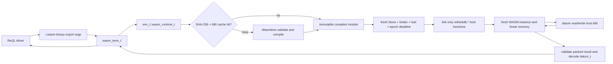
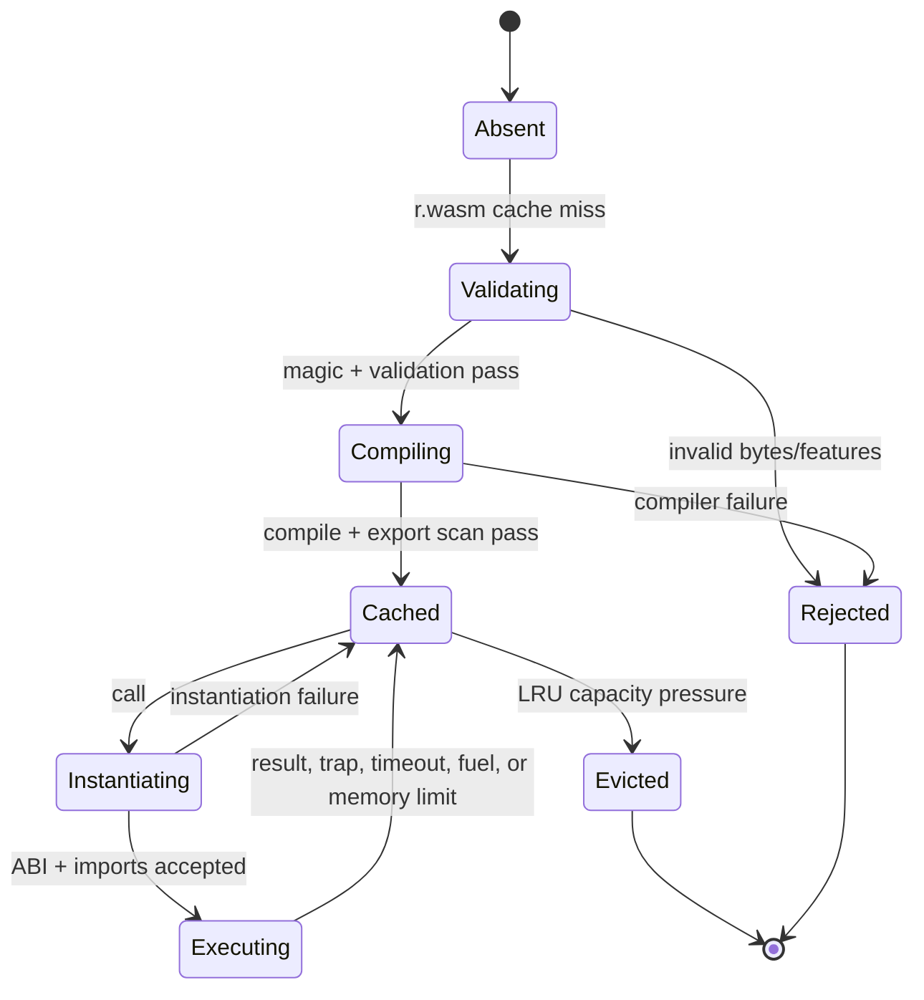

# WASM-based UDF Sandbox (replace V8/QuickJS) — RethinkDB v3.0

**Status:** Phase 3 axiom-level implementation specification  
**Scope:** In-process WebAssembly UDF runtime, ReQL surface, cache, ABI, limits, and removal of the core QuickJS execution path.  
**Repository:** `/home/kara/rethinkdb`  
**Status of this document:** Design only; it specifies no implementation patch.

## 1. Overview

### 1.1 Problem statement

RethinkDB currently evaluates `r.js()` through QuickJS in a child process. The
main-process `js_runner_t` (`src/extproc/js_runner.hpp/.cc`) sends source or a
cached `js_id_t` over `js_job_t` (`src/extproc/js_job.hpp/.cc`) to a QuickJS
runtime in `src/extproc/js_job.cc`. The process boundary limits blast radius,
but has four material costs: fork/IPC latency, source-language lock-in,
non-deterministic timeout termination through worker destruction, and an
embedded JavaScript engine that needs its own security lifecycle.

RethinkDB v3.0 replaces the V8/QuickJS UDF execution architecture with one
in-process Wasmtime embedding. Modules are portable core WebAssembly binaries
emitted by Rust, C/C++, Zig, AssemblyScript, and equivalent toolchains. A module
starts with no filesystem, network, environment, clock, random, database, or
native-pointer capability. The server grants a tiny `rethinkdb` host ABI over
one call-local datum and destroys the instance after every invocation.

The chosen architecture intentionally has **no `extproc_job_t`, no WASM child
process, and no pipe serialization**. “Worker” below means the existing
RethinkDB query execution thread that owns an `env_t`; it never means a new OS
process. This resolves the design-direction conflict explicitly: v3.0 gains the
latency and compiled-cache benefit of in-process execution, and its safety
boundary is Wasmtime validation + store isolation + resource controls, not a
forked evaluator.



### 1.2 Invariants

1. A guest instance has exactly one store, one exported memory, and one call
   context. No store, memory pointer, host callback context, or mutable global
   survives an invocation.
2. The compiled cache contains immutable module handles only. It never contains
   an instance, `wasmtime_store_t`, `wasmtime_context_t`, guest pointer, or
   native compiled-code bytes serialized across processes or restarts.
3. Every guest memory access performed by host code is checked for `offset +
   length` overflow and against the current memory byte size before copying.
4. Fuel, linear-memory limits, query interruptors, and an epoch deadline are
   all enforced. No individual mechanism is treated as sufficient by itself.
5. `r.wasm()` is non-deterministic in ReQL because resource failures and future
   host ABI additions are observable. It is rejected in deterministic write,
   secondary-index, generated-column, and write-hook contexts.
6. Core v3.0 server builds contain no QuickJS or V8 UDF engine. The old
   `JAVASCRIPT = 11` wire term remains decodable solely to provide a stable
   migration error; it never starts an interpreter.

### 1.3 Non-goals

Phase 3 does **not** add persistent, cluster-replicated module registries;
module upload/download APIs; compilation from source; dynamic linking; WASM
component-model support; WASM threads, atomics, shared memories, multi-memory,
or SIMD; guest table scans/writes; a guest scheduler; cross-UDF state; durable
UDF state; transactions begun by a guest; user-defined native imports; or
language-specific SDKs beyond the documented ABI fixtures.

It also does not claim that WebAssembly eliminates native-runtime CVEs or every
microarchitectural side channel. It does not translate JavaScript to WASM. It
does not run arbitrary modules in a subprocess, and it does not preserve a
working `r.js()` evaluator in the default v3.0 binary.

## 2. API Design / ReQL surface

### 2.1 Public term

The only new public operation is an eager expression, not a first-class ReQL
function:

```javascript
r.wasm(module_binary, export_name, args, {
  timeout: 5,
  memory_pages: 256,
  fuel: 1000000
})
```

`module_binary` must be an `R_BINARY` datum containing a core WASM binary.
`export_name` is a non-empty UTF-8 string. `args` is an array datum and becomes
the guest input array. The result is the `datum_t` returned by that export.

Repeated use inside a ReQL lambda is valid and is the replacement for a JS
function in `map`, `filter`, or `update` with `non_atomic: true`:

```javascript
const normalize = r.binary(readFileBytes("normalize.wasm"));

r.table("users").map(function (row) {
  return r.wasm(normalize, "normalize", [row], {
    fuel: 300000,
    memory_pages: 32,
    timeout: 1
  });
});

r.range(3).map(function (n) {
  return r.wasm(r.binary(add_wasm), "add", [n, 2]);
});
```

The cache is keyed by content and ABI, so identical module bytes used in a
lambda compile once per `env_t` even though the term evaluates repeatedly.
`r.wasm()` does not expose a long-lived user handle because a handle would be
query-local state with unclear driver/session semantics. The internally cached
compiled module is enough to meet repeated-invocation performance requirements.

### 2.2 Exact validation and defaults

| Input | Required type | Default | Accepted range |
| --- | --- | ---: | --- |
| `module_binary` | `BINARY` | none | 8 bytes through 16 MiB inclusive |
| `export_name` | non-empty `STRING` | none | 1 through 255 UTF-8 bytes |
| `args` | `ARRAY` | none | current `configured_limits_t` depth/size limits |
| `timeout` | finite integral `NUMBER`, seconds | 5 | 1 through 60 |
| `memory_pages` | finite integral `NUMBER` | 256 | 1 through 1024 |
| `fuel` | finite integral `NUMBER` | 1,000,000 | 1 through 100,000,000 |

`memory_pages` uses WebAssembly pages (64 KiB): default maximum linear memory
is 16 MiB and hard maximum is 64 MiB. The bytecode ceiling, limit ceilings, and
maximum one exported memory are server invariants, not configurable query
optargs. Invalid type/range/unknown optarg fails before Wasmtime or cache lookup.

The effective limits are copied into a `wasm_call_config_t`; they never mutate a
cache entry. Cache identity includes the hard maximum, not a per-call lower
limit, so one compiled module can be safely instantiated under different limits.

### 2.3 `r.js()` deprecation and removal path

`JAVASCRIPT = 11` stays in `ql2.proto` and remains recognized by the decoder and
term walker. Its factory changes from `make_javascript_term()` to
`make_javascript_removed_term()` in `src/rdb_protocol/terms/js.cc`; the latter
always raises the exact `JAVASCRIPT_REMOVED` error in section 8. No QuickJS
header, library, extproc runner, or source/function cache remains in the v3.0
core build.

Migration is explicit:

1. Rewrite the JavaScript function against the `rdb-datum-v1` ABI in section 5.
2. Compile to a core WASM module without WASI imports.
3. Verify output with a direct `r.wasm(r.binary(bytes), export, args)` call.
4. Replace every `r.js("function...")` function position with a ReQL lambda
   that calls `r.wasm(binary, export, [arguments...])`.
5. Remove reliance on JavaScript closures, `Date`, `RegExp`, `undefined`, and
   JS object identity; the ABI transports only datum values.

A distribution that requires temporary JavaScript compatibility may ship a
separate `rethinkdb-legacy-js` v2 sidecar/proxy. It is outside this repository,
not linked into the server, cannot register new `Term::JAVASCRIPT` behavior, and
is not a v3.0 feature flag.

### 2.4 ql2.proto allocation

`VECTOR = 200` and `VECTOR_NEAR = 201` are already allocated in
`src/rdb_protocol/ql2.proto`; no existing ID is reused. Add exactly this enum
entry immediately after `VECTOR_NEAR`:

```proto
// Executes a core WebAssembly UDF with the rdb-datum-v1 ABI.
WASM = 202; // BINARY, STRING, ARRAY,
            // {timeout: NUMBER, memory_pages: NUMBER, fuel: NUMBER} -> DATUM
```

There are no new protobuf messages or fields. The normal `Term.args` field
numbers remain `args = 3` and `optargs = 4`; all options use `Term.AssocPair`
with existing field numbers `key = 1`, `val = 2`.

Driver surfaces map `r.wasm` / `wasm` to term ID 202. Each maintained driver
must publish the method only after server protocol support lands. Older servers
reject 202 through their existing invalid-term path; older drivers cannot emit
it. The ql2 protocol regression test must assert IDs 11, 200, 201, and 202.

### 2.5 Compile wiring

Add `make_wasm_term` to `src/rdb_protocol/terms/terms.hpp` and dispatch it in
`src/rdb_protocol/term.cc`:

```cpp
counted_t<term_t> make_wasm_term(
    compile_env_t *env, const raw_term_t &term);

case Term::WASM: return make_wasm_term(env, t);
```

`src/rdb_protocol/term_walker.cc` adds `Term::WASM` to all exhaustive
classification switches that already list `Term::JAVASCRIPT`: valid-term,
write-or-meta (false), and deterministic-expression handling. `wasm_term_t`
uses this exact constructor declaration:

```cpp
explicit wasm_term_t(compile_env_t *env, const raw_term_t &term)
    : op_term_t(env, term, argspec_t(3),
                optargspec_t({ "timeout", "memory_pages", "fuel" })) { }
```

`wasm_term_t::is_deterministic()` returns `deterministic_t::no()`.

## 3. Dependencies

### 3.1 Selected runtime

Use **Wasmtime C API**, vendored at an explicitly pinned release under
`external/wasmtime_<version>/`. Wasmtime is selected over wasm3 because this
design requires validation, ahead-of-time compilation, fuel, epoch interruption,
a store resource limiter, and a maintained C embedding API. No runtime selection
is configurable at run time.

The build accepts only core WebAssembly MVP plus bulk-memory operations needed
by Rust/AssemblyScript allocators. Configure Wasmtime with fuel and epoch
interruption enabled; configure the engine to reject or disable threads, shared
memory, multi-memory, reference types, tail calls, component model, WASI command
helpers, sockets, and pre-open support. The exact Wasmtime version is a release
lock: its C API declarations are copied into an integration compile test before
implementation starts.

### 3.2 Build and packaging changes

| File | Required change |
| --- | --- |
| `configure` | Replace `quickjs` in `must_fetch_list`, `required_libs`, and dependency loop with `wasmtime`; fail if the C API archive/header probe fails. |
| `config.mk` generated template | Replace `QUICKJS_*` with `WASMTIME_VERSION`, `WASMTIME_LIBS_DEP`, `WASMTIME_INCLUDE`, and `HAS_WASMTIME`. |
| `mk/support/pkg/wasmtime.mk` (new) | Build a static Wasmtime C API archive from vendored sources with cargo offline mode; emit headers and `libwasmtime.a`. |
| `src/Makefile` / current source manifest | Remove `extproc/js_runner.cc`, `extproc/js_job.cc`; add `rdb_protocol/wasm_udf.cc`, `rdb_protocol/wasm_runtime.cc`, and `rdb_protocol/terms/wasm.cc`. |
| `src/rdb_protocol/env.hpp/.cc` | Replace `js_runner_t js_runner_` and `get_js_runner()` with `wasm_runtime_t wasm_runtime_` and `get_wasm_runtime()`. |
| `external/quickjs_0.15.1/` | Remove from v3.0 source distribution after all JS tests are migrated/deleted. |
| `packaging/*` and licenses manifest | Include Wasmtime license, notices, source, checksums, and static library in every supported source/binary package. |

The support build is hermetic: `cargo build --locked --offline` consumes only
vendored crate sources and a checked-in `Cargo.lock`. Configure must fail if
Cargo/Rust is unavailable for a source build; release artifacts must package the
prebuilt support library only where that is already accepted for other support
dependencies. No build rule may download crates during `make`.

### 3.3 Required C API capabilities

The integration compilation gate must prove that the pinned API supplies these
families: `wasm_config_new`, `wasmtime_config_consume_fuel_set`,
`wasmtime_config_epoch_interruption_set`, `wasm_engine_new_with_config`,
`wasmtime_module_validate`, `wasmtime_module_new`, `wasmtime_store_new`,
`wasmtime_context_add_fuel`, `wasmtime_context_set_epoch_deadline`,
`wasmtime_store_limiter`, `wasmtime_linker_new`, `wasmtime_linker_define_func`,
`wasmtime_linker_instantiate`, `wasmtime_instance_export_get`,
`wasmtime_func_call`, and the module/store/linker/error/trap delete APIs.

If a pinned Wasmtime release lacks any required API, the dependency upgrade must
choose another pinned release. Do not silently omit a limit or substitute a
best-effort configuration.

## 4. Interface / Data structures

### 4.1 Ownership and header boundaries

Create `src/rdb_protocol/wasm_udf.hpp` for serializable call/cache metadata and
`src/rdb_protocol/wasm_runtime.hpp/.cc` for runtime-only types. The public
header must not include `<wasmtime.h>`; all C API objects are opaque pointers in
the `.cc` translation unit. `src/rdb_protocol/terms/wasm.cc` includes only
`wasm_runtime.hpp`, `op.hpp`, `error.hpp`, `func.hpp`, and `terms.hpp`.

The repository does not define an `RDB_MAKE_ME_SERIALIZABLE` macro. Existing
code uses `RDB_DECLARE_SERIALIZABLE` in headers and
`RDB_IMPL_SERIALIZABLE_N` plus `INSTANTIATE_SERIALIZABLE_FOR_CLUSTER` in source.
This specification uses those real macros rather than inventing an unavailable
one. `serializable_t` is not a base class in this codebase; the macro-based free
serialization functions are the established convention.

### 4.2 Serializable types

```cpp
// src/rdb_protocol/wasm_udf.hpp
#ifndef RDB_PROTOCOL_WASM_UDF_HPP_
#define RDB_PROTOCOL_WASM_UDF_HPP_

#include <stdint.h>

#include <string>
#include <vector>

#include <boost/variant.hpp>

#include "containers/name_string.hpp"
#include "rdb_protocol/datum.hpp"

namespace ql {

enum class wasm_result_kind_t : int8_t {
    DATUM = 0,
    USER_ERROR = 1,
    RUNTIME_ERROR = 2
};

struct wasm_call_config_t {
    uint64_t timeout_ms;
    uint32_t memory_pages;
    uint64_t fuel;
    uint32_t abi_version;

    wasm_call_config_t();
};

struct wasm_module_key_t {
    std::string sha256_hex;
    uint32_t abi_version;
    uint32_t max_memory_pages;

    bool operator<(const wasm_module_key_t &other) const;
    bool operator==(const wasm_module_key_t &other) const;
};

struct wasm_cache_record_t {
    wasm_module_key_t key;
    std::vector<uint8_t> module_bytes;
    std::vector<std::string> callable_exports;
    uint64_t last_used_micros;

    wasm_cache_record_t();
};

struct wasm_guest_error_t {
    std::string code;
    std::string message;

    wasm_guest_error_t();
    wasm_guest_error_t(std::string _code, std::string _message);
};

typedef boost::variant<datum_t, wasm_guest_error_t> wasm_result_t;

RDB_DECLARE_SERIALIZABLE(wasm_result_kind_t);
RDB_DECLARE_SERIALIZABLE(wasm_call_config_t);
RDB_DECLARE_SERIALIZABLE(wasm_module_key_t);
RDB_DECLARE_SERIALIZABLE(wasm_cache_record_t);
RDB_DECLARE_SERIALIZABLE(wasm_guest_error_t);

}  // namespace ql
#endif  // RDB_PROTOCOL_WASM_UDF_HPP_
```

`wasm_cache_record_t.module_bytes` is the portable cache representation. It is
not Wasmtime serialized machine code. On deserialize, `wasm_runtime_t` validates
the key/ABI and recompiles from `module_bytes`; an incompatible runtime discards
the record. Normal `env_t` caches never cross a query boundary, but archive
round-trip support makes cache persistence and unit testing precise.

### 4.3 Runtime and cache interfaces

```cpp
// src/rdb_protocol/wasm_runtime.hpp
#ifndef RDB_PROTOCOL_WASM_RUNTIME_HPP_
#define RDB_PROTOCOL_WASM_RUNTIME_HPP_

#include <map>
#include <string>
#include <vector>

#include "containers/counted.hpp"
#include "containers/scoped.hpp"
#include "rdb_protocol/configured_limits.hpp"
#include "rdb_protocol/wasm_udf.hpp"
#include "thread_local.hpp"

namespace ql {

class wasm_compiled_module_t;
class wasm_store_t;
class wasm_epoch_sentry_t;

class wasm_runtime_t : public home_thread_mixin_t {
public:
    static const size_t CACHE_CAPACITY = 100;
    static const uint32_t ABI_VERSION = 1;

    wasm_runtime_t();
    ~wasm_runtime_t();

    void begin(const configured_limits_t &limits, signal_t *interruptor);
    void end();
    bool connected() const;

    wasm_result_t call(const std::vector<uint8_t> &module_bytes,
                       const std::string &export_name,
                       const std::vector<datum_t> &args,
                       const wasm_call_config_t &config);

    size_t cache_size() const;
    std::vector<wasm_cache_record_t> cache_snapshot() const;

private:
    typedef std::map<wasm_module_key_t,
                     scoped_ptr_t<wasm_compiled_module_t> > module_map_t;

    wasm_module_key_t make_key(const std::vector<uint8_t> &module_bytes) const;
    scoped_ptr_t<wasm_compiled_module_t> compile(
        const wasm_module_key_t &key,
        const std::vector<uint8_t> &module_bytes,
        const wasm_call_config_t &config);
    wasm_compiled_module_t *find_or_compile(
        const wasm_module_key_t &key,
        const std::vector<uint8_t> &module_bytes,
        const wasm_call_config_t &config);
    void evict_one_unpinned();
    void clear_cache();

    class runtime_data_t;
    scoped_ptr_t<runtime_data_t> data_;
    DISABLE_COPYING(wasm_runtime_t);
};

class wasm_func_t : public func_t {
public:
    wasm_func_t(std::vector<uint8_t> _module_bytes,
                std::string _export_name,
                wasm_call_config_t _config);

    counted_t<func_t> clone() const;
    scoped_ptr_t<val_t> call(scope_env_t *env,
                             args_t *args,
                             eval_flags_t eval_flags) const;
    deterministic_t is_deterministic() const;

private:
    const std::vector<uint8_t> module_bytes_;
    const std::string export_name_;
    const wasm_call_config_t config_;
};

}  // namespace ql
#endif  // RDB_PROTOCOL_WASM_RUNTIME_HPP_
```

`wasm_func_t` is intentionally specified even though `r.wasm()` is eager: the
term implementation constructs it transiently and calls it with the supplied
array. It also supplies the exact reusable C++ interface for future internal
call sites without exposing a second ReQL term. It owns bytes rather than a raw
cache pointer, so it cannot outlive an `env_t` cache safely by accident.

### 4.4 Store, limits, and host callback interfaces

```cpp
// private declarations in src/rdb_protocol/wasm_runtime.cc
namespace ql {

struct wasm_call_context_t {
    const datum_t *input;
    configured_limits_t limits;
    wasm_guest_error_t guest_error;
    bool has_guest_error;
    uint64_t memory_limit_bytes;
    uint64_t deadline_epoch;

    wasm_call_context_t(const datum_t *_input,
                        const configured_limits_t &_limits,
                        uint64_t _memory_limit_bytes,
                        uint64_t _deadline_epoch);
};

class wasm_store_t {
public:
    wasm_store_t(wasm_compiled_module_t *module,
                 wasm_call_context_t *context,
                 const wasm_call_config_t &config);
    ~wasm_store_t();

    wasm_result_t instantiate();
    wasm_result_t invoke(const std::string &export_name,
                         const std::vector<uint8_t> &argument_bytes);
    wasm_result_t read_packed_result(uint64_t packed_pointer_length);
    uint32_t guest_alloc(uint32_t byte_count);
    void interrupt();

    uint64_t memory_size_bytes() const;
    bool checked_guest_range(uint32_t offset, uint32_t length) const;
    const uint8_t *guest_bytes(uint32_t offset, uint32_t length) const;
    uint8_t *mutable_guest_bytes(uint32_t offset, uint32_t length);

private:
    class impl_t;
    scoped_ptr_t<impl_t> impl_;
    DISABLE_COPYING(wasm_store_t);
};

wasm_result_t wasm_host_datum_read(wasm_call_context_t *context,
                                   wasm_store_t *store,
                                   uint32_t path_ptr,
                                   uint32_t path_len,
                                   uint64_t *result_out);
wasm_result_t wasm_host_datum_write(wasm_call_context_t *context,
                                    wasm_store_t *store,
                                    uint32_t json_ptr,
                                    uint32_t json_len,
                                    uint64_t *result_out);
wasm_result_t wasm_host_error(wasm_call_context_t *context,
                              wasm_store_t *store,
                              uint32_t message_ptr,
                              uint32_t message_len);

}  // namespace ql
```

The callback trampoline registered with `wasmtime_linker_define_func` converts
Wasmtime values to these signatures, writes an i64 packed result only on success,
and converts every host failure to a controlled trap. It does not throw C++
exceptions through the Wasmtime C API.

### 4.5 Exact serialization implementations

```cpp
// src/rdb_protocol/wasm_udf.cc
ARCHIVE_PRIM_MAKE_RANGED_SERIALIZABLE(
    ql::wasm_result_kind_t, int8_t,
    ql::wasm_result_kind_t::DATUM, ql::wasm_result_kind_t::RUNTIME_ERROR);

RDB_IMPL_SERIALIZABLE_4(ql::wasm_call_config_t,
                        timeout_ms, memory_pages, fuel, abi_version);
RDB_IMPL_SERIALIZABLE_3(ql::wasm_module_key_t,
                        sha256_hex, abi_version, max_memory_pages);
RDB_IMPL_SERIALIZABLE_4(ql::wasm_cache_record_t,
                        key, module_bytes, callable_exports, last_used_micros);
RDB_IMPL_SERIALIZABLE_2(ql::wasm_guest_error_t, code, message);

INSTANTIATE_SERIALIZABLE_FOR_CLUSTER(ql::wasm_call_config_t);
INSTANTIATE_SERIALIZABLE_FOR_CLUSTER(ql::wasm_module_key_t);
INSTANTIATE_SERIALIZABLE_FOR_CLUSTER(ql::wasm_cache_record_t);
INSTANTIATE_SERIALIZABLE_FOR_CLUSTER(ql::wasm_guest_error_t);
```

The variant `wasm_result_t` is local runtime control flow and is not serialized.
`datum_t` continues to use its existing archive serializer. `wasm_result_kind_t`
is declared only for persisted diagnostics/test fixtures; ordinary error
transport uses `wasm_guest_error_t`.

## 5. Behavior

### 5.1 Term-to-result execution flow

`wasm_term_t::eval_impl` performs these actions in order:

1. Evaluate all three positional arguments and each recognized optarg once.
2. Validate module type/size, export name, `args`, and option values.
3. Create a `wasm_call_config_t` with defaults and converted milliseconds.
4. Obtain `env->env->get_wasm_runtime()`; `env_t` calls `begin(limits(),
   interruptor)` lazily exactly once.
5. Call `wasm_runtime_t::call` with copied module bytes, name, args, and config.
6. Convert `boost::get<datum_t>` to `new_val`. Convert
   `boost::get<wasm_guest_error_t>` to the error class/message in section 8.
7. Attach ordinary ReQL backtrace information through the existing `rfail` path.

Cache lookup computes SHA-256 over complete bytecode and constructs key
`{hex_digest, 1, 1024}`. A miss checks magic/version, runs Wasmtime validation,
compiles the immutable module, scans exports, and inserts it. A hit moves the
entry’s LRU timestamp forward. Capacity is 100; least-recently-used entry is
removed only when no invocation holds it. Because a query thread is serial,
there is no concurrent mutation of one runtime cache.

### 5.2 Wasmtime engine configuration

One `wasm_engine_t` lives in `wasm_runtime_t::runtime_data_t` for the life of
one `env_t`. It enables fuel and epoch interruption before engine creation. A
server-wide atomic epoch ticker increments every 1 ms; `wasm_epoch_sentry_t`
sets the call deadline to `current_epoch + timeout_ms` and cancels it on return.
The store has a resource limiter with the selected page maximum.

The runtime config must reject a module containing more than one memory, a
shared memory, `memory64`, threads/atomics, a table import/export used as an
escape hatch, or a callable export not matching the ABI. The module may export
non-callable globals/tables, but the runtime never exposes them to a guest or
client.

### 5.3 WASI capability model

Wasmtime’s WASI support is linked only if required by the selected static
library, but a WASI context is created with **zero capabilities**:

| Capability | v3.0 grant |
| --- | --- |
| Filesystem / preopens | none |
| stdin, stdout, stderr | none |
| environment / argv | none |
| clocks | none |
| random source | none |
| TCP, UDP, DNS, Unix sockets | none |
| process exit/spawn | none |
| pollable I/O | none |

The linker does not define `wasi_snapshot_preview1`, `wasi:cli/*`, or any
similar module namespace. A WASI import is therefore an unresolved import and
fails instantiation. This is stronger and simpler than defining `fd_write` to a
log sink or passing a “sandboxed” filesystem object.

### 5.4 Guest ABI: `rdb-datum-v1`

Every callable export has this exact signature:

```c
// Guest exports.
// Arguments are UTF-8 JSON for the complete ReQL args array.
// Return (uint64_t(ptr) << 32) | uint64_t(len), pointing to UTF-8 JSON.
typedef uint64_t rdb_udf_export_t(uint32_t args_ptr, uint32_t args_len);

// Required exports.
uint8_t memory[];
uint32_t rethinkdb_alloc(uint32_t bytes);
uint64_t chosen_export(uint32_t args_ptr, uint32_t args_len);
```

`memory` must be one non-shared 32-bit-addressable memory. `rethinkdb_alloc`
must have exactly `(i32) -> i32`; the runtime calls it before copying encoded
arguments. A module may export `rethinkdb_dealloc(i32, i32) -> ()`; the runtime
calls it after copying a return if present. A return allocation is otherwise
released with the entire instance at call completion.

The runtime converts `std::vector<datum_t>` to one canonical JSON array using
existing datum serialization, copying bytes to guest linear memory. It decodes
the return’s high 32 bits as pointer and low 32 bits as length, range-checks it,
copies it to a host vector, parses JSON through the existing datum parser under
`configured_limits_t`, and returns the resulting datum. It accepts NULL, BOOL,
finite NUMBER, STRING, ARRAY, OBJECT, TIME, GEOMETRY, and other existing JSON
pseudotypes supported by the datum parser. It rejects `R_BINARY`, `MINVAL`,
`MAXVAL`, non-finite numbers, circular data (which `datum_t` cannot contain),
and oversized/deep structures.

### 5.5 Host function bindings

The only defined imports are in module namespace `rethinkdb`:

| Import | Exact WASM signature | Semantics |
| --- | --- | --- |
| `datum_read` | `(i32 path_ptr, i32 path_len) -> i64` | Read one value from the call’s first object argument using a JSON-pointer path; encode JSON into guest allocation; return packed pointer/length. Empty path returns the first argument. Missing path returns JSON `null`. |
| `datum_write` | `(i32 json_ptr, i32 json_len) -> i64` | Parse/validate a guest JSON value as a datum; canonicalize it; encode it into guest allocation; return packed pointer/length. It is a datum normalization primitive, not a database write. |
| `error` | `(i32 msg_ptr, i32 msg_len) -> ()` | Copy at most 4096 UTF-8 bytes, record `WASM_GUEST_ERROR`, then trap execution. |

`datum_read` accepts RFC 6901 JSON Pointer syntax. It cannot address tables,
other call arguments, module files, host memory, or any ReQL variable.
`datum_write` does not mutate the first input object, the ReQL `args` array, a
table row, cache metadata, or persistent database state. No host function takes
or returns `datum_t *`, `val_t *`, `env_t *`, a native allocator pointer, or an
arbitrary function pointer.

### 5.6 Resource enforcement and cancellation

| Resource | Default | Hard maximum | Enforcement |
| --- | ---: | ---: | --- |
| Module bytes | n/a | 16 MiB | validate before cache lookup/compile |
| Linear memory | 256 pages | 1024 pages | Wasmtime store limiter; reject initial/grow above limit |
| Fuel | 1,000,000 | 100,000,000 | add exactly once per call; OutOfFuel trap |
| Wall time | 5 s | 60 s | store epoch deadline + 1 ms epoch ticker |
| Input/output datum | current limits | current limits | before guest copy and after return parse |
| Host error text | n/a | 4096 UTF-8 bytes | truncate at code-point boundary |
| Cache entries | 100 | 100 | LRU, no unbounded compile retention |

The query interruptor is checked before compilation, before instantiation, in
host callbacks, and immediately after a Wasmtime call returns. The epoch ticker
is a separate cancellation mechanism: on deadline, Wasmtime traps the guest.
If a query interruptor fires, `wasm_store_t::interrupt()` sets its deadline to
the current epoch and the term propagates `interrupted_exc_t` rather than
misclassifying cancellation as a UDF failure.

## 6. Data / Serialization

### 6.1 Cache serialization format

A portable cache record serializes in this exact order:

```text
wasm_cache_record_t :=
  wasm_module_key_t {
    sha256_hex: STRING(64 lowercase hex),
    abi_version: UINT32(1),
    max_memory_pages: UINT32(1024)
  },
  module_bytes: VECTOR<UINT8>(8..16MiB),
  callable_exports: VECTOR<STRING>,
  last_used_micros: UINT64
```

Deserialization validates all of the following before it can produce a usable
entry: digest length/hex characters, `abi_version == 1`,
`max_memory_pages == 1024`, module byte ceiling, recomputed SHA-256 equality,
and sorted/unique export names. Failure drops only that cache record and reports
`WASM_CACHE_RECORD_INVALID` to internal diagnostics; no client can directly
submit a cache record.

Wasmtime’s serialized module API is deliberately not used. Native compiled
artifacts may embed CPU features, Wasmtime implementation details, and code
pointers; serializing them would invalidate cross-node portability and expand
the attack surface. Cache restore recompiles the validated source binary.

### 6.2 Wire and disk compatibility

The new ql2 wire change is only `Term::WASM = 202`; no disk superblock,
metadata, Raft object, table configuration, changefeed payload, or replication
message stores module bytes. Therefore an existing table/database is unchanged
on upgrade and no disk-format migration exists.

`wasm_call_config_t`, `wasm_module_key_t`, `wasm_cache_record_t`, and
`wasm_guest_error_t` use archive serialization for unit tests and any future
query-local cache transfer. They are versioned with
`INSTANTIATE_SERIALIZABLE_FOR_CLUSTER`, but must not be inserted into durable
cluster metadata without a separate specification.

### 6.3 Datum marshaling rules

The two serialization legs are independent:

```text
C++ datum_t args
  -> canonical ReQL JSON array
  -> checked copy to guest linear memory
  -> guest export
  -> packed (ptr,len)
  -> checked copy from guest linear memory
  -> datum parser under configured_limits_t
  -> C++ datum_t result
```

The cache/ABI uses bytes, not a C++ object serialization. This avoids layout,
endianness, lifetime, alignment, and ownership coupling between a C++ server and
Rust/C/AssemblyScript guest code. UTF-8 is required for JSON strings and object
keys. Host conversion errors never surface a raw parser exception, guest memory
address, or binary byte sequence.

## 7. States

### 7.1 Module lifecycle



A cache hit may enter `Instantiating` directly. The compiled module remains
immutable in `Cached`; every `Instantiating` transition creates a new store,
linker, call context, instance, and guest memory. No error leaves an instance in
the cache.

### 7.2 `env_t` runtime lifecycle

`env_t` owns `wasm_runtime_t wasm_runtime_`, analogous to the existing
`js_runner_` member but without `extproc_pool_t`. `get_wasm_runtime()` lazily
calls `begin(limits(), interruptor)`. `env_t::~env_t()` calls `end()`, which
waits for no worker process, releases all compiled module handles, then destroys
the engine. The runtime object is home-thread-bound; `assert_thread()` guards
all public operations.

The engine is created once per active query `env_t`, not once per module. The
cache lasts for that environment only. A new query begins empty; this bounds
module retention and avoids cross-client capability/state transfer.

### 7.3 Worker process management

There is no WASM worker process to supervise. The following legacy ownership is
removed from the core server:

| Removed path | Replacement |
| --- | --- |
| `extproc/js_job_t::worker_fn()` child loop | `wasm_runtime_t::call()` on the owning query thread |
| pipe task enum and archive IPC | direct C++ method arguments |
| `js_timeout_t` killing a child | Wasmtime epoch trap + query interruptor |
| `js_runner_t` source/ID cache | `wasm_runtime_t` SHA-256 LRU of compiled modules |
| `extproc_pool_t` use for JS UDFs | no pool use for UDF execution |

A Wasmtime trap, module validation failure, fuel exhaustion, memory denial, or
ABI error destroys only the per-call store. An engine-level unrecoverable error
clears the whole query-local cache and raises `WASM_RUNTIME_FAILURE`; the next
UDF call creates a new runtime only after `end()`/`begin()` completes. The server
must not continue using an engine after its C API reports an internal invariant
failure.

## 8. Errors

Known errors use stable diagnostic codes internally and exact client messages.
Malformed user input is `base_exc_t::LOGIC`; guest/runtime-limit errors are
`base_exc_t::RUNTIME`; host/runtime invariant failures are `base_exc_t::INTERNAL`.

| Code | Type | Exact ReQL error message | Trigger |
| --- | --- | --- | --- |
| `WASM_MODULE_TYPE` | LOGIC | `WASM module must be binary data.` | first argument is not `R_BINARY` |
| `WASM_MODULE_EMPTY` | LOGIC | `WASM module binary must not be empty.` | zero bytes |
| `WASM_MODULE_TOO_LARGE` | LOGIC | `WASM module binary exceeds the 16777216 byte limit.` | >16 MiB |
| `WASM_EXPORT_TYPE` | LOGIC | `WASM export name must be a non-empty string.` | invalid/empty export name |
| `WASM_ARGS_TYPE` | LOGIC | `WASM function arguments must be an array.` | third positional argument is not array |
| `WASM_OPTION_INVALID` | LOGIC | `WASM option '{name}' must be an integer in the range {min} through {max}.` | invalid timeout/pages/fuel |
| `WASM_COMPILE_FAILED` | RUNTIME | `WASM module compilation failed: {reason}` | header/validation/compiler/rejected feature |
| `WASM_CACHE_RECORD_INVALID` | INTERNAL | `WASM compiled-module cache record is invalid.` | corrupted internal archive record |
| `WASM_EXPORT_NOT_FOUND` | RUNTIME | `WASM module does not export function '{name}'.` | no selected function export |
| `WASM_ABI_INVALID` | RUNTIME | `WASM module does not satisfy the rdb-datum-v1 ABI: {reason}` | missing memory/allocator or wrong signature |
| `WASM_IMPORT_DENIED` | RUNTIME | `WASM module imports unsupported capability '{module}.{name}'.` | any import outside three allowlisted imports |
| `WASM_MEMORY_LIMIT` | RUNTIME | `WASM module exceeded its {pages}-page memory limit.` | initial allocation/grow/limiter denial |
| `WASM_FUEL_EXHAUSTED` | RUNTIME | `WASM module exhausted its {fuel} instruction budget.` | Wasmtime OutOfFuel trap |
| `WASM_TIMEOUT` | RUNTIME | `WASM module timed out after {timeout_ms}ms.` | epoch deadline trap |
| `WASM_GUEST_ERROR` | RUNTIME | `WASM module raised an error: {message}` | `rethinkdb.error` import |
| `WASM_ARGUMENT_ENCODING` | RUNTIME | `WASM function arguments cannot be encoded as rdb-datum-v1.` | unsupported input datum/payload limit |
| `WASM_RESULT_BOUNDS` | RUNTIME | `WASM module returned an out-of-bounds result buffer.` | packed pointer/length overflow/outside memory |
| `WASM_RESULT_DECODING` | RUNTIME | `WASM module returned invalid rdb-datum-v1 JSON.` | invalid UTF-8/JSON/limits/non-finite number |
| `WASM_RUNTIME_FAILURE` | INTERNAL | `WASM runtime failed while executing the function.` | unclassified C API/runtime invariant error |
| `JAVASCRIPT_REMOVED` | LOGIC | `r.js is no longer supported in RethinkDB 3.0; migrate this UDF to r.wasm.` | term 11 is evaluated |

Validation order is fixed: positional/optarg count; positional evaluation;
module type/size; export type; args type; option type/range; magic/validation;
cache compilation; ABI/import inspection; instantiation; argument encoding;
function invocation; result bounds; result JSON. This makes the first error
predictable when multiple inputs are bad.

Wasmtime diagnostics are sanitized: truncate to 4096 UTF-8 bytes, replace
absolute paths and host addresses with `<redacted>`, and include them only in
`WASM_COMPILE_FAILED` or ABI reason text. Raw traps, stack traces, WAT source,
module bytes, and host exception text never reach the client.

## 9. Testing

### 9.1 Unit tests

Create `src/unittest/wasm_udf.cc`; use `test/wasm/` fixtures containing pinned
Rust and AssemblyScript source and checked-in binaries with SHA-256 manifest.
The required unit scenarios are:

1. Valid Rust `add` module validates, compiles, and returns `3` for `[1, 2]`.
2. Valid AssemblyScript `multiply` module returns `42` for `[6, 7]`.
3. Identical bytes invoked 101 times compile once and record 100 cache capacity
   maximum without another instance surviving.
4. Two distinct modules past capacity evict the least-recently-used idle module.
5. A malformed magic/version binary returns `WASM_COMPILE_FAILED` and a later
   valid call still succeeds.
6. A module with a WASI `fd_read` import returns `WASM_IMPORT_DENIED`.
7. A module importing `env.abort` returns `WASM_IMPORT_DENIED`.
8. A module with missing `memory` export returns `WASM_ABI_INVALID`.
9. A module with wrong `rethinkdb_alloc` signature returns `WASM_ABI_INVALID`.
10. A module requesting two memories is rejected at validation.
11. A 2-page initial memory with `memory_pages: 1` returns `WASM_MEMORY_LIMIT`.
12. A module whose `memory.grow` exceeds one page returns `WASM_MEMORY_LIMIT`.
13. An infinite loop with fuel 1000 returns `WASM_FUEL_EXHAUSTED` and later calls
    remain usable.
14. An infinite loop with high fuel and 1 ms timeout returns `WASM_TIMEOUT`.
15. A guest packed pointer at end-of-memory plus length one returns
    `WASM_RESULT_BOUNDS`.
16. A guest return with invalid UTF-8 or JSON returns `WASM_RESULT_DECODING`.
17. A guest return of nested arrays/objects/time pseudotypes round-trips exactly.
18. `R_BINARY`, `MINVAL`, and `MAXVAL` in args return `WASM_ARGUMENT_ENCODING`.
19. `rethinkdb.datum_read` reads `/profile/name`, missing paths return null, and
    cannot read any path outside first object argument.
20. `rethinkdb.datum_write` canonicalizes valid JSON and cannot mutate input.
21. `rethinkdb.error("bad")` returns exact `WASM_GUEST_ERROR` text and truncates
    a 5000-byte error safely.
22. Stateful counter module returns its initial value on two calls, proving fresh
    instance/global/memory isolation.
23. Archive round trips preserve every field order in the four section-4 types;
    altered digest causes cache-record rejection.
24. `wasm_runtime_t::end()` releases cache/engine and `begin()` supports a new
    valid call on the same `env_t` test harness.
25. The `JAVASCRIPT` term returns exact `JAVASCRIPT_REMOVED` and does not create
    an extproc job.

### 9.2 Integration tests

Add `test/rql_test/src/wasm.yaml` and driver bindings/fixtures for IDs 202. The
workload must exercise a real server, not a direct C++ runtime fixture:

```javascript
r.wasm(r.binary(add_wasm), "add", [1, 2])
// expected: 3

r.range(3).map(function (n) {
  return r.wasm(r.binary(add_wasm), "add", [n, 2]);
})
// expected: [2, 3, 4]

r.wasm(r.binary(loop_wasm), "run", [], {fuel: 1000})
// expected error substring: WASM module exhausted its 1000 instruction budget.

r.wasm(r.binary(grow_wasm), "grow", [], {memory_pages: 1})
// expected error substring: WASM module exceeded its 1-page memory limit.

r.js("1+1")
// expected error substring: r.js is no longer supported in RethinkDB 3.0
```

The integration suite also covers all option validation ranges, a malformed
binary, missing export, forbidden import, guest JSON error, nested datum output,
`datum_read`, `datum_write`, non-determinism rejection in atomic update/secondary
index/write-hook/generated-column validation, and cache reuse observable through
test-only compilation counters. It must run under both standard and TLS server
configurations because UDF capabilities must not change with transport security.

### 9.3 Fuzzing, sanitizer, and regression gates

Fuzz module bytes (headers, LEB128, section sizes, imports, exports), guest
pointer/length returns, JSON output, JSON-pointer paths, and serialized cache
records. Every input must either return a catalogued error or successful datum;
it must not crash, hang past timeout, leak a native address, exceed cache size,
or alter a later independent invocation.

Run the unit/integration suite under ASan/UBSan where supported and add a
libFuzzer target for the module validation/marshaling boundary. Repeat a
compile/call/evict loop at least 250 times. Test cancellation by pulsing the
query interruptor while a high-fuel loop executes; it must propagate normal
query cancellation rather than `WASM_TIMEOUT`.

## 10. Security

### 10.1 Sandbox guarantees and limits

The sandbox guarantee is capability-based rather than trust-by-convention. The
guest can execute validated bytecode and read/write its own bounded linear
memory. It can interact with the server only through exactly three linker
functions in section 5.5. It has no ambient WASI capability and cannot acquire
one dynamically because there is no module loader, socket, filesystem, clock,
random source, environment access, native FFI, host function discovery, or
indirect ReQL evaluation.

Linear memory isolation is enforced by Wasmtime’s store memory implementation.
The runtime enables guard pages where supported by the pinned Wasmtime platform
build; an absence of guard-page support is a configure-time failure on supported
platforms, not a reason to run unguarded. Guard pages are defense in depth; the
host still checks every range and the Wasmtime resource limiter still enforces
page count.

### 10.2 Timeout and CPU enforcement

Fuel bounds normal guest instruction consumption. Epoch interruption bounds wall
clock time even if a guest hits an expensive engine path with low apparent fuel
progress. The existing query interruptor handles client disconnect/cancellation.
Each limit is installed per fresh store, and their failure classes remain
distinct in section 8. A C++ host callback must check both its guest-memory
bounds and `interruptor` before parsing/copying attacker-controlled bytes.

The in-process decision means a native Wasmtime vulnerability could affect the
server process. Mitigations are: pinned/updatable dependency, reduced enabled
feature surface, compile-time hardening/sanitizer CI, Wasmtime validation,
no-WASI linker, per-call resource bounds, no raw host pointers, and operator
process isolation for mutually untrusted tenants. This is not an assertion of
complete fault containment equivalent to a process boundary.

### 10.3 CVE resilience and operational response

Maintain a `third_party/wasmtime.version` record with upstream release, commit,
source SHA-256, cargo lock digest, enabled feature list, and security advisory
review date. CI must run an advisory scan against the vendored lockfile. A
security update requires compatibility tests for ABI fixtures, ql2 term 202,
all resource traps, and sanitizer/fuzz corpus before release.

Server logs/metrics may include normalized code, module digest prefix, module
byte length, cache hit/miss, fuel used, memory high-water, and duration. They
must not include module bytes, args, result values, guest JSON, or full attacker
provided `rethinkdb.error` text. Rate-limit repeated validation errors per
connection to prevent compiler/log amplification.

## 11. Performance

### 11.1 Performance model and targets

Cold work consists of validation, compilation, cache insertion, fresh store/
linker/instance creation, JSON marshaling, execution, and return parsing. Warm
work omits validation/compilation but deliberately retains fresh instantiation
for state isolation. For tiny scalar work, marshaling and instantiation dominate;
callers should batch rows/arrays. For compute-heavy functions, compiled WASM
should outperform interpretation while fuel adds bounded instrumentation cost.

The following are release acceptance targets measured on the documented CI
reference host in release mode; they are not API latency guarantees:

| Metric | Target |
| --- | --- |
| 64 KiB module cold validate+compile p95 | <= 15 ms |
| warm cache lookup p95 | <= 10 µs |
| fresh store/linker/instance p95 | <= 250 µs |
| warm scalar invocation excluding JSON p95 | <= 300 µs |
| cache capacity | exactly 100 immutable modules/env |
| cache hit compilation count | zero new compilations |
| cache memory after 100 64 KiB modules | measured/reported; no unbounded growth |

### 11.2 Required comparative benchmark

Add a benchmark under `test/bench/wasm_udf/` that retains a v2 QuickJS baseline
binary solely for comparison; it is not linked into v3.0 production. Build the
same logical UDFs in QuickJS, Rust→WASM, and AssemblyScript→WASM. Run 1000
warm-up calls then 10,000 measured calls; report p50/p95/p99, calls/sec, CPU
cycles/call, peak RSS, compile time, cache hit rate, bytes marshaled, fuel, and
host/build/runtime version.

| Pattern | QuickJS (v2 baseline) | WASM Rust | WASM AssemblyScript | Acceptance interpretation |
| --- | --- | --- | --- | --- |
| scalar `add(a,b)` | baseline; IPC/interpreter cost | compare warm total | compare warm total | no regression claim; overhead may dominate |
| 128-element vector sum | baseline | target >= 1.5x baseline throughput | target >= 1.2x baseline throughput | WASM should benefit from numeric loop compilation |
| 8 KiB nested datum echo | baseline | target within 1.25x baseline latency | target within 1.35x baseline latency | JSON ABI dominates and must remain bounded |
| iterative `fib(35)` | baseline | target >= 2.0x baseline throughput | target >= 1.5x baseline throughput | compute-heavy expected win |
| cold 64 KiB module | baseline source eval | <= 15 ms p95 compile+first call | <= 15 ms p95 compile+first call | report separately from warm calls |
| cached repeated call | JS source/function cache | <= 300 µs p95 excluding JSON | <= 350 µs p95 excluding JSON | fresh-instance isolation remains mandatory |

The table’s ratios are pass/fail benchmark targets only after fixture-equivalent
semantics are verified. If a target misses, implementation may optimize cache,
linker construction, or marshaling, but it may not relax per-call isolation,
WASI denial, bounds checks, fuel, memory pages, or timeout enforcement.

### 11.3 Completion gates

Implementation order is fixed: (1) vendor/build Wasmtime and remove QuickJS
link wiring; (2) add term 202, decoder/walker dispatch, and migration-only
`r.js` error; (3) implement serializable data structures and tests; (4) build
runtime/cache/store/ABI; (5) add host bindings and resource controls; (6) add
unit, integration, fuzz, cancellation, sanitizer, and protocol regression
coverage; (7) execute comparative benchmarks and publish raw measurements.

The feature is complete only when every stated error/message is reachable, all
15+ required scenarios pass, r.js cannot execute a JavaScript engine, the
Wasmtime feature/WASI capability set is verifiably minimal, cache restoration
never serializes native code, and all measured benchmark results accompany the
release decision.
