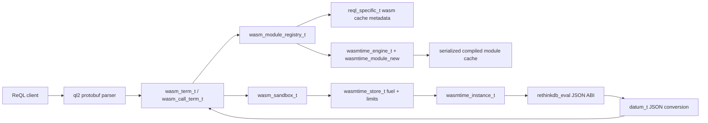
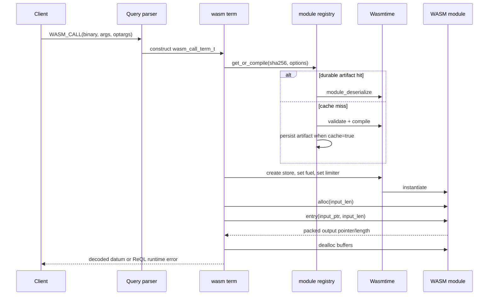
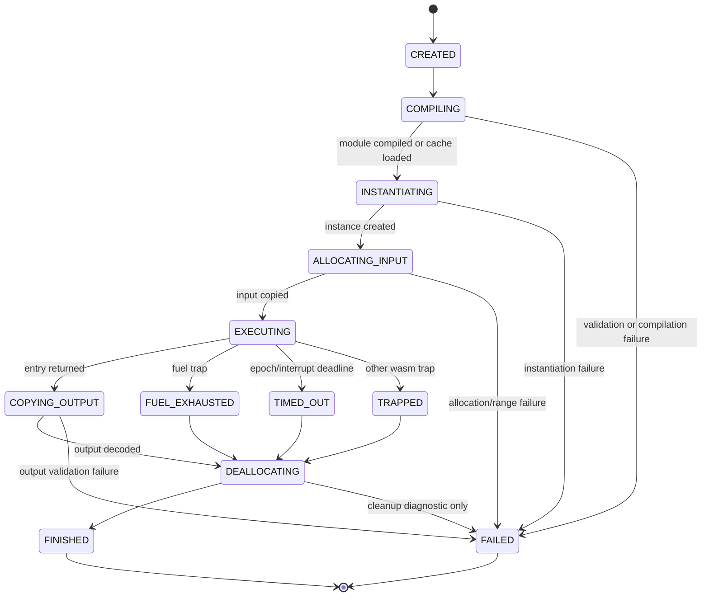
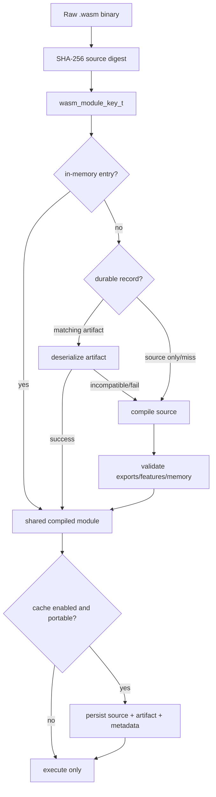

# Phase 3: WASM-based UDF sandbox (replace V8/QuickJS)
## 1. Overview
**Status:** Proposed axiom-level implementation specification for RethinkDB v3.0.
**Repository path:** `/home/kara/rethinkdb`.
**Scope:** Replace the externally hosted QuickJS execution path used by `r.js` with an in-process Wasmtime-backed WebAssembly UDF subsystem. The system accepts a portable WASM binary, validates its imports and exports, compiles it under a constrained engine configuration, caches its serialized compiled form in database metadata, instantiates it per execution, and exchanges ReQL values through a deliberately narrow JSON ABI.
**Affected primary source areas:**
- `src/extproc/js_runner.hpp`
- `src/extproc/js_job.cc`
- `src/extproc/extproc_job.hpp`
- `src/rdb_protocol/terms/js.cc`
- `src/rdb_protocol/terms/terms.hpp`
- `src/rdb_protocol/term.cc`
- `src/rdb_protocol/ql2.proto`
- `src/rdb_protocol/val.hpp`
- `src/rdb_protocol/configured_limits.hpp`
- `src/btree/reql_specific.hpp`
### 1.1 Problem statement
The current JavaScript UDF implementation executes untrusted JavaScript through a QuickJS runtime in an external-process pool. That design has five material limitations.
1. QuickJS source is not a portable, language-neutral module format. Users must write JavaScript and cannot use Rust, C, C++, Zig, AssemblyScript, or TinyGo as UDF implementation languages.
2. The extproc transport adds a process boundary, IPC serialization, child process lifecycle management, and crash recovery to every JS execution path.
3. The JS runner caches evaluated source identifiers, not a validated capability-constrained executable artifact with a stable binary ABI.
4. QuickJS's runtime policy is bespoke and does not provide WebAssembly's standardized import surface, explicit linear-memory bounds, fuel metering, or compilation artifact serialization.
5. Existing JavaScript is intentionally nondeterministic and remains unsuitable for deterministic schema features such as generated columns. A no-WASI, no-clock WASM profile can be deterministic when explicitly declared and validated.
RethinkDB v3.0 therefore introduces a new `WASM` ReQL term family. It does not silently reinterpret source passed to `r.js`; `r.js` remains available and unchanged for the v3.0 compatibility window. New WASM terms use Wasmtime in the server process, with no `extproc_pool_t` dependency in the request path.
### 1.2 Architectural decision
The production runtime is Wasmtime's C API, linked as a pinned third-party dependency. The implementation exposes only a project-local C++ wrapper; Wasmtime headers never appear in ReQL term code or btree metadata code.
`wasm3` is permitted only in a test-only adapter selected by a test build flag. It is not a production fallback, does not write cache artifacts, and must not be enabled by a production configuration option.
WASM UDFs receive no WASI implementation. The module import allowlist contains only RethinkDB host ABI functions declared by this specification. In particular, there is no filesystem, socket, environment-variable, random, clock, process, thread, or dynamic-linking capability.

### 1.3 Goals
1. Provide a documented binary UDF interface usable from all languages that target `wasm32-unknown-unknown`.
2. Execute untrusted UDF bytecode in-process with explicit memory, fuel, wall-clock, output-size, and recursion limits.
3. Remove external-process IPC from the WASM execution path.
4. Ensure modules cannot access host OS capabilities by exposing neither WASI nor arbitrary imports.
5. Cache compiled Wasmtime module artifacts durably in `reql_specific_t` metadata with explicit engine and ABI versioning.
6. Preserve existing `r.js` behavior and compatibility; no existing `JAVASCRIPT` wire token changes behavior.
7. Provide stable machine-readable error codes and exact ReQL error text.
8. Permit deterministic use only when a module passes static restrictions and a term requests deterministic mode.
9. Make module validation and module cache invalidation observable through server logs and unit-test seams.
10. Keep `datum_t` as the sole ReQL value representation at the host boundary.
### 1.4 Non-goals
1. This feature does not compile source code. RethinkDB accepts only a fully linked WASM binary supplied by the client.
2. This feature does not expose a general WASI runtime, preview1, preview2, filesystem, network, time, random, environment, or process API.
3. This feature does not support `wasm-bindgen`, JavaScript glue, Emscripten syscalls, or arbitrary dynamic imports.
4. This feature does not replace, deprecate, or change the semantics of `r.js` in v3.0.
5. This feature does not persist an instantiated runtime, mutable linear memory, globals, tables, or module state between ReQL evaluations.
6. This feature does not provide streaming input or output; arguments and results are bounded JSON documents.
7. This feature does not make arbitrary UDFs deterministic. Only a module accepted by deterministic validation and invoked with `deterministic: true` is marked deterministic.
8. This feature does not distribute modules between clusters independently of normal metadata replication.
9. This feature does not permit a UDF to issue ReQL queries, access transaction internals, or call into storage code.
10. This feature does not retain the `extproc_job_t` process model for WASM execution.
### 1.5 Compatibility rules
- `Term::JAVASCRIPT = 15` remains unchanged in `src/rdb_protocol/ql2.proto`.
- New token values are append-only and must never reuse a retired token number.
- Existing clients that do not know the new terms receive normal unknown-term behavior if they attempt to decode them.
- Existing JavaScript tests in `src/unittest/jsproc.cc` remain active and must not be rewritten as WASM tests.
- WASM module metadata is ignored by v2.x binaries only through normal version incompatibility; v3.0 data files containing WASM cache records must carry a format version gate.
## 2. API Design / ReQL surface
### 2.1 New ReQL terms
Add exactly these protocol terms to the end of the `enum Term` declaration in `src/rdb_protocol/ql2.proto`:
```protobuf
WASM = 194;
WASM_CALL = 195;
```
The numeric values above are normative for this branch. Before merge, the implementer must verify that `194` and `195` are unused in the checked-out `ql2.proto`; if either is occupied, append the two values after the actual highest assigned value and update this specification in the same change. Never renumber existing values.
The driver API generator must expose the following JavaScript driver surface:
```javascript
r.wasm(moduleBytes, [optArgs])
r.wasm(moduleBytes, optArgs).call(...args)
r.wasmCall(moduleBytes, argsArray, [optArgs])
```
`moduleBytes` is a ReQL binary datum. In JavaScript it is supplied as a `Buffer`, `Uint8Array`, or an `r.binary(...)` value according to the driver’s existing binary-datum conventions.
`r.wasm(...)` returns a `WASM_MODULE` value. A `WASM_MODULE` is an opaque ReQL function-like value and is valid only as the receiver of `.call(...)`. It is not serializable as a datum and cannot be stored in a table document.
`r.wasmCall(...)` executes immediately and returns a normal ReQL datum.
### 2.2 `r.wasm(moduleBytes, optArgs)` signature
```javascript
r.wasm(moduleBytes, {
  entry: 'rethinkdb_eval',
  deterministic: false,
  timeout: 5000,
  fuel: 10000000,
  memory_limit: 16777216,
  output_limit: 8388608,
  cache: true
})
```
Arguments:
| Name | Required | ReQL type | Default | Validation |
|---|---:|---|---:|---|
| `moduleBytes` | yes | BINARY | none | Must be nonempty and at most `configured_limits_t::wasm_module_max_bytes`. |
| `entry` | no | STRING | `rethinkdb_eval` | ASCII identifier, length 1..128, must equal an exported function name. |
| `deterministic` | no | BOOL | `false` | `true` requires deterministic validation. |
| `timeout` | no | NUMBER | `5000` | Integer milliseconds, inclusive range 1..`wasm_timeout_max_ms`. |
| `fuel` | no | NUMBER | `10000000` | Unsigned integer, inclusive range 1..`wasm_fuel_max`. |
| `memory_limit` | no | NUMBER | `16777216` | Integer byte count, page-aligned upward, inclusive 65536..`wasm_memory_max_bytes`. |
| `output_limit` | no | NUMBER | `8388608` | Integer byte count, inclusive 1..`wasm_output_max_bytes`. |
| `cache` | no | BOOL | `true` | Enables durable compiled-artifact lookup and insertion for this query. |
The `r.wasm` constructor validates and compiles the module eagerly. It returns a `WASM_MODULE` value only after successful validation and compile/cache retrieval. It does not instantiate the module until `.call` or `r.wasmCall` executes it.
JavaScript example:
```javascript
const module = fs.readFileSync('target/wasm32-unknown-unknown/release/udf.wasm');
const udf = r.wasm(module, {
  entry: 'rethinkdb_eval',
  deterministic: true,
  timeout: 250,
  fuel: 500000,
  memory_limit: 1048576,
  output_limit: 65536
});
r.table('users').map(row => udf.call(row)).run(conn);
```
### 2.3 `wasm_module.call(...args)` signature
```javascript
r.wasm(moduleBytes, optArgs).call(arg0, arg1, ...argN)
```
The call accepts zero or more normal ReQL arguments. The host serializes the complete ordered argument list as a JSON array. A ReQL datum passed as an argument is represented using the existing `datum_t` JSON encoding, including pseudotypes. The call returns the datum decoded from the UDF’s output JSON.
The call’s return type is `DATUM`. It may return `null`, BOOL, NUMBER, STRING, BINARY pseudotype, ARRAY, OBJECT, TIME pseudotype, GEOMETRY pseudotype, or any other `datum_t` representation accepted by the existing JSON datum parser. It may not return a sequence, function, table, selection, or `WASM_MODULE`.
Example:
```javascript
const add = r.wasm(addWasm, {deterministic: true});
r.table('numbers').map(row => add.call(row('a'), row('b')));
```
For a module implementing the required ABI, input becomes `[row('a'), row('b')]`; output is a JSON number.
### 2.4 `r.wasmCall(moduleBytes, argsArray, optArgs)` signature
```javascript
r.wasmCall(moduleBytes, argsArray, {
  entry: 'rethinkdb_eval',
  deterministic: false,
  timeout: 5000,
  fuel: 10000000,
  memory_limit: 16777216,
  output_limit: 8388608,
  cache: true
})
```
`argsArray` must evaluate to an ARRAY datum. It is the ordered ABI argument list. This term is exactly equivalent to:
```javascript
r.wasm(moduleBytes, optArgs).call(...argsArray)
```
except that it avoids creation of an intermediate `WASM_MODULE` ReQL value in driver AST construction.
Example:
```javascript
r.wasmCall(hashWasm, ['alice@example.com'], {
  entry: 'rethinkdb_eval',
  timeout: 100,
  fuel: 100000,
  output_limit: 128
});
```
### 2.5 Required C FFI ABI
A valid module must export exactly these callable ABI functions; extra exports are allowed, subject to validation rules.
```c
/* Writes `input_len` bytes from host memory into module linear memory. */
uint32_t rethinkdb_alloc(uint32_t input_len);
/* Evaluates JSON input at [input_ptr, input_ptr + input_len). */
uint64_t rethinkdb_eval(uint32_t input_ptr, uint32_t input_len);
/* Releases buffers returned by rethinkdb_alloc or rethinkdb_eval. */
void rethinkdb_dealloc(uint32_t ptr, uint32_t len);
```
The `entry` optarg selects the exported evaluator in place of `rethinkdb_eval`; the selected evaluator must always have this exact WebAssembly function type:
```text
(i32 input_ptr, i32 input_len) -> i64 packed_result
```
`rethinkdb_alloc` must have type:
```text
(i32 requested_len) -> i32 output_ptr
```
`rethinkdb_dealloc` must have type:
```text
(i32 ptr, i32 len) -> ()
```
The evaluator returns `packed_result`, whose low 32 bits are `output_ptr` and high 32 bits are `output_len`:
```c
uint32_t output_ptr = (uint32_t)(packed_result & 0xffffffffULL);
uint32_t output_len = (uint32_t)(packed_result >> 32);
```
The host rejects output if `output_len` is zero only when the bytes cannot decode as valid JSON; a zero-length output is otherwise treated as the invalid JSON document and yields `WASM_OUTPUT_INVALID_JSON`.
Input bytes are UTF-8 JSON encoding of one JSON array. Output bytes must be UTF-8 JSON encoding of exactly one ReQL datum.
The module must export one memory named `memory`, with type `memory32`, an initial minimum no greater than the selected `memory_limit`, and a declared maximum no greater than `memory_limit`. Modules with no maximum are rejected.
The module may import no functions, memories, tables, globals, tags, or modules. A module with an import section is rejected even if the import would otherwise be unused. This is stronger and less ambiguous than an allowlist.
The host always calls `rethinkdb_dealloc(input_ptr, input_len)` after evaluator return or trap, when allocation succeeded and the store remains usable. It calls `rethinkdb_dealloc(output_ptr, output_len)` only after bounds-checking the output range and copying the result bytes to host memory.
### 2.6 ReQL-level validation errors
The following exact strings are part of the public API. Error codes in brackets are server-generated machine labels and must not be removed.
| Condition | ReQL error string |
|---|---|
| First argument is not BINARY | `WASM module must be a binary datum. [WASM_MODULE_TYPE]` |
| Module is empty | `WASM module must not be empty. [WASM_MODULE_EMPTY]` |
| Module exceeds configured size | `WASM module exceeds the configured maximum size. [WASM_MODULE_TOO_LARGE]` |
| `entry` is not a string | `WASM option \`entry\` must be a string. [WASM_ENTRY_TYPE]` |
| Entry name invalid | `WASM option \`entry\` must be an ASCII identifier of at most 128 bytes. [WASM_ENTRY_INVALID]` |
| `timeout` invalid | `WASM option \`timeout\` must be an integer number of milliseconds within the configured range. [WASM_TIMEOUT_INVALID]` |
| `fuel` invalid | `WASM option \`fuel\` must be a positive integer within the configured range. [WASM_FUEL_INVALID]` |
| `memory_limit` invalid | `WASM option \`memory_limit\` must be a page-aligned positive byte limit within the configured range. [WASM_MEMORY_LIMIT_INVALID]` |
| `output_limit` invalid | `WASM option \`output_limit\` must be a positive byte limit within the configured range. [WASM_OUTPUT_LIMIT_INVALID]` |
| `argsArray` not array | `WASM call arguments must be an array. [WASM_ARGS_TYPE]` |
| Attempt to store module value | `WASM module values cannot be stored as data. [WASM_VALUE_NOT_DATUM]` |
| Deterministic module check fails | `WASM module cannot be used with \`deterministic: true\`. [WASM_NOT_DETERMINISTIC]` |
### 2.7 Determinism semantics
A `r.wasm(..., {deterministic: false})` expression has `deterministic_t::no()` regardless of bytecode content, matching the conservative behavior of `r.js`.
A `r.wasm(..., {deterministic: true})` expression has `deterministic_t::yes()` only after all of the following hold:
1. The module has zero imports.
2. The module has no `memory.grow` instruction.
3. The module has no mutable globals.
4. The module has no table, element segment, reference type, exception tag, shared memory, atomic instruction, SIMD instruction, relaxed-SIMD instruction, thread proposal construct, or GC proposal construct.
5. The module's selected entry, allocator, and deallocator exports have the required types.
6. The module has a finite declared maximum memory no larger than the configured limit.
This is a validation policy, not a proof that a computation is pure. It establishes that execution has no host capability and cannot observe time, entropy, I/O, or persisted mutable module instance state.
### 2.8 Protocol and pretty-printing requirements
Add `WASM` and `WASM_CALL` cases to term registration in `src/rdb_protocol/term.cc` and declarations in `src/rdb_protocol/terms/terms.hpp`.
Add a new pair of files:
- `src/pprint/wasm_pprint.hpp`
- `src/pprint/wasm_pprint.cc`
The printer must render binary payloads without dumping the complete module. It must emit exactly:
```text
r.wasm(r.binary(<N bytes>), {entry: "...", ...})
r.wasmCall(r.binary(<N bytes>), [...], {...})
```
where `<N bytes>` is the binary datum byte count. The printer must preserve optarg ordering using the existing printer convention.

## 3. Data structures
### 3.1 New file layout
Create these production files:
- `src/rdb_protocol/wasm/wasm_types.hpp`
- `src/rdb_protocol/wasm/wasm_types.cc`
- `src/rdb_protocol/wasm/wasm_runtime.hpp`
- `src/rdb_protocol/wasm/wasm_runtime.cc`
- `src/rdb_protocol/wasm/wasm_registry.hpp`
- `src/rdb_protocol/wasm/wasm_registry.cc`
- `src/rdb_protocol/terms/wasm.cc`
- `src/pprint/wasm_pprint.hpp`
- `src/pprint/wasm_pprint.cc`
`wasm_types.hpp` may include RethinkDB serialization headers and fixed-width standard headers. It must not include Wasmtime headers. `wasm_runtime.hpp` owns all Wasmtime forward declarations and opaque wrapper declarations.
### 3.2 `wasm_error_code_t`
In `src/rdb_protocol/wasm/wasm_types.hpp`, define this enum exactly:
```cpp
enum class wasm_error_code_t : uint16_t {
    MODULE_TYPE = 1,
    MODULE_EMPTY = 2,
    MODULE_TOO_LARGE = 3,
    MODULE_INVALID = 4,
    MODULE_IMPORT_FORBIDDEN = 5,
    MODULE_FEATURE_FORBIDDEN = 6,
    MODULE_MEMORY_INVALID = 7,
    EXPORT_MISSING = 8,
    EXPORT_SIGNATURE_INVALID = 9,
    COMPILE_FAILED = 10,
    CACHE_DESERIALIZE_FAILED = 11,
    INSTANTIATE_FAILED = 12,
    ALLOC_FAILED = 13,
    INPUT_RANGE_INVALID = 14,
    EXECUTION_TRAP = 15,
    FUEL_EXHAUSTED = 16,
    TIMEOUT = 17,
    MEMORY_LIMIT_EXCEEDED = 18,
    OUTPUT_RANGE_INVALID = 19,
    OUTPUT_TOO_LARGE = 20,
    OUTPUT_INVALID_UTF8 = 21,
    OUTPUT_INVALID_JSON = 22,
    OUTPUT_NOT_DATUM = 23,
    DEALLOC_FAILED = 24,
    OPTION_INVALID = 25,
    ARGS_TYPE = 26,
    NOT_DETERMINISTIC = 27,
    CACHE_WRITE_FAILED = 28,
    INTERNAL = 29
};
```
This enum is not serialized directly into user table records. It is used in runtime responses, logs, unit tests, and conversion to exact public error strings.
### 3.3 `wasm_module_key_t`
In `src/rdb_protocol/wasm/wasm_types.hpp`, define:
```cpp
struct wasm_module_key_t {
    uuid_u cluster_uuid;
    std::array<uint8_t, 32> source_sha256;
    uint32_t abi_version;
    uint32_t wasmtime_cache_version;
    RDB_DECLARE_ME_SERIALIZABLE;
};
```
In `src/rdb_protocol/wasm/wasm_types.cc`, define serialization exactly in field order:
```cpp
RDB_IMPL_SERIALIZABLE_4(wasm_module_key_t,
                        cluster_uuid,
                        source_sha256,
                        abi_version,
                        wasmtime_cache_version);
```
`cluster_uuid` binds a cache artifact to a cluster. This prevents an artifact copied from an unrelated cluster metadata block from being treated as locally authoritative.
`source_sha256` is the SHA-256 digest of the exact raw binary datum payload, not a digest of a base64 representation.
`abi_version` is `WASM_UDF_ABI_VERSION`.
`wasmtime_cache_version` is `WASM_UDF_WASMTIME_CACHE_VERSION` and must change whenever the Wasmtime serialized-artifact compatibility contract changes.
### 3.4 `wasm_module_metadata_t`
In `src/rdb_protocol/wasm/wasm_types.hpp`, define:
```cpp
struct wasm_module_metadata_t {
    wasm_module_key_t key;
    std::string entry_name;
    uint32_t initial_memory_pages;
    uint32_t maximum_memory_pages;
    uint64_t source_size_bytes;
    uint64_t compiled_size_bytes;
    bool deterministic_validated;
    uint64_t created_at_unix_micros;
    uint64_t last_used_at_unix_micros;
    uint64_t use_count;
    RDB_DECLARE_ME_SERIALIZABLE;
};
```
In `src/rdb_protocol/wasm/wasm_types.cc`, define:
```cpp
RDB_IMPL_SERIALIZABLE_10(wasm_module_metadata_t,
                         key,
                         entry_name,
                         initial_memory_pages,
                         maximum_memory_pages,
                         source_size_bytes,
                         compiled_size_bytes,
                         deterministic_validated,
                         created_at_unix_micros,
                         last_used_at_unix_micros,
                         use_count);
```
`created_at_unix_micros` and `last_used_at_unix_micros` are cache bookkeeping only. They must not influence module execution, planning, determinism, or user-visible data results.
### 3.5 `wasm_cached_module_t`
In `src/rdb_protocol/wasm/wasm_types.hpp`, define:
```cpp
struct wasm_cached_module_t {
    wasm_module_metadata_t metadata;
    std::vector<uint8_t> source_bytes;
    std::vector<uint8_t> compiled_artifact;
    uint32_t record_version;
    RDB_DECLARE_ME_SERIALIZABLE;
};
```
In `src/rdb_protocol/wasm/wasm_types.cc`, define:
```cpp
RDB_IMPL_SERIALIZABLE_4(wasm_cached_module_t,
                        metadata,
                        source_bytes,
                        compiled_artifact,
                        record_version);
```
`record_version` is `WASM_UDF_CACHE_RECORD_VERSION`, initially `1`. A reader must reject any version greater than the highest supported version. It may read lower supported versions only through an explicit migration branch.
`source_bytes` is always stored even when `compiled_artifact` is present. This permits a server with a new Wasmtime version to recompile from authoritative source after rejecting an incompatible artifact.
### 3.6 `wasm_execution_limits_t`
In `src/rdb_protocol/wasm/wasm_types.hpp`, define:
```cpp
struct wasm_execution_limits_t {
    uint64_t timeout_ms;
    uint64_t fuel;
    uint64_t memory_limit_bytes;
    uint64_t output_limit_bytes;
    RDB_DECLARE_ME_SERIALIZABLE;
};
```
In `src/rdb_protocol/wasm/wasm_types.cc`, define:
```cpp
RDB_IMPL_SERIALIZABLE_4(wasm_execution_limits_t,
                        timeout_ms,
                        fuel,
                        memory_limit_bytes,
                        output_limit_bytes);
```
This type is serializable because it is part of executable ReQL AST state. It is not stored in module cache records and must not be implicitly read from cache metadata.
### 3.7 `wasm_module_options_t`
In `src/rdb_protocol/wasm/wasm_types.hpp`, define:
```cpp
struct wasm_module_options_t {
    std::string entry_name;
    bool deterministic;
    bool cache;
    wasm_execution_limits_t limits;
    RDB_DECLARE_ME_SERIALIZABLE;
};
```
In `src/rdb_protocol/wasm/wasm_types.cc`, define:
```cpp
RDB_IMPL_SERIALIZABLE_4(wasm_module_options_t,
                        entry_name,
                        deterministic,
                        cache,
                        limits);
```
### 3.8 `wasm_validation_state_t`
In `src/rdb_protocol/wasm/wasm_types.hpp`, define:
```cpp
enum class wasm_validation_state_t : uint8_t {
    UNVALIDATED = 0,
    VALIDATING = 1,
    VALID = 2,
    INVALID = 3,
    COMPILED = 4,
    CACHE_LOADED = 5,
    EVICTED = 6
};
```
This enum is in-memory only and is not serialized. The persistent state is represented by presence of a valid `wasm_cached_module_t` record plus its `record_version`.
### 3.9 `wasm_execution_state_t`
In `src/rdb_protocol/wasm/wasm_types.hpp`, define:
```cpp
enum class wasm_execution_state_t : uint8_t {
    CREATED = 0,
    COMPILING = 1,
    INSTANTIATING = 2,
    ALLOCATING_INPUT = 3,
    EXECUTING = 4,
    COPYING_OUTPUT = 5,
    DEALLOCATING = 6,
    FINISHED = 7,
    TRAPPED = 8,
    TIMED_OUT = 9,
    FUEL_EXHAUSTED = 10,
    FAILED = 11
};
```
This enum is in-memory only. Each transition is monotonically forward except the terminal transition from any nonterminal state to `FAILED`.
### 3.10 `wasm_execution_result_t`
In `src/rdb_protocol/wasm/wasm_types.hpp`, define:
```cpp
struct wasm_execution_result_t {
    boost::optional<ql::datum_t> datum;
    boost::optional<wasm_error_code_t> error_code;
    std::string runtime_detail;
    wasm_execution_state_t terminal_state;
};
```
Do not add `RDB_DECLARE_ME_SERIALIZABLE` to `wasm_execution_result_t`. It contains `datum_t`, runtime diagnostics, and process-local execution state and never crosses a cluster metadata boundary.
Exactly one of `datum` and `error_code` must be present. `runtime_detail` must never be returned directly to an unauthenticated client; it is logged after escaping and is included in server-side test diagnostics.
### 3.11 `wasm_runtime_config_t`
In `src/rdb_protocol/wasm/wasm_runtime.hpp`, define:
```cpp
struct wasm_runtime_config_t {
    uint64_t module_max_bytes;
    uint64_t memory_max_bytes;
    uint64_t output_max_bytes;
    uint64_t timeout_max_ms;
    uint64_t fuel_max;
    uint64_t cache_max_bytes;
    uint64_t cache_max_entries;
    uint32_t abi_version;
    uint32_t cache_record_version;
    uint32_t wasmtime_cache_version;
};
```
This configuration is created from `ql::configured_limits_t`, not serialized, and immutable after `wasm_runtime_t::begin`.
### 3.12 `wasm_compiled_module_t`
In `src/rdb_protocol/wasm/wasm_runtime.hpp`, define an opaque runtime owner:
```cpp
class wasm_compiled_module_t : public home_thread_mixin_t {
public:
    wasm_compiled_module_t(wasm_module_key_t key,
                           wasm_module_metadata_t metadata,
                           std::shared_ptr<void> module_handle);
    ~wasm_compiled_module_t();
    const wasm_module_key_t &key() const;
    const wasm_module_metadata_t &metadata() const;
    const std::shared_ptr<void> &module_handle() const;
private:
    wasm_module_key_t key_;
    wasm_module_metadata_t metadata_;
    std::shared_ptr<void> module_handle_;
};
```
`module_handle_` owns a `wasmtime_module_t` through a custom deleter in `wasm_runtime.cc`. No other file may cast the `void` pointer to a Wasmtime type.
### 3.13 `wasm_sandbox_t`
In `src/rdb_protocol/wasm/wasm_runtime.hpp`, define:
```cpp
class wasm_sandbox_t : public home_thread_mixin_t {
public:
    wasm_sandbox_t(wasm_runtime_t *runtime,
                   std::shared_ptr<wasm_compiled_module_t> module,
                   wasm_module_options_t options,
                   signal_t *interruptor);
    ~wasm_sandbox_t();
    wasm_execution_result_t execute(const std::vector<ql::datum_t> &args);
private:
    wasm_execution_result_t instantiate();
    wasm_execution_result_t write_input(const std::string &input_json);
    wasm_execution_result_t invoke_entry();
    wasm_execution_result_t read_output();
    void best_effort_deallocate();
    bool interrupt_or_deadline_reached() const;
    wasm_runtime_t *runtime_;
    std::shared_ptr<wasm_compiled_module_t> module_;
    wasm_module_options_t options_;
    signal_t *interruptor_;
    wasm_execution_state_t state_;
    uint64_t deadline_monotonic_micros_;
    uint32_t input_ptr_;
    uint32_t input_len_;
    uint32_t output_ptr_;
    uint32_t output_len_;
    bool input_allocated_;
    bool output_received_;
    std::shared_ptr<void> store_handle_;
    std::shared_ptr<void> instance_handle_;
};
```
All pointers and lengths in this class are WASM32 offsets and lengths. The host must promote to `uint64_t` before adding or bounds checking them.
### 3.14 `wasm_runtime_t`
In `src/rdb_protocol/wasm/wasm_runtime.hpp`, define:
```cpp
class wasm_runtime_t : public home_thread_mixin_t {
public:
    wasm_runtime_t();
    ~wasm_runtime_t();
    void begin(const ql::configured_limits_t &limits,
               reql_specific_t *reql_specific,
               uuid_u cluster_uuid);
    void end();
    bool started() const;
    wasm_runtime_config_t config() const;
    std::shared_ptr<wasm_compiled_module_t> get_or_compile(
        const std::vector<uint8_t> &source_bytes,
        const wasm_module_options_t &options,
        wasm_error_code_t *error_code_out,
        std::string *runtime_detail_out);
    wasm_execution_result_t execute(
        std::shared_ptr<wasm_compiled_module_t> module,
        const wasm_module_options_t &options,
        const std::vector<ql::datum_t> &args,
        signal_t *interruptor);
private:
    std::shared_ptr<void> engine_handle_;
    wasm_runtime_config_t config_;
    reql_specific_t *reql_specific_;
    uuid_u cluster_uuid_;
    bool started_;
    std::unique_ptr<wasm_module_registry_t> registry_;
};
```
`begin` must configure the Wasmtime engine with fuel consumption enabled, epoch interruption enabled, multi-memory disabled, threads disabled, SIMD disabled, relaxed SIMD disabled, reference types disabled, GC disabled, component model disabled, and WASI unavailable.
### 3.15 `wasm_module_registry_t`
In `src/rdb_protocol/wasm/wasm_registry.hpp`, define:
```cpp
class wasm_module_registry_t : public home_thread_mixin_t {
public:
    wasm_module_registry_t(wasm_runtime_t *runtime,
                           reql_specific_t *reql_specific,
                           uuid_u cluster_uuid);
    ~wasm_module_registry_t();
    std::shared_ptr<wasm_compiled_module_t> get_or_compile(
        const std::vector<uint8_t> &source_bytes,
        const wasm_module_options_t &options,
        wasm_error_code_t *error_code_out,
        std::string *runtime_detail_out);
    void evict_all();
private:
    struct entry_t {
        std::shared_ptr<wasm_compiled_module_t> module;
        wasm_validation_state_t state;
        uint64_t last_used_monotonic_micros;
        uint64_t artifact_size_bytes;
    };
    wasm_module_key_t make_key(const std::vector<uint8_t> &source_bytes) const;
    bool load_durable(const wasm_module_key_t &key,
                      const wasm_module_options_t &options,
                      std::shared_ptr<wasm_compiled_module_t> *out,
                      wasm_error_code_t *error_code_out,
                      std::string *runtime_detail_out);
    bool compile_fresh(const wasm_module_key_t &key,
                       const std::vector<uint8_t> &source_bytes,
                       const wasm_module_options_t &options,
                       std::shared_ptr<wasm_compiled_module_t> *out,
                       wasm_error_code_t *error_code_out,
                       std::string *runtime_detail_out);
    bool persist_durable(const wasm_cached_module_t &record,
                         wasm_error_code_t *error_code_out,
                         std::string *runtime_detail_out);
    void enforce_capacity();
    wasm_runtime_t *runtime_;
    reql_specific_t *reql_specific_;
    uuid_u cluster_uuid_;
    std::map<wasm_module_key_t, entry_t> entries_;
    uint64_t resident_artifact_bytes_;
};
```
`std::map<wasm_module_key_t, entry_t>` requires a strict weak ordering. Implement `operator<` for `wasm_module_key_t` in `wasm_types.cc` using lexicographic field order: `cluster_uuid`, `source_sha256`, `abi_version`, `wasmtime_cache_version`.
### 3.16 `configured_limits_t` additions
In `src/rdb_protocol/configured_limits.hpp`, add these fields to `ql::configured_limits_t` in the same style as existing limits:
```cpp
uint64_t wasm_module_max_bytes;
uint64_t wasm_memory_max_bytes;
uint64_t wasm_output_max_bytes;
uint64_t wasm_timeout_max_ms;
uint64_t wasm_fuel_max;
uint64_t wasm_cache_max_bytes;
uint64_t wasm_cache_max_entries;
```
Add corresponding defaults in the existing limits construction site:
```cpp
wasm_module_max_bytes = 16ULL * 1024ULL * 1024ULL;
wasm_memory_max_bytes = 64ULL * 1024ULL * 1024ULL;
wasm_output_max_bytes = 8ULL * 1024ULL * 1024ULL;
wasm_timeout_max_ms = 5000ULL;
wasm_fuel_max = 100000000ULL;
wasm_cache_max_bytes = 256ULL * 1024ULL * 1024ULL;
wasm_cache_max_entries = 1024ULL;
```
All values are server upper bounds. Query optargs may lower but never increase the effective limit.
## 4. Query planner / execution engine changes
### 4.1 Term classes
In `src/rdb_protocol/terms/wasm.cc`, define two term classes in namespace `ql`:
```cpp
class wasm_term_t : public op_term_t {
public:
    wasm_term_t(const protob_t<const Term *> &term,
                const std::vector<backtrace_id_t> &bt_src);
private:
    scoped_ptr_t<val_t> eval_impl(scope_env_t *env,
                                  args_t *args,
                                  eval_flags_t flags) const override;
};
class wasm_call_term_t : public op_term_t {
public:
    wasm_call_term_t(const protob_t<const Term *> &term,
                     const std::vector<backtrace_id_t> &bt_src);
private:
    scoped_ptr_t<val_t> eval_impl(scope_env_t *env,
                                  args_t *args,
                                  eval_flags_t flags) const override;
};
```
Use the existing `op_term_t` constructor and optarg parsing conventions from `src/rdb_protocol/terms/js.cc`; do not introduce a second option parser framework.
`wasm_term_t::eval_impl` evaluates its binary module argument and optargs, calls `env->env->get_wasm_runtime()->get_or_compile(...)`, then returns a `val_t` holding a new `wasm_module_val_t`.
Create `wasm_module_val_t` in `src/rdb_protocol/val.hpp` and implement it in the corresponding implementation file. It must derive from `val_t`, own a `std::shared_ptr<wasm_compiled_module_t>`, retain `wasm_module_options_t`, and reject all datum coercion methods with `WASM_VALUE_NOT_DATUM`.
```cpp
class wasm_module_val_t : public val_t {
public:
    wasm_module_val_t(backtrace_id_t bt,
                      std::shared_ptr<wasm_compiled_module_t> module,
                      wasm_module_options_t options);
    val_type_t get_type() const override;
    std::shared_ptr<wasm_compiled_module_t> module() const;
    const wasm_module_options_t &options() const;
private:
    std::shared_ptr<wasm_compiled_module_t> module_;
    wasm_module_options_t options_;
};
```
Add `WASM_MODULE` to the existing `val_type_t` enum. Its stringifier must produce `WASM_MODULE`.
`wasm_call_term_t::eval_impl` evaluates the binary module and `argsArray`, parses the same options, compiles/loads through the runtime, then calls `wasm_runtime_t::execute` and returns `val_t::make_datum(result.datum.get())` on success.
The driver fluent `.call(...)` representation must compile to `WASM_CALL`; it does not add a generic method-dispatch ReQL term.
### 4.2 Planner properties
`wasm_call_term_t` is non-streaming and scalar. It may be evaluated inside `map`, `filter`, `merge`, `update`, or function bodies exactly as other scalar terms are, subject to determinism rules.
The planner must not hoist `WASM_CALL` out of a row-dependent context. Even deterministic calls must be evaluated per distinct argument tuple unless an existing optimizer proves equivalence through the normal term purity rules.
When `deterministic: false`, expose `deterministic_t::no()` and prohibit use in any location that already rejects `r.js`, including generated columns defined by the Phase 3 generated-column implementation.
When `deterministic: true`, expose `deterministic_t::yes()` only after module validation succeeds. Failure occurs during term evaluation/compilation, not through a planner guess.
`WASM_MODULE` values are query-local and must not cross a distributed query boundary. A worker that needs the module receives the source binary embedded in the serialized term AST and independently obtains the durable cache record. Do not serialize a raw `wasmtime_module_t` or pointer.
### 4.3 Sandbox lifecycle
The lifecycle is mandatory and ordered:
1. Parse term arguments and apply server-clamped limits.
2. Compute source SHA-256 and construct `wasm_module_key_t`.
3. Check the in-memory registry.
4. If absent and `cache: true`, load matching durable cache record.
5. Deserialize the compiled artifact only if every key/version field matches the active runtime.
6. On artifact failure, delete or tombstone only the artifact portion of the durable entry, retain source bytes, and compile source fresh.
7. Validate source bytecode before compile, including import, feature, export, and memory rules.
8. Compile through the configured Wasmtime engine.
9. Serialize the compiled module; if `cache: true`, persist source plus artifact atomically in metadata.
10. Create a new store for each call.
11. Configure store fuel exactly to the effective `fuel` value.
12. Configure store epoch deadline and host monotonic deadline exactly to the effective `timeout` value.
13. Install a per-store resource limiter with the effective memory limit.
14. Instantiate the compiled module with an empty import vector.
15. Obtain `memory`, allocator, selected entry, and deallocator exports by exact name.
16. Serialize ReQL args to one UTF-8 JSON array.
17. Call allocator, validate returned input range, copy input JSON to linear memory.
18. Call selected evaluator and decode its packed return.
19. Validate output range, output byte length, UTF-8, JSON, and datum conversion.
20. Copy output bytes before calling deallocator.
21. Call deallocator for output, then input, best effort.
22. Destroy instance and store regardless of success or failure.
23. Return datum or a mapped error.

### 4.4 Timeout and interrupt integration
Wasmtime epoch interruption is the primary execution-time limiter. `wasm_runtime_t::begin` starts one server-owned epoch ticker at a bounded cadence of 1 millisecond. The ticker increments the engine epoch; it must not be driven by client requests.
Before entry invocation, `wasm_sandbox_t` computes `deadline_monotonic_micros_` from the server monotonic clock. It converts the effective timeout to an epoch deadline rounded up to the next ticker period. The runtime must additionally poll `interruptor_` before allocation, before invocation, and after invocation. If `interruptor_` is pulsed, report the existing query interruption mechanism, not a synthetic `WASM_TIMEOUT` error.
A wall-clock deadline alone is insufficient because it cannot preempt running bytecode. Epoch interruption is required. Fuel alone is insufficient because compiled instructions do not map to user-visible elapsed time. Both limits must be active for every invocation.
### 4.5 Fuel and memory integration
Fuel is set per store and not shared between invocations. The runtime must not replenish fuel during a call.
Memory is constrained by three layers:
1. Validation rejects an initial or maximum declared linear-memory size above the effective byte limit.
2. Wasmtime store resource limiting rejects growth beyond the effective byte limit.
3. Host input and output pointer/length validation rejects any range outside current memory size, including integer overflow.
Compute each range with:
```cpp
uint64_t begin = static_cast<uint64_t>(ptr);
uint64_t end = begin + static_cast<uint64_t>(len);
if (end < begin || end > current_memory_size) { /* reject */ }
```
Never use 32-bit addition for a bounds check.
### 4.6 JSON conversion
Use existing `datum_t` JSON serialization and parsing facilities in `src/rdb_protocol/val.hpp` and related datum implementation. Do not add a second JSON library in the WASM subsystem.
The host input is a JSON array. The host output is parsed using a mode that accepts exactly one JSON value with no trailing non-whitespace content. The parser must preserve normal ReQL pseudotype rules. If existing parser APIs cannot distinguish trailing data, add a narrow helper in the existing datum JSON implementation rather than parsing with a separate library.
Binary datum output must use RethinkDB's standard JSON pseudotype representation. Raw arbitrary bytes are not valid JSON output.
### 4.7 Difference from existing JS runner path
| Concern | Existing `r.js` | New WASM UDF |
|---|---|---|
| Runtime | QuickJS | Wasmtime C API |
| Process placement | `extproc_pool_t` child process | Server process, per-call store |
| Transport | extproc request/response IPC | Direct C++ calls and linear memory copy |
| Input language | JavaScript source text | Validated `.wasm` binary |
| ABI | JS conversion and function invocation | Fixed JSON allocator/evaluator/deallocator ABI |
| Cache key | JS source-to-ID runtime cache | SHA-256 + ABI + Wasmtime cache version |
| Persistent artifact | No compiled QuickJS bytecode cache | Source plus serialized compiled module metadata |
| Resource accounting | extproc timeout / process isolation | fuel + epoch timeout + store limiter |
| OS capability policy | child process controls | zero imports, no WASI |
| Instance reuse | runner context behavior | no instance reuse; one store/instance per call |
## 5. Storage layout
### 5.1 Metadata ownership
WASM compiled artifacts are stored in `reql_specific_t` metadata, declared in `src/btree/reql_specific.hpp`. They are not stored in user tables, document B-tree leaf values, table config records, or the raw superblock header structure.
Add a `wasm_module_cache_t` member to `reql_specific_t`. The cache is logically part of cluster-wide ReQL metadata and is replicated through the same metadata propagation mechanism as other `reql_specific_t` fields.
In `src/btree/reql_specific.hpp`, define:
```cpp
struct wasm_module_cache_t {
    std::map<wasm_module_key_t, wasm_cached_module_t> entries;
    uint64_t total_artifact_bytes;
    uint64_t generation;
    RDB_DECLARE_ME_SERIALIZABLE;
};
```
In the corresponding `.cc`, define:
```cpp
RDB_IMPL_SERIALIZABLE_3(wasm_module_cache_t,
                        entries,
                        total_artifact_bytes,
                        generation);
```
Add this exact field to `reql_specific_t`:
```cpp
wasm_module_cache_t wasm_module_cache;
```
Append it to the existing `RDB_IMPL_SERIALIZABLE_N(reql_specific_t, ...)` invocation. Do not reorder existing `reql_specific_t` fields.
### 5.2 Why not raw superblock bytes
The superblock is a low-level storage structure and must not become a variable-length executable-artifact container. `reql_specific_t` is the correct ownership layer because it already expresses ReQL-specific, cluster-coordinated metadata and participates in versioned serialization.
The phrase “cached in the B-tree superblock” means the cache is reachable from persistent metadata rooted by the superblock, not that arbitrary Wasmtime bytes are embedded directly in the fixed raw superblock header.
### 5.3 Durable record format
Each map key is `wasm_module_key_t`.
Each value is `wasm_cached_module_t`:
```text
record_version
metadata
  key
  entry_name
  initial_memory_pages
  maximum_memory_pages
  source_size_bytes
  compiled_size_bytes
  deterministic_validated
  created_at_unix_micros
  last_used_at_unix_micros
  use_count
source_bytes
compiled_artifact
```
The serialization order is exactly the field declaration order and is fixed by the macros defined in Section 3.
The cache record must be written atomically with metadata update semantics already used for `reql_specific_t`. A partially persisted record must be impossible; if the metadata write reports failure, the in-memory registry may retain the compiled module for the active query but must not mark it durable.
### 5.4 Cache insertion and eviction
Cache insertion occurs only after successful source validation, successful compilation, successful Wasmtime serialization, and a successful metadata write.
Cache lookup is exact over all key fields. A matching source SHA-256 with a differing ABI or Wasmtime cache version is a cache miss, not an error.
Eviction is least-recently-used by `last_used_at_unix_micros`, with SHA-256 byte order as a deterministic tie-breaker. Evict whole entries; never strip source bytes while retaining a compiled artifact.
Before inserting a new record, evict entries until both of these conditions will hold:
```text
entry_count <= wasm_cache_max_entries
total_artifact_bytes <= wasm_cache_max_bytes
```
`total_artifact_bytes` counts only `compiled_artifact.size()`, not source bytes. Source-byte storage is bounded separately by the module upload maximum and cache-entry maximum. If no eviction can make room because the single artifact exceeds `wasm_cache_max_bytes`, execute the current query from the in-memory compiled module but do not persist it.
### 5.5 Artifact compatibility and versioning
Define these constants in `src/rdb_protocol/wasm/wasm_types.hpp`:
```cpp
static const uint32_t WASM_UDF_ABI_VERSION = 1;
static const uint32_t WASM_UDF_CACHE_RECORD_VERSION = 1;
static const uint32_t WASM_UDF_WASMTIME_CACHE_VERSION = 1;
```
Bump `WASM_UDF_ABI_VERSION` for any change to required exports, function signatures, packed result representation, JSON encoding rules, import policy, or deterministic validation semantic contract.
Bump `WASM_UDF_CACHE_RECORD_VERSION` for any serialized-field layout or meaning change in `wasm_cached_module_t`, `wasm_module_metadata_t`, `wasm_module_key_t`, or `wasm_module_cache_t`.
Bump `WASM_UDF_WASMTIME_CACHE_VERSION` whenever the pinned Wasmtime release changes, Wasmtime's serialized module format compatibility changes, engine configuration alters compiled-code compatibility, or target architecture/CPU feature policy changes.
On a cache artifact deserialize failure, log a warning including source digest prefix and version fields, remove the unusable artifact from the durable record, retain source, and recompile. Do not return an error to the query unless fresh compilation fails.
### 5.6 Cluster and upgrade behavior
A cluster member may compile a source module locally even when another member has populated the durable artifact. The durable artifact is an optimization, never the only executable representation.
During mixed-version rolling upgrade, nodes that cannot understand the new `reql_specific_t` field must be rejected by the existing data-format/version negotiation before serving writes. This feature does not define a mixed v2/v3 metadata protocol.
Do not include machine-specific native-code artifacts in a shared cache if Wasmtime serialization is not portable across the supported cluster architecture set. The implementation must gate persistence on an explicit `wasmtime_module_serialize` portability guarantee for the configured target. If no guarantee exists, persist source bytes and a portable validated metadata record but leave `compiled_artifact` empty. The runtime then compiles locally. This is mandatory correctness behavior, not an optimization choice.

## 6. Integration points
### 6.1 Build-system integration
Add Wasmtime as a pinned external dependency under `external/wasmtime_<PINNED_VERSION>/` using the repository's existing external dependency convention. The exact version string must be declared once in the build configuration and surfaced in `WASM_UDF_WASMTIME_CACHE_VERSION` documentation.
Modify the top-level and source-level build files that currently enumerate `src/extproc` and `src/rdb_protocol` sources. Add:
```text
src/rdb_protocol/wasm/wasm_types.cc
src/rdb_protocol/wasm/wasm_runtime.cc
src/rdb_protocol/wasm/wasm_registry.cc
src/rdb_protocol/terms/wasm.cc
src/pprint/wasm_pprint.cc
```
Link against Wasmtime's C API library only. Do not link C++ bindings, WASI libraries, or a compiler toolchain into the server binary.
Add a build-time configure check that fails with a clear error if the pinned Wasmtime C header or library is unavailable.
### 6.2 Environment lifecycle integration
Locate the environment owner that currently exposes `get_js_runner()` by searching `src/rdb_protocol` for that exact symbol. Add a sibling accessor:
```cpp
wasm_runtime_t *get_wasm_runtime();
```
Add an owning member:
```cpp
scoped_ptr_t<wasm_runtime_t> wasm_runtime_;
```
Create and call `wasm_runtime_->begin(configured_limits, reql_specific, cluster_uuid)` during server/query-environment initialization after `reql_specific_t` is available and before any ReQL worker accepts a query.
Call `wasm_runtime_->end()` before destruction of the environment, before `reql_specific_t` ownership is released, and before the event loop shuts down. `end()` must reject new work, stop epoch ticking, destroy registry entries, then destroy the Wasmtime engine.
Do not initialize WASM through `extproc_pool_t`, `js_runner_t::begin`, or `extproc_job_t`.
### 6.3 `js_runner_t` and extproc mapping
The existing architecture remains intact for JavaScript:
- `src/extproc/js_runner.hpp`: unchanged public `js_runner_t` API.
- `src/extproc/js_job.cc`: unchanged QuickJS conversion behavior.
- `src/extproc/extproc_job.hpp`: unchanged base external-process job abstraction.
- `src/rdb_protocol/terms/js.cc`: unchanged `javascript_term_t` semantics and error behavior.
- `src/unittest/jsproc.cc`: remains a regression suite for the old JS pipeline.
The WASM subsystem does **not** subclass `extproc_job_t`, does **not** add a `wasm_runner_t` to `src/extproc`, and does **not** put Wasmtime execution into `extproc_pool_t`.
The conceptual mapping is:
| QuickJS/extproc responsibility | WASM replacement |
|---|---|
| `js_runner_t` request coordinator | `wasm_runtime_t` + `wasm_module_registry_t` |
| `extproc_job_t` child-process message | direct `wasm_sandbox_t::execute` call |
| `quickjs_context` | `wasmtime_store_t` + `wasmtime_instance_t`, wrapped privately |
| JS source cache ID | `wasm_module_key_t` durable/in-memory cache key |
| JS↔datum conversion | JSON ABI using existing `datum_t` JSON conversion |
| child crash signal | Wasmtime trap/error classification |
This is a replacement of the execution model for the new API, not an extension of extproc.
### 6.4 Term registration integration
In `src/rdb_protocol/term.cc`:
1. Include `rdb_protocol/terms/wasm.hpp` if the project term include convention uses headers, otherwise expose constructors in `terms.hpp` as neighboring terms do.
2. Add `case Term::WASM:` constructing `wasm_term_t`.
3. Add `case Term::WASM_CALL:` constructing `wasm_call_term_t`.
4. Add arity validation before generic option handling: `WASM` has exactly one positional argument; `WASM_CALL` has exactly two positional arguments.
5. Preserve the standard error backtrace behavior by passing `bt_src` exactly as existing terms do.
In `src/rdb_protocol/terms/terms.hpp`, add forward declarations or includes matching the local style. Do not expose Wasmtime types in this header.
In `src/rdb_protocol/ql2.proto`, append the enum values defined in Section 2.1 and regenerate all protocol bindings using the repository's existing protobuf generation target.
### 6.5 Value integration
In `src/rdb_protocol/val.hpp`:
1. Add `WASM_MODULE` to `val_type_t`.
2. Add declaration of `wasm_module_val_t` from Section 4.1.
3. Make every datum-conversion path reject `WASM_MODULE` with the exact `WASM_VALUE_NOT_DATUM` error string.
4. Ensure `wasm_module_val_t` cannot be accidentally serialized by normal `datum_t` conversion or `to_json` paths.
The `wasm_module_val_t` is valid only in the same query evaluation graph. Capturing it inside a ReQL function is allowed only if the function is executed within that query; serialization to a remote worker uses the original term, not this runtime value.
### 6.6 `table_config_t` and `reql_specific_t`
`table_config_t` must not gain a module binary, compiled artifact, raw pointer, or Wasmtime-specific field for this feature.
Table configuration references are not introduced in v3.0. Users supply a module in the ReQL term. Persistent, named UDF catalogs are explicitly deferred.
`reql_specific_t` gains only `wasm_module_cache_t` as specified in Section 5. This object is cache metadata, not table schema configuration.
Generated columns and other schema objects may embed a `WASM` term AST only through the normal serialized ReQL AST mechanism. They must not copy compiled artifact bytes into schema definitions. When a generated column evaluates, the worker gets the module bytes from the AST and uses `reql_specific_t.wasm_module_cache` only as an optional cache.
### 6.7 Configured limits integration
Modify `src/rdb_protocol/configured_limits.hpp` and every corresponding parser/default/serialization location found by tracing `configured_limits_t` uses. The new fields must be included in configuration validation and be visible in any existing admin inspection output for configured limits.
Reject server startup if:
```text
wasm_module_max_bytes == 0
wasm_memory_max_bytes < 65536
wasm_memory_max_bytes % 65536 != 0
wasm_output_max_bytes == 0
wasm_timeout_max_ms == 0
wasm_fuel_max == 0
wasm_cache_max_entries == 0
```
`wasm_cache_max_bytes` may be zero only to disable durable artifact caching; source validation and in-memory compilation remain available.
### 6.8 Logging integration
Runtime failures must log a structured server message with:
```text
component=wasm_udf
error_code=<wasm_error_code_t name>
source_sha256_prefix=<first 12 hex chars>
entry=<escaped entry name>
state=<wasm_execution_state_t name>
```
Never log raw module contents, JSON input values, JSON output values, auth tokens, or more than 256 bytes of a Wasmtime diagnostic string.
## 7. Error paths
### 7.1 Error conversion rule
All public WASM failures must be raised as ordinary ReQL runtime errors through the existing error machinery used by `src/rdb_protocol/terms/js.cc`. The server must include the exact message below. Runtime diagnostic detail is server-log-only, except that the public text may append the fixed entry name when shown below.
### 7.2 Error catalog
| Code | Trigger | ReQL response |
|---|---|---|
| `WASM_MODULE_TYPE` | `moduleBytes` evaluates to anything other than BINARY. | `WASM module must be a binary datum. [WASM_MODULE_TYPE]` |
| `WASM_MODULE_EMPTY` | Binary datum has zero bytes. | `WASM module must not be empty. [WASM_MODULE_EMPTY]` |
| `WASM_MODULE_TOO_LARGE` | Module byte count exceeds effective server module maximum. | `WASM module exceeds the configured maximum size. [WASM_MODULE_TOO_LARGE]` |
| `WASM_MODULE_INVALID` | Wasmtime parser rejects malformed bytecode, bad magic, malformed section, or invalid index. | `WASM module is not valid WebAssembly. [WASM_MODULE_INVALID]` |
| `WASM_IMPORT_FORBIDDEN` | Any import section entry exists, regardless of kind. | `WASM modules may not import host capabilities. [WASM_IMPORT_FORBIDDEN]` |
| `WASM_FEATURE_FORBIDDEN` | Validation sees a forbidden proposal feature, including threads, SIMD, shared memory, references, GC, exceptions, component model, or multi-memory. | `WASM module uses a feature not permitted by the RethinkDB sandbox. [WASM_FEATURE_FORBIDDEN]` |
| `WASM_MEMORY_INVALID` | Missing `memory` export, non-memory export named `memory`, no declared max, initial/max pages invalid, or page limit exceeded. | `WASM module must export bounded memory named \`memory\`. [WASM_MEMORY_INVALID]` |
| `WASM_EXPORT_MISSING` | Allocator, selected entry, or deallocator export does not exist. | `WASM module is missing required export \`<name>\`. [WASM_EXPORT_MISSING]` |
| `WASM_EXPORT_SIGNATURE_INVALID` | Required export exists but does not have the exact ABI function signature. | `WASM module export \`<name>\` has an incompatible RethinkDB WASM ABI signature. [WASM_EXPORT_SIGNATURE_INVALID]` |
| `WASM_COMPILE_FAILED` | Wasmtime validation/compilation fails after syntax-level validation. | `WASM module compilation failed. [WASM_COMPILE_FAILED]` |
| `WASM_CACHE_DESERIALIZE_FAILED` | Cache artifact cannot deserialize and source bytes are absent or fresh compilation also fails. | `WASM cached module artifact is incompatible and could not be rebuilt. [WASM_CACHE_DESERIALIZE_FAILED]` |
| `WASM_INSTANTIATE_FAILED` | Module instantiation fails with empty imports, start function traps, or required exports cannot be retrieved after instantiation. | `WASM module could not be instantiated. [WASM_INSTANTIATE_FAILED]` |
| `WASM_ALLOC_FAILED` | Allocator traps, returns invalid pointer, or module memory cannot hold input bytes. | `WASM module could not allocate input memory. [WASM_ALLOC_FAILED]` |
| `WASM_INPUT_RANGE_INVALID` | `input_ptr + input_len` overflows or exceeds current linear memory after allocation. | `WASM module returned an invalid input memory range. [WASM_INPUT_RANGE_INVALID]` |
| `WASM_EXECUTION_TRAP` | Evaluator traps for a reason other than fuel or epoch timeout. | `WASM execution trapped. [WASM_EXECUTION_TRAP]` |
| `WASM_FUEL_EXHAUSTED` | Wasmtime reports out-of-fuel. | `WASM execution exceeded its fuel limit. [WASM_FUEL_EXHAUSTED]` |
| `WASM_TIMEOUT` | Epoch deadline expires before evaluator returns. | `WASM execution exceeded its timeout. [WASM_TIMEOUT]` |
| `WASM_MEMORY_LIMIT_EXCEEDED` | Store limiter denies memory growth or Wasmtime reports resource-limit breach. | `WASM execution exceeded its memory limit. [WASM_MEMORY_LIMIT_EXCEEDED]` |
| `WASM_OUTPUT_RANGE_INVALID` | Packed output pointer/length overflows or is out of current linear memory bounds. | `WASM module returned an invalid output memory range. [WASM_OUTPUT_RANGE_INVALID]` |
| `WASM_OUTPUT_TOO_LARGE` | Packed output length exceeds effective output limit. | `WASM module output exceeds the configured maximum size. [WASM_OUTPUT_TOO_LARGE]` |
| `WASM_OUTPUT_INVALID_UTF8` | Output byte range is not valid UTF-8. | `WASM module output is not valid UTF-8 JSON. [WASM_OUTPUT_INVALID_UTF8]` |
| `WASM_OUTPUT_INVALID_JSON` | UTF-8 output is not exactly one valid JSON value. | `WASM module output is not valid JSON. [WASM_OUTPUT_INVALID_JSON]` |
| `WASM_OUTPUT_NOT_DATUM` | JSON parses but cannot become a ReQL datum under normal pseudotype rules. | `WASM module output cannot be converted to a ReQL datum. [WASM_OUTPUT_NOT_DATUM]` |
| `WASM_DEALLOC_FAILED` | Deallocator traps after result copy; primary call otherwise succeeded. | No client error if a valid result was produced; emit server warning `WASM deallocation failed after result copy. [WASM_DEALLOC_FAILED]`. If execution was already failing, preserve the primary error. |
| `WASM_OPTION_INVALID` | Any option has wrong type/range or unknown option is supplied. | `Invalid WASM option \`<name>\`. [WASM_OPTION_INVALID]` |
| `WASM_ARGS_TYPE` | Second `WASM_CALL` positional argument is not an ARRAY datum. | `WASM call arguments must be an array. [WASM_ARGS_TYPE]` |
| `WASM_NOT_DETERMINISTIC` | `deterministic: true` requested and deterministic validation rule fails. | `WASM module cannot be used with \`deterministic: true\`. [WASM_NOT_DETERMINISTIC]` |
| `WASM_CACHE_WRITE_FAILED` | Execution succeeds but requested durable cache insertion fails. | Do not fail the query. Log `WASM compiled module cache write failed. [WASM_CACHE_WRITE_FAILED]`; execute with the in-memory module. |
| `WASM_INTERNAL` | Unexpected wrapper invariant failure, null runtime, impossible state transition, or unclassified Wasmtime error. | `WASM execution failed due to an internal server error. [WASM_INTERNAL]` |
### 7.3 Error precedence
When multiple failures are observed, return the earliest failure in this precedence order:
1. ReQL argument and option validation.
2. Module size and parse validation.
3. Import, feature, memory, and export ABI validation.
4. Cache artifact compatibility recovery.
5. Compilation.
6. Instantiation.
7. Allocation/input memory validation.
8. Query interruption.
9. Timeout.
10. Fuel exhaustion.
11. Memory limit breach.
12. Generic execution trap.
13. Output range/size/UTF-8/JSON/datum validation.
14. Cleanup warning.
15. Internal invariant failure.
A pulsed `signal_t` must use the existing query cancellation error path and takes precedence over timeout/fuel classification if detected before or immediately after a Wasmtime interruption.
### 7.4 Cache errors are non-semantic
A cache miss, artifact incompatibility, artifact eviction, metadata cache write failure, and LRU eviction must never change successful UDF semantics. They may increase latency and produce logs, but only an inability to compile authoritative source may fail a query.
## 8. Testing requirements
### 8.1 Test file plan
Add the following test files in the style used by the current unit test tree:
- `src/unittest/wasm_types.cc`
- `src/unittest/wasm_runtime.cc`
- `src/unittest/wasm_terms.cc`
- `src/unittest/wasm_cache.cc`
- `src/unittest/wasm_failure.cc`
Retain `src/unittest/jsproc.cc` unchanged except for build-target adjustments necessary to run both JS and WASM suites.
Add small, checked-in fixture binaries under:
- `src/unittest/fixtures/wasm/identity.wasm`
- `src/unittest/fixtures/wasm/add.wasm`
- `src/unittest/fixtures/wasm/invalid_magic.wasm`
- `src/unittest/fixtures/wasm/imports_env.wasm`
- `src/unittest/fixtures/wasm/missing_export.wasm`
- `src/unittest/fixtures/wasm/bad_signature.wasm`
- `src/unittest/fixtures/wasm/infinite_loop.wasm`
- `src/unittest/fixtures/wasm/memory_grow.wasm`
- `src/unittest/fixtures/wasm/invalid_output_json.wasm`
- `src/unittest/fixtures/wasm/invalid_output_utf8.wasm`
- `src/unittest/fixtures/wasm/output_oob.wasm`
- `src/unittest/fixtures/wasm/output_too_large.wasm`
Fixtures must be generated from reproducible source under `src/unittest/fixtures/wasm-src/` with a documented build command. Do not check in opaque binaries without their source.
### 8.2 Unit tests: type and serialization
`src/unittest/wasm_types.cc` must cover:
1. Round-trip serialization of `wasm_module_key_t` with nonzero UUID, all digest byte values, and nondefault versions.
2. Round-trip serialization of `wasm_module_metadata_t` preserving all ten fields.
3. Round-trip serialization of `wasm_cached_module_t` with source and compiled vectors containing zero bytes.
4. Round-trip serialization of `wasm_execution_limits_t` and `wasm_module_options_t`.
5. Round-trip serialization of `wasm_module_cache_t` containing multiple entries in deterministic map order.
6. Strict ordering of `wasm_module_key_t`: differing each field individually produces a valid stable ordering.
7. Every `wasm_error_code_t` maps to exactly one stable error-name string.
8. Every `wasm_execution_state_t` terminal classification is correct.
### 8.3 Unit tests: module validation
`src/unittest/wasm_runtime.cc` must cover:
1. Valid identity fixture validates, compiles, instantiates, and returns its sole JSON argument.
2. Valid add fixture accepts `[2, 3]` and returns ReQL number `5`.
3. Bad magic fixture returns `WASM_MODULE_INVALID`.
4. Import fixture returns `WASM_IMPORT_FORBIDDEN` even if import is unused.
5. Missing allocator returns `WASM_EXPORT_MISSING` naming `rethinkdb_alloc`.
6. Missing deallocator returns `WASM_EXPORT_MISSING` naming `rethinkdb_dealloc`.
7. Missing selected entry returns `WASM_EXPORT_MISSING` naming the requested entry.
8. Bad evaluator signature returns `WASM_EXPORT_SIGNATURE_INVALID`.
9. Memory with no maximum returns `WASM_MEMORY_INVALID`.
10. Memory max above effective limit returns `WASM_MEMORY_INVALID`.
11. Module with forbidden SIMD/reference/thread feature returns `WASM_FEATURE_FORBIDDEN`.
12. Deterministic mode rejects a module containing `memory.grow`.
13. Non-deterministic mode may accept a bounded module containing `memory.grow`, while runtime resource limiting still applies.
### 8.4 Unit tests: ABI and data conversion
`src/unittest/wasm_runtime.cc` must cover:
1. Input passed to the module is an exact JSON array in original argument order.
2. Strings containing quotes, Unicode scalar values, and embedded NUL represented by ReQL string conventions round-trip correctly.
3. Objects preserve ReQL datum semantics.
4. Arrays preserve nesting and ordering.
5. Pseudotype JSON accepted by existing datum conversion round-trips through the ABI.
6. `null`, `false`, `true`, integer-like number, floating number, string, array, and object outputs all become the expected `datum_t`.
7. Output with trailing JSON document returns `WASM_OUTPUT_INVALID_JSON`.
8. Empty output returns `WASM_OUTPUT_INVALID_JSON`.
9. Invalid UTF-8 output returns `WASM_OUTPUT_INVALID_UTF8`.
10. Output larger than `output_limit` returns `WASM_OUTPUT_TOO_LARGE` before host JSON parsing.
11. Output pointer plus length overflowing 32-bit representation is validated using 64-bit arithmetic and returns `WASM_OUTPUT_RANGE_INVALID`.
12. Allocator return range outside memory returns `WASM_INPUT_RANGE_INVALID`.
### 8.5 Unit tests: resource controls
`src/unittest/wasm_failure.cc` must cover:
1. Infinite loop fixture with small fuel returns `WASM_FUEL_EXHAUSTED`.
2. Infinite loop fixture with sufficient fuel but short timeout returns `WASM_TIMEOUT`.
3. A test-controlled pulsed `signal_t` interrupts an infinite loop through the existing query cancellation path.
4. Fixture growing memory beyond the store limit returns `WASM_MEMORY_LIMIT_EXCEEDED`.
5. Declared memory maximum exactly equal to effective limit is accepted.
6. Declared initial memory exactly equal to effective limit is accepted.
7. One byte above effective page-rounded limit is rejected by validation.
8. A module returning a large but in-bounds output returns `WASM_OUTPUT_TOO_LARGE` when it crosses the configured output limit.
9. Per-call stores do not share fuel: two calls each with fuel budget N both succeed when one would fail if budgets were shared.
10. Per-call instances do not share memory: one call mutating linear memory cannot affect a subsequent call.
### 8.6 Term and ReQL integration tests
`src/unittest/wasm_terms.cc` must run ReQL expressions against the normal test environment and verify:
1. `r.wasm(binary).call(1)` returns the expected datum.
2. `r.wasmCall(binary, [1])` is equivalent to `r.wasm(binary).call(1)`.
3. `r.wasm(binary, {entry: 'alternate'})` calls alternate export with the required signature.
4. Omitted options receive exact defaults.
5. Every option boundary is accepted at its inclusive min/max and rejected one unit beyond it.
6. Unknown optarg returns `Invalid WASM option \`name\`. [WASM_OPTION_INVALID]`.
7. A non-binary module argument gives `WASM_MODULE_TYPE`.
8. A non-array `argsArray` gives `WASM_ARGS_TYPE`.
9. A WASM module value cannot be inserted into a table document and yields `WASM_VALUE_NOT_DATUM`.
10. A nondeterministic WASM call is rejected in every existing generated-column context that rejects `r.js`.
11. A deterministic WASM module accepted by static validation is permitted in the generated-column context specified by the generated-columns feature.
12. Existing `r.js('1 + 1')` behavior is unchanged and its JS test suite still passes.
### 8.7 Cache tests
`src/unittest/wasm_cache.cc` must cover:
1. First `cache: true` evaluation compiles source and writes a record with source bytes and artifact if portability permits.
2. Second evaluation of identical bytes, entry, ABI, and engine version hits the in-memory registry.
3. After runtime restart, a compatible durable artifact is deserialized instead of compiled; use an injected compile counter to prove this.
4. An incompatible artifact version falls back to source compilation and updates/replaces the artifact.
5. Missing source plus incompatible artifact produces `WASM_CACHE_DESERIALIZE_FAILED`.
6. `cache: false` neither reads nor writes durable artifacts, but may use an already-resident module only within the current query process according to a documented registry policy. The required policy is: `cache: false` bypasses both durable cache and in-memory registry; it compiles fresh for each `r.wasm` construction.
7. LRU eviction removes the least-recently-used entry and updates `total_artifact_bytes` correctly.
8. SHA-256 collision test seam uses injected digest values to prove full key version fields participate in map lookup.
9. A failed cache write does not fail a successful UDF result.
10. A cache record never contains an artifact whose source digest differs from its key.
### 8.8 Failure injection tests
Introduce narrow dependency-injection seams in `wasm_runtime_t` only under test builds for:
- Wasmtime compile failure.
- Artifact serialization failure.
- Artifact deserialization failure.
- Metadata persistence failure.
- Store creation failure.
- Instance creation failure.
- Allocator trap.
- Evaluator trap.
- Deallocator trap.
- Engine epoch interruption.
Each seam must prove the exact public error mapping or nonfatal cleanup/cache behavior defined in Section 7. Do not use process kill tests as a substitute; WASM runs in-process.
### 8.9 Integration and regression execution
The implementation change is not complete until all of the following commands or their repository-standard equivalents run successfully:
```text
make unittest
make unittest TEST=wasm_types
make unittest TEST=wasm_runtime
make unittest TEST=wasm_terms
make unittest TEST=wasm_cache
make unittest TEST=wasm_failure
make unittest TEST=jsproc
```
If the repository uses a different test invocation syntax, use the actual build target while preserving the six logical suites above.
Run the existing protocol-generation check after changing `src/rdb_protocol/ql2.proto`.
Run the existing serialization compatibility test suite after modifying `src/btree/reql_specific.hpp`.
## 9. Security considerations
### 9.1 Sandbox boundary
The sandbox boundary is WebAssembly bytecode plus a Wasmtime store configured with no imports. It prevents the UDF from directly invoking operating-system APIs because there are no host functions, WASI functions, file descriptors, sockets, clocks, random sources, environment variables, or process handles to invoke.
This boundary does not make arbitrary native-code bugs impossible. Wasmtime remains trusted computing base code inside the server process. The project must keep Wasmtime patched and treat a Wasmtime sandbox escape as a server security vulnerability.
### 9.2 Capability policy
The allowed import set is empty.
The following capabilities are explicitly denied:
- Filesystem reads and writes.
- Network connections and listening sockets.
- DNS.
- Wall clock, monotonic clock, and timers visible to the module.
- Random numbers and entropy.
- Environment variables.
- Command-line arguments.
- Process creation, signals, threads, and shared memory.
- Dynamic linking.
- Host callbacks into ReQL, transactions, table access, or server configuration.
- Logging callbacks that might exfiltrate input data.
There is no exception mechanism in v3.0. A future host API requires a new ABI version, an explicit capability declaration, security review, deterministic classification, and a separate implementation spec.
### 9.3 Denial-of-service prevention
Every execution has all of these independent constraints:
1. Source module byte maximum.
2. Validated maximum linear-memory declaration.
3. Store resource limiter for actual memory growth.
4. Input byte size bounded by existing ReQL datum/query limits and memory-limit validation.
5. Output byte maximum enforced before allocation of host JSON parser structures.
6. Fuel budget enforced by Wasmtime.
7. Epoch interruption timeout enforced by Wasmtime.
8. Query cancellation signal checks.
9. Per-call store and instance teardown.
10. Durable cache entry-count and artifact-byte caps.
The implementation must not rely on C++ exceptions crossing Wasmtime C callbacks. All C API errors are converted at the wrapper boundary into `wasm_execution_result_t`.
Do not allow a module's start function to run without the same store fuel, epoch deadline, and memory limiter. Instantiation is executable code and must be constrained identically to the selected evaluator.
### 9.4 Memory safety rules
All WASM offsets and lengths are untrusted.
The host must:
- Convert each pointer and length independently to `uint64_t` before arithmetic.
- Check addition overflow.
- Check against current memory byte length after every module call that can grow memory.
- Copy output into host-owned memory before deallocation.
- Avoid retaining raw linear-memory pointers across calls that may grow memory.
- Never expose raw host pointers, file descriptors, or object addresses to WASM.
- Never allocate host buffers based solely on an unbounded module-reported length.
### 9.5 Deterministic mode security and correctness
`deterministic: true` is a stronger planning contract, not a stronger privilege. It grants no host capabilities.
The deterministic static validator must reject features that create ambiguity around shared state or platform behavior as enumerated in Section 2.7. Each invocation still creates a fresh instance, so mutable linear memory cannot persist across invocations.
### 9.6 Supply chain and module trust
A module binary is supplied by an authenticated ReQL client. It is data, not server-side executable deployment configuration. RethinkDB does not claim that a module is authored by a trusted party merely because it validates as WASM.
Cluster administrators must use existing authentication and authorization mechanisms to restrict who can execute arbitrary queries that submit modules. If the database permission model distinguishes query execution roles, WASM execution must require the same or stricter permission as `r.js`.
The server records only source SHA-256 in logs and cache metadata identifiers. It does not sign modules in v3.0.
Artifact integrity comes from keying by SHA-256 source digest and verifying the loaded record's source digest before use. An artifact is never trusted without a matching source record and version key.
Wasmtime itself is a supply-chain dependency. Pin its source and build artifacts, record its version in release metadata, scan it through the project's dependency vulnerability process, and update it promptly for security advisories.
### 9.7 Abuse monitoring
Expose counters through existing server metrics infrastructure if present:
```text
wasm_udf_compile_total
wasm_udf_cache_hit_total
wasm_udf_cache_miss_total
wasm_udf_execution_total
wasm_udf_trap_total
wasm_udf_timeout_total
wasm_udf_fuel_exhausted_total
wasm_udf_memory_limit_total
wasm_udf_output_rejected_total
```
Counters must not include module source, inputs, outputs, usernames, or table names as labels. Use only bounded labels such as `error_code`.
## 10. Performance model
### 10.1 Baseline cost model
A WASM invocation has these components:
```text
T_total = T_term_parse
        + T_hash
        + T_cache_lookup
        + T_compile_or_deserialize
        + T_store_create
        + T_instantiate
        + T_json_encode
        + T_linear_memory_copy_in
        + T_wasm_execute
        + T_linear_memory_copy_out
        + T_json_decode
        + T_teardown
```
For cache hits, `T_compile_or_deserialize` should be dominated by module deserialization or eliminated by an in-memory compiled module hit. For a fresh source module, JIT compilation dominates small UDF calls.
### 10.2 Compilation overhead
Compilation is eager at `r.wasm(...)` construction, not deferred to an arbitrary first `.call`, so an invalid module fails at a precise ReQL source location and a valid module can be reused across calls in the query.
Source SHA-256 is linear in module byte size. The maximum default module size is 16 MiB, making hashing bounded and predictable.
Wasmtime compile time is workload-dependent. The implementation must not promise a numeric latency target in API semantics. It must expose compile/cache counters and benchmark representative fixture modules in CI performance jobs where available.
Durable serialized artifact caching reduces repeated compilation after server restart only when Wasmtime artifact portability is guaranteed for the deployed architecture and engine configuration. In-memory registry hits are the normal fast path within a running process.
### 10.3 Execution overhead versus QuickJS
Compared with `js_runner_t`, a warm WASM UDF avoids:
- extproc job construction.
- IPC request serialization.
- IPC response serialization.
- child-process scheduling and reconnect behavior.
- QuickJS source parse/evaluate path for each uncached source form.
Compared with a direct C++ function, a WASM UDF adds:
- per-call store and instance setup.
- fuel and epoch accounting.
- JSON encoding and decoding.
- copying data into and out of linear memory.
- ABI allocator/deallocator calls.
The system therefore targets lower tail latency than the external QuickJS path for small warm UDFs, while accepting that JSON ABI conversion may dominate for small scalar values. It does not claim that every UDF is faster than QuickJS.
### 10.4 Instance and memory footprint
A compiled module is shared through `std::shared_ptr<wasm_compiled_module_t>` and is immutable after compilation.
A sandbox invocation owns one Wasmtime store and one module instance. The required memory footprint upper bound per invocation is:
```text
M_invocation <= effective_memory_limit
              + effective_input_json_bytes
              + effective_output_limit_bytes
              + Wasmtime store/instance overhead
              + host datum JSON parser overhead
```
The module's linear memory is capped by `memory_limit`. Input bytes reside both in host JSON and copied linear memory during execution. Output bytes reside both in linear memory and a host copy during validation/deallocation. Call admission must therefore account for more than linear memory alone.
The implementation must not pool live instances in v3.0. Pooling would create ambiguous state-reset and isolation semantics. A future instance pool requires a new design proving zeroed/reinitialized memory, globals, tables, fuel, epochs, and resource limiter state.
### 10.5 Cache footprint
Durable cache space is bounded by:
```text
compiled artifact bytes <= wasm_cache_max_bytes
entry count <= wasm_cache_max_entries
source bytes per entry <= wasm_module_max_bytes
```
The source-byte total may exceed `wasm_cache_max_bytes` because that cap intentionally covers compiled artifacts only. Administrators must size metadata storage for worst-case source retention or configure a lower entry-count limit. The implementation must expose source-byte and artifact-byte totals separately in cache inspection/logging output.
### 10.6 Concurrency
The Wasmtime engine is shared and immutable after initialization. Each execution uses an independent store and instance. The registry map is home-thread-affine through `home_thread_mixin_t`; cross-thread query execution must marshal lookup/compile operations through the existing coroutine/thread-affinity mechanism rather than applying an ad hoc mutex around arbitrary Wasmtime calls.
Compilation may be CPU intensive. The implementation must run compilation through the existing server CPU work scheduling mechanism if one exists; it must not block the event loop thread. Instantiation and short execution occur in the query worker context, bounded by fuel and epoch timeout.
No global execution lock is permitted. Independent WASM calls may execute concurrently, subject to existing query scheduling and a future optional server-wide admission limit. If an admission limit is added, it must produce a separately specified queue/backpressure error rather than silently extending a per-call timeout.
### 10.7 Required benchmark scenarios
Add benchmark coverage, or document results in the existing benchmark harness, for:
1. Cold compile plus first call of a 10 KiB identity module.
2. In-memory cache hit plus scalar identity call.
3. Durable artifact reload after restart when supported.
4. `map` over 10,000 rows with a scalar numeric UDF.
5. 1 MiB JSON input and output bounded below `output_limit`.
6. Fuel exhaustion latency.
7. Epoch timeout latency for an infinite loop.
8. Concurrent execution of 1, 4, 16, and 64 independent calls.
9. Existing equivalent `r.js` workload for comparison.
Report p50, p95, p99 latency, compile time, resident process memory change, and CPU time. Do not gate correctness on absolute benchmark values; use them to detect regressions relative to the baseline established when this feature lands.
### 10.8 Completion gate
Implementation is complete only when:
1. The new terms parse through generated `ql2` bindings.
2. `r.js` remains on `js_runner_t`/QuickJS/extproc and its regression suite passes.
3. WASM has no path through `extproc_job_t` or `extproc_pool_t`.
4. All data structures and serialization declarations in Section 3 exist exactly or have a reviewed, documented repository-style equivalent.
5. Cache records are versioned, source-backed, and recover from artifact incompatibility.
6. All resource limits in Section 4 are active on every instantiation and invocation.
7. Every catalogued error has a direct test of exact public text or code mapping.
8. The fixture, unit, integration, failure-injection, protocol, and serialization tests in Section 8 pass.
9. No user-provided module bytecode, input, or output is logged.
10. The feature is documented as a new WASM API and does not claim automatic migration from `r.js`.
